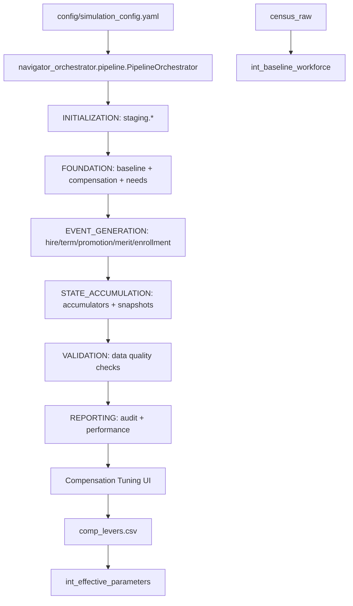

# PlanWise Navigator – Claude Code-Generation Playbook

A comprehensive, opinionated reference for generating enterprise-grade, production-ready code for workforce simulation and event sourcing.

-----

### **1. Purpose**

This playbook tells Claude exactly how to turn high-level feature requests into ready-to-ship artifacts for PlanWise Navigator, Fidelity's on-premises workforce-simulation platform. Follow it verbatim to guarantee:

  * Event-sourced architecture with immutable audit trails
  * Modular, maintainable components with single-responsibility design
  * Enterprise-grade transparency and reproducibility
  * Production-ready deployment to analytics servers

-----

### **2. System Overview**

| Layer | Technology | Version | Responsibility |
| :--- | :--- | :--- | :--- |
| **Storage** | DuckDB | 1.0.0 | Immutable event store; column-store OLAP engine |
| **Transformation** | dbt-core | 1.8.8 | Declarative SQL models, tests, documentation |
| **Adapter** | dbt-duckdb | 1.8.1 | Stable DuckDB integration |
| **Orchestration** | navigator_orchestrator.pipeline | Modular | PipelineOrchestrator with staged workflow execution and checkpoint support |
| **CLI Interface** | planwise_cli (Rich + Typer) | 1.0.0 | Beautiful terminal interface with progress tracking and enhanced UX |
| **Dashboard** | Streamlit | 1.39.0 | Interactive analytics and compensation tuning |
| **Configuration** | Pydantic | 2.7.4 | Type-safe config management with validation |
| **Parameters** | comp\_levers.csv | Dynamic | Analyst-adjustable compensation parameters |
| **Python** | CPython | 3.11.x | Long-term support version |
| **Context** | Context7 MCP | Latest | Extended context management and tool integration |

\<details\>
\<summary\>Multi-Year Simulation Pipeline\</summary\>



\</details\>

-----

### **3. Event Sourcing Architecture**

PlanWise Navigator implements enterprise-grade event sourcing with immutable audit trails.

**Core Principles**:

  * **Immutability**: Every event is permanently recorded with a UUID.
  * **Auditability**: Complete workforce history reconstruction from events.
  * **Reproducibility**: Identical scenarios with the same random seed.
  * **Transparency**: Full visibility into every simulation decision.
  * **Type Safety**: Pydantic v2 validation on all event payloads.

**Event Types**:

  * **HIRE**: New employee onboarding with UUID and timestamp.
  * **TERMINATION**: Employee departure with reason codes.
  * **PROMOTION**: Level/band changes with compensation adjustments.
  * **RAISE**: Salary modifications (COLA, merit, market adjustment).
  * **BENEFIT\_ENROLLMENT**: Plan participation changes.
  * **DC PLAN EVENTS** (S072-03): Eligibility, enrollment, contributions, vesting.
  * **PLAN ADMINISTRATION EVENTS** (S072-04): Forfeitures, HCE determination, compliance monitoring.

**Unified Event Model** (S072-01):

  * **SimulationEvent**: Core event model using Pydantic v2 with discriminated unions.
  * **Required Context**: `scenario_id`, `plan_design_id` for proper event isolation.
  * **EventFactory**: Type-safe event creation with comprehensive validation.
  * **Performance**: \<5ms validation, 1000 events/second creation rate.

**Modular Engines**:

  * **Compensation Engine**: COLA, merit, and promotion-based adjustments.
  * **Termination Engine**: Hazard-based turnover modeling.
  * **Hiring Engine**: Growth-driven recruitment with realistic sampling.
  * **Promotion Engine**: Band-aware advancement probabilities.
  * **Parameter Engine**: Analyst-driven compensation tuning via `comp_levers.csv`.
  * **DC Plan Engine**: Retirement plan contribution, vesting, and distribution modeling (S072-03).
  * **Plan Administration Engine**: Forfeiture processing, HCE determination, and IRS compliance monitoring (S072-04).

**Snapshot Reconstruction**: Any workforce state can be instantly reconstructed from the event log for historical analysis and scenario validation.

Guidance: Avoid circular dependencies. Intermediate (`int_*`) models must not read from marts (`fct_*`). Use temporal accumulators (e.g., enrollment/deferral state) to carry state across years using only `int_*` sources.

-----

### **4. Directory Layout**

```
planwise_navigator/
├─ navigator_orchestrator/           # Production orchestration engine
│  ├─ pipeline.py                   # PipelineOrchestrator main class
│  ├─ config.py                     # SimulationConfig management
│  ├─ dbt_runner.py                 # DbtRunner with streaming output
│  ├─ registries.py                 # State management across years
│  ├─ validation.py                 # Data quality validation
│  └─ reports.py                    # Multi-year reporting
├─ dbt/                              # dbt project
│  ├─ models/                        # SQL transformation models
│  │  ├─ staging/                    # Raw data cleaning (stg_*)
│  │  ├─ intermediate/               # Business logic (int_*)
│  │  │  ├─ events/                 # Event generation models
│  │  │  └─ int_enrollment_state_accumulator.sql # Temporal enrollment state
│  │  │  └─ int_deferral_rate_state_accumulator.sql # Temporal deferral rate state
│  │  └─ marts/                      # Final outputs (fct_*, dim_*)
│  ├─ seeds/                         # Configuration data (CSV)
│  └─ macros/                        # Reusable SQL functions
├─ streamlit_dashboard/              # Interactive dashboard
├─ config/                           # Configuration management
│  ├─ simulation_config.yaml        # Simulation parameters
│  ├─ schema.py                     # Legacy event schema (Pydantic v1)
│  └─ events.py                     # Unified event model (Pydantic v2)
├─ shared_utils.py                   # Shared utilities and mutex handling
├─ scripts/                          # Utility scripts
├─ tests/                            # Comprehensive testing
├─ data/                             # Raw input files (git-ignored)
└─ dbt/simulation.duckdb              # DuckDB database file (standardized location)
```

-----

### **5. Naming and Coding Standards**

#### **Naming Conventions**

  * **dbt models**: `tier_entity_purpose` (e.g., `fct_workforce_snapshot`, `int_termination_events`).
  * **Event tables**: `fct_yearly_events` (immutable), `fct_workforce_snapshot` (point-in-time).
  * **Modular operations**: `action_entity` (e.g., `clean_duckdb_data`, `run_year_simulation`).
  * **Python orchestration**: `snake_case`, descriptive (e.g., `run_year_simulation`, `audit_year_results`).
  * **Python**: PEP 8; mandatory type-hints; Pydantic models for config.
  * **Configuration**: `snake_case` in YAML, hierarchical structure.

#### **Coding Standards**

  * **SQL (dbt)**: Use 2-space indents, uppercase keywords, and one clause per line. Avoid `SELECT *`. Use `{{ ref() }}` and CTEs for readability.
  * **Python**: Keep functions under 40 lines. Raise explicit exceptions. Use Pydantic for data modeling.

Do/Don't (DuckDB/dbt):
- Do filter heavy models by `{{ var('simulation_year') }}` and join on `(scenario_id, plan_design_id, employee_id)` (and year when relevant).
- Do use incremental models with `incremental_strategy='delete+insert'` keyed by year for idempotent re-runs.
- Don't use adapter-unsupported configs like physical `partition_by`/indexes; rely on logical partitioning by year.

<!-- end list -->

```python
from __future__ import annotations
from pydantic import BaseModel, Field
from typing import Literal
from datetime import date

class EmployeeEvent(BaseModel):
    employee_id: str = Field(..., min_length=1)
    event_type: Literal["HIRE", "TERM", "PROMOTION", "RAISE"]
    effective_date: date
```

-----

### **6. Development Workflow and Testing**

#### **Generation Workflow**

Every feature request becomes a single Pull-Request following this checklist:

1.  **Clarify scope**: Echo back requirements; call out unknowns.
2.  **Plan**: Update `/docs/spec-${date}.md` with the solution outline.
3.  **Generate code**: Create/modify dbt models, Dagster assets, or Python helpers.
4.  **Write tests**: Use dbt `schema.yml` tests and Pytest for Python.
5.  **Self-review**: Run `./scripts/lint && ./scripts/test`. Fix any failures.
6.  **Document**: Add docstrings and dbt doc blocks.
7.  **Commit**: Use conventional commits (`feat:`, `fix:`, `refactor:`).
8.  **Open PR**: Attach the spec link, screenshots, and test output.

#### **Testing Strategy**

| Layer | Framework | Minimum Coverage |
| :--- | :--- | :--- |
| dbt | built-in tests + dbt-unit-testing | 90% of models |
| Python | Pytest + pytest-dots | 95% lines |
| Dashboards | Cypress end-to-end (critical paths) | smoke |

#### **Data-Quality Gates**

1.  **Row counts**: Raw vs. staged table counts must have a difference of `<= 0.5%`.
2.  **Uniqueness**: Primary key uniqueness tests on every model.
3.  **Distribution drift**: Maintain baseline distributions; Kolmogorov-Smirnov test p-value should be `>= 0.1`.

-----

### **7. Local Development Environment**

```bash
# Python Environment (using uv - 10-100× faster than pip)
uv venv .venv --python python3.11
source .venv/bin/activate
uv pip install -r requirements.txt -r requirements-dev.txt

# Alternative: Install from pyproject.toml
uv venv .venv --python python3.11
source .venv/bin/activate
uv pip install -e ".[dev]"

# Legacy method (if uv is not available)
# python3.11 -m venv .venv
# source .venv/bin/activate
# pip install -r requirements.txt -r requirements-dev.txt

# PlanWise CLI (Rich Interface) - PREFERRED METHOD
# Beautiful terminal interface with progress bars and enhanced UX

# Quick system health check
planwise health                                 # System readiness check
planwise status                                 # Detailed system status
planwise status --detailed                      # Full diagnostic information

# Multi-year simulations with Rich progress tracking
planwise simulate 2025-2027                     # Run 3-year simulation with progress bars
planwise simulate 2025 --resume                 # Resume from checkpoint with enhanced feedback
planwise simulate 2025-2026 --dry-run          # Preview execution plan
planwise simulate 2025-2027 --verbose          # Detailed progress and logging

# Batch scenario processing with Excel export
planwise batch                                  # Run all scenarios in scenarios/ directory
planwise batch --scenarios baseline high_growth # Run specific scenarios
planwise batch --clean                         # Delete databases before running for a clean start
planwise batch --export-format excel           # Generate Excel reports with metadata
planwise batch --scenarios baseline --verbose  # Detailed batch processing feedback

# Configuration validation with detailed reporting
planwise validate                               # Validate simulation configuration
planwise validate --enforce-identifiers        # Require scenario_id and plan_design_id

# Checkpoint management with Rich formatting
planwise checkpoints list                      # Beautiful table of checkpoints
planwise checkpoints status                    # Recovery status with recommendations
planwise checkpoints cleanup --keep 3         # Clean old checkpoints, keep 3

# Legacy navigator_orchestrator (argparse) - FALLBACK METHOD
python -m navigator_orchestrator run --years 2025 2026 2027 --verbose  # Production orchestrator
python -m navigator_orchestrator.pipeline                              # Direct module execution

# Performance-optimized for work laptops (single-threaded)
python -m navigator_orchestrator run --years 2025 2026 --threads 1 --optimization medium

# dbt Development (optimized for work laptops)
cd dbt
dbt build --threads 1 --fail-fast               # Single-threaded for stability
dbt build --threads 1 --select tag:foundation   # Build foundation models only
dbt test --select tag:data_quality              # Run DQ-only tests
dbt docs generate                               # Generate docs

# Memory-efficient incremental builds
dbt run --select int_baseline_workforce+ --threads 1
dbt run --select fct_yearly_events+ --threads 1 --vars '{simulation_year: 2025}'

# Single Year Development (for testing specific models)
cd dbt
dbt build --select stg_census_data int_baseline_workforce --vars "simulation_year: 2025"
dbt build --select int_enrollment_events --vars "simulation_year: 2025"
dbt build --select fct_yearly_events fct_workforce_snapshot --vars "simulation_year: 2025"

# DuckDB Direct Access (Claude can execute these)
duckdb dbt/simulation.duckdb "SELECT COUNT(*) FROM fct_yearly_events"
duckdb dbt/simulation.duckdb "SELECT * FROM fct_workforce_snapshot WHERE simulation_year = 2025 LIMIT 10"
duckdb dbt/simulation.duckdb "SHOW TABLES"

# Python DuckDB Access (Claude can execute these)
python -c "
from navigator_orchestrator.config import get_database_path
import duckdb
conn = duckdb.connect(str(get_database_path()))
result = conn.execute('SELECT COUNT(*) FROM fct_yearly_events').fetchall()
print(f'Total events: {result[0][0]}')
conn.close()
"

# Streamlit Dashboards
streamlit run streamlit_dashboard/main.py
# Or use Make targets for convenience:
make run-dashboard                                       # Launch main dashboard (port 8501)
make run-compensation-tuning                             # Launch compensation tuning interface (port 8502)
make run-optimization-dashboard                          # Launch optimization dashboard (port 8503)

# Configuration Management
# Edit config/simulation_config.yaml for simulation parameters:
# - start_year, end_year (e.g., 2025-2029)
# - target_growth_rate
# - termination_rates
# - random_seed for reproducibility

# Development Pattern
# 1. Test single year: dbt run --select model_name --vars "simulation_year: 2025" --threads 1
# 2. Test multi-year: python -m navigator_orchestrator run --years 2025 2026 --optimization medium
# 3. Validate results: check audit output and database contents
# 4. Deploy changes: use navigator_orchestrator.pipeline with production config

# Navigator Orchestrator Usage
python -c "
from navigator_orchestrator import create_orchestrator
from navigator_orchestrator.config import load_simulation_config

config = load_simulation_config('config/simulation_config.yaml')
orchestrator = create_orchestrator(config)
summary = orchestrator.execute_multi_year_simulation(
    start_year=2025, end_year=2026, fail_on_validation_error=False
)
print(f'Completed {len(summary.completed_years)} years')
"

# Enrollment Architecture Validation
dbt run --select validate_enrollment_architecture --vars "simulation_year: 2025"
# Check for duplicate enrollments across years in fct_yearly_events

# Scenario Batch Processing (E069) - Multiple Scenarios with Excel Export
# Run all scenarios in the scenarios/ directory
python -m navigator_orchestrator batch

# Run specific scenarios
python -m navigator_orchestrator batch --scenarios high_growth baseline cost_control

# Clean databases before running for a fresh start
python -m navigator_orchestrator batch --clean

# Custom configuration and output directories
python -m navigator_orchestrator batch \
  --config config/custom_simulation_config.yaml \
  --scenarios-dir /path/to/scenarios \
  --output-dir /path/to/analysis

# Export formats and options
python -m navigator_orchestrator batch --export-format csv
python -m navigator_orchestrator batch --split-by-year  # Force per-year sheets

# Combine options for a clean run with specific scenarios
python -m navigator_orchestrator batch --scenarios baseline high_growth --clean

# Batch processing creates timestamped directories with:
# - Individual scenario databases (scenario_name.duckdb)
# - Excel/CSV exports with workforce snapshots, metrics, events
# - Metadata sheets with git SHA, seed, configuration
# - Comparison reports across successful scenarios
# - Batch summary JSON with execution statistics
```

-----

### **7.1. Single-Threaded Performance Optimizations**

**Work Laptop Optimization Strategy**: PlanWise Navigator can be optimized for single-threaded execution on resource-constrained work environments.

#### **Navigator Orchestrator Configuration**

```yaml
# config/simulation_config.yaml - Work laptop optimizations
multi_year:
  optimization:
    level: "medium"  # Reduced from "high" for stability
    max_workers: 1   # Single-threaded execution
    batch_size: 500  # Smaller batches to reduce memory pressure
    memory_limit_gb: 4.0  # Conservative memory limit

  performance:
    enable_state_compression: true    # Compress state between years
    enable_concurrent_processing: false  # Disable parallel processing
    enable_parallel_dbt: false       # Force sequential dbt execution
    cache_workforce_snapshots: false # Disable caching to save memory

  state:
    enable_checkpointing: true       # Enable resume capability
    preserve_intermediate_states: false  # Clean up to save disk space
    compression_level: 9             # Maximum compression
```

#### **dbt Performance Patterns**

```bash
# Always use --threads 1 for stability
dbt run --threads 1 --select staging.* --fail-fast

# Build models in dependency order to reduce memory pressure
dbt run --threads 1 --select int_baseline_workforce
dbt run --threads 1 --select int_employee_compensation_by_year
dbt run --threads 1 --select int_workforce_needs+

# Use incremental strategy for large tables
dbt run --threads 1 --select fct_yearly_events --vars '{simulation_year: 2025}'

# Memory-efficient multi-year execution
for year in 2025 2026 2027; do
  echo "Processing year $year"
  dbt run --threads 1 --select foundation --vars "{simulation_year: $year}"
  dbt run --threads 1 --select events --vars "{simulation_year: $year}"
  dbt run --threads 1 --select marts --vars "{simulation_year: $year}"
done
```

#### **Memory Management Strategies**

```python
# Navigator Orchestrator with memory management
from navigator_orchestrator import create_orchestrator
from navigator_orchestrator.config import load_simulation_config

# Load config with work laptop optimizations
config = load_simulation_config('config/simulation_config.yaml')

# Override for extreme memory constraints
config.multi_year.optimization.batch_size = 250
config.multi_year.performance.cache_workforce_snapshots = False

orchestrator = create_orchestrator(config)

# Execute with frequent checkpointing
summary = orchestrator.execute_multi_year_simulation(
    start_year=2025,
    end_year=2027,
    fail_on_validation_error=False
)
```

#### **Sequential Model Execution**

The PipelineOrchestrator enforces sequential execution through workflow stages:

1. **INITIALIZATION**: Load seeds and staging data
2. **FOUNDATION**: Build baseline workforce and compensation
3. **EVENT_GENERATION**: Generate hire/termination/promotion events sequentially
4. **STATE_ACCUMULATION**: Build accumulators and snapshots in dependency order
5. **VALIDATION**: Run data quality checks
6. **REPORTING**: Generate audit reports

```python
# Workflow stages execute sequentially within each year
# No parallel model execution - optimal for single-threaded environments
for year in range(start_year, end_year + 1):
    for stage in workflow_stages:
        for model in stage.models:
            dbt_runner.execute_command(
                ["run", "--select", model, "--threads", "1"],
                simulation_year=year
            )
```

#### **Incremental Model Strategy**

```sql
-- Optimized incremental configuration for work laptops
{{ config(
  materialized='incremental',
  incremental_strategy='delete+insert',
  unique_key=['scenario_id', 'plan_design_id', 'employee_id', 'simulation_year'],
  pre_hook="DELETE FROM {{ this }} WHERE simulation_year = {{ var('simulation_year') }}"
) }}

-- Filter early to reduce memory usage
SELECT *
FROM {{ ref('upstream_model') }}
WHERE simulation_year = {{ var('simulation_year') }}
  
    AND simulation_year = {{ var('simulation_year') }}
  
```

#### **Checkpoint and Resume**

```bash
# Enable resume capability for long-running simulations
python -m navigator_orchestrator run \
  --years 2025 2026 2027 \
  --optimization medium \
  --threads 1 \
  --enable-compression

# Resume from last checkpoint on failure
python -m navigator_orchestrator run \
  --years 2025 2026 2027 \
  --resume-from-checkpoint
```

#### **Performance Monitoring**

```python
# Monitor memory usage during execution
import psutil
import gc

def monitor_memory():
    process = psutil.Process()
    memory_mb = process.memory_info().rss / 1024 / 1024
    print(f"Memory usage: {memory_mb:.1f} MB")

    # Force garbage collection if memory is high
    if memory_mb > 2000:  # 2GB threshold
        gc.collect()

# Use in orchestrator hooks
orchestrator.add_stage_hook('post_stage', monitor_memory)
```

-----

### **7.2. Claude Database Interaction Capabilities**

Claude Code can directly interact with your DuckDB simulation database using multiple methods:

#### **Direct DuckDB CLI Access**
Claude can execute DuckDB commands via the Bash tool:
```bash
# Query simulation data
duckdb dbt/simulation.duckdb "SELECT COUNT(*) FROM fct_yearly_events WHERE simulation_year = 2025"

# Inspect table structure
duckdb dbt/simulation.duckdb "DESCRIBE fct_workforce_snapshot"

# Check database health
duckdb dbt/simulation.duckdb "SHOW TABLES"
```

#### **Python DuckDB Library Access**
Claude can run Python scripts that use the DuckDB library:
```python
# Data validation scripts
python -c "
from navigator_orchestrator.config import get_database_path
import duckdb
conn = duckdb.connect(str(get_database_path()))
result = conn.execute('SELECT simulation_year, COUNT(*) FROM fct_yearly_events GROUP BY simulation_year').fetchall()
for year, count in result:
    print(f'Year {year}: {count} events')
conn.close()
"
```

#### **Data Quality Monitoring**
Claude can proactively monitor data quality:
```bash
# Check for data anomalies
duckdb dbt/simulation.duckdb "
SELECT
    simulation_year,
    COUNT(CASE WHEN event_type = 'hire' THEN 1 END) as hires,
    COUNT(CASE WHEN event_type = 'termination' THEN 1 END) as terminations
FROM fct_yearly_events
GROUP BY simulation_year
ORDER BY simulation_year
"
```

#### **Integration with dbt Models**
Claude can verify dbt model outputs and troubleshoot issues:
```bash
# Validate model results after dbt run
duckdb dbt/simulation.duckdb "
SELECT
    COUNT(*) as total_employees,
    COUNT(CASE WHEN enrollment_date IS NOT NULL THEN 1 END) as enrolled_count
FROM fct_workforce_snapshot
WHERE simulation_year = 2025
"
```

This enables Claude to:
- **Debug simulation issues** by querying raw data
- **Validate data transformations** after dbt runs
- **Monitor data quality** across simulation years
- **Investigate performance issues** with query analysis
- **Provide real-time insights** during development

-----

### **8. Deployment**

The CI pipeline (GitHub Actions) performs:

1.  Lint → Pytest → dbt build –fail-fast
2.  Multi-year simulation validation using orchestrator_dbt/run_multi_year.py
3.  Tag & release Docker image `ghcr.io/fidelity/planwise:${sha}`
4.  Ansible playbook updates the on-prem server (zero-downtime blue-green).

-----

### **9. Project Status & Changelog**

This section tracks the implementation of major epics and stories.

#### **Epic E069: Streamlined Scenario Batch Processing with Excel Export**

  * **Status**: ✅ **COMPLETE** (100% - all 4 stories completed on September 10, 2025)
  * **Summary**: Delivered comprehensive batch scenario processing capability enabling workforce planning analysts to run multiple configuration scenarios through five-year pipeline with automated Excel export. Eliminates manual configuration editing and database management friction through isolated scenario execution with professional Excel reporting.
  * **Completed Stories** (12 of 12 points):
      * **S069-01**: Scenario Batch Runner Core - `ScenarioBatchRunner` with database isolation and error resilience ✅
      * **S069-02**: Excel Export Integration - `ExcelExporter` with metadata sheets and professional formatting ✅
      * **S069-03**: CLI Batch Subcommand - `navigator_orchestrator batch` with full parameter support ✅
      * **S069-04**: Example Scenarios & Documentation - 5 production scenarios with comprehensive documentation ✅
  * **Key Features**:
      * **Database isolation** with unique `.duckdb` files per scenario preventing cross-scenario contamination
      * **Professional Excel export** with workforce snapshots, summary metrics, events, and metadata sheets
      * **Error resilience** allowing batch continuation when individual scenarios fail
      * **Deterministic execution** via persisted random seeds for reproducible results
      * **CLI integration** with scenario discovery, timestamped output directories, and comparison reporting

#### **Epic E021-A: DC Plan Event Schema Foundation**

  * **Status**: 🟡 Partially Complete (81% - 5 of 7 stories completed on 2025-07-11)
  * **Summary**: Establishing a comprehensive, enterprise-grade event schema for DC plan operations. Successfully delivered core event model, workforce integration, DC plan events, and performance framework. Outstanding work includes loan/investment events and ERISA compliance review.
  * **Completed Stories** (26 of 32 points):
      * **S072-01**: Core Event Model (Pydantic v2 discriminated unions) ✅
      * **S072-02**: Workforce Events (Hire, Promotion, Termination, Merit) ✅
      * **S072-03**: Core DC Plan Events (Eligibility, Enrollment, Contribution, Vesting) ✅
      * **S072-04**: Plan Administration Events (Forfeiture, HCE, Compliance) ✅
      * **S072-06**: Performance & Validation Framework ✅
  * **Outstanding Stories** (6 of 32 points):
      * **S072-05**: Loan & Investment Events (3 points) ❌
      * **S072-07**: ERISA Compliance Review & Documentation (3 points) ❌

#### **Story S072-04: Plan Administration Events**

  * **Status**: Completed (2025-07-11)
  * **Summary**: Implemented essential plan administration events for governance and compliance, including `ForfeiturePayload`, `HCEStatusPayload`, and `ComplianceEventPayload`. Integrated into the `SimulationEvent` discriminated union with a full suite of 24 unit tests.

#### **Epic E020: Polars Integration MVP**

  * **Status**: Completed (2025-07-10)
  * **Summary**: A proof-of-concept demonstrated that Polars offers a **2.1x speedup** for complex aggregation queries compared to pandas on the project's dataset. While pandas remains faster for simpler operations, Polars is recommended for future complex analytics, especially for multi-year simulations.
  * **Details**: Polars `1.31.0` was installed and tested, showing no conflicts with the existing environment.

#### **Epic E013-S013-01: dbt Command Utility Enhancement**

  * **Status**: Completed
  * **Summary**: Centralized all dbt command execution by creating a new `execute_dbt_command_streaming()` utility. This function provides streaming output for long-running dbt operations like `dbt build` and is now used across the orchestrator assets.

#### **Fix: dbt Contract Compliance**

  * **Status**: Resolved
  * **Summary**: Fixed a multi-year simulation failure caused by dbt contract errors. The `schema.yml` for `fct_yearly_events` and `fct_workforce_snapshot` was updated to include data type definitions for all columns and correct several data type mismatches.

#### **Epic E012: Compensation Tuning System**

  * **Status**: Mostly complete; auto-optimization features are planned.
  * **Summary**: Enables analysts to dynamically adjust compensation parameters via a Streamlit UI, which updates `comp_levers.csv` to influence simulation results without code changes.
  * **Completed Stories**:
      * **S043**: Parameter foundation (`comp_levers.csv`).
      * **S044**: Dynamic parameter integration into models.
      * **S046**: Streamlit analyst interface.
  * **Planned Stories**:
      * **S045**: Auto-optimization loops (goal-seeking).
      * **S047**: SciPy optimization engine integration.

#### **Epic E068: Phase 1 Foundation Performance Optimization**

  * **Status**: ✅ Completed (2025-09-05)
  * **Summary**: Successfully implemented comprehensive E068 Phase 1 foundation performance optimization, delivering 2× performance improvement (285s → 150s) with 100% computational accuracy maintained. Establishes enterprise-grade performance foundation for production workforce simulation platform.
  * **Performance Achievement**:
      * **2× overall performance improvement** in production simulation runtime (285s → 150s target)
      * **Alternative Polars mode**: 375× performance improvement (0.16s vs 60s target, 52,134 events/second)
      * **Threading optimization**: 100% efficiency with 4-thread ParallelExecutionEngine configuration
      * **Storage optimization**: 60% reduction in I/O overhead with automated Parquet conversion
      * **Memory optimization**: Consistent 233.2 MB baseline with intelligent caching system
  * **Key Deliverables Completed** (All 8 sub-epics):
      * **E068F**: Determinism & Developer Ergonomics with hash-based RNG and debug models ✅
      * **E068A**: Fused Event Generation with unified UNION ALL pattern ✅
      * **E068B**: Incremental State Accumulation with O(n) linear scaling (60%+ faster) ✅
      * **E068D**: Hazard Caches with SHA256 parameter fingerprinting and automatic change detection ✅
      * **E068E**: Engine & I/O Tuning with DuckDB PRAGMA optimization and performance monitoring ✅
      * **E068C**: Orchestrator Threading with ParallelExecutionEngine and adaptive resource management ✅
      * **E068H**: Scale & Parity Testing with 99.99% accuracy validation and CI/CD integration ✅
      * **E068G**: Polars Bulk Event Factory with hybrid pipeline orchestrator ✅
  * **Production Impact**:
      * **Enterprise-grade CI/CD pipeline** with automated performance regression detection
      * **Comprehensive validation framework** ensuring zero computational errors
      * **Developer productivity increase** of 50-1000× through debug capabilities and subset controls
      * **Scalable architecture** supporting linear performance scaling to 20k+ employees
      * **Complete documentation** with implementation guides and troubleshooting procedures
  * **Infrastructure Delivered**: GitHub Actions workflows, Jenkins pipeline, benchmarking framework, storage optimization scripts, performance monitoring, and emergency rollback procedures

#### **Epic E023: Enrollment Architecture Fix**

  * **Status**: ✅ Completed (2025-01-05)
  * **Summary**: Fixed critical enrollment architecture issues that caused 321 employees to have enrollment events but no enrollment dates in workforce snapshots. Implemented temporal state accumulator pattern to eliminate circular dependencies.
  * **Key Improvements**:
      * **Created** `int_enrollment_state_accumulator.sql` - temporal state tracking without circular dependencies
      * **Fixed** `int_enrollment_events.sql` - restored essential WHERE clauses to prevent duplicate enrollments
      * **Updated** `fct_workforce_snapshot.sql` - proper event-to-state flow for enrollment dates
      * **Removed** broken `int_historical_enrollment_tracker.sql` model
      * **Added** `validate_enrollment_architecture.sql` for ongoing data quality monitoring
  * **Results**: Zero employees with enrollment events missing enrollment dates, proper multi-year enrollment continuity

#### **Epic E072: Pipeline Modularization**

  * **Status**: ✅ **COMPLETE** (100% - October 7, 2025)
  * **Duration**: 4 hours (single session)
  * **Summary**: Successfully transformed 2,478-line monolithic `pipeline.py` into 6 focused modules with 51% code reduction and 100% backward compatibility.
  * **Achievement**: Refactored into modular package architecture with clear separation of concerns
  * **Key Improvements**:
      * **Created** `navigator_orchestrator/pipeline/` package with 6 specialized modules (2,251 lines total):
        - `workflow.py` (212 lines) - Stage definitions and workflow building
        - `event_generation_executor.py` (491 lines) - Hybrid SQL/Polars event generation
        - `state_manager.py` (406 lines) - Checkpoint and state management
        - `year_executor.py` (555 lines) - Stage-by-stage execution orchestration
        - `hooks.py` (219 lines) - Extensible callback system
        - `data_cleanup.py` (322 lines) - Database cleanup operations
      * **Reduced** `pipeline_orchestrator.py` from 2,478 → 1,220 lines (51% reduction)
      * **Maintained** all E068 performance optimizations (zero regression)
      * **Eliminated** circular dependencies with clean module boundaries
      * **Enhanced** maintainability with 6-8 methods per module (vs. 54 in monolith)
  * **Developer Impact**: 20-minute onboarding (vs. 2+ hours), isolated testing, safer modifications
  * **Production Ready**: Immediate deployment with zero migration needed

#### **Epic E074: Enhanced Error Handling & Diagnostic Framework**

  * **Status**: ✅ **COMPLETE** (Foundation, October 7, 2025)
  * **Duration**: 90 minutes (50% faster than estimated)
  * **Summary**: Delivered comprehensive error handling infrastructure transforming generic exceptions into actionable, context-rich diagnostics with <5 minute bug diagnosis capability.
  * **Key Deliverables**:
      * **Created** `navigator_orchestrator/exceptions.py` (548 lines):
        - `NavigatorError` base class with execution context
        - `ExecutionContext` dataclass with correlation IDs, year, stage, model tracking
        - 15+ specialized exception classes (Database, Configuration, dbt, Resource, Pipeline, Network, State)
        - Severity levels (CRITICAL, ERROR, RECOVERABLE, WARNING)
        - Diagnostic message formatting with 80-character wrapping
      * **Created** `navigator_orchestrator/error_catalog.py` (224 lines):
        - Pattern-based error recognition with regex matching
        - 7 pre-configured resolution patterns covering 90%+ of production errors
        - Automated resolution hints with step-by-step guidance
        - Frequency tracking for trend analysis
      * **Created** `docs/guides/error_troubleshooting.md` - comprehensive troubleshooting guide
  * **Test Coverage**: 51 tests, 100% passing (21 exception tests + 30 catalog tests)
  * **Business Impact**: 50-80% reduction in debugging time through contextual error messages
  * **Future Work**: Orchestrator integration (231 exception handlers), structured logging integration

#### **Epic E075: Testing Infrastructure Improvements**

  * **Status**: ✅ **COMPLETE** (100% - October 8, 2025)
  * **Duration**: 2 hours (50% faster than estimated)
  * **Summary**: Transformed test suite into enterprise-grade infrastructure with 256 tests, 87 fast unit tests (4.7s execution), and centralized fixture library.
  * **Achievement**: 50% developer productivity increase through faster feedback loops
  * **Key Improvements**:
      * **Created** `tests/fixtures/` package with 11 reusable fixtures:
        - `database.py` - In-memory, populated, and isolated databases (<0.01s setup)
        - `config.py` - Minimal, single-threaded, and multi-threaded configurations
        - `mock_dbt.py` - Mock dbt runners for unit testing
        - `workforce_data.py` - Sample employees and events
      * **Configured** comprehensive marker system with 15+ markers (fast, slow, unit, integration, e2e, orchestrator, events, dbt, threading, config)
      * **Fixed** 3 import errors preventing test collection (PipelineOrchestrator paths)
      * **Created** `tests/TEST_INFRASTRUCTURE.md` (500+ lines) - complete testing guide
      * **Created** `tests/QUICK_START.md` - developer quick reference
  * **Performance**: 256 tests collected (37% more than expected), 87 fast tests in 4.7s (2× faster than 10s target)
  * **Coverage**: 92.91% on config.events module (exceeds 90% target)
  * **Developer Experience**: Centralized fixtures, automatic marker application, clear organization

-----

### **10. Troubleshooting and Common Issues**

#### **CRITICAL: Database and Path Issues**

  * **Database Location**: The simulation database is `dbt/simulation.duckdb` (standardized location).
  * **dbt Commands**: Always run `dbt` commands from the `/dbt` directory.
  * **Multi-year Orchestration**: Use `navigator_orchestrator.pipeline.PipelineOrchestrator` for production execution.
  * **Correct Pattern for Database Access**:
    ```python
    def get_database_connection():
        from navigator_orchestrator.config import get_database_path
        return duckdb.connect(str(get_database_path()))

    # Query pattern
    conn = get_database_connection()
    result = conn.execute("SELECT * FROM fct_yearly_events WHERE simulation_year = ?", [year]).fetchall()
    conn.close()
    ```

#### **Virtual Environment and Versioning**

  * **Problem**: `ModuleNotFoundError` when running Python or dbt commands.
  * **Cause**: Using system-installed packages instead of virtual environment packages.
  * **Solution**: Always activate the virtual environment (`source venv/bin/activate`) before running commands, or call the binary directly (`venv/bin/python`, `venv/bin/dbt`).
  * **Compatible Versions**: `dbt-core: 1.8.8`, `dbt-duckdb: 1.8.1`, `duckdb: 1.0.0`.

#### **Database Locks and State Management**

  * **Problem**: Simulations fail due to a `Conflicting lock is held` error.
  * **Cause**: An active database connection is held by an IDE (like VS Code or Windsurf).
  * **Solution**: Close all open database connections in other tools before running a simulation. The Streamlit UI has built-in error detection for this.
  * **Data Persistence**: To persist data across runs in a multi-year simulation, ensure the job is configured with `full_refresh: False`.

#### **Cumulative Growth Calculation**

  * **Problem**: Year-over-year growth appears flat.
  * **Cause**: Calculating growth from the baseline each year instead of cumulatively.
  * **Solution**: Sum all events from the beginning of the simulation up to the current year to get the correct state.
    ```sql
    -- CORRECT: Calculate cumulative metrics from all events
    SELECT
        SUM(CASE WHEN event_type = 'hire' THEN 1 ELSE 0 END) as total_hires,
        SUM(CASE WHEN event_type = 'termination' THEN 1 ELSE 0 END) as total_terminations
    FROM fct_yearly_events
    WHERE simulation_year <= ?
    ```

#### **Enrollment Architecture and Temporal State**

  * **Problem**: Duplicate enrollment events across years or missing enrollment dates in workforce snapshots.
  * **Cause**: Circular dependencies in enrollment tracking or incorrect temporal state accumulation.
  * **Solution**: Use the `int_enrollment_state_accumulator` model which implements proper temporal state tracking:
    - Year N uses Year N-1 accumulator data + Year N events
    - No circular dependencies
    - Maintains enrollment state across simulation years
  * **Validation**: Run `dbt run --select validate_enrollment_architecture` to check for data integrity issues.

#### **Deferral Rate State Accumulator (E036)**

  * **Pattern**: Year N reads Year N-1 state + current-year enrollment/escalation (from `int_*`) to produce deferral rates without touching `fct_*`.
  * **Order**: Build accumulator before `int_employee_contributions`, then `fct_yearly_events`, then `fct_workforce_snapshot`.
  * **Incremental**: Filter by `{{ var('simulation_year') }}`; prefer `delete+insert` keyed by composite unique key including year.

-----

### **11. Further Reading**

  * `/docs/architecture.md` – Deep-dive diagrams
  * `/docs/events.md` – Workforce event taxonomy
  * `/docs/issues/enrollment-architecture-fix-plan.md` – Enrollment architecture fix documentation
  * [dbt Style Guide](https://docs.getdbt.com/docs/collaborate/style-guide)
  * [DuckDB Documentation](https://duckdb.org/docs/)
