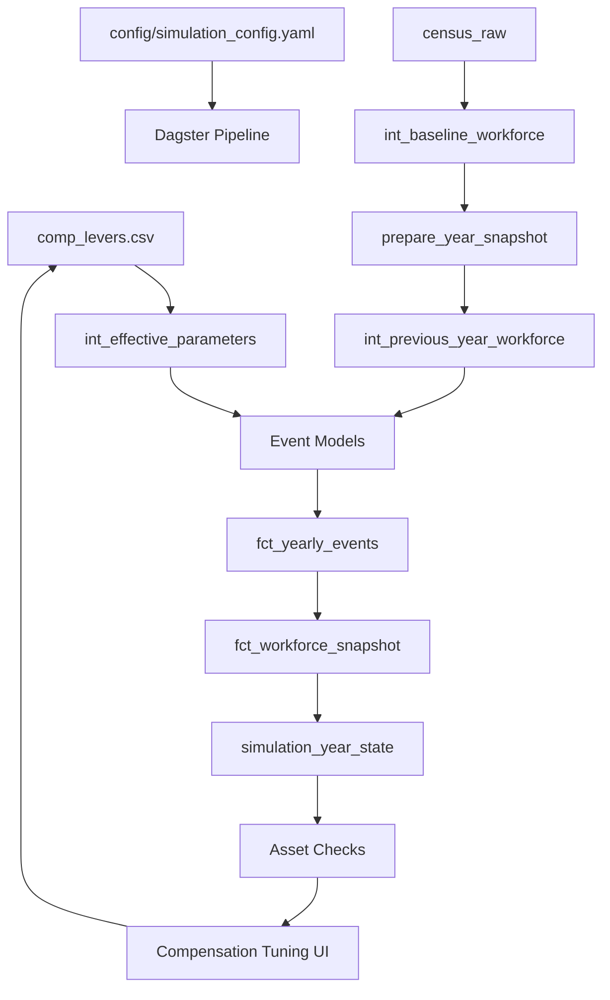

# PlanWise Navigator – Claude Code-Generation Playbook

A comprehensive, opinionated reference for generating enterprise-grade, production-ready code for workforce simulation and event sourcing.

-----

### **1. Purpose**

This playbook tells Claude exactly how to turn high-level feature requests into ready-to-ship artifacts for PlanWise Navigator, Fidelity's on-premises workforce-simulation platform. Follow it verbatim to guarantee:

  * Event-sourced architecture with immutable audit trails
  * Modular, maintainable components with single-responsibility design
  * Enterprise-grade transparency and reproducibility
  * Production-ready deployment to analytics servers

-----

### **2. System Overview**

| Layer | Technology | Version | Responsibility |
| :--- | :--- | :--- | :--- |
| **Storage** | DuckDB | 1.0.0 | Immutable event store; column-store OLAP engine |
| **Transformation** | dbt-core | 1.8.8 | Declarative SQL models, tests, documentation |
| **Adapter** | dbt-duckdb | 1.8.1 | Stable DuckDB integration |
| **Orchestration** | Dagster | 1.8.12 | Asset-based pipeline for simulation workflow |
| **Dashboard** | Streamlit | 1.39.0 | Interactive analytics and compensation tuning |
| **Configuration** | Pydantic | 2.7.4 | Type-safe config management with validation |
| **Parameters** | comp\_levers.csv | Dynamic | Analyst-adjustable compensation parameters |
| **Python** | CPython | 3.11.x | Long-term support version |
| **Context** | Context7 MCP | Latest | Extended context management and tool integration |

\<details\>
\<summary\>Unified Simulation Pipeline\</summary\>



\</details\>

-----

### **3. Event Sourcing Architecture**

PlanWise Navigator implements enterprise-grade event sourcing with immutable audit trails.

**Core Principles**:

  * **Immutability**: Every event is permanently recorded with a UUID.
  * **Auditability**: Complete workforce history reconstruction from events.
  * **Reproducibility**: Identical scenarios with the same random seed.
  * **Transparency**: Full visibility into every simulation decision.
  * **Type Safety**: Pydantic v2 validation on all event payloads.

**Event Types**:

  * **HIRE**: New employee onboarding with UUID and timestamp.
  * **TERMINATION**: Employee departure with reason codes.
  * **PROMOTION**: Level/band changes with compensation adjustments.
  * **RAISE**: Salary modifications (COLA, merit, market adjustment).
  * **BENEFIT\_ENROLLMENT**: Plan participation changes.
  * **DC PLAN EVENTS** (S072-03): Eligibility, enrollment, contributions, vesting.
  * **PLAN ADMINISTRATION EVENTS** (S072-04): Forfeitures, HCE determination, compliance monitoring.

**Unified Event Model** (S072-01):

  * **SimulationEvent**: Core event model using Pydantic v2 with discriminated unions.
  * **Required Context**: `scenario_id`, `plan_design_id` for proper event isolation.
  * **EventFactory**: Type-safe event creation with comprehensive validation.
  * **Performance**: \<5ms validation, 1000 events/second creation rate.

**Modular Engines**:

  * **Compensation Engine**: COLA, merit, and promotion-based adjustments.
  * **Termination Engine**: Hazard-based turnover modeling.
  * **Hiring Engine**: Growth-driven recruitment with realistic sampling.
  * **Promotion Engine**: Band-aware advancement probabilities.
  * **Parameter Engine**: Analyst-driven compensation tuning via `comp_levers.csv`.
  * **DC Plan Engine**: Retirement plan contribution, vesting, and distribution modeling (S072-03).
  * **Plan Administration Engine**: Forfeiture processing, HCE determination, and IRS compliance monitoring (S072-04).

**Snapshot Reconstruction**: Any workforce state can be instantly reconstructed from the event log for historical analysis and scenario validation.

-----

### **4. Directory Layout**

```
planwise_navigator/
├─ definitions.py                    # Dagster workspace entry point
├─ orchestrator/                     # Dagster pipeline code
│  ├─ simulation_pipeline.py        # Main simulation logic
│  ├─ assets/                        # Asset definitions
│  ├─ jobs/                          # Job workflows
│  └─ resources/                     # Shared resources (DuckDBResource)
├─ dbt/                              # dbt project
│  ├─ models/                        # SQL transformation models
│  │  ├─ staging/                    # Raw data cleaning (stg_*)
│  │  ├─ intermediate/               # Business logic (int_*)
│  │  └─ marts/                      # Final outputs (fct_*, dim_*)
│  ├─ seeds/                         # Configuration data (CSV)
│  └─ macros/                        # Reusable SQL functions
├─ streamlit_dashboard/              # Interactive dashboard
├─ config/                           # Configuration management
│  ├─ simulation_config.yaml        # Simulation parameters
│  ├─ schema.py                     # Legacy event schema (Pydantic v1)
│  └─ events.py                     # Unified event model (Pydantic v2)
├─ scripts/                          # Utility scripts
├─ tests/                            # Comprehensive testing
├─ data/                             # Raw input files (git-ignored)
├─ .dagster/                         # Dagster home directory (git-ignored)
└─ simulation.duckdb                 # DuckDB database file (git-ignored)
```

-----

### **5. Naming and Coding Standards**

#### **Naming Conventions**

  * **dbt models**: `tier_entity_purpose` (e.g., `fct_workforce_snapshot`, `int_termination_events`).
  * **Event tables**: `fct_yearly_events` (immutable), `fct_workforce_snapshot` (point-in-time).
  * **Modular operations**: `action_entity` (e.g., `clean_duckdb_data`, `run_year_simulation`).
  * **Dagster assets**: `snake_case`, descriptive (e.g., `simulation_year_state`, `dbt_simulation_assets`).
  * **Python**: PEP 8; mandatory type-hints; Pydantic models for config.
  * **Configuration**: `snake_case` in YAML, hierarchical structure.

#### **Coding Standards**

  * **SQL (dbt)**: Use 2-space indents, uppercase keywords, and one clause per line. Avoid `SELECT *`. Use `{{ ref() }}` and CTEs for readability.
  * **Python**: Keep functions under 40 lines. Raise explicit exceptions. Use Pydantic for data modeling.

<!-- end list -->

```python
from __future__ import annotations
from pydantic import BaseModel, Field
from typing import Literal
from datetime import date

class EmployeeEvent(BaseModel):
    employee_id: str = Field(..., min_length=1)
    event_type: Literal["HIRE", "TERM", "PROMOTION", "RAISE"]
    effective_date: date
```

-----

### **6. Development Workflow and Testing**

#### **Generation Workflow**

Every feature request becomes a single Pull-Request following this checklist:

1.  **Clarify scope**: Echo back requirements; call out unknowns.
2.  **Plan**: Update `/docs/spec-${date}.md` with the solution outline.
3.  **Generate code**: Create/modify dbt models, Dagster assets, or Python helpers.
4.  **Write tests**: Use dbt `schema.yml` tests and Pytest for Python.
5.  **Self-review**: Run `./scripts/lint && ./scripts/test`. Fix any failures.
6.  **Document**: Add docstrings and dbt doc blocks.
7.  **Commit**: Use conventional commits (`feat:`, `fix:`, `refactor:`).
8.  **Open PR**: Attach the spec link, screenshots, and test output.

#### **Testing Strategy**

| Layer | Framework | Minimum Coverage |
| :--- | :--- | :--- |
| dbt | built-in tests + dbt-unit-testing | 90% of models |
| Python | Pytest + pytest-dots | 95% lines |
| Dashboards | Cypress end-to-end (critical paths) | smoke |

#### **Data-Quality Gates**

1.  **Row counts**: Raw vs. staged table counts must have a difference of `<= 0.5%`.
2.  **Uniqueness**: Primary key uniqueness tests on every model.
3.  **Distribution drift**: Kolmogorov-Smirnov test vs. baseline should not have a p-value `>= 0.1`.

-----

### **7. Local Development Environment**

```bash
# Environment Setup
# DAGSTER_HOME should be set system-wide to ~/dagster_home_planwise
# Verify with: launchctl getenv DAGSTER_HOME
# If not set, run: ./scripts/set_dagster_home.sh

# Python Environment
python3.11 -m venv venv
source venv/bin/activate
pip install -r requirements.txt

# Start Dagster Development Server
dagster dev # Web server available at http://localhost:3000

# Run Simulations
dagster asset materialize --select simulation_year_state  # Single year
dagster asset materialize --select multi_year_simulation  # Multi-year

# dbt Development
cd dbt
dbt run       # Run all models
dbt test      # Run all tests
dbt docs generate # Generate documentation

# Streamlit Dashboards
streamlit run streamlit_dashboard/main.py
# Or use Make targets for convenience:
make run-dashboard                                       # Launch main dashboard (port 8501)
make run-compensation-tuning                             # Launch compensation tuning interface (port 8502)
make run-optimization-dashboard                          # Launch optimization dashboard (port 8503)

# Configuration Management
# Edit config/simulation_config.yaml for simulation parameters:
# - start_year, end_year
# - target_growth_rate
# - termination_rates
# - random_seed for reproducibility

# Asset-based Development Pattern
dagster asset materialize --select dbt_models             # Run all dbt models
dagster asset materialize --select workforce_simulation   # Run simulation assets
dagster asset materialize --select dashboard_data        # Prepare dashboard data

# Data Quality Checks
dagster asset check --select validate_data_quality       # Run data quality checks
dagster asset check --select validate_simulation_results # Validate simulation outputs
```

-----

### **8. Deployment**

The CI pipeline (GitHub Actions) performs:

1.  Lint → Pytest → dbt build –fail-fast
2.  Dagster asset warm-up
3.  Tag & release Docker image `ghcr.io/fidelity/planwise:${sha}`
4.  Ansible playbook updates the on-prem server (zero-downtime blue-green).

-----

### **9. Project Status & Changelog**

This section tracks the implementation of major epics and stories.

#### **Epic E021-A: DC Plan Event Schema Foundation**

  * **Status**: 🟡 Partially Complete (81% - 5 of 7 stories completed on 2025-07-11)
  * **Summary**: Establishing a comprehensive, enterprise-grade event schema for DC plan operations. Successfully delivered core event model, workforce integration, DC plan events, and performance framework. Outstanding work includes loan/investment events and ERISA compliance review.
  * **Completed Stories** (26 of 32 points):
      * **S072-01**: Core Event Model (Pydantic v2 discriminated unions) ✅
      * **S072-02**: Workforce Events (Hire, Promotion, Termination, Merit) ✅
      * **S072-03**: Core DC Plan Events (Eligibility, Enrollment, Contribution, Vesting) ✅
      * **S072-04**: Plan Administration Events (Forfeiture, HCE, Compliance) ✅
      * **S072-06**: Performance & Validation Framework ✅
  * **Outstanding Stories** (6 of 32 points):
      * **S072-05**: Loan & Investment Events (3 points) ❌
      * **S072-07**: ERISA Compliance Review & Documentation (3 points) ❌

#### **Story S072-04: Plan Administration Events**

  * **Status**: Completed (2025-07-11)
  * **Summary**: Implemented essential plan administration events for governance and compliance, including `ForfeiturePayload`, `HCEStatusPayload`, and `ComplianceEventPayload`. Integrated into the `SimulationEvent` discriminated union with a full suite of 24 unit tests.

#### **Epic E020: Polars Integration MVP**

  * **Status**: Completed (2025-07-10)
  * **Summary**: A proof-of-concept demonstrated that Polars offers a **2.1x speedup** for complex aggregation queries compared to pandas on the project's dataset. While pandas remains faster for simpler operations, Polars is recommended for future complex analytics, especially for multi-year simulations.
  * **Details**: Polars `1.31.0` was installed and tested, showing no conflicts with the existing environment.

#### **Epic E013-S013-01: dbt Command Utility Enhancement**

  * **Status**: Completed
  * **Summary**: Centralized all dbt command execution by creating a new `execute_dbt_command_streaming()` utility. This function provides streaming output for long-running dbt operations like `dbt build` and is now used across the orchestrator assets.

#### **Fix: dbt Contract Compliance**

  * **Status**: Resolved
  * **Summary**: Fixed a multi-year simulation failure caused by dbt contract errors. The `schema.yml` for `fct_yearly_events` and `fct_workforce_snapshot` was updated to include data type definitions for all columns and correct several data type mismatches.

#### **Epic E012: Compensation Tuning System**

  * **Status**: Mostly complete; auto-optimization features are planned.
  * **Summary**: Enables analysts to dynamically adjust compensation parameters via a Streamlit UI, which updates `comp_levers.csv` to influence simulation results without code changes.
  * **Completed Stories**:
      * **S043**: Parameter foundation (`comp_levers.csv`).
      * **S044**: Dynamic parameter integration into models.
      * **S046**: Streamlit analyst interface.
  * **Planned Stories**:
      * **S045**: Dagster tuning loops (auto-optimization).
      * **S047**: SciPy optimization engine (goal-seeking).

-----

### **10. Troubleshooting and Common Issues**

#### **CRITICAL: DuckDB Serialization and Path Issues**

  * **Problem**: DuckDB Relation objects are not serializable by Dagster.
  * **Solution**: **Always** convert DuckDB query results to pandas DataFrames (`.df()`) before returning them from a Dagster asset.
  * **Correct Pattern**:
    ```python
    @asset
    def correct_asset(context: AssetExecutionContext, duckdb: DuckDBResource) -> pd.DataFrame:
        with duckdb.get_connection() as conn:
            df = conn.execute("SELECT * FROM employees").df()
            return df # Returns a serializable DataFrame
    ```
  * **Paths**: Always run `dagster` commands from the project root and `dbt` commands from the `/dbt` directory. The database file is `simulation.duckdb`.

#### **Virtual Environment and Versioning**

  * **Problem**: `ModuleNotFoundError` when running `dagster` commands.
  * **Cause**: Using a system-installed Dagster instead of the one in the virtual environment.
  * **Solution**: Always activate the virtual environment (`source venv/bin/activate`) before running commands, or call the binary directly (`venv/bin/dagster ...`).
  * **Compatible Versions**: `dbt-core: 1.9.8`, `dagster: 1.10.21`, `dagster-dbt: 0.26.21`.

#### **Database Locks and State Management**

  * **Problem**: Simulations fail due to a `Conflicting lock is held` error.
  * **Cause**: An active database connection is held by an IDE (like VS Code or Windsurf).
  * **Solution**: Close all open database connections in other tools before running a simulation. The Streamlit UI has built-in error detection for this.
  * **Data Persistence**: To persist data across runs in a multi-year simulation, ensure the job is configured with `full_refresh: False`.

#### **Cumulative Growth Calculation**

  * **Problem**: Year-over-year growth appears flat.
  * **Cause**: Calculating growth from the baseline each year instead of cumulatively.
  * **Solution**: Sum all events from the beginning of the simulation up to the current year to get the correct state.
    ```sql
    -- CORRECT: Calculate cumulative metrics from all events
    SELECT
        SUM(CASE WHEN event_type = 'hire' THEN 1 ELSE 0 END) as total_hires,
        SUM(CASE WHEN event_type = 'termination' THEN 1 ELSE 0 END) as total_terminations
    FROM fct_yearly_events
    WHERE simulation_year <= ?
    ```

-----

### **11. Further Reading**

  * `/docs/architecture.md` – Deep-dive diagrams
  * `/docs/events.md` – Workforce event taxonomy
  * [Dagster Docs](https://docs.dagster.io/)
  * [dbt Style Guide](https://docs.getdbt.com/docs/collaborate/style-guide)
