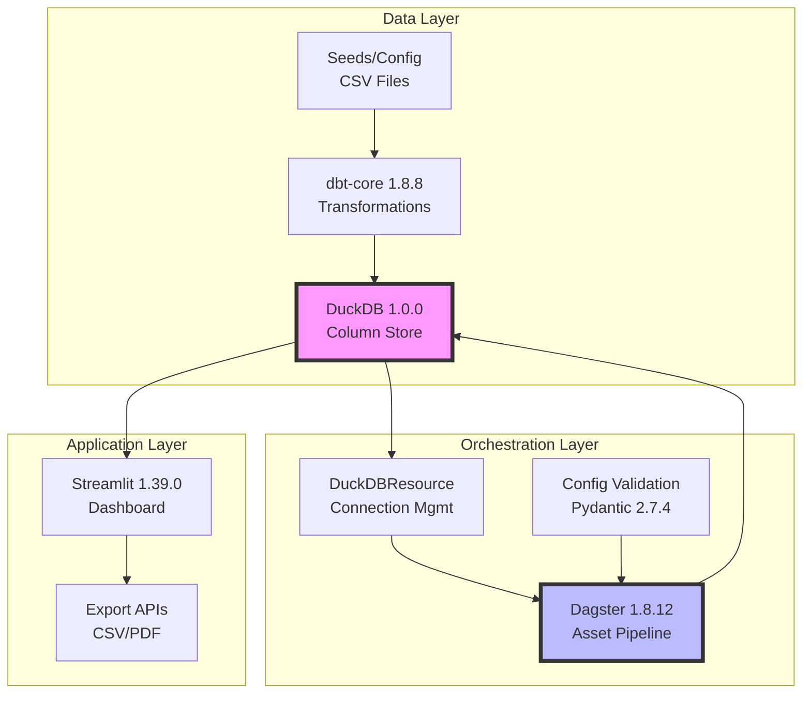
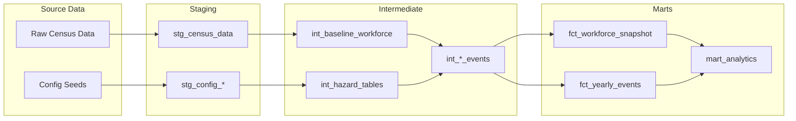
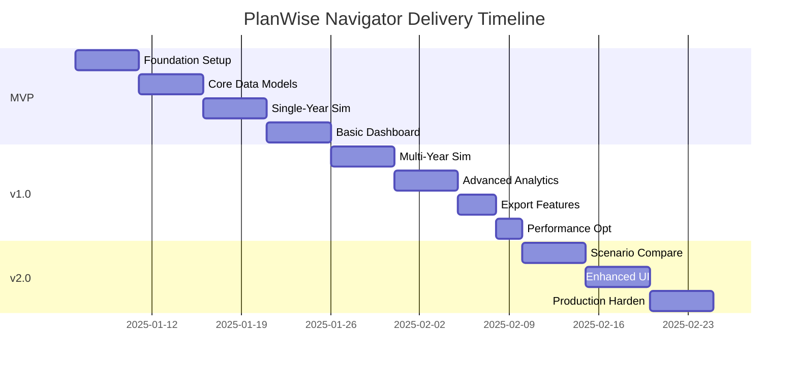

# PlanWise Navigator - Product Requirements Document v3.0

**Date**: 2025-06-21
**Version**: 3.0 (Complete Rebuild)
**Status**: Ready for Implementation
**Target GA**: Q1 2025

---

## 1. Executive Summary

PlanWise Navigator is Fidelity's on-premises workforce simulation platform that models employee lifecycle events (hiring, promotions, raises, terminations) to project future workforce composition and costs. This document defines the complete rebuild using a modern, proven data stack with battle-tested component versions.

### Key Objectives
- **Simulate** multi-year workforce scenarios with configurable parameters
- **Project** headcount, compensation costs, and organizational structure changes
- **Analyze** impact of policy changes (promotion rates, termination rates, hiring targets)
- **Deliver** interactive dashboards and reports for strategic decision-making

### Critical Constraints
- **On-premises only**: No cloud dependencies, all processing local
- **DuckDB serialization**: Must handle DuckDB's non-serializable objects correctly
- **Proven stack only**: Use stable, tested versions to minimize risk

---

## 2. System Architecture

### 2.1 Technology Stack (Validated Versions)

| Layer | Technology | Version | Rationale |
|-------|------------|---------|-----------|
| **Storage** | DuckDB | 1.0.0 | Column-store OLAP, proven stability |
| **Transformation** | dbt-core | 1.8.8 | Mature SQL transformations |
| **Adapter** | dbt-duckdb | 1.8.1 | Stable DuckDB integration |
| **Orchestration** | Dagster | 1.8.12 | Asset-based pipelines, stable API |
| **Dashboard** | Streamlit | 1.39.0 | Interactive analytics UI |
| **Configuration** | Pydantic | 2.7.4 | Type-safe validation |
| **Python** | CPython | 3.11.x | Long-term support |

### 2.2 Architecture Diagram



### 2.3 Data Flow Architecture



---

## 3. Functional Requirements

### 3.1 Core Simulation Capabilities

| ID | Requirement | Priority | Acceptance Criteria |
|----|-------------|----------|-------------------|
| F01 | Multi-year workforce projection (1-10 years) | P0 | Simulate 5 years for 10K employees < 5 min |
| F02 | Configurable growth rates by year | P0 | Support -10% to +20% annual growth |
| F03 | Event generation (hire, promote, terminate, raise) | P0 | Generate events based on hazard tables |
| F04 | Hazard-based probability models | P0 | Age/tenure/level-based risk calculations |
| F05 | Reproducible results via random seed | P0 | Same seed = identical results |
| F06 | Cumulative state tracking | P0 | Correct year-over-year progression |

### 3.2 Data Processing Requirements

| ID | Requirement | Priority | Acceptance Criteria |
|----|-------------|----------|-------------------|
| D01 | Handle 100K employee records | P0 | Process without memory errors |
| D02 | Incremental processing support | P1 | Only process changed data |
| D03 | Data validation at each stage | P0 | Schema + business rule checks |
| D04 | Audit trail for all changes | P0 | Complete lineage tracking |
| D05 | Rollback/recovery capability | P1 | Restore to previous state |

### 3.3 Analytics & Reporting

| ID | Requirement | Priority | Acceptance Criteria |
|----|-------------|----------|-------------------|
| A01 | Interactive workforce dashboards | P0 | < 2s query response time |
| A02 | Scenario comparison (side-by-side) | P0 | Compare up to 3 scenarios |
| A03 | Export to CSV/Excel | P0 | Full data downloads |
| A04 | PDF report generation | P1 | Executive summary format |
| A05 | Cohort progression tracking | P1 | Track groups over time |

---

## 4. Non-Functional Requirements

### 4.1 Performance

| Metric | Target | Measurement |
|--------|--------|-------------|
| Dashboard query response | < 2 seconds | 95th percentile |
| 5-year simulation runtime | < 5 minutes | 10K employees |
| Memory usage | < 8GB RAM | Peak during simulation |
| Concurrent users | 10 analysts | Dashboard access |

### 4.2 Reliability & Maintainability

| Requirement | Target | Implementation |
|-------------|--------|----------------|
| Uptime | 99.5% during business hours | Process monitoring |
| Recovery time | < 30 minutes | Automated restart |
| Code test coverage | > 90% | pytest + dbt tests |
| Documentation | 100% of public APIs | Docstrings + README |

### 4.3 Security & Compliance

| Requirement | Implementation |
|-------------|----------------|
| Data encryption at rest | DuckDB file permissions |
| Access control | OS-level user permissions |
| Audit logging | All data modifications logged |
| PII handling | Configurable masking rules |

---

## 5. Technical Constraints & Design Decisions

### 5.1 Critical Technical Constraints

1. **DuckDB Serialization**: DuckDB Relation objects are NOT serializable by Dagster
   - ✅ **Solution**: Always convert to pandas DataFrames or Python primitives
   - ✅ **Pattern**: Use context managers for all connections
   - ❌ **Never**: Return DuckDBPyRelation from Dagster assets

2. **Version Compatibility**: Proven stable versions only
   - ~~DuckDB 1.1.x~~ → DuckDB 1.0.0 (stability issues resolved)
   - ~~dbt-core 1.9.x~~ → dbt-core 1.8.8 (adapter compatibility)
   - ~~dagster latest~~ → dagster 1.8.12 (API stability)

3. **Memory Management**: Handle large datasets efficiently
   - Batch processing for > 50K records
   - Streaming reads for analytical queries
   - Connection pooling with proper cleanup

### 5.2 Key Design Patterns

```python
# REQUIRED: DuckDB Asset Pattern
@asset
def workforce_data(context: AssetExecutionContext, duckdb: DuckDBResource) -> pd.DataFrame:
    with duckdb.get_connection() as conn:
        # ✅ CORRECT: Convert immediately to DataFrame
        df = conn.execute("SELECT * FROM employees").df()
        return df  # Serializable

# ❌ WRONG: Never do this
@asset
def broken_asset():
    conn = duckdb.connect("db.duckdb")
    return conn.table("employees")  # DuckDBPyRelation - NOT SERIALIZABLE!
```

---

## 6. Non-Goals / Out of Scope

The following are explicitly **OUT OF SCOPE** for this rebuild:

| Item | Rationale | Future Consideration |
|------|-----------|---------------------|
| Real-time data streaming | Batch processing sufficient for use case | v3.0 if needed |
| Cloud deployment | Security requires on-premises | Not planned |
| Mobile app | Desktop analytics sufficient | Not planned |
| AI/ML predictions | Hazard tables provide needed accuracy | v2.0 evaluation |
| Multi-tenant isolation | Single-tenant design simpler | If multi-dept needed |
| External API integration | Self-contained system required | Case-by-case basis |

---

## 7. Success Metrics

### 7.1 Technical Metrics

| Metric | Target | Measurement Method |
|--------|--------|-------------------|
| Build time | < 30 seconds | CI/CD pipeline |
| Test coverage | > 90% Python, 100% dbt | Coverage reports |
| Mean time to recovery | < 30 minutes | Incident tracking |
| Query performance | < 2s p95 | Dagster monitoring |

### 7.2 Business Metrics

| Metric | Current | Target | Timeline |
|--------|---------|--------|----------|
| Simulation accuracy | N/A | < 5% variance from actuals | 6 months |
| User adoption | 0% | 80% of analysts | 3 months post-launch |
| Planning cycle time | 2 weeks | 3 days | 6 months |
| Scenarios per quarter | 5 | 20+ | 3 months |

### 7.3 Quality Gates

- [ ] All Dagster assets pass serialization tests
- [ ] Zero DuckDB connection leaks in 24-hour test
- [ ] Dashboard loads in < 2s with 100K employees
- [ ] Simulation results reproducible with same seed
- [ ] 100% dbt test coverage passing

---

## 8. Implementation Plan

### 8.1 Phased Delivery



### 8.2 MVP (Week 1-2)
**Goal**: Single-year simulation with basic dashboard

Deliverables:
- [x] DuckDB + Dagster integration working
- [x] Staging and intermediate dbt models
- [x] Single-year simulation pipeline
- [x] Basic Streamlit dashboard
- [x] Core data quality checks

### 8.3 Version 1.0 (Week 3-4)
**Goal**: Multi-year simulation with full analytics

Deliverables:
- [ ] Multi-year simulation with state tracking
- [ ] Complete hazard table implementation
- [ ] All mart models and analytics
- [ ] Export to CSV/Excel
- [ ] Performance optimization

### 8.4 Version 2.0 (Week 5-6)
**Goal**: Production-ready with advanced features

Deliverables:
- [ ] Scenario comparison tools
- [ ] Enhanced UI/UX
- [ ] Comprehensive error handling
- [ ] Production monitoring
- [ ] Complete documentation

---

## 9. Open Questions & Decisions Needed

### 9.1 Steering Committee Decisions Required

| Question | Options | Recommendation | **TODO** Owner |
|----------|---------|----------------|----------------|
| Termination rate modeling | Flat rate vs. cohort-based | Cohort-based for accuracy | **TODO**: Analytics Lead |
| Compensation COLA | Fixed % vs. variable by level | Variable for realism | **TODO**: Comp Team |
| Dashboard access | Open vs. role-based | Role-based for sensitive data | **TODO**: Security |
| Historical data | Import all vs. 3-year window | 3-year for performance | **TODO**: Data Governance |

### 9.2 Technical Decisions

| Decision | Options | Recommendation | Status |
|----------|---------|----------------|---------|
| DuckDB version | 1.0.0 vs 1.1.x | 1.0.0 (proven stable) | ✅ Decided |
| State persistence | Database vs. files | Database tables | ✅ Decided |
| Config format | YAML vs. JSON | YAML (readable) | ✅ Decided |
| Testing framework | pytest vs. unittest | pytest + dbt tests | ✅ Decided |

---

## 10. Risk Mitigation

### 10.1 Technical Risks

| Risk | Impact | Probability | Mitigation |
|------|--------|-------------|------------|
| DuckDB serialization issues | High | Medium | Strict coding patterns, comprehensive tests |
| Memory overflow on large datasets | Medium | Low | Batch processing, streaming reads |
| Version incompatibilities | High | Low | Lock all dependency versions |
| Performance degradation | Medium | Medium | Query optimization, monitoring |

### 10.2 Business Risks

| Risk | Impact | Probability | Mitigation |
|------|--------|-------------|------------|
| Low user adoption | High | Medium | Training, intuitive UI, quick wins |
| Inaccurate projections | High | Low | Validate against historical data |
| Scope creep | Medium | High | Strict change control process |

---

## 11. Appendices

### 11.1 Configuration Schema Example

```yaml
# config/simulation_config.yaml
simulation:
  start_year: 2025
  end_year: 2029
  random_seed: 42

workforce:
  target_growth_rate: 0.03
  total_termination_rate: 0.12
  new_hire_termination_rate: 0.25

compensation:
  cola_rate: 0.025
  merit_budget: 0.04
  promotion_increase: 0.15
```

### 11.2 Key File Structure
```
planwise_navigator/
├── definitions.py          # Dagster entry point
├── orchestrator/           # Pipeline code
├── dbt/                    # SQL models
├── config/                 # YAML configs
├── streamlit_dashboard/    # UI
└── tests/                  # All tests
```

---

## Changelog (v2.0 → v3.0)

### Major Additions
1. **Section 2.1**: Added validated version matrix with specific versions that work together
2. **Section 5.1**: Expanded critical constraints with code examples showing correct/incorrect patterns
3. **Section 6**: New "Non-Goals / Out of Scope" section to prevent scope creep
4. **Section 7**: Comprehensive success metrics with technical and business KPIs
5. **Section 8.1**: Visual Gantt chart for phased delivery timeline
6. **Section 9**: Open questions requiring steering committee decisions with TODO owners
7. **Section 10**: Risk mitigation matrix for technical and business risks

### Major Changes
1. **Section 2**: ~~Latest versions~~ → Specific proven versions (DuckDB 1.0.0, dbt-core 1.8.8, Dagster 1.8.12)
2. **Section 3**: Reorganized requirements into functional categories with clear IDs and priorities
3. **Section 4**: ~~Generic NFRs~~ → Specific measurable targets with implementation details
4. **Section 8**: ~~4-week plan~~ → Phased MVP/v1/v2 delivery with clear goals per phase
5. **Throughout**: Added code examples showing DuckDB serialization patterns

### Deprecations
1. ~~Generic "latest stable versions"~~ → Explicit version numbers
2. ~~Vague performance targets~~ → Specific metrics (< 2s queries, < 5 min simulation)
3. ~~Open-ended implementation~~ → Phased delivery with gates

This PRD v3.0 provides a complete, unambiguous specification ready for immediate implementation with all technical constraints addressed and clear success criteria defined.
