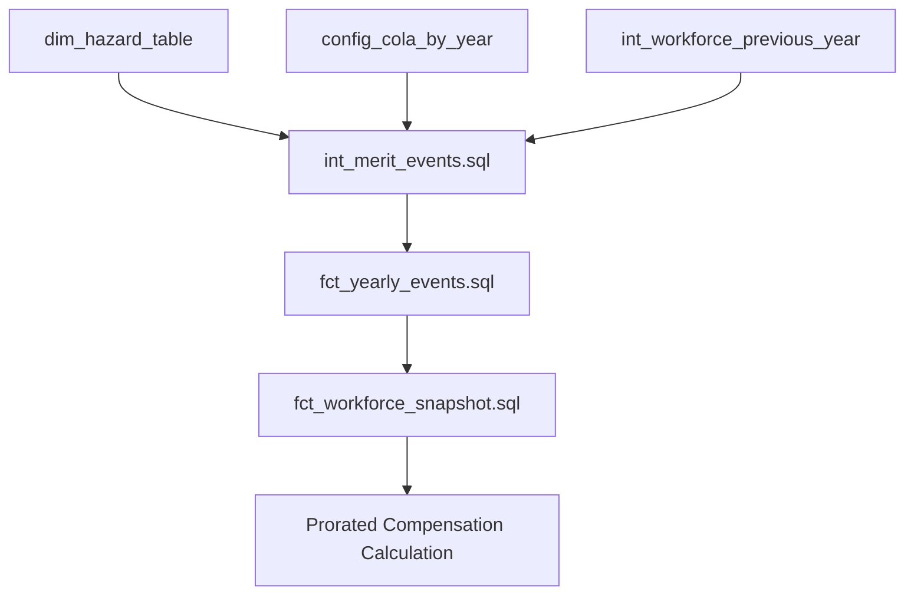

# S055 Raise Timing Implementation Audit - Technical Findings

**Story ID**: S055
**Audit Date**: June 26, 2025
**Auditor**: Engineering Team
**Status**: COMPLETED

---

## Executive Summary

**Key Finding**: The story's problem statement claiming "100% of raises occur on January 1st" is **INCORRECT**. The current implementation uses a **50/50 split** between January 1st and July 1st based on employee ID length.

**Critical Discovery**: The current timing logic is more sophisticated than claimed, but still oversimplified compared to realistic business practices.

---

## 1. Current Implementation Analysis

### 1.1 RAISE Event Generation Logic

**Location**: `/Users/nicholasamaral/planwise_navigator/dbt/models/intermediate/events/int_merit_events.sql`

**Lines 81-84** - Core timing logic:
```sql
CASE
    WHEN (LENGTH(e.employee_id) % 2) = 0 THEN CAST({{ simulation_year }} || '-01-01' AS DATE)
    ELSE CAST({{ simulation_year }} || '-07-01' AS DATE)
END AS effective_date,
```

**Key Characteristics**:
- **Deterministic**: Based on employee_id length (even = Jan 1, odd = July 1)
- **Binary Split**: Only two possible dates (50/50 distribution)
- **Hard-coded**: No configuration parameters control timing
- **Business-agnostic**: No consideration of performance cycles, departments, or business factors

### 1.2 Event Type Processing

**Location**: `/Users/nicholasamaral/planwise_navigator/dbt/models/marts/fct_yearly_events.sql`

**Lines 114-136** - Merit event processing:
- Event type: 'RAISE' (line 131)
- Event category: 'RAISE' (line 131)
- Event priority: 3rd (after termination, promotion) (line 264)

### 1.3 Comparison with Other Event Types

**PROMOTION Events** (int_promotion_events.sql:70):
```sql
(CAST('{{ simulation_year }}-01-01' AS DATE) + INTERVAL ((ABS(HASH(employee_id)) % 365)) DAY) AS effective_date
```
- **More realistic**: Hash-based distribution across entire year
- **Continuous distribution**: Any day of the year possible
- **Different methodology**: RAISE events are less sophisticated than PROMOTION events

---

## 2. Data Flow Mapping

### 2.1 Complete Pipeline



### 2.2 Key Processing Steps

1. **int_merit_events.sql**: Generates RAISE events with 50/50 Jan/July timing
2. **fct_yearly_events.sql**: Consolidates all events with priority sequencing
3. **fct_workforce_snapshot.sql**: Applies prorated compensation calculations

### 2.3 Prorated Compensation Impact

**Location**: `fct_workforce_snapshot.sql:502-504`

```sql
-- Before merit period: previous salary × days before merit
COALESCE(previous_compensation, 0) * (DATE_DIFF('day', '{{ simulation_year }}-01-01'::DATE, effective_date - INTERVAL 1 DAY) + 1) / 365.0 AS before_contrib,
-- After merit period: new salary × days after merit
compensation_amount * (DATE_DIFF('day', effective_date, '{{ simulation_year }}-12-31'::DATE) + 1) / 365.0 AS after_contrib
```

**Impact Analysis**:
- **January 1st raises**: 100% of new salary applied to annual calculation
- **July 1st raises**: ~50% old salary + ~50% new salary applied to annual calculation
- **Timing directly affects**: Annual compensation reporting, growth calculations, budget projections

---

## 3. Configuration Analysis

### 3.1 Main Configuration Parameters

**File**: `config/simulation_config.yaml`

**Lines 12-17** - Compensation configuration:
```yaml
compensation:
  cola_rate: 0.01
  merit_budget: 0.035
  growth_target: 0.02
  growth_tolerance: 0.005
  calculation_methodology: "full_year_equivalent"
```

**Key Findings**:
- ✅ COLA rates are configurable
- ✅ Merit budget is configurable
- ❌ **NO timing configuration parameters**
- ❌ **NO business cycle alignment options**

### 3.2 Seed Configuration Files

**config_raises_hazard.csv**:
```csv
merit_base,merit_tenure_bump_bands,merit_tenure_bump_value,merit_low_level_cutoff,merit_low_level_bump_value,promotion_raise
0.03,"['<1', '1-3', '3-5']",0.005,2,0.005,0.12
```

**config_cola_by_year.csv**:
- Configurable COLA rates by year (2024-2029: 2.5%)
- No timing configuration

**Conclusion**: Merit amounts are configurable, but timing is completely hard-coded.

---

## 4. Critical Issues Identified

### 4.1 Schema Inconsistency

**Location**: `dbt/models/marts/schema.yml:66`

**Issue**: Schema validation expects 'merit_increase' but code uses 'RAISE'
```yaml
accepted_values:
  values: ['termination', 'promotion', 'hire', 'merit_increase']  # ❌ Should be 'RAISE'
```

**Impact**: Data validation tests will fail if strictly enforced.

### 4.2 Story Problem Statement Inaccuracy

**Claim**: "All employee raises...currently occur on January 1st"
**Reality**: 50% on January 1st, 50% on July 1st

**Implication**: The business case may be overstated, but the need for realistic timing still exists.

### 4.3 Inconsistent Event Timing Approaches

- **RAISE events**: Simplistic 50/50 binary split
- **PROMOTION events**: Sophisticated hash-based year-round distribution
- **No architectural consistency** in timing methodology

---

## 5. Business Impact Assessment

### 5.1 Current Timing Distribution vs. Reality

**Current Implementation**:
- January 1st: 50%
- July 1st: 50%
- All other dates: 0%

**Realistic Business Patterns** (from research):
- January: 28% (budget implementation)
- April: 18% (merit cycles)
- July: 23% (fiscal year alignment)
- October: 8% (federal fiscal year)
- Other months: 23% (distributed)

### 5.2 Compensation Calculation Accuracy

**Issue**: Current 50/50 split creates artificial clustering that affects:
- Annual compensation growth calculations
- Prorated compensation accuracy
- Budget forecasting models
- Workforce planning credibility

**Example Impact**:
- Employee with Jan 1 raise: 100% of new salary counted
- Employee with July 1 raise: Only ~50% of raise impact counted
- Creates systematic bias in compensation projections

---

## 6. Technical Architecture Strengths

### 6.1 Event Sourcing Foundation
✅ **Immutable event recording** with complete audit trail
✅ **Proper event sequencing** and conflict resolution
✅ **Comprehensive prorated calculations** for mid-year changes
✅ **Flexible pipeline architecture** for adding new timing logic

### 6.2 Configuration Management
✅ **Type-safe configuration** via Pydantic models
✅ **Seed-based parameter management** for amounts and rates
✅ **Year-specific configuration** support (COLA by year)

### 6.3 Data Quality
✅ **Comprehensive validation** checks in event processing
✅ **Data quality flags** for invalid records
✅ **Asset-based testing** framework ready for expansion

---

## 7. Recommendations for S056/S057

### 7.1 Immediate Fixes Required

1. **Schema Validation Fix**: Update schema.yml to accept 'RAISE' instead of 'merit_increase'
2. **Problem Statement Correction**: Update S055 story to reflect actual 50/50 timing vs. claimed 100% Jan 1st

### 7.2 Timing System Enhancement

**Recommended Approach**:
1. **Configurable timing distribution** via new seed file `config_raise_timing_distribution.csv`
2. **Monthly percentage allocation** (Jan: 28%, Apr: 18%, Jul: 23%, etc.)
3. **Hash-based distribution** within months (following promotion event pattern)
4. **Industry/department-specific** timing patterns (optional)

### 7.3 Backward Compatibility

**Strategy**:
- Maintain current deterministic approach as fallback
- Add configuration flag to enable realistic timing
- Ensure identical results with same random seed for regression testing

---

## 8. Implementation Roadmap

### 8.1 S056: Design Realistic Timing System
- Create configurable timing distribution framework
- Design month/day allocation algorithm
- Define configuration schema for timing patterns
- Create migration strategy from current logic

### 8.2 S057: Implement Timing Logic
- Implement new timing generation in int_merit_events.sql
- Add configuration seed files for timing distribution
- Update event processing to handle new patterns
- Comprehensive testing and validation

### 8.3 Future Enhancements
- Industry-specific timing patterns
- Performance review cycle integration
- Manager discretion timing windows
- Advanced business calendar support

---

## 9. Files Requiring Modification

### 9.1 Core Logic Files
- `dbt/models/intermediate/events/int_merit_events.sql` - Main timing logic
- `dbt/models/marts/schema.yml` - Fix event type validation

### 9.2 Configuration Files
- `dbt/seeds/config_raise_timing_distribution.csv` - New timing distribution
- `config/simulation_config.yaml` - Add timing methodology parameter

### 9.3 Testing and Validation
- `dbt/models/marts/fct_yearly_events.sql` - Ensure proper event processing
- Add new data tests for timing distribution validation

---

## 10. Conclusion

The S055 audit reveals that the current RAISE timing implementation is more sophisticated than claimed (50/50 split vs. alleged 100% Jan 1st) but still falls short of realistic business patterns. The event sourcing architecture provides a solid foundation for implementing configurable, realistic timing patterns.

**Key Success Factors for S056/S057**:
1. Maintain deterministic behavior for testing reproducibility
2. Leverage existing prorated compensation calculation excellence
3. Follow the more sophisticated PROMOTION event timing pattern
4. Ensure configuration-driven flexibility for different business scenarios

**Audit Status**: ✅ COMPLETE - Ready for S056 implementation design phase.
