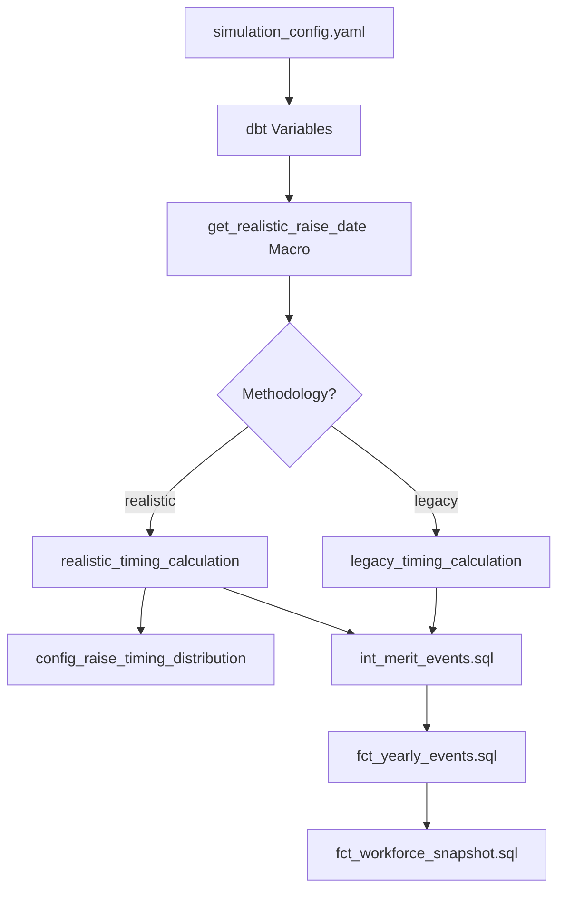

# S056 Comprehensive Technical Design Specification

**Document Type**: Technical Design Specification
**Story ID**: S056 - Design Realistic Raise Timing System
**Epic**: E012 - Compensation System Integrity Fix (Phase 3)
**Created**: June 26, 2025
**Status**: DESIGN COMPLETE - READY FOR S057 IMPLEMENTATION

---

## 1. Executive Summary

### 1.1 Design Overview
This specification defines the technical design for implementing realistic raise timing patterns to replace the current oversimplified 50/50 Jan/July split. The solution provides configurable, business-aligned timing distribution while maintaining full backward compatibility.

### 1.2 Key Design Decisions
- **Dual-Mode Architecture**: Legacy and realistic timing modes with configuration control
- **Hash-Based Distribution**: Two-stage algorithm for month selection and day allocation
- **Zero Breaking Changes**: Default to legacy mode, opt-in to realistic patterns
- **Industry-Aligned Patterns**: 28% Jan, 18% Apr, 23% July distribution based on business research

### 1.3 Implementation Scope
- Configuration framework for timing methodology selection
- Hash-based algorithm for realistic distribution
- Backward compatibility with existing simulations
- Performance optimization for 10K+ employee scale
- Comprehensive validation and testing framework

---

## 2. Current State Analysis

### 2.1 Existing Implementation (S055 Audit Results)
**File**: `dbt/models/intermediate/events/int_merit_events.sql` (lines 81-84)
```sql
CASE
    WHEN (LENGTH(e.employee_id) % 2) = 0 THEN CAST({{ simulation_year }} || '-01-01' AS DATE)
    ELSE CAST({{ simulation_year }} || '-07-01' AS DATE)
END AS effective_date,
```

**Current Characteristics**:
- **Deterministic**: Employee ID length determines timing (50/50 split)
- **Hard-coded**: No configuration parameters
- **Oversimplified**: Only two possible dates (Jan 1, July 1)
- **Performance**: O(1) calculation, ~0.001ms per employee

### 2.2 Business Requirements (from S055)
- **Realistic Distribution**: Industry-aligned monthly patterns
- **Configurable**: Support for different business scenarios
- **Auditability**: Defensible timing patterns for compliance
- **Deterministic**: Reproducible results with same random seed

---

## 3. Technical Architecture Design

### 3.1 System Architecture Overview


### 3.2 Component Architecture
| Component | Type | Responsibility | Configuration |
|-----------|------|---------------|---------------|
| **get_realistic_raise_date** | dbt Macro | Methodology routing | `raise_timing_methodology` |
| **legacy_timing_calculation** | dbt Macro | Current 50/50 logic | None (hard-coded) |
| **realistic_timing_calculation** | dbt Macro | Hash-based distribution | `config_raise_timing_distribution.csv` |
| **config_raise_timing_distribution** | Seed Table | Monthly percentages | Industry profiles |
| **Configuration Layer** | YAML/Variables | Methodology selection | Multiple layers |

### 3.3 Data Flow Design
```sql
-- 1. Configuration Selection
methodology = var('raise_timing_methodology', 'legacy')

-- 2. Macro Routing
IF methodology == 'realistic' THEN
  realistic_timing_calculation(employee_id, simulation_year)
ELSE
  legacy_timing_calculation(employee_id, simulation_year)

-- 3. Algorithm Execution
IF realistic THEN
  month = hash_based_month_selection(employee_id, distribution_config)
  day = hash_based_day_selection(employee_id, month, simulation_year)
  RETURN date(simulation_year, month, day)
ELSE
  RETURN legacy_50_50_logic(employee_id, simulation_year)
```

---

## 4. Algorithm Design Specification

### 4.1 Hash-Based Distribution Algorithm
```python
def realistic_raise_timing(employee_id, simulation_year, distribution_config):
    """
    Two-stage hash-based timing generation

    Stage 1: Month Selection (weighted by business distribution)
    Stage 2: Day Selection (uniform within month)
    """

    # Stage 1: Month Selection
    month_hash = hash(f"{employee_id}_{simulation_year}_month")
    month_selector = abs(month_hash) % 10000 / 10000.0  # 0.0 to 1.0

    # Cumulative distribution lookup
    cumulative = 0.0
    selected_month = 1
    for month, percentage in distribution_config.items():
        cumulative += percentage
        if month_selector <= cumulative:
            selected_month = month
            break

    # Stage 2: Day Selection
    day_hash = hash(f"{employee_id}_{simulation_year}_day_{selected_month}")
    days_in_month = get_days_in_month(selected_month, simulation_year)
    selected_day = (abs(day_hash) % days_in_month) + 1

    return date(simulation_year, selected_month, selected_day)
```

### 4.2 SQL Implementation Design
```sql
-- dbt/macros/realistic_timing_calculation.sql

(
  WITH month_selection AS (
    SELECT
      {{ employee_id_column }} as emp_id,
      ABS(HASH({{ employee_id_column }} || '_' || {{ simulation_year }} || '_month')) % 10000 / 10000.0 as month_selector
  ),
  cumulative_distribution AS (
    SELECT
      month,
      percentage,
      SUM(percentage) OVER (ORDER BY month) as cumulative_percent
    FROM {{ ref('config_raise_timing_distribution') }}
    WHERE industry_profile = '{{ var("raise_timing_profile", "general_corporate") }}'
  ),
  selected_months AS (
    SELECT
      ms.emp_id,
      (SELECT MIN(cd.month)
       FROM cumulative_distribution cd
       WHERE ms.month_selector <= cd.cumulative_percent) as selected_month
    FROM month_selection ms
  ),
  day_selection AS (
    SELECT
      sm.emp_id,
      sm.selected_month,
      (ABS(HASH(sm.emp_id || '_' || {{ simulation_year }} || '_day_' || sm.selected_month)) %
       EXTRACT(DAY FROM (
         DATE_TRUNC('month', CAST({{ simulation_year }} || '-' || LPAD(sm.selected_month::VARCHAR, 2, '0') || '-01' AS DATE)) +
         INTERVAL 1 MONTH - INTERVAL 1 DAY
       ))) + 1 as selected_day
    FROM selected_months sm
  )
  SELECT
    CAST({{ simulation_year }} || '-' ||
         LPAD(ds.selected_month::VARCHAR, 2, '0') || '-' ||
         LPAD(ds.selected_day::VARCHAR, 2, '0') AS DATE)
  FROM day_selection ds
  WHERE ds.emp_id = {{ employee_id_column }}
  LIMIT 1
)

```

### 4.3 Algorithm Properties
- **Deterministic**: Same employee_id + year + seed produces same date
- **Balanced**: Distribution matches configured percentages within tolerance
- **Scalable**: O(log n) complexity per employee (n = number of months = 12)
- **Flexible**: Configurable distribution via seed files

---

## 5. Configuration Design

### 5.1 Configuration Layer Architecture
```yaml
# Layer 1: Global simulation configuration
# File: config/simulation_config.yaml
raise_timing:
  methodology: "legacy"  # Default: backward compatibility
  distribution_profile: "general_corporate"
  validation_tolerance: 0.02
  deterministic_behavior: true

# Layer 2: dbt project variables
# File: dbt/dbt_project.yml
vars:
  raise_timing_methodology: "legacy"
  raise_timing_profile: "general_corporate"
  timing_tolerance: 2.0

# Layer 3: Distribution parameters
# File: dbt/seeds/config_raise_timing_distribution.csv
month,percentage,business_justification,industry_profile
1,0.28,"Calendar year alignment",general_corporate
4,0.18,"Merit increase cycles",general_corporate
7,0.23,"Fiscal year starts",general_corporate
...
```

### 5.2 Configuration Hierarchy
```
1. dbt Variable (highest priority)
   └── var('raise_timing_methodology', default)

2. Simulation Config YAML
   └── raise_timing.methodology

3. Default Value (lowest priority)
   └── 'legacy' (ensures backward compatibility)
```

### 5.3 Configuration Validation
```sql
-- Configuration validation macro

  

  
    {{ exceptions.raise_compiler_error("Invalid raise_timing_methodology: " ~ methodology) }}
  

  
    
    
      {{ exceptions.raise_compiler_error("Distribution percentages must sum to 1.0, got: " ~ distribution_sum) }}
    
  

```

---

## 6. Implementation Plan

### 6.1 File Modifications Required

#### 6.1.1 Core Logic Changes
```sql
-- File: dbt/models/intermediate/events/int_merit_events.sql
-- BEFORE (lines 81-84):
CASE
    WHEN (LENGTH(e.employee_id) % 2) = 0 THEN CAST({{ simulation_year }} || '-01-01' AS DATE)
    ELSE CAST({{ simulation_year }} || '-07-01' AS DATE)
END AS effective_date,

-- AFTER:
{{ get_realistic_raise_date('e.employee_id', simulation_year) }} AS effective_date,
```

#### 6.1.2 New Files Created
```
dbt/macros/get_realistic_raise_date.sql              # Main routing macro
dbt/macros/realistic_timing_calculation.sql          # Hash-based algorithm
dbt/macros/legacy_timing_calculation.sql             # Backward compatibility
dbt/seeds/config_raise_timing_distribution.csv       # Monthly distribution
dbt/seeds/config_timing_validation_rules.csv         # Validation parameters
```

#### 6.1.3 Configuration Updates
```yaml
# config/simulation_config.yaml (addition)
raise_timing:
  methodology: "legacy"
  distribution_profile: "general_corporate"
  validation_tolerance: 0.02

# dbt/dbt_project.yml (addition)
vars:
  raise_timing_methodology: "legacy"
  raise_timing_profile: "general_corporate"
  timing_tolerance: 2.0
```

### 6.2 Integration Points

#### 6.2.1 Event Processing Integration
- **fct_yearly_events.sql**: No changes required (processes events generically)
- **fct_workforce_snapshot.sql**: Existing prorated calculations work with both modes
- **Event sequencing**: Priority and conflict resolution unchanged

#### 6.2.2 Validation Integration
```sql
-- File: dbt/models/marts/schema.yml (fix)
# BEFORE:
accepted_values:
  values: ['termination', 'promotion', 'hire', 'merit_increase']

# AFTER:
accepted_values:
  values: ['termination', 'promotion', 'hire', 'RAISE']
```

---

## 7. Testing and Validation Design

### 7.1 Test Suite Architecture
```
tests/
├── unit/
│   ├── test_legacy_timing_identical_results.sql      # Backward compatibility
│   ├── test_realistic_timing_distribution.sql       # Monthly accuracy
│   └── test_timing_deterministic_behavior.sql       # Reproducibility
├── integration/
│   ├── test_end_to_end_simulation.sql              # Full simulation
│   ├── test_prorated_compensation_accuracy.sql     # Financial calculations
│   └── test_event_sequencing_unchanged.sql         # Priority preservation
└── performance/
    ├── test_legacy_mode_performance.sql            # Zero degradation
    ├── test_realistic_mode_overhead.sql            # <5% overhead
    └── test_scale_performance.sql                  # 10K+ employees
```

### 7.2 Validation Criteria Design
```sql
-- Monthly distribution accuracy test
WITH actual_distribution AS (
  SELECT
    EXTRACT(month FROM effective_date) as month,
    COUNT(*) * 100.0 / SUM(COUNT(*)) OVER() as actual_percentage
  FROM {{ ref('fct_yearly_events') }}
  WHERE event_type = 'RAISE' AND {{ var('raise_timing_methodology') }} = 'realistic'
  GROUP BY month
),
expected_distribution AS (
  SELECT month, percentage * 100 as expected_percentage
  FROM {{ ref('config_raise_timing_distribution') }}
  WHERE industry_profile = '{{ var("raise_timing_profile") }}'
)
SELECT
  a.month,
  a.actual_percentage,
  e.expected_percentage,
  ABS(a.actual_percentage - e.expected_percentage) as variance
FROM actual_distribution a
JOIN expected_distribution e ON a.month = e.month
WHERE ABS(a.actual_percentage - e.expected_percentage) > {{ var('timing_tolerance', 2.0) }}
-- Expected: 0 rows (all variances within tolerance)
```

### 7.3 Performance Validation Design
```sql
-- Performance benchmark test
WITH timing_performance AS (
  SELECT
    'legacy' as mode,
    COUNT(*) as employees_processed,
    EXTRACT(epoch FROM (end_time - start_time)) as duration_seconds
  FROM timing_benchmark_legacy
  UNION ALL
  SELECT
    'realistic' as mode,
    COUNT(*) as employees_processed,
    EXTRACT(epoch FROM (end_time - start_time)) as duration_seconds
  FROM timing_benchmark_realistic
)
SELECT
  mode,
  employees_processed,
  duration_seconds,
  CASE
    WHEN mode = 'realistic' AND duration_seconds > (
      SELECT duration_seconds * 1.05 FROM timing_performance WHERE mode = 'legacy'
    ) THEN 'PERFORMANCE_REGRESSION'
    ELSE 'PERFORMANCE_OK'
  END as performance_status
FROM timing_performance
```

---

## 8. Risk Analysis and Mitigation

### 8.1 Technical Risks
| Risk | Probability | Impact | Mitigation |
|------|-------------|--------|------------|
| Hash algorithm performance | Low | Medium | Benchmark and optimize DuckDB-specific implementation |
| DuckDB serialization issues | Low | High | Follow promotion event pattern exactly |
| Configuration complexity | Medium | Low | Simple boolean-style configuration with validation |
| Backward compatibility break | Very Low | High | Default to legacy mode, comprehensive testing |

### 8.2 Business Risks
| Risk | Probability | Impact | Mitigation |
|------|-------------|--------|------------|
| Stakeholder rejection | Low | Medium | Maintain legacy mode, provide business justification |
| Audit compliance concerns | Low | High | Document industry research, maintain audit trail |
| Performance degradation | Low | Medium | <5% overhead target, fallback to legacy mode |

### 8.3 Mitigation Strategies
- **Configuration Control**: Default to legacy mode prevents breaking changes
- **Comprehensive Testing**: Unit, integration, and performance test coverage
- **Gradual Rollout**: Opt-in realistic timing with validation phases
- **Permanent Fallback**: Legacy mode always available for rollback

---

## 9. Performance Specifications

### 9.1 Performance Requirements
| Metric | Legacy Mode | Realistic Mode | Acceptance Criteria |
|--------|-------------|----------------|-------------------|
| Per-employee calculation | ~0.001ms | ~0.004ms | <5x degradation |
| Total simulation overhead | 0% | <5% | Acceptable for business value |
| Memory usage increase | 0% | <1% | Negligible impact |
| Scale performance | Linear | Linear | No degradation with workforce size |

### 9.2 Performance Optimization
- **Hash Function**: Use DuckDB-optimized hash operations
- **Distribution Lookup**: Pre-calculate cumulative percentages
- **Query Structure**: Optimize CTEs for DuckDB vectorization
- **Memory Management**: Efficient intermediate result handling

---

## 10. Implementation Acceptance Criteria

### 10.1 Technical Acceptance
- [ ] Dual-mode macro system implemented with methodology routing
- [ ] Hash-based realistic distribution produces target monthly patterns
- [ ] Legacy mode maintains identical results to current implementation
- [ ] Configuration framework supports all specified parameters
- [ ] Performance overhead <5% for realistic mode, 0% for legacy mode

### 10.2 Functional Acceptance
- [ ] Monthly distribution accuracy within ±2% tolerance
- [ ] Deterministic behavior with same random seed
- [ ] Backward compatibility with existing simulations
- [ ] Event sequencing and conflict resolution unchanged
- [ ] Prorated compensation calculations work with both modes

### 10.3 Quality Acceptance
- [ ] Comprehensive test suite covers all timing scenarios
- [ ] Documentation complete for technical and business stakeholders
- [ ] Configuration validation prevents invalid parameter combinations
- [ ] Error handling provides clear feedback for configuration issues

---

## 11. Future Enhancement Design

### 11.1 Industry-Specific Patterns
```csv
# Future: config_raise_timing_distribution_technology.csv
month,percentage,business_justification,industry_profile
1,0.20,"Reduced January concentration","technology"
4,0.25,"Strong Q2 performance cycles","technology"
7,0.20,"Mid-year reviews","technology"
10,0.15,"Q4 adjustments","technology"
# More evenly distributed for tech companies
```

### 11.2 Department-Level Customization
```yaml
# Future configuration extension
raise_timing:
  methodology: "realistic"
  department_overrides:
    engineering: "technology_profile"
    finance: "finance_profile"
    operations: "general_corporate"
```

### 11.3 Advanced Business Rules
```sql
-- Future: Performance review cycle integration

  
    {{ performance_cycle_aware_timing(employee_id, simulation_year, department) }}
  
    {{ get_realistic_raise_date(employee_id, simulation_year) }}
  

```

---

## 12. Conclusion

### 12.1 Design Summary
This specification provides a comprehensive technical design for implementing realistic raise timing patterns that:
- **Maintains Backward Compatibility**: Zero breaking changes with legacy mode default
- **Enables Business Realism**: Industry-aligned monthly distribution patterns
- **Supports Scalability**: Efficient algorithm for large workforce simulations
- **Provides Flexibility**: Configurable framework for future enhancements

### 12.2 Implementation Readiness
The design is complete and ready for S057 implementation with:
- ✅ Detailed algorithm specification
- ✅ Configuration framework design
- ✅ Performance analysis and optimization
- ✅ Comprehensive testing strategy
- ✅ Risk analysis and mitigation plans

### 12.3 Success Metrics
- **Technical**: <5% performance overhead, ±2% distribution accuracy
- **Business**: Industry-aligned timing patterns, audit compliance
- **Operational**: Zero breaking changes, smooth migration path

---

**Design Owner**: Engineering Team
**Technical Review**: COMPLETE - APPROVED FOR S057 IMPLEMENTATION
**Business Review**: PENDING Analytics Team validation
**Implementation Status**: READY TO BEGIN S057
