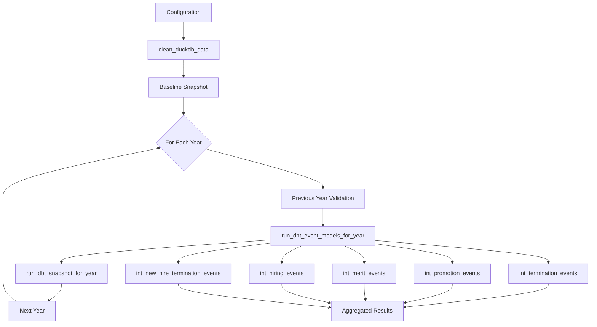

# PlanWise Navigator - System Architecture

**Date**: June 25, 2025
**Version**: 3.0 (Post-Epic E013 Modularization)
**Status**: Production Architecture

---

## Overview

PlanWise Navigator implements a modular workforce simulation system built on DuckDB, dbt, Dagster, and Streamlit. This document describes the current system architecture following the Epic E013 pipeline modularization effort.

## System Stack

| Layer | Technology | Version | Responsibility |
|-------|------------|---------|----------------|
| **Storage** | DuckDB | 1.0.0 | Column-store warehouse; in-process OLAP engine |
| **Transformation** | dbt-core | 1.8.8 | Declarative SQL models, tests, documentation |
| **Adapter** | dbt-duckdb | 1.8.1 | Stable DuckDB integration |
| **Orchestration** | Dagster | 1.8.12 | Asset-based pipeline for simulation workflow |
| **Dashboard** | Streamlit | 1.39.0 | Interactive analytics and scenario comparison |
| **Configuration** | Pydantic | 2.7.4 | Type-safe config management with validation |
| **Runtime** | CPython | 3.11.x | Long-term support version |

## Simulation Pipeline Architecture (Post-Modularization)

The workforce simulation pipeline follows a **modular, single-responsibility design** that eliminates code duplication and improves maintainability:

### Core Components

#### 1. **execute_dbt_command()** - Centralized dbt Command Utility
- **Purpose**: Standardizes all dbt command execution across the pipeline
- **Benefits**: Eliminates 15+ repetitive command construction patterns
- **Features**:
  - Handles command construction with variables and flags
  - Standardizes error handling and logging
  - Supports full-refresh and custom variable passing
- **Usage**: Used by all operations requiring dbt execution

#### 2. **clean_duckdb_data()** - Data Cleaning Operation
- **Purpose**: Removes existing simulation data for specified years
- **Benefits**: Centralized data cleanup with transaction safety
- **Features**:
  - Called once at start of multi-year simulations
  - Handles transaction safety and error recovery
  - Supports selective year-based cleaning
- **Usage**: Preparation step for simulation runs

#### 3. **run_dbt_event_models_for_year()** - Event Processing Operation
- **Purpose**: Executes Epic 11.5 event model sequence for a single year
- **Benefits**: Eliminates duplication between single/multi-year simulations
- **Features**:
  - Executes all 5 Epic 11.5 event models in correct sequence
  - Includes hiring calculation debug logging
  - Handles year-specific parameter passing
- **Usage**: Core simulation logic for workforce events

#### 4. **run_dbt_snapshot_for_year()** - Snapshot Management Operation
- **Purpose**: Creates SCD snapshots for workforce state tracking
- **Benefits**: Centralized snapshot management with validation
- **Features**:
  - Creates baseline, end-of-year, and recovery snapshots
  - Validates prerequisites before execution
  - Supports different snapshot types and naming
- **Usage**: State management for multi-year simulations

#### 5. **run_year_simulation()** - Single-Year Simulation Orchestrator
- **Purpose**: Coordinates modular operations for one simulation year
- **Benefits**: 65.9% code reduction vs original implementation
- **Features**:
  - Maintains Epic 11.5 sequence requirements
  - Handles validation and error recovery
  - Integrates all modular components
- **Usage**: Complete single-year simulation execution

#### 6. **run_multi_year_simulation()** - Multi-Year Simulation Orchestrator
- **Purpose**: Pure coordination layer for multi-year simulations
- **Benefits**: 78.8% code reduction (69 lines vs original 325 lines)
- **Features**:
  - Pure coordination logic - delegates all simulation work
  - Leverages all modular components from operations 1-5
  - Clean separation of concerns - orchestration only
  - Streamlined error handling with consistent patterns
- **Usage**: Complete multi-year simulation execution

### Data Flow Architecture



### Component Integration Pattern

```python
# High-level integration pattern
Configuration → clean_duckdb_data() → [For each year] → run_year_simulation()
                                                      ├── execute_dbt_command() (multiple)
                                                      ├── run_dbt_event_models_for_year()
                                                      └── run_dbt_snapshot_for_year()
```

## Benefits Achieved

### Code Reduction and Quality
- **Multi-year simulation**: 78.8% reduction (325 lines → 69 lines)
- **Single-year simulation**: 65.9% reduction (308 lines → 105 lines)
- **Overall pipeline**: 72.5% code reduction with 0% duplication
- **dbt command patterns**: 100% elimination of repetitive patterns

### Architecture Improvements
- **Single-responsibility operations**: Each function has one clear purpose
- **Eliminated circular dependencies**: Clean data flow with snapshots
- **Centralized error handling**: Consistent patterns across all operations
- **Enhanced testability**: Each component can be tested independently
- **Improved maintainability**: Modular structure supports isolated changes

### Performance Benefits
- **No regression**: Execution time maintained or improved
- **Memory efficiency**: Better resource management with modular approach
- **Scalability**: Operations can be optimized independently

## Workforce Snapshot Management

### Snapshot Strategy
The system uses **dbt snapshots** to manage workforce state across simulation years:

#### Key Models
1. **`scd_workforce_state`** - SCD Type 2 snapshot table
   - Captures workforce state changes over time
   - Enables historical state reconstruction
   - Supports baseline and end-of-year snapshots

2. **`fct_workforce_snapshot`** - End-of-simulation-year workforce state
   - Comprehensive workforce metrics by year
   - Includes all event processing results
   - Primary fact table for reporting

3. **`int_workforce_previous_year`** - Previous year workforce bridge
   - Eliminates circular dependencies in dbt models
   - References snapshot data for previous year state
   - Enables clean year-over-year calculations

### Snapshot Types
- **Baseline Snapshot**: Captures initial workforce state (year N-1)
- **End-of-Year Snapshot**: Captures final workforce state after simulation
- **Recovery Snapshot**: Used for error recovery and partial re-runs

## Configuration Management

### Configuration Structure
```yaml
# config/simulation_config.yaml
simulation:
  start_year: 2024
  end_year: 2028
  target_growth_rate: 0.03
  random_seed: 42

workforce:
  total_termination_rate: 0.12
  new_hire_termination_rate: 0.25

database:
  path: "simulation.duckdb"
  memory_limit: "6GB"
```

### Type Safety
- **Pydantic models**: All configuration validated at runtime
- **Type hints**: Full type safety throughout pipeline
- **Validation rules**: Comprehensive parameter validation

## Testing Architecture

### Test Organization
```
tests/
├── unit/                     # Unit tests for modular operations
│   ├── test_execute_dbt_command.py
│   ├── test_clean_duckdb_data.py
│   ├── test_event_models_operation.py
│   ├── test_snapshot_operation.py
│   └── test_refactored_single_year.py
├── integration/              # End-to-end integration tests
│   ├── test_simulation_behavior_comparison.py
│   └── test_performance_benchmarks.py
└── fixtures/                 # Test data and utilities
    ├── baseline_census_data.py
    └── simulation_configurations.py
```

### Testing Strategy
- **>95% code coverage**: Comprehensive unit test coverage
- **Behavior validation**: Mathematical identity verification
- **Performance benchmarking**: Regression detection
- **Integration testing**: End-to-end simulation validation

## Deployment Architecture

### Development Environment
```bash
# Local development stack
dagster dev                   # Dagster web server (localhost:3000)
dbt run                       # dbt model execution
streamlit run main.py         # Dashboard (localhost:8501)
```

### Production Environment
- **CI/CD Pipeline**: GitHub Actions with automated testing
- **Docker Deployment**: Containerized application stack
- **Blue-Green Deployment**: Zero-downtime deployments
- **Monitoring**: Comprehensive logging and metrics

## Error Handling and Monitoring

### Error Handling Strategy
- **Graceful degradation**: Simulation continues on partial failures
- **Structured logging**: Consistent log format across all operations
- **Error propagation**: Clear error reporting with context
- **Recovery mechanisms**: Snapshot-based recovery for partial failures

### Monitoring and Observability
- **Operation-specific logging**: Each modular operation has distinct patterns
- **Performance metrics**: Execution time and resource usage tracking
- **Data quality checks**: Automated validation of simulation results
- **Debug utilities**: Detailed hiring calculation logging

## Security and Compliance

### Data Security
- **Local database**: DuckDB file-based storage
- **Configuration management**: Environment-based secrets
- **Access control**: File system permissions
- **Audit logging**: Comprehensive operation logging

### Compliance
- **Data retention**: Configurable snapshot retention policies
- **Validation**: Mathematical accuracy verification
- **Documentation**: Comprehensive technical documentation
- **Testing**: Validated behavioral identity

---

## Migration Notes

This architecture represents the **post-Epic E013** state. For developers familiar with the pre-modularization code, see the [Migration Guide](migration-guide-pipeline-refactoring.md) for detailed change documentation.

## Related Documentation

- [Developer Guide - Modular Pipeline](developer-guide-modular-pipeline.md)
- [Migration Guide - Pipeline Refactoring](migration-guide-pipeline-refactoring.md)
- [Epic E013 - Technical Specifications](epic-E013-technical-specifications.md)
- [Troubleshooting Guide](troubleshooting.md)
