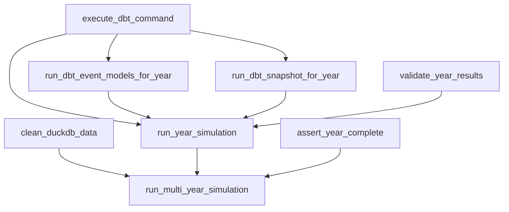

# Epic E013: Technical Specifications and Implementation Patterns

**Epic**: E013 - Dagster Simulation Pipeline Modularization
**Document Type**: Technical Specification
**Last Updated**: 2024-06-24

## Overview

This document provides detailed technical specifications for implementing the modular simulation pipeline refactoring. It includes architecture patterns, code examples, performance requirements, and implementation guidelines.

## Architecture Patterns

### Current State Analysis

#### Monolithic Operation Structure
```python
# Current run_multi_year_simulation: 325 lines
def run_multi_year_simulation(context, baseline_valid):
    # Configuration setup (10 lines)
    # Data cleaning embedded logic (15 lines)
    # Year loop with embedded logic (280+ lines)
    #   ├── Validation logic (20 lines)
    #   ├── dbt command blocks (80+ lines)
    #   ├── Event processing duplication (94 lines)
    #   ├── Snapshot management (35 lines)
    #   └── Error handling (40+ lines)
    # Summary logging (20 lines)
```

#### Code Duplication Analysis
| Logic Block | run_year_simulation | run_multi_year_simulation | Duplication % |
|-------------|-------------------|---------------------------|---------------|
| Event processing | Lines 295-386 (91 lines) | Lines 932-1026 (94 lines) | ~100% |
| dbt command patterns | 8 blocks | 7+ blocks | ~60% |
| Hiring debug logging | Lines 310-376 (66 lines) | Lines 946-1014 (68 lines) | ~100% |
| Error handling | Distributed | Distributed | ~40% |

### Target State Architecture

#### Modular Operation Structure
```python
# Proposed modular architecture
execute_dbt_command()           # Utility: 30 lines
clean_duckdb_data()            # Operation: 40 lines
run_dbt_event_models_for_year() # Operation: 80 lines
run_dbt_snapshot_for_year()    # Operation: 50 lines
run_year_simulation()          # Orchestrator: 160 lines (was 308)
run_multi_year_simulation()    # Orchestrator: 50 lines (was 325)
```

#### Dependency Graph


## Implementation Patterns

### 1. dbt Command Execution Pattern

#### Current Pattern (Repetitive)
```python
# Repeated 15+ times across codebase
invocation = dbt.cli([
    "run", "--select", "model_name",
    "--vars", f"{{simulation_year: {year}, random_seed: {seed}}}"
], context=context).wait()

if invocation.process is None or invocation.process.returncode != 0:
    stdout = invocation.get_stdout() or ""
    stderr = invocation.get_stderr() or ""
    error_message = f"Failed to run model_name for year {year}. Exit code: {invocation.process.returncode}\\n\\nSTDOUT:\\n{stdout}\\n\\nSTDERR:\\n{stderr}"
    raise Exception(error_message)
```

#### New Pattern (Centralized)
```python
def execute_dbt_command(
    context: OpExecutionContext,
    command: List[str],
    vars_dict: Dict[str, Any],
    full_refresh: bool = False,
    description: str = ""
) -> None:
    """Centralized dbt command execution with standardized error handling."""

    # Build command with variables
    full_command = command.copy()
    if vars_dict:
        vars_string = "{" + ", ".join([f"{k}: {v}" for k, v in vars_dict.items()]) + "}"
        full_command.extend(["--vars", vars_string])
    if full_refresh:
        full_command.append("--full-refresh")

    # Log execution start
    context.log.info(f"Executing: dbt {' '.join(full_command)}")
    if description:
        context.log.info(f"Description: {description}")

    # Execute command
    dbt = context.resources.dbt
    invocation = dbt.cli(full_command, context=context).wait()

    # Handle errors with standardized format
    if invocation.process is None or invocation.process.returncode != 0:
        stdout = invocation.get_stdout() or ""
        stderr = invocation.get_stderr() or ""

        error_msg = f"Failed to run {' '.join(command)}"
        if description:
            error_msg += f" for {description}"
        error_msg += f". Exit code: {invocation.process.returncode}\n\nSTDOUT:\n{stdout}\n\nSTDERR:\n{stderr}"

        context.log.error(error_msg)
        raise Exception(error_msg)

    context.log.info(f"Successfully completed: dbt {' '.join(command)}")

# Usage example
execute_dbt_command(
    context,
    ["run", "--select", "int_hiring_events"],
    {"simulation_year": 2025, "random_seed": 42},
    full_refresh=True,
    "hiring events for 2025"
)
```

### 2. Event Processing Modularization Pattern

#### Extracted Operation
```python
@op(required_resource_keys={"dbt"})
def run_dbt_event_models_for_year(
    context: OpExecutionContext,
    year: int,
    config: Dict[str, Any]
) -> Dict[str, Any]:
    """Execute all event models for a single simulation year."""

    event_models = [
        "int_termination_events",      # Epic 11.5 Step b-c
        "int_promotion_events",        # Promotions before hiring
        "int_merit_events",           # Merit increases
        "int_hiring_events",          # Epic 11.5 Step f
        "int_new_hire_termination_events"  # Epic 11.5 Step g
    ]

    results = {"year": year, "models_executed": []}

    for model in event_models:
        # Build variables for this model
        vars_dict = {
            "simulation_year": year,
            "random_seed": config["random_seed"],
            "target_growth_rate": config["target_growth_rate"],
            "new_hire_termination_rate": config["new_hire_termination_rate"],
            "total_termination_rate": config["total_termination_rate"]
        }

        # Special handling for hiring events debug logging
        if model == "int_hiring_events":
            debug_info = _log_hiring_calculation_debug(context, year, config)
            results["hiring_debug"] = debug_info

        # Execute model using centralized utility
        execute_dbt_command(
            context,
            ["run", "--select", model],
            vars_dict,
            config.get("full_refresh", False),
            f"{model} for year {year}"
        )

        results["models_executed"].append(model)
        context.log.info(f"✅ Completed {model} for year {year}")

    return results

def _log_hiring_calculation_debug(
    context: OpExecutionContext,
    year: int,
    config: Dict[str, Any]
) -> Dict[str, Any]:
    """Log detailed hiring calculation debug information."""
    context.log.info("🔍 HIRING CALCULATION DEBUG:")

    # Get workforce count using unified logic
    conn = duckdb.connect(str(DB_PATH))
    try:
        if year == 2025:  # Use baseline for first year
            workforce_count = conn.execute(
                "SELECT COUNT(*) FROM int_baseline_workforce WHERE employment_status = 'active'"
            ).fetchone()[0]
        else:
            workforce_count = conn.execute(
                "SELECT COUNT(*) FROM int_workforce_previous_year WHERE employment_status = 'active'"
            ).fetchone()[0]

        # Extract and calculate using exact Epic 11.5 formula
        import math

        target_growth_rate = config["target_growth_rate"]
        total_termination_rate = config["total_termination_rate"]
        new_hire_termination_rate = config["new_hire_termination_rate"]

        experienced_terms = math.ceil(workforce_count * total_termination_rate)
        growth_amount = workforce_count * target_growth_rate
        total_hires_needed = math.ceil(
            (experienced_terms + growth_amount) / (1 - new_hire_termination_rate)
        )
        expected_new_hire_terms = round(total_hires_needed * new_hire_termination_rate)

        # Log all debug information (preserve exact format)
        context.log.info(f"  📊 Starting workforce: {workforce_count} active employees")
        context.log.info(f"  📊 Target growth rate: {target_growth_rate:.1%}")
        context.log.info(f"  📊 Total termination rate: {total_termination_rate:.1%}")
        context.log.info(f"  📊 New hire termination rate: {new_hire_termination_rate:.1%}")
        context.log.info(f"  📊 Expected experienced terminations: {experienced_terms}")
        context.log.info(f"  📊 Growth amount needed: {growth_amount:.1f}")
        context.log.info(f"  🎯 TOTAL HIRES CALLING FOR: {total_hires_needed}")
        context.log.info(f"  📊 Expected new hire terminations: {expected_new_hire_terms}")
        context.log.info(f"  📊 Net hiring impact: {total_hires_needed - expected_new_hire_terms}")
        context.log.info(f"  📊 Formula: CEIL(({experienced_terms} + {growth_amount:.1f}) / (1 - {new_hire_termination_rate})) = {total_hires_needed}")

        return {
            "workforce_count": workforce_count,
            "experienced_terms": experienced_terms,
            "growth_amount": growth_amount,
            "total_hires_needed": total_hires_needed,
            "expected_new_hire_terms": expected_new_hire_terms,
            "net_hiring_impact": total_hires_needed - expected_new_hire_terms
        }

    except Exception as e:
        context.log.warning(f"Error calculating hiring debug info: {e}")
        return {"error": str(e)}
    finally:
        conn.close()
```

### 3. Clean Orchestration Pattern

#### Transformed Multi-Year Operation
```python
@op(
    required_resource_keys={"dbt"},
    config_schema={
        "start_year": int, "end_year": int, "target_growth_rate": float,
        "total_termination_rate": float, "new_hire_termination_rate": float,
        "random_seed": int, "full_refresh": bool,
    },
)
def run_multi_year_simulation(
    context: OpExecutionContext, baseline_valid: bool
) -> List[YearResult]:
    """Pure orchestrator for multi-year simulation execution."""

    if not baseline_valid:
        raise Exception("Baseline workforce validation failed")

    config = context.op_config
    start_year, end_year = config["start_year"], config["end_year"]
    full_refresh = config.get("full_refresh", False)

    context.log.info(f"Starting multi-year simulation from {start_year} to {end_year}")

    # Step 1: Clean data once using dedicated operation
    years_to_clean = list(range(start_year, end_year + 1))
    clean_duckdb_data(context, years_to_clean)

    # Step 2: Create baseline snapshot
    run_dbt_snapshot_for_year(context, start_year - 1, "baseline", full_refresh)

    # Step 3: Execute year-by-year using refactored single-year operation
    results = []
    for year in range(start_year, end_year + 1):
        context.log.info(f"=== Starting simulation for year {year} ===")

        # Validate previous year completion
        if year > start_year:
            try:
                assert_year_complete(context, year - 1)
            except Exception as e:
                context.log.error(f"Year {year} validation failed: {e}")
                results.append(_create_failed_year_result(year))
                continue

        # Execute single year simulation
        try:
            year_config = config.copy()
            year_config["start_year"] = year
            year_result = _execute_single_year_with_config(context, year_config)
            results.append(year_result)
        except Exception as e:
            context.log.error(f"Simulation failed for year {year}: {e}")
            results.append(_create_failed_year_result(year))
            continue

    # Step 4: Summary logging
    _log_simulation_summary(context, results)
    return results
```

## Performance Requirements

### Execution Time Targets
| Operation | Current Time | Target Time | Max Regression |
|-----------|-------------|-------------|----------------|
| Single year simulation | X seconds | X seconds | +5% |
| Multi-year simulation (5 years) | Y seconds | Y seconds | +5% |
| dbt command execution | Z seconds | Z seconds | +2% |

### Memory Usage Targets
- **Peak memory usage**: No increase >10% during simulation
- **Memory efficiency**: Modular operations should release memory promptly
- **Connection management**: Database connections properly closed

### Code Metrics Targets
| Metric | Current | Target | Success Criteria |
|--------|---------|--------|-----------------|
| run_multi_year_simulation LOC | 325 | <100 | 70%+ reduction |
| Code duplication | ~60% | <5% | 90%+ reduction |
| Cyclomatic complexity | High | Medium | Measurable improvement |
| Test coverage | ~80% | >95% | Comprehensive testing |

## Error Handling Patterns

### Standardized Error Format
```python
# Error message template for dbt commands
def format_dbt_error(command: List[str], description: str, returncode: int, stdout: str, stderr: str) -> str:
    return (
        f"Failed to run {' '.join(command)}"
        f"{f' for {description}' if description else ''}. "
        f"Exit code: {returncode}\n\n"
        f"STDOUT:\n{stdout}\n\n"
        f"STDERR:\n{stderr}"
    )

# Error handling for operations
def handle_operation_error(context: OpExecutionContext, operation: str, year: int, error: Exception) -> YearResult:
    """Standard error handling pattern for simulation operations."""
    context.log.error(f"{operation} failed for year {year}: {error}")
    return YearResult(
        year=year,
        success=False,
        active_employees=0,
        total_terminations=0,
        experienced_terminations=0,
        new_hire_terminations=0,
        total_hires=0,
        growth_rate=0.0,
        validation_passed=False,
    )
```

### Recovery Patterns
```python
# Multi-year simulation continues on individual year failures
try:
    year_result = execute_year_simulation(year, config)
    results.append(year_result)
except Exception as e:
    context.log.error(f"Year {year} failed: {e}")
    results.append(create_failed_year_result(year))
    continue  # Continue with next year

# Graceful degradation for non-critical operations
try:
    debug_info = calculate_hiring_debug(year, config)
    results["debug"] = debug_info
except Exception as e:
    context.log.warning(f"Debug calculation failed: {e}")
    results["debug"] = {"error": str(e)}
    # Continue with main operation
```

## Testing Patterns

### Unit Test Structure
```python
class TestExecuteDbtCommand:
    """Test suite for centralized dbt command utility."""

    def test_basic_command_execution(self, mock_context):
        """Test command execution with no variables."""
        # Setup mocks
        # Execute function
        # Assert expected behavior

    def test_variables_handling(self, mock_context):
        """Test variable dictionary to string conversion."""
        # Test various variable combinations

    def test_full_refresh_flag(self, mock_context):
        """Test full_refresh parameter handling."""
        # Verify flag addition to command

    def test_error_scenarios(self, mock_context):
        """Test error handling and message formatting."""
        # Test various failure conditions

class TestEventModelsOperation:
    """Test suite for event processing operation."""

    def test_model_execution_sequence(self, mock_context):
        """Test all 5 models execute in Epic 11.5 order."""

    def test_hiring_calculation_debug(self, mock_context):
        """Test hiring calculation accuracy and logging."""

    def test_configuration_passing(self, mock_context):
        """Test parameter passing to dbt models."""
```

### Integration Test Structure
```python
class TestSimulationBehaviorComparison:
    """Compare refactored vs original implementation."""

    def test_identical_results(self, baseline_config):
        """Test mathematical identity of simulation results."""
        original_results = run_original_simulation(baseline_config)
        refactored_results = run_refactored_simulation(baseline_config)

        for orig, refact in zip(original_results, refactored_results):
            assert_year_results_identical(orig, refact)

    def test_logging_output_identity(self, baseline_config, caplog):
        """Test character-level identity of logging output."""
        # Compare hiring debug logs character-by-character

    def test_performance_regression(self, large_config):
        """Test execution time within acceptable bounds."""
        # Benchmark and compare execution times
```

## Database Connection Patterns

### Safe Connection Management
```python
# Pattern for database operations
def safe_database_operation(operation_name: str):
    """Context manager for safe database operations."""
    conn = duckdb.connect(str(DB_PATH))
    try:
        yield conn
    except Exception as e:
        context.log.error(f"{operation_name} database error: {e}")
        raise
    finally:
        conn.close()

# Usage example
with safe_database_operation("workforce validation") as conn:
    count = conn.execute("SELECT COUNT(*) FROM int_baseline_workforce").fetchone()[0]
    return count > 0
```

### Transaction Safety
```python
# Pattern for multi-operation transactions
def execute_data_cleaning(context: OpExecutionContext, years: List[int]) -> Dict[str, int]:
    """Clean data with transaction safety."""
    results = {"events_deleted": 0, "snapshots_deleted": 0}

    conn = duckdb.connect(str(DB_PATH))
    try:
        conn.begin()  # Start transaction

        for year in years:
            # Delete events
            deleted_events = conn.execute(
                "DELETE FROM fct_yearly_events WHERE simulation_year = ?", [year]
            ).rowcount
            results["events_deleted"] += deleted_events

            # Delete snapshots
            deleted_snapshots = conn.execute(
                "DELETE FROM fct_workforce_snapshot WHERE simulation_year = ?", [year]
            ).rowcount
            results["snapshots_deleted"] += deleted_snapshots

        conn.commit()  # Commit all changes
        context.log.info(f"Successfully cleaned {sum(results.values())} records")

    except Exception as e:
        conn.rollback()  # Rollback on error
        context.log.error(f"Data cleaning failed, rolled back: {e}")
        raise
    finally:
        conn.close()

    return results
```

## Configuration Management Patterns

### Type-Safe Configuration
```python
from pydantic import BaseModel, Field
from typing import Dict, Any

class SimulationYearConfig(BaseModel):
    """Type-safe configuration for single year simulation."""
    simulation_year: int = Field(..., ge=2020, le=2050, description="Year to simulate")
    random_seed: int = Field(42, ge=1, description="Random seed for reproducibility")
    target_growth_rate: float = Field(0.03, ge=-0.5, le=0.5, description="Target workforce growth rate")
    total_termination_rate: float = Field(0.12, ge=0.0, le=1.0, description="Total termination rate")
    new_hire_termination_rate: float = Field(0.25, ge=0.0, le=1.0, description="New hire termination rate")
    full_refresh: bool = Field(False, description="Whether to full refresh dbt models")

def validate_and_extract_config(op_config: Dict[str, Any]) -> SimulationYearConfig:
    """Validate operation configuration and return type-safe object."""
    try:
        return SimulationYearConfig(**op_config)
    except Exception as e:
        raise ValueError(f"Invalid simulation configuration: {e}")
```

---

**Implementation Notes**: These patterns provide the foundation for implementing the modular simulation pipeline. Focus on maintaining behavioral identity while achieving the modularity and maintainability benefits outlined in the Epic.
