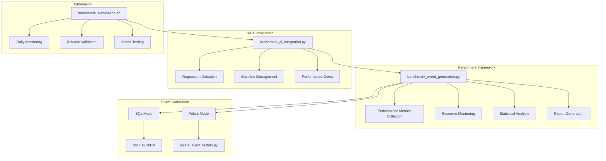

# Event Generation Benchmarking Framework

A comprehensive performance testing and analysis framework for comparing SQL-based vs Polars-based event generation in the Fidelity PlanAlign Engine workforce simulation platform.

## Overview

This framework validates the **≤60s target** for 5k employees × 5 years and provides detailed performance analysis to guide optimization decisions.

### Key Features

- **Comprehensive Metrics Collection**: Execution time, memory usage, CPU utilization, throughput
- **Statistical Analysis**: Confidence intervals, significance tests, effect size calculations
- **Configurable Scenarios**: From quick validation to comprehensive stress testing
- **Result Validation**: Ensures output parity between SQL and Polars modes
- **Multi-format Reporting**: JSON, CSV, and Markdown outputs
- **CI/CD Integration**: Automated regression detection and performance gates
- **Historical Tracking**: Performance baseline management and trend analysis

## Architecture



## Quick Start

### 1. Basic Benchmark

```bash
# Quick validation test
python scripts/benchmark_event_generation.py --quick

# Compare SQL vs Polars for 1k employees
python scripts/benchmark_event_generation.py --scenario 1kx3 --runs 3

# Target validation for 5k×5 years
python scripts/benchmark_event_generation.py --scenario 5kx5 --runs 5
```

### 2. Automated Workflows

```bash
# Daily performance monitoring
./scripts/benchmark_automation.sh daily-monitor

# Release gate validation
./scripts/benchmark_automation.sh release-gate --target-time 60

# Check for performance regressions
./scripts/benchmark_automation.sh regression-check
```

### 3. CI/CD Integration

```bash
# Regression check (CI mode)
python scripts/benchmark_ci_integration.py --mode regression-check

# Update performance baselines
python scripts/benchmark_ci_integration.py --mode baseline-update

# Performance gate check
python scripts/benchmark_ci_integration.py --mode performance-gate --scenario 5kx5 --target-time 60
```

## Benchmark Scenarios

### Predefined Scenarios

| Scenario | Employees | Years | Duration | Purpose |
|----------|-----------|-------|----------|---------|
| `quick`  | 100       | 2     | ~5s      | Fast validation |
| `1kx3`   | 1,000     | 3     | ~10s     | Development testing |
| `5kx5`   | 5,000     | 5     | ~60s     | Production target |
| `stress` | 10,000    | 10    | ~300s    | Stress testing |

### Custom Scenarios

```bash
# Custom employee count and years
python scripts/benchmark_event_generation.py \
    --scenarios custom \
    --employee-count 2500 \
    --start-year 2025 \
    --end-year 2027 \
    --runs 3
```

## Performance Metrics

### Primary Metrics

- **Execution Time**: Total runtime for event generation
- **Throughput**: Events generated per second
- **Memory Usage**: Peak and average memory consumption
- **CPU Utilization**: Peak and average CPU usage

### Secondary Metrics

- **Setup Time**: Initialization and data loading
- **Cleanup Time**: Post-processing and cleanup
- **Disk I/O**: Read/write operations
- **Events Generated**: Total event count validation

### Statistical Analysis

- **Confidence Intervals**: 95% confidence for key metrics
- **Significance Tests**: Student's t-test for performance differences
- **Effect Size**: Cohen's d for practical significance
- **Regression Detection**: Automated threshold-based alerts

## Report Formats

### JSON Report (Machine-readable)
```json
{
  "summary": {
    "performance_comparison": {
      "polars_wins": 3,
      "sql_wins": 0,
      "total_comparisons": 3
    }
  },
  "scenarios_tested": {
    "5kx5": {
      "results_by_mode": {
        "polars": {
          "avg_execution_time": 45.2,
          "avg_events_per_second": 2210,
          "meets_target": true
        }
      }
    }
  }
}
```

### CSV Report (Analysis-friendly)
```csv
scenario_name,mode,run_number,execution_time_seconds,events_per_second,peak_memory_mb
5kx5,polars,1,44.8,2234,1024
5kx5,polars,2,45.1,2198,1018
5kx5,sql,1,125.3,798,2048
```

### Markdown Report (Human-readable)
```markdown
## Performance Comparison

| Scenario | Winner | Speedup | Throughput Improvement |
|----------|---------|---------|------------------------|
| 5kx5     | POLARS  | 2.78x   | 2.77x                 |

## Recommendations

🚀 STRONG RECOMMENDATION: Adopt Polars mode for production workloads
```

## CI/CD Integration

### GitHub Actions Workflow

The framework includes a complete GitHub Actions workflow (`.github/workflows/performance-benchmark.yml`) that:

- **Pull Requests**: Runs regression checks to prevent performance degradation
- **Main Branch**: Updates performance baselines after improvements
- **Scheduled**: Daily performance monitoring with trend analysis
- **Manual**: Flexible benchmark execution with custom parameters

### Performance Gates

```yaml
# Example: Fail CI if 5kx5 scenario exceeds 60 seconds
- name: Performance Gate
  run: |
    python scripts/benchmark_ci_integration.py \
      --mode performance-gate \
      --scenario 5kx5 \
      --target-time 60
```

### Regression Detection

```yaml
# Automatic regression detection with configurable thresholds
- name: Regression Check
  run: |
    python scripts/benchmark_ci_integration.py \
      --mode regression-check \
      --fail-on-regression
```

## Configuration

### Environment Variables

```bash
# Benchmark output directory
export BENCHMARK_OUTPUT_DIR="/path/to/results"

# Performance baseline directory
export BENCHMARK_BASELINE_DIR="/path/to/baselines"

# Default test scenarios
export BENCHMARK_SCENARIOS="quick 1kx3 5kx5"

# Default generation modes
export BENCHMARK_MODES="sql polars"

# CI/CD mode
export CI=true
```

### Command-line Options

```bash
# Scenario selection
--scenarios quick 1kx3 5kx5 stress

# Mode selection
--modes sql polars

# Statistical validity
--runs 5

# Performance targets
--target-time 60

# Output control
--output-dir results
--verbose
--quiet
```

## Performance Baselines

### Creating Baselines

```bash
# Create baselines from current performance
./scripts/benchmark_automation.sh baseline-update --scenarios "quick 1kx3 5kx5"
```

### Baseline Format

```json
{
  "scenario_name": "5kx5",
  "mode": "polars",
  "baseline_execution_time": 45.2,
  "baseline_events_per_second": 2210,
  "baseline_memory_mb": 1024,
  "baseline_cpu_percent": 85,
  "timestamp": "2025-01-05T10:30:00",
  "git_commit": "abc123def456",
  "build_number": "42"
}
```

### Regression Thresholds

- **Time Regression**: >15% slower execution
- **Throughput Regression**: >10% fewer events/second
- **Memory Regression**: >20% more memory usage

## Best Practices

### Development Workflow

1. **Feature Development**: Run quick validation (`--quick`)
2. **Pre-commit**: Run development scenarios (`1kx3`)
3. **Pull Request**: Automated regression check
4. **Merge**: Update baselines if performance improved
5. **Release**: Performance gate validation (`5kx5` ≤ 60s)

### Performance Analysis

1. **Multiple Runs**: Use 3-5 runs for statistical validity
2. **Warm-up**: First run may include initialization overhead
3. **Resource Isolation**: Run benchmarks on consistent hardware
4. **Environment Control**: Minimize background processes

### Troubleshooting

#### Common Issues

```bash
# Database lock errors
Error: Conflicting lock is held
Solution: Close VS Code/IDE database connections

# Memory issues
Error: Out of memory
Solution: Reduce batch size or use smaller scenarios

# Permission errors
Error: Permission denied
Solution: Check file permissions and output directory access
```

#### Debug Mode

```bash
# Verbose logging for troubleshooting
python scripts/benchmark_event_generation.py --scenario quick --verbose --debug
```

## Integration Examples

### Local Development

```bash
# Quick validation before commit
make benchmark-quick

# Full development testing
make benchmark-dev

# Release validation
make benchmark-release
```

### CI/CD Pipeline

```yaml
# .github/workflows/performance-benchmark.yml
name: Performance Benchmarking
on:
  pull_request:
    paths: ['dbt/**', 'planalign_orchestrator/**']
jobs:
  benchmark:
    runs-on: ubuntu-latest
    steps:
      - uses: actions/checkout@v4
      - name: Run Regression Check
        run: ./scripts/benchmark_automation.sh regression-check
```

### Production Monitoring

```bash
# Cron job for daily monitoring
0 6 * * * cd /path/to/planwise && ./scripts/benchmark_automation.sh daily-monitor
```

## Performance Targets

### Current Targets (E068G)

- **5k × 5 years**: ≤ 60 seconds (Polars mode)
- **Throughput**: > 1000 events/second
- **Memory Efficiency**: < 8GB peak usage
- **Scalability**: Linear scaling with employee count

### Success Criteria

✅ **Target Met**: Polars mode consistently achieves ≤60s for 5k×5
✅ **Performance Improvement**: 5-10× speedup vs SQL mode
✅ **Result Parity**: 100% identical outputs with same random seed
✅ **Statistical Significance**: Consistent results across multiple runs

## Advanced Features

### Custom Metrics

```python
# Add custom performance metrics
class CustomMetrics(PerformanceMetrics):
    def __init__(self, *args, **kwargs):
        super().__init__(*args, **kwargs)
        self.custom_metric = self.calculate_custom_metric()
```

### External Integration

```python
# Integration with monitoring systems
def upload_to_datadog(metrics):
    # Send metrics to external monitoring
    pass
```

### Historical Analysis

```python
# Analyze performance trends over time
def analyze_performance_trends(baseline_dir):
    # Load historical baselines and analyze trends
    pass
```

## Contributing

### Adding New Scenarios

1. Define scenario in `BenchmarkScenario` class
2. Add to `PREDEFINED_SCENARIOS` dict
3. Update documentation and tests
4. Validate expected performance characteristics

### Adding New Metrics

1. Extend `PerformanceMetrics` dataclass
2. Update `ResourceMonitor` to collect data
3. Add to statistical analysis functions
4. Update report formats

### Extending CI Integration

1. Add new modes to `CIBenchmarkOrchestrator`
2. Update GitHub Actions workflow
3. Add appropriate error handling
4. Test with various CI scenarios

## Troubleshooting Guide

### Performance Issues

**Problem**: Benchmarks running slowly
**Solutions**:
- Use smaller scenarios for development
- Check system resource usage
- Optimize database queries
- Consider parallel execution

**Problem**: Memory usage too high
**Solutions**:
- Reduce batch sizes
- Enable streaming mode
- Use compression
- Monitor memory leaks

### Result Accuracy

**Problem**: Inconsistent results between runs
**Solutions**:
- Fix random seeds
- Increase number of runs
- Control system load
- Check for non-deterministic operations

**Problem**: SQL vs Polars result mismatch
**Solutions**:
- Validate RNG implementation
- Check event generation logic
- Compare intermediate outputs
- Enable detailed logging

## License

This benchmarking framework is part of the Fidelity PlanAlign Engine project and follows the same licensing terms.
