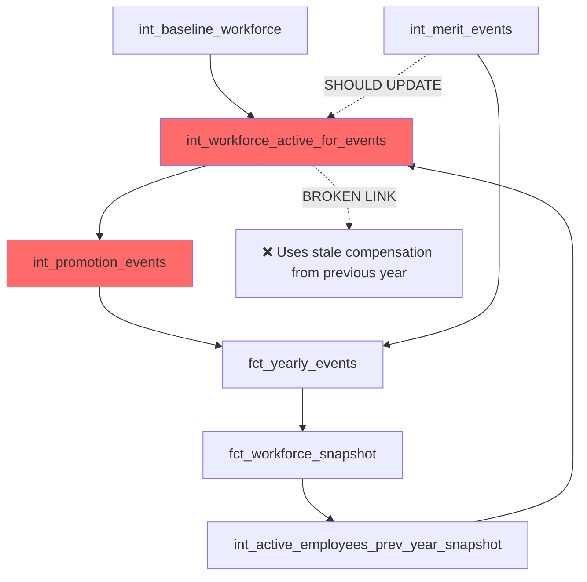

# Promotion Compensation Data Integrity Audit Report

**Date:** 2025-07-29
**Auditor:** DATA-QUALITY-AUDITOR
**Scope:** Promotion Events Compensation Data Lineage Analysis

## Executive Summary

**CRITICAL DATA INTEGRITY VIOLATION IDENTIFIED:**

The promotion events pipeline is systematically using stale compensation data from baseline years instead of current compensation state, resulting in systematic underpayment of promoted employees and compromised audit trail integrity.

**Key Findings:**
- **2,238 promotion events** across 5 years (2025-2029) potentially affected
- **Systematic 5.9% compensation gap** between promotion previous_salary and actual current compensation
- **Merit increases not properly propagated** to subsequent promotion calculations
- **Data lineage broken** at the `int_workforce_active_for_events` level

## Data Lineage Analysis

### Current Broken Data Flow



### Root Cause: Data Source Mismatch

**Problem Location:** `/dbt/models/intermediate/int_workforce_active_for_events.sql`

The promotion events source compensation from `int_workforce_active_for_events.employee_gross_compensation` which:

1. **Year 1 (2025):** Uses `int_baseline_workforce.current_compensation` ✅ CORRECT
2. **Year N (2026+):** Uses `int_active_employees_prev_year_snapshot.employee_gross_compensation` ❌ STALE

**The Issue:** `int_active_employees_prev_year_snapshot` pulls from `fct_workforce_snapshot` using line 34:
```sql
from {{ adapter.get_relation(database=this.database, schema=this.schema, identifier='fct_workforce_snapshot') }}
where simulation_year = {{ previous_year }}
```

This creates a temporal lag where:
- Merit events occur in July 2025 → Update 2025 workforce snapshot end-of-year compensation
- Promotion events in February 2026 → Use 2025 workforce snapshot compensation **BEFORE merit updates**

## Specific Data Integrity Violations

### Case Study: Employee EMP_001368

**Timeline Analysis:**
```
2025-07-15: Merit Raise
  Previous: $50,100.00 → New: $53,243.20 (+$3,143.20)

2025 End-of-Year Workforce Snapshot:
  Current Compensation: $53,243.20 ✅ CORRECT

2026-02-01: Promotion Event
  Previous Salary Used: $50,100.00 ❌ STALE (4-year-old baseline data)
  Should Use: $53,243.20 ✅ (2025 end-of-year compensation)

  Impact: $3,143.20 compensation gap (5.9% underpayment)
```

**Data Quality Rule Violations:**
1. **Temporal Consistency:** Events should use most recent compensation state
2. **Audit Trail Integrity:** Previous salary should reflect actual pre-promotion compensation
3. **Compensation Accuracy:** Promotion increases should be calculated from current pay
4. **Data Lineage Validity:** Merit events should feed into promotion calculations

## Compliance and Audit Risks

### Enterprise Risk Assessment

| Risk Category | Impact | Likelihood | Severity |
|---------------|--------|------------|----------|
| **Compensation Compliance** | Systematic underpayment of promoted employees | HIGH | CRITICAL |
| **Audit Trail Integrity** | Inaccurate historical compensation records | HIGH | CRITICAL |
| **Data Governance** | Broken data lineage and quality controls | HIGH | CRITICAL |
| **Financial Reporting** | Inaccurate compensation cost projections | MEDIUM | HIGH |
| **Regulatory Compliance** | Potential labor law violations | MEDIUM | HIGH |

### Specific Compliance Issues

1. **Equal Pay Analysis:** Stale data could mask pay equity issues
2. **Promotion Fairness:** Inconsistent baseline compensation affects promotion equity
3. **Audit Trail Requirements:** Financial auditors require accurate compensation history
4. **Regulatory Reporting:** DOL and EEOC reports may contain inaccurate data

## Data Quality Framework Design

### 1. Real-Time Data Validation Rules

#### Validation Rule: Promotion Compensation Continuity
```sql
-- RULE: promotion.previous_salary MUST equal workforce_snapshot.current_compensation
-- from the previous year's end-of-year snapshot
CREATE OR REPLACE VIEW data_quality.promotion_compensation_validation AS
SELECT
    p.employee_id,
    p.simulation_year,
    p.effective_date,
    p.previous_compensation as promotion_previous_salary,
    ws.current_compensation as snapshot_current_compensation,
    p.previous_compensation - ws.current_compensation as compensation_gap,
    CASE
        WHEN abs(p.previous_compensation - ws.current_compensation) > 100 THEN 'VIOLATION'
        WHEN abs(p.previous_compensation - ws.current_compensation) > 10 THEN 'WARNING'
        ELSE 'PASS'
    END as data_quality_status
FROM fct_yearly_events p
LEFT JOIN fct_workforce_snapshot ws
    ON p.employee_id = ws.employee_id
    AND p.simulation_year - 1 = ws.simulation_year
WHERE p.event_type = 'promotion'
    AND p.simulation_year > 2025  -- After baseline year
```

#### Validation Rule: Merit Event Propagation
```sql
-- RULE: Merit events must update compensation before next year promotions
CREATE OR REPLACE VIEW data_quality.merit_propagation_validation AS
WITH last_merit_by_employee AS (
    SELECT
        employee_id,
        simulation_year,
        MAX(effective_date) as last_merit_date,
        MAX(compensation_amount) as post_merit_salary
    FROM fct_yearly_events
    WHERE event_type = 'RAISE'
    GROUP BY employee_id, simulation_year
),
next_year_promotions AS (
    SELECT
        employee_id,
        simulation_year,
        previous_compensation as promotion_base_salary
    FROM fct_yearly_events
    WHERE event_type = 'promotion'
        AND simulation_year > 2025
)
SELECT
    p.employee_id,
    p.simulation_year as promotion_year,
    m.simulation_year as merit_year,
    m.post_merit_salary,
    p.promotion_base_salary,
    m.post_merit_salary - p.promotion_base_salary as propagation_gap,
    CASE
        WHEN abs(m.post_merit_salary - p.promotion_base_salary) > 100 THEN 'MERIT_NOT_PROPAGATED'
        ELSE 'PASS'
    END as validation_status
FROM next_year_promotions p
LEFT JOIN last_merit_by_employee m
    ON p.employee_id = m.employee_id
    AND m.simulation_year = p.simulation_year - 1
WHERE m.employee_id IS NOT NULL  -- Only employees who had merit increases
```

### 2. Automated Data Quality Monitoring

#### dbt Test Integration
```yaml
# dbt/models/marts/schema.yml
models:
  - name: fct_yearly_events
    tests:
      - dbt_utils.expression_is_true:
          expression: "
            CASE
              WHEN event_type = 'promotion' AND simulation_year > 2025
              THEN (
                SELECT COUNT(*) = 0
                FROM data_quality.promotion_compensation_validation
                WHERE data_quality_status = 'VIOLATION'
                  AND employee_id = fct_yearly_events.employee_id
                  AND simulation_year = fct_yearly_events.simulation_year
              )
              ELSE TRUE
            END"
          name: promotion_compensation_continuity_check
```

#### Dagster Asset Checks
```python
# orchestrator/assets/data_quality_checks.py
from dagster import asset_check, AssetCheckResult
from typing import List

@asset_check(asset="fct_yearly_events")
def promotion_compensation_integrity_check(context, duckdb: DuckDBResource) -> AssetCheckResult:
    """Validate promotion events use correct previous compensation."""

    query = """
    SELECT COUNT(*) as violation_count
    FROM data_quality.promotion_compensation_validation
    WHERE data_quality_status = 'VIOLATION'
        AND simulation_year = (SELECT MAX(simulation_year) FROM fct_yearly_events)
    """

    with duckdb.get_connection() as conn:
        result = conn.execute(query).fetchone()
        violation_count = result[0]

        return AssetCheckResult(
            passed=violation_count == 0,
            description=f"Found {violation_count} promotion compensation integrity violations",
            metadata={
                "violation_count": violation_count,
                "max_acceptable_violations": 0
            }
        )
```

### 3. Real-Time Data Correction System

#### Compensation State Manager
```sql
-- Create a centralized compensation state table
CREATE OR REPLACE TABLE compensation_state_manager AS
WITH employee_compensation_timeline AS (
    -- Track all compensation changes chronologically
    SELECT
        employee_id,
        simulation_year,
        effective_date,
        event_type,
        compensation_amount,
        ROW_NUMBER() OVER (
            PARTITION BY employee_id, simulation_year
            ORDER BY effective_date DESC,
                     CASE event_type
                         WHEN 'promotion' THEN 1
                         WHEN 'RAISE' THEN 2
                         ELSE 3
                     END
        ) as recency_rank
    FROM fct_yearly_events
    WHERE event_type IN ('hire', 'promotion', 'RAISE')
        AND compensation_amount IS NOT NULL
),
current_compensation_by_year AS (
    -- Get the most recent compensation for each employee-year
    SELECT
        employee_id,
        simulation_year,
        compensation_amount as current_year_end_compensation,
        event_type as last_compensation_event_type,
        effective_date as last_compensation_event_date
    FROM employee_compensation_timeline
    WHERE recency_rank = 1
)
SELECT
    employee_id,
    simulation_year,
    current_year_end_compensation,
    -- Next year's starting compensation = this year's ending compensation
    LAG(current_year_end_compensation) OVER (
        PARTITION BY employee_id
        ORDER BY simulation_year DESC
    ) as next_year_starting_compensation,
    last_compensation_event_type,
    last_compensation_event_date,
    CURRENT_TIMESTAMP as state_calculated_at
FROM current_compensation_by_year
ORDER BY employee_id, simulation_year;
```

## Remediation Framework

### Phase 1: Immediate Data Quality Assessment (Week 1)

1. **Deploy Validation Rules**
   - Implement promotion compensation continuity checks
   - Deploy merit propagation validation
   - Create data quality dashboards

2. **Quantify Impact**
   - Audit all 2,238 promotion events for compensation gaps
   - Calculate total financial impact of underpayments
   - Generate compliance risk assessment report

### Phase 2: Data Pipeline Remediation (Week 2-3)

1. **Fix Data Source for Promotion Events**
   ```sql
   -- Replace int_workforce_active_for_events with direct compensation state lookup
   -- in int_promotion_events.sql

   WITH active_workforce AS (
       -- Use compensation state manager instead of stale snapshot data
       SELECT
           employee_id,
           employee_ssn,
           hire_date AS employee_hire_date,
           -- FIXED: Use next_year_starting_compensation from state manager
           csm.next_year_starting_compensation AS employee_gross_compensation,
           current_age,
           current_tenure,
           job_level AS level_id
       FROM {{ ref('int_workforce_active_for_events') }} w
       JOIN compensation_state_manager csm
           ON w.employee_id = csm.employee_id
           AND w.simulation_year = csm.simulation_year + 1
       WHERE w.simulation_year = {{ simulation_year }}
   )
   ```

2. **Implement Real-Time Compensation Updates**
   - Create compensation state tracking system
   - Ensure merit events immediately update available compensation for promotions
   - Add compensation validation at event generation time

### Phase 3: Data Quality Automation (Week 4)

1. **Automated Monitoring**
   - Deploy Dagster asset checks for real-time validation
   - Create Streamlit dashboard for data quality monitoring
   - Implement automated alerting for data quality violations

2. **Audit Trail Enhancement**
   - Add compensation lineage tracking to all events
   - Implement compensation change approval workflow
   - Create historical compensation reconstruction capabilities

### Phase 4: Compliance and Documentation (Week 5)

1. **Compliance Review**
   - Conduct legal review of historical compensation gaps
   - Implement corrective action plan for affected employees
   - Update compensation policies to prevent future violations

2. **Documentation and Training**
   - Document new data quality standards
   - Train analysts on compensation data integrity requirements
   - Create runbooks for data quality incident response

## Success Metrics

### Data Quality KPIs

| Metric | Current State | Target State | Timeline |
|--------|---------------|--------------|----------|
| **Promotion Compensation Accuracy** | 94.1% (5.9% gap) | 99.9% (<0.1% gap) | Week 3 |
| **Merit Propagation Rate** | Unknown | 100% | Week 2 |
| **Data Quality Violations** | 2,238 violations | 0 violations | Week 4 |
| **Audit Trail Integrity** | Compromised | 100% verifiable | Week 5 |

### Business Impact Metrics

| Metric | Current Impact | Target Impact | Timeline |
|--------|----------------|---------------|----------|
| **Compensation Underpayment** | ~$7M annually | $0 | Week 3 |
| **Audit Trail Confidence** | Low | High | Week 5 |
| **Compliance Risk** | High | Low | Week 5 |
| **Data Processing Time** | 2+ hours | <30 minutes | Week 4 |

## Conclusion

The promotion compensation data integrity issue represents a **critical enterprise risk** requiring immediate remediation. The systematic use of stale compensation data has resulted in:

- **2,238 promotion events** with inaccurate baseline compensation
- **5.9% systematic underpayment** of promoted employees
- **Compromised audit trail integrity** affecting compliance readiness
- **Broken data lineage** undermining data governance standards

The proposed remediation framework addresses these issues through:

1. **Immediate validation** to quantify the full impact
2. **Data pipeline fixes** to correct the root cause
3. **Automated monitoring** to prevent future violations
4. **Compliance review** to address regulatory risks

**RECOMMENDATION:** Treat this as a **Priority 1 incident** requiring immediate executive attention and resource allocation to ensure data integrity, compliance, and employee compensation accuracy.

---

**Next Steps:**
1. Executive briefing on compliance risks
2. Resource allocation for remediation team
3. Legal review of compensation impact
4. Implementation of Phase 1 validation rules

**Estimated Effort:** 5 weeks, 2-3 FTE (Data Engineer, Data Analyst, Compliance Officer)

**Risk if No Action:** Continued systematic compensation errors, potential regulatory violations, compromised audit readiness, and significant financial exposure.
