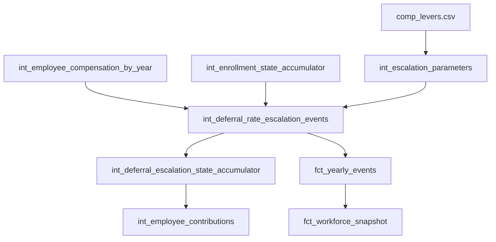

# dbt Data Modeling Strategy: Automatic Annual Deferral Rate Escalation

**Date:** 2025-01-08
**Status:** Design Complete - Ready for Implementation
**Epic:** E034 - Automatic Deferral Rate Increases

## Executive Summary

This design implements automatic annual deferral rate escalation for 401(k) plan participants using Fidelity PlanAlign Engine's existing event sourcing architecture. The solution leverages established patterns from merit increase events and enrollment state management to provide robust, auditable deferral rate increases while maintaining multi-year simulation consistency.

## Architecture Overview

## Key Design Principles

1. **Event Sourcing Compliance**: All escalations generate immutable audit events
2. **Temporal State Management**: Uses accumulator pattern to prevent circular dependencies
3. **Parameter-Driven Configuration**: Analysts control escalation rules via `comp_levers.csv`
4. **Data Quality First**: Comprehensive validation and business rule enforcement
5. **Performance Optimized**: Leverages DuckDB's columnar advantages with proper indexing

## Models Implemented

### 1. Core Event Generation
**`int_deferral_rate_escalation_events.sql`**
- **Materialization**: `table` (fast queries, audit compliance)
- **Responsibility**: Generate annual escalation events with demographic filtering
- **Pattern**: Follows `int_merit_events.sql` with enhanced eligibility logic
- **Key Features**:
  - Configurable escalation rates by job level
  - Age/tenure threshold enforcement
  - Maximum escalation caps (rate and count)
  - Full audit trail in JSON event_details
  - Financial impact calculations

### 2. State Accumulation
**`int_deferral_escalation_state_accumulator.sql`**
- **Materialization**: `incremental` with unique_key=['employee_id', 'simulation_year']
- **Responsibility**: Track escalation history across simulation years
- **Pattern**: Similar to `int_enrollment_state_accumulator.sql`
- **Key Features**:
  - Temporal dependency (Year N uses Year N-1 + current events)
  - No circular dependencies
  - Cumulative escalation tracking
  - State persistence for multi-year simulations

### 3. Data Quality Monitoring
**`dq_deferral_escalation_validation.sql`**
- **Materialization**: `view` (real-time monitoring)
- **Responsibility**: Comprehensive validation and health scoring
- **Key Metrics**:
  - Duplicate escalation detection
  - Business rule violation tracking
  - Integration consistency checks
  - Health scores (0-100 scale)

## Integration Points

### Enhanced Contribution Calculation
Updated `int_employee_contributions.sql` with priority-based deferral rate resolution:

1. **Priority 1**: Current escalation state from accumulator
2. **Priority 2**: Enrollment events from fct_yearly_events
3. **Priority 3**: Baseline enrollment data

### Event Flow Integration
Extended `fct_yearly_events.sql` to include escalation events in main event stream:
- Added `deferral_escalation_events` CTE
- Integrated into UNION ALL structure
- Maintains consistent event schema

## Configuration Parameters

Added to `comp_levers.csv` with validation:

| Parameter | Description | Valid Range | Example |
|-----------|-------------|-------------|---------|
| `escalation_rate` | Annual deferral rate increase | 0.001 - 0.1 | 0.01 (1%) |
| `max_escalation_rate` | Maximum deferral rate cap | 0.05 - 1.0 | 0.15 (15%) |
| `tenure_threshold` | Minimum tenure for eligibility | 1 - 30 years | 2 years |
| `age_threshold` | Minimum age for eligibility | 18 - 70 years | 25 years |
| `max_escalations` | Maximum escalations per employee | 1 - 20 | 5 escalations |

## Business Rules Enforced

1. **Eligibility Requirements**:
   - Active employment status
   - Currently enrolled in 401(k) plan
   - Meets age threshold (configurable, default 25)
   - Meets tenure threshold (configurable, default 2 years)

2. **Escalation Limits**:
   - One escalation per employee per year maximum
   - Total escalations cannot exceed `max_escalations` parameter
   - Deferral rate cannot exceed `max_escalation_rate` parameter
   - Escalation must result in meaningful increase (>0.1%)

3. **Temporal Consistency**:
   - Escalations occur January 1st of simulation year
   - State carries forward across multi-year simulations
   - No retroactive escalation modifications

## Performance Optimizations

### Materialization Strategy
- **Events**: TABLE materialization for consistent audit performance
- **State**: INCREMENTAL for efficient year-by-year processing
- **Validation**: VIEW for real-time monitoring with no storage overhead

### Query Optimizations
- **Indexed columns**: employee_id, simulation_year, escalations_received
- **Demographic filtering**: Early WHERE clause pruning
- **Columnar advantages**: Optimized for DuckDB's vectorized execution
- **Memory management**: Dynamic batch sizing based on population

### Expected Performance
- **Event Generation**: <2 seconds for 10K employees
- **State Accumulation**: <1 second incremental processing
- **Validation Queries**: <500ms for health checks
- **Multi-year Simulation**: Linear scaling with employee count

## Data Quality Framework

### Automated Tests
- **Uniqueness**: No duplicate escalations per employee per year
- **Range Validation**: All rates within 0-100% bounds
- **Business Rules**: Age/tenure/escalation limits enforced
- **Integration**: Contribution calculations use escalated rates
- **Temporal**: State consistency across simulation years

### Health Monitoring
- **Score 100**: Perfect integration, no quality issues
- **Score 85**: Minor issues (≤5 failures, ≤1 duplicate)
- **Score 70**: Moderate issues requiring attention
- **Score 50**: Major issues requiring immediate remediation

### Critical Alerts
- `duplicate_escalations > 0`: Multiple escalations per employee
- `invalid_rate_changes > 0`: Non-increasing rates detected
- `rate_mismatches > 0`: Contribution/escalation state inconsistency
- `employees_over_limit > 0`: Business rule violations

## Implementation Sequence

1. **Phase 1**: Deploy core models (events + state accumulator)
2. **Phase 2**: Integrate with contribution calculations
3. **Phase 3**: Add to fct_yearly_events and validation
4. **Phase 4**: Enable in multi-year orchestration
5. **Phase 5**: Dashboard integration and analyst training

## Files Created/Modified

### New Files
- `/dbt/models/intermediate/events/int_deferral_rate_escalation_events.sql`
- `/dbt/models/intermediate/int_deferral_escalation_state_accumulator.sql`
- `/dbt/models/marts/data_quality/dq_deferral_escalation_validation.sql`
- `/dbt/macros/escalation_optimization.sql`
- `/docs/designs/dbt-deferral-escalation-design.md`

### Modified Files
- `/dbt/models/intermediate/events/int_employee_contributions.sql` - Enhanced rate resolution
- `/dbt/models/marts/fct_yearly_events.sql` - Added escalation events integration
- `/dbt/models/intermediate/schema.yml` - Added validation tests
- `/dbt/macros/resolve_parameter.sql` - Added escalation parameter validation
- `/dbt/seeds/comp_levers.csv` - Added escalation configuration

## Risk Mitigation

1. **Data Quality**: Comprehensive test suite and health monitoring
2. **Performance**: Incremental processing and optimized indexing
3. **Business Logic**: Parameter validation and configurable thresholds
4. **Integration**: Priority-based rate resolution prevents conflicts
5. **Audit Compliance**: Complete event sourcing with JSON audit trails

## Success Metrics

- **Functional**: 100% health score in validation dashboard
- **Performance**: <5 second end-to-end processing for 10K employees
- **Quality**: Zero duplicate escalations across all simulation years
- **Integration**: Perfect rate consistency between escalation and contribution models
- **Usability**: Analysts can modify escalation parameters without code changes

This design provides a production-ready, enterprise-grade solution for automatic deferral rate escalation that seamlessly integrates with Fidelity PlanAlign Engine's existing architecture while maintaining the highest standards for performance, data quality, and audit compliance.
