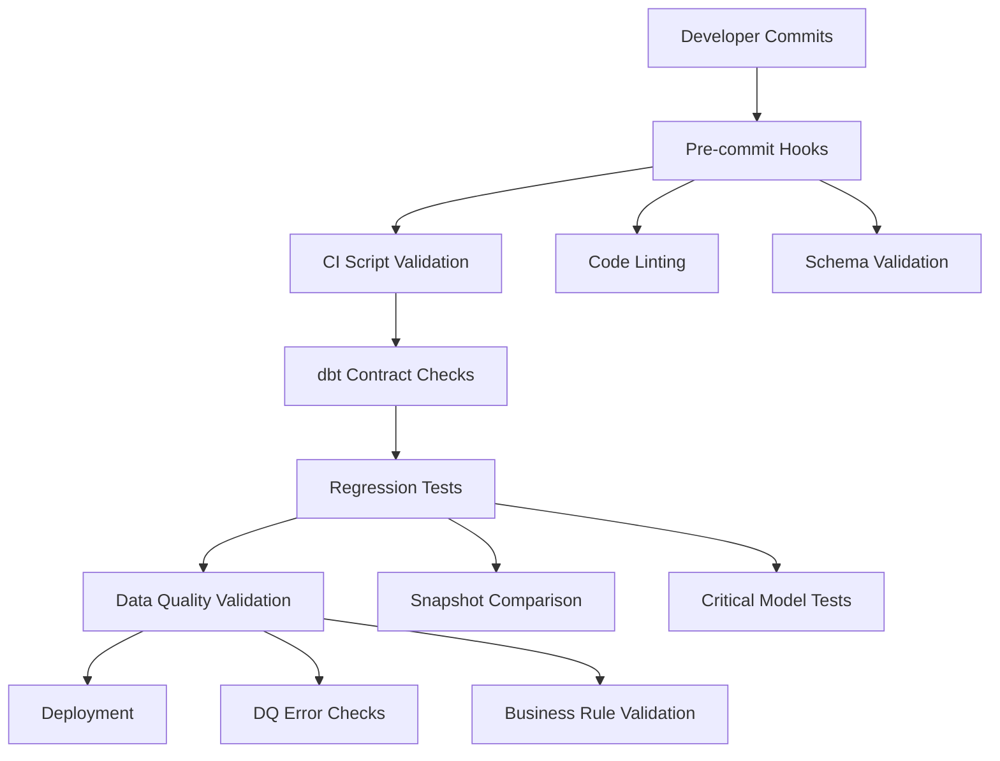

# Epic E014: Layered Defense Strategy for Data Platform Stability

## Epic Overview

**Epic ID**: E014
**Epic Name**: Implement Layered Defense Strategy for Data Platform Stability
**Sprint Scope**: Multiple sprints (6-8)
**Total Story Points**: 54 points
**Priority**: Must Have

## Epic Description

Establish a comprehensive, multi-layered defense strategy to prevent program breakage, improve data quality, and ensure the stability of the data platform, particularly focusing on dbt models and event-sourced data pipelines. This initiative will integrate automated testing, robust CI/CD practices, and proactive monitoring to minimize "fix one thing, break another" scenarios and increase developer confidence.

## Value Proposition

### Business Impact
- **Reduced Incidents**: Significantly decrease production data issues and broken downstream reports
- **Faster Development**: Increase developer velocity by catching issues earlier and reducing time spent on debugging
- **Improved Trust**: Enhance stakeholder trust in data accuracy and reliability
- **Scalability**: Create a more resilient foundation for future data platform growth

### Technical Benefits
- **Early Error Detection**: Catch schema violations, data quality issues, and logic errors before deployment
- **Automated Safeguards**: Prevent accidental breaking changes to critical data models
- **Consistent Quality**: Enforce coding standards and best practices across all development work
- **Regression Prevention**: Detect when changes inadvertently break existing functionality

## Current State Analysis

### Existing Strengths
- ✅ Comprehensive dbt tests in schema.yml files
- ✅ Data quality validation models (e.g., `dq_employee_id_validation`)
- ✅ Clear separation of concerns (staging → intermediate → marts)
- ✅ Event sourcing architecture provides natural audit trails

### Identified Gaps
- ❌ No automated CI/CD pipeline to run tests before merge
- ❌ No pre-commit hooks to catch common errors early
- ❌ Limited regression testing coverage for critical workflows
- ❌ No contracts/schema enforcement for critical models
- ❌ Manual testing processes prone to human error

## Strategic Approach

This epic follows a **phased implementation strategy** to maximize value delivery while minimizing disruption:

### Phase 1: Immediate Actions (High Impact, Low Effort)
**Sprint 8-9 | 18 story points**
- Establish local CI script for developer validation
- Tag critical dbt models for enhanced protection
- Implement dbt contracts for core models

### Phase 2: Medium-Term (Moderate Effort, High Reliability)
**Sprint 10-11 | 21 story points**
- Integrate pre-commit hooks for automated code quality
- Deploy automated weekly regression testing
- Create snapshot-based testing for critical outputs

### Phase 3: Long-Term (High Effort, Maximum Protection)
**Sprint 12-13 | 15 story points**
- Research and plan feature flag implementation for controlled rollouts
- Implement advanced monitoring and alerting

## Success Criteria

### Quantitative Metrics
- **Zero Critical Data Quality Errors**: All ERROR-level data quality checks must pass
- **95%+ Test Coverage**: Critical dbt models have comprehensive test coverage
- **<2 minute CI Pipeline**: Local validation completes quickly for developer productivity
- **100% Pre-commit Compliance**: All commits pass automated quality checks

### Qualitative Outcomes
- **Developer Confidence**: Team feels safe making changes without fear of breaking production
- **Stakeholder Trust**: Business users rely on data accuracy and consistency
- **Maintainable Codebase**: New team members can contribute safely with guard rails in place

## Dependencies and Risks

### Dependencies
- **dbt Version Compatibility**: Ensure dbt contracts work with current version (1.8.8)
- **Testing Infrastructure**: Sufficient compute resources for regression test execution
- **Team Training**: Developer education on new tools and processes

### Risk Mitigation
- **Gradual Rollout**: Implement safeguards incrementally to avoid disruption
- **Fallback Plans**: Maintain ability to bypass checks in emergency situations
- **Documentation**: Comprehensive guides to reduce learning curve

## Related Epics

- **Epic E013**: Dagster Pipeline Modularization - provides foundation for testing
- **Epic E012**: Compensation System Integrity - beneficiary of enhanced validation
- **Epic E011**: Workforce Simulation Validation - demonstrates need for systematic testing

## Technical Architecture

## Story Summary

| Phase | Story ID | Story Title | Points | Priority |
|-------|----------|-------------|---------|----------|
| 1 | S063 | Developer-Initiated CI Script | 5 | Must Have |
| 1 | S064 | Tag Critical dbt Models | 3 | Must Have |
| 1 | S065 | Implement dbt Contracts for Core Models | 10 | Must Have |
| 2 | S066 | Integrate Pre-Commit Hooks | 8 | Must Have |
| 2 | S067 | Automate Weekly Regression Tests | 13 | Must Have |
| 3 | S068 | Develop Snapshot-Based Testing | 8 | Should Have |
| 3 | S069 | Research Feature Flag Implementation | 7 | Should Have |

**Total**: 54 story points across 7 stories

## Implementation Timeline

- **Sprint 8**: Stories S063, S064 (8 points)
- **Sprint 9**: Story S065 (10 points)
- **Sprint 10**: Story S066 (8 points)
- **Sprint 11**: Story S067 (13 points)
- **Sprint 12**: Story S068 (8 points)
- **Sprint 13**: Story S069 (7 points)

## Acceptance Criteria

This epic is complete when:

1. ✅ All critical dbt models have contracts and comprehensive testing
2. ✅ Automated CI/CD pipeline prevents broken code from reaching production
3. ✅ Pre-commit hooks catch common errors before they enter version control
4. ✅ Weekly regression tests validate system stability
5. ✅ Data quality validation prevents ERROR-level issues
6. ✅ Documentation enables team to use new tools effectively
7. ✅ Zero production incidents caused by preventable code quality issues

---

*This epic represents a strategic investment in platform stability and developer productivity, directly addressing the "fix one thing, break another" challenge identified in the PlanWise Navigator development process.*
