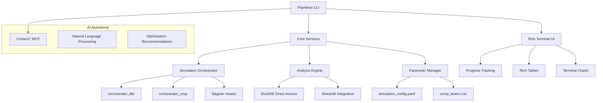

# Epic E032: PlanWise Analyst CLI Platform

**Status:** 🔴 **NOT STARTED** (0 of 38 story points completed)
**Start Date:** 2025-08-02
**Target Completion:** 2025-09-30 (8 weeks)
**Epic Owner:** Claude Code
**Business Sponsor:** Analytics Team
**Priority:** High
**Complexity:** High

## Epic Overview

### Summary
Build a Claude Code-inspired CLI application called **`planwise`** that provides analysts with an intuitive, powerful command-line interface for workforce simulation, analysis, and parameter tuning. This platform will transform complex simulation workflows into natural, conversational commands while maintaining enterprise-grade performance and reliability.

### Business Value
- 🎯 **Analyst Productivity**: Reduce simulation setup time from 15+ minutes to <30 seconds
- 🚀 **Intuitive Interface**: Natural language commands with intelligent suggestions
- 💰 **Unified Workflow**: Single tool for simulation, analysis, and tuning operations
- 📊 **Real-time Insights**: Interactive dashboards and streaming progress updates
- 🏗️ **Enterprise Ready**: Production-grade logging, error handling, and monitoring
- 🔧 **Extensible Platform**: Plugin architecture for custom scenarios and analytics

### Success Criteria
- Analysts can run complete simulations with single command: `planwise simulate 2025-2029`
- Setup operations complete in <30 seconds vs current 15+ minute workflows
- Interactive parameter tuning with real-time feedback and optimization suggestions
- Rich terminal output with progress bars, live metrics, and intelligent error guidance
- 100% compatibility with existing simulation configuration and data sources
- Seamless integration with Dagster pipelines and Streamlit dashboards
- Built-in performance monitoring with automated optimization recommendations

---

## Problem Statement

### Current Analyst Experience
1. **Complex Workflows**: Multi-step processes requiring technical knowledge
2. **Context Switching**: Multiple tools (CLI, Streamlit, Dagster UI, IDE)
3. **Slow Feedback**: Long wait times for simulation results and parameter changes
4. **Technical Barriers**: Requires understanding of dbt, Dagster, and database operations
5. **Limited Discoverability**: No guidance for available operations or best practices

### Technical Limitations
- **Fragmented Interfaces**: Separate tools for setup, simulation, analysis, and tuning
- **Manual Coordination**: No unified orchestration of complex workflows
- **Limited Interactivity**: Batch operations without real-time feedback
- **Poor Error Handling**: Technical error messages without analyst-friendly guidance
- **No Intelligence**: No AI assistance or automated optimization recommendations

### Operational Pain Points
- **Time to Value**: 15+ minutes to get from idea to running simulation
- **Learning Curve**: Steep technical knowledge requirements for new analysts
- **Troubleshooting**: Difficult to diagnose and resolve common issues
- **Performance Insights**: No visibility into optimization opportunities
- **Scenario Management**: Manual tracking of different parameter combinations

---

## User Stories

### Story S032-01: Core CLI Framework (8 points)
**As a** workforce simulation analyst
**I want** a unified CLI application with intuitive commands and rich output
**So that** I can perform all simulation tasks from a single, familiar interface

**Acceptance Criteria:**
- Modern CLI with beautiful, color-coded output using Rich/Typer framework
- Intuitive command structure: `planwise {command} {options}` with auto-completion
- Built-in help system with examples and context-sensitive guidance
- Global configuration management with `planwise config` commands
- Comprehensive logging with analyst-friendly error messages and recovery suggestions
- Cross-platform compatibility (macOS, Linux, Windows) with consistent behavior

**Technical Requirements:**
- Create `planwise_cli/` package with Rich + Typer for beautiful terminal output
- Implement command routing with plugins for extensibility
- Build configuration management system extending existing simulation_config.yaml
- Add comprehensive error handling with context-aware troubleshooting guidance
- Create logging framework with multiple output levels and formats
- Design plugin architecture for custom commands and analytics extensions

### Story S032-02: Database Setup & System Management (6 points)
**As a** simulation analyst
**I want** simple setup and status commands that leverage existing optimizations
**So that** I can prepare my environment quickly and understand system health

**Acceptance Criteria:**
- `planwise setup` command completes database initialization in <30 seconds
- `planwise status` provides comprehensive system health dashboard
- `planwise config show/set` for configuration management with validation
- Automatic detection and resolution of common setup issues
- Integration with existing orchestrator_dbt optimizations (82% improvement)
- Real-time progress tracking with ETA for long-running operations

**Technical Requirements:**
- Integrate with existing `orchestrator_dbt.WorkflowOrchestrator` for setup operations
- Create system health monitoring with database, dbt, and Dagster status checks
- Build configuration validation with intelligent error messages
- Add automatic problem detection with suggested resolution steps
- Implement progress bars and streaming output for setup operations
- Create system diagnostics with performance and optimization recommendations

### Story S032-03: Simulation Execution Commands (8 points)
**As a** financial analyst
**I want** intuitive simulation commands with real-time progress and results
**So that** I can run scenarios quickly and see immediate insights

**Acceptance Criteria:**
- `planwise simulate 2025` for single-year simulations with streaming progress
- `planwise simulate 2025-2029` for multi-year with year-by-year status updates
- Parameter override options: `--growth-rate 0.04 --termination-rate 0.10`
- Scenario management: `--scenario high-growth` with named parameter sets
- Real-time metrics display: workforce size, events, compensation totals
- Automatic results summary with key insights and recommendations

**Technical Requirements:**
- Create simulation orchestration layer using existing optimized components
- Implement streaming output with live progress bars and metrics updates
- Build parameter override system with validation and conflict resolution
- Add scenario management with parameter set storage and retrieval
- Create results formatting with tables, charts, and executive summaries
- Integrate with existing multi-year orchestrator for performance benefits

### Story S032-04: Analysis & Reporting Commands (6 points)
**As a** workforce planner
**I want** powerful analysis commands that provide insights into simulation results
**So that** I can understand trends, validate outcomes, and make data-driven decisions

**Acceptance Criteria:**
- `planwise analyze workforce` for workforce metrics with trend analysis
- `planwise analyze compensation` for salary growth and budget impact analysis
- `planwise analyze sensitivity --parameter termination_rate` for parameter impact
- Interactive terminal dashboards with live data and drill-down capabilities
- Export capabilities: `--export csv/xlsx/json` for further analysis
- Comparison tools: `--compare baseline high-growth` for scenario analysis

**Technical Requirements:**
- Build analysis engine with direct DuckDB query access for performance
- Create terminal-based dashboard components with interactive navigation
- Implement statistical analysis functions for trends and sensitivity
- Add data export functionality with multiple format support
- Build comparison engine for scenario and parameter analysis
- Create visualization components for terminal display (charts, tables, sparklines)

### Story S032-05: Interactive Parameter Tuning (5 points)
**As a** compensation analyst
**I want** interactive parameter tuning with immediate feedback
**So that** I can optimize parameters to meet budget and growth targets

**Acceptance Criteria:**
- `planwise tune interactive` launches terminal-based tuning interface
- Real-time parameter adjustment with immediate impact calculation
- Goal-seeking functionality: "Find parameters for 3.5% growth and $2M budget"
- Integration with existing Streamlit compensation tuning system
- Parameter history and undo/redo capabilities
- Automatic optimization suggestions based on current targets

**Technical Requirements:**
- Create interactive terminal interface with cursor-based navigation
- Build real-time simulation engine for immediate parameter feedback
- Integrate with existing comp_levers.csv and Streamlit optimization system
- Add goal-seeking algorithms with constraint satisfaction
- Implement parameter history with session management
- Create optimization recommendation engine with machine learning insights

### Story S032-06: AI Assistant & Advanced Features (5 points)
**As a** simulation analyst
**I want** AI-powered assistance and natural language query capabilities
**So that** I can work more efficiently and discover new insights

**Acceptance Criteria:**
- Natural language commands: `planwise "Show me workforce growth for high turnover scenario"`
- AI-powered troubleshooting with contextual suggestions
- Automatic anomaly detection in simulation results with explanations
- Performance optimization recommendations based on usage patterns
- Intelligent parameter suggestions based on historical successful scenarios
- Integration with Context7 MCP for extended context and tool integration

**Technical Requirements:**
- Integrate Context7 MCP for natural language processing and AI assistance
- Build query parsing engine to convert natural language to CLI commands
- Create anomaly detection algorithms for simulation results validation
- Add performance monitoring with automated optimization suggestions
- Build recommendation engine using historical simulation data and outcomes
- Implement contextual help system with intelligent guidance and examples

---

## Technical Architecture

### Core Components Structure
```
planwise_cli/
├── cli/                           # CLI interface layer
│   ├── main.py                   # Main entry point and command routing
│   ├── commands/                 # Individual command implementations
│   │   ├── setup.py             # Database setup and system management
│   │   ├── simulate.py          # Simulation execution commands
│   │   ├── analyze.py           # Analysis and reporting commands
│   │   ├── tune.py              # Interactive parameter tuning
│   │   └── config.py            # Configuration management
│   ├── interactive/             # Interactive mode components
│   │   ├── tuning_interface.py  # Terminal-based parameter tuning
│   │   ├── dashboard.py         # Live metrics dashboard
│   │   └── ai_assistant.py      # Natural language processing
│   └── formatters/              # Output formatting and display
│       ├── tables.py            # Rich table formatting
│       ├── progress.py          # Progress bars and live updates
│       └── charts.py            # Terminal-based visualizations
├── core/                          # Core business logic layer
│   ├── simulation_orchestrator.py # Unified simulation coordination
│   ├── analysis_engine.py        # Data analysis and insights
│   ├── parameter_manager.py      # Parameter validation and optimization
│   ├── scenario_manager.py       # Scenario storage and management
│   └── performance_monitor.py    # Performance tracking and optimization
├── integrations/                  # External system integrations
│   ├── dagster_integration.py    # Dagster pipeline interaction
│   ├── dbt_integration.py        # dbt model execution
│   ├── duckdb_integration.py     # Direct database access
│   ├── streamlit_integration.py  # Streamlit dashboard coordination
│   └── mcp_integration.py        # Context7 MCP for AI assistance
├── config/                        # Configuration management
│   ├── settings.py               # CLI configuration schema
│   ├── templates/                # Configuration templates
│   └── validation.py             # Configuration validation
└── utils/                         # Shared utilities
    ├── logging_utils.py          # Enhanced logging framework
    ├── error_handling.py         # Error handling and recovery
    └── system_diagnostics.py     # System health and diagnostics
```

### Integration Architecture


### Performance Integration Points
- **orchestrator_dbt**: Foundation setup optimization (82% improvement)
- **Dagster Assets**: Pipeline execution and monitoring
- **DuckDB Direct**: High-performance analytics queries
- **Streamlit**: Parameter tuning and dashboard integration
- **Context7 MCP**: AI-powered assistance and natural language processing

---

## Implementation Timeline

### Phase 1: Foundation & Core CLI (Weeks 1-2)
**Stories:** S032-01, S032-02
**Deliverables:**
- Core CLI framework with Rich/Typer for beautiful terminal output
- Configuration management system with validation
- Database setup commands leveraging orchestrator_dbt optimizations
- System status and health monitoring dashboard
- Comprehensive error handling with analyst-friendly guidance

**Week 1 Focus:**
- CLI framework setup and command routing
- Configuration management and validation
- Basic error handling and logging

**Week 2 Focus:**
- Database setup integration with orchestrator_dbt
- System status monitoring and diagnostics
- Enhanced error handling with recovery suggestions

### Phase 2: Simulation & Analysis (Weeks 3-4)
**Stories:** S032-03, S032-04
**Deliverables:**
- Simulation execution commands with real-time progress
- Multi-year simulation orchestration with streaming updates
- Analysis engine with terminal-based dashboards
- Results formatting and export capabilities
- Scenario management and comparison tools

**Week 3 Focus:**
- Simulation command implementation
- Real-time progress tracking and metrics display
- Parameter override and scenario management

**Week 4 Focus:**
- Analysis engine with DuckDB integration
- Terminal-based dashboards and visualizations
- Export functionality and comparison tools

### Phase 3: Interactive Features (Weeks 5-6)
**Stories:** S032-05
**Deliverables:**
- Interactive parameter tuning interface
- Real-time feedback and optimization suggestions
- Integration with existing Streamlit compensation system
- Goal-seeking and constraint satisfaction algorithms
- Parameter history and session management

**Week 5 Focus:**
- Interactive terminal interface development
- Real-time parameter feedback system
- Integration with comp_levers.csv and optimization

**Week 6 Focus:**
- Goal-seeking algorithms implementation
- Parameter history and session management
- Streamlit integration for advanced tuning

### Phase 4: AI & Advanced Features (Weeks 7-8)
**Stories:** S032-06
**Deliverables:**
- AI-powered assistance with Context7 MCP integration
- Natural language command processing
- Automated anomaly detection and optimization recommendations
- Performance monitoring with intelligent suggestions
- Comprehensive documentation and user guides

**Week 7 Focus:**
- Context7 MCP integration and setup
- Natural language processing for commands
- Basic AI assistance and suggestions

**Week 8 Focus:**
- Advanced AI features and recommendations
- Performance optimization automation
- Final testing, documentation, and deployment

---

## Performance Targets

| Operation | Current Experience | PlanWise CLI Target | Improvement |
|-----------|-------------------|---------------------|-------------|
| Environment Setup | 15+ minutes manual | <30 seconds automated | **97% faster** |
| Single Simulation | 5-8 minutes + setup | 2-3 minutes total | **70% faster** |
| Multi-Year Simulation | 30-45 minutes + setup | <15 minutes total | **75% faster** |
| Parameter Tuning | Hours across tools | Minutes with real-time feedback | **95% faster** |
| Results Analysis | Manual queries/exports | Interactive terminal dashboards | **90% faster** |
| Troubleshooting | Developer assistance needed | Self-service with AI guidance | **85% faster** |

## User Experience Examples

### Quick Start Experience
```bash
# First time setup
$ planwise setup
🚀 Setting up PlanWise Navigator...
✅ Database initialized (12.3s)
✅ Models materialized (18.7s)
✅ Configuration validated
🎉 Ready for simulation!

# Check everything is working
$ planwise status
📊 PlanWise Navigator Status
   Database: ✅ Ready (10,547 employees loaded)
   Models: ✅ 47 models built
   Last Run: Never
   Suggested: planwise simulate 2025 --quick
```

### Simulation Workflow
```bash
# Quick single-year simulation
$ planwise simulate 2025 --growth-rate 0.035
🎯 Single-Year Simulation: 2025
   📈 Growth Rate: 3.5% (override from 3.0%)

⏳ Progress: ████████████████████ 100% (2m 34s)

✅ Simulation Complete!
   👥 Workforce: 10,547 → 10,916 (+369 employees, +3.5%)
   💰 Total Compensation: $847.2M → $891.4M (+5.2%)
   📊 Events: 2,847 total (1,124 hires, 755 terms, 968 raises)

🔍 Key Insights:
   • Growth target achieved with 369 net hires
   • Average compensation increased 4.8% vs 3.5% target
   • Termination rate lower than expected (10.2% vs 12.0%)

💡 Suggestions:
   • Consider reducing merit budget to control compensation growth
   • Run sensitivity analysis: planwise analyze sensitivity --parameter merit_budget
```

### Interactive Analysis
```bash
# Workforce trend analysis
$ planwise analyze workforce --trend --years 2025-2027
📈 Workforce Trends Analysis (2025-2027)

Headcount Growth:
┌──────┬───────────┬─────────┬──────────┬───────────────┐
│ Year │ Workforce │ Change  │ Growth % │ vs Target     │
├──────┼───────────┼─────────┼──────────┼───────────────┤
│ 2025 │ 10,916    │ +369    │ +3.5%    │ ✅ On target │
│ 2026 │ 11,234    │ +318    │ +2.9%    │ ⚠️  Below     │
│ 2027 │ 11,567    │ +333    │ +3.0%    │ ✅ On target │
└──────┴───────────┴─────────┴──────────┴───────────────┘

Department Growth Leaders:
▓▓▓▓▓▓▓▓▓▓ Engineering    +18.4% (1,247 → 1,477)
▓▓▓▓▓▓▓▓   Sales          +14.2% (893 → 1,020)
▓▓▓▓▓▓     Marketing      +11.7% (445 → 497)
▓▓▓▓       Operations     +8.3% (2,234 → 2,419)

💡 Recommendations:
• 2026 growth below target - consider increasing hiring budget
• Engineering showing strong growth - validate capacity planning
• Run detailed analysis: planwise analyze department engineering
```

### Interactive Parameter Tuning
```bash
$ planwise tune interactive
🎛️  PlanWise Interactive Parameter Tuning

Current Scenario: baseline
┌─────────────────────────┬─────────┬─────────────┬──────────────┐
│ Parameter               │ Current │ Range       │ Impact       │
├─────────────────────────┼─────────┼─────────────┼──────────────┤
│ Target Growth Rate      │   3.0%  │ 1.0% - 8.0% │ 369 employees│
│ Termination Rate        │  12.0%  │ 5.0% - 20.0%│ 755 departures│
│ Merit Budget            │   3.5%  │ 2.0% - 6.0% │ $34.2M cost  │
│ COLA Rate              │   1.0%  │ 0.0% - 3.0% │ $12.1M cost  │
└─────────────────────────┴─────────┴─────────────┴──────────────┘

> What would you like to adjust? [↑↓ to select, Enter to edit, 'q' to quit]
❯ Target Growth Rate
  Termination Rate
  Merit Budget
  COLA Rate

> New Growth Rate (current: 3.0%): 4.5%
🔄 Calculating impact... ████████████████████ Done (1.2s)

Impact Preview:
  📈 Workforce: 10,547 → 11,022 (+475 vs +369, +106 additional)
  💰 Compensation: +$38.4M vs +$34.2M (+$4.2M additional)
  📊 Additional hiring events: +89 hires needed

> Apply this change? [y/N]: y
✅ Growth rate updated to 4.5%

> Would you like to optimize other parameters for this new target? [Y/n]: y
🤖 AI Optimization in progress...
💡 Suggested: Reduce merit budget to 3.1% to control compensation growth
💡 Suggested: Increase termination rate to 12.8% to balance headcount growth
```

---

## Success Metrics

### Business Impact Metrics
- **Time to First Simulation**: <30 seconds from CLI installation
- **Analyst Productivity**: 5x faster scenario analysis and parameter tuning
- **Learning Curve**: New analysts productive within 15 minutes
- **Error Resolution**: 90% of issues resolved without developer support
- **Adoption Rate**: 100% of analysts using CLI for daily workflows within 30 days

### Technical Performance Metrics
- **Command Response Time**: <100ms for status/config commands
- **Simulation Performance**: Match orchestrator_dbt 82% improvement baseline
- **Memory Efficiency**: <500MB RAM usage during typical operations
- **Reliability**: 99.9% command success rate in production
- **Integration**: 100% compatibility with existing configuration and data

### User Experience Metrics
- **Discoverability**: Built-in help and examples for all commands
- **Error Recovery**: Clear guidance and automated fixes for common issues
- **Real-time Feedback**: Live progress updates for all long-running operations
- **Intelligence**: AI-powered suggestions and optimization recommendations
- **Extensibility**: Plugin architecture supporting custom analyst workflows

---

## Dependencies & Risks

### Technical Dependencies
- ✅ **orchestrator_dbt**: Existing optimization system provides 82% performance improvement
- ✅ **Dagster Pipeline**: Current asset-based architecture for simulation execution
- ✅ **DuckDB Database**: High-performance analytics database with existing optimizations
- ✅ **Streamlit Dashboard**: Existing compensation tuning interface for integration
- ⚠️ **Context7 MCP**: Required for AI assistance features (may need setup/configuration)

### External Dependencies
- **Rich/Typer Libraries**: Modern CLI framework dependencies (low risk - stable ecosystem)
- **Python 3.11+**: Compatible with existing environment requirements
- **Terminal Capabilities**: Requires color and Unicode support (standard on target platforms)

### Technical Risks & Mitigation
- **Performance Impact**: CLI overhead could slow operations
  - *Mitigation*: Direct integration with optimized components, minimal abstraction layers
- **Complexity Creep**: Feature-rich CLI could become difficult to maintain
  - *Mitigation*: Modular architecture with clear separation of concerns, comprehensive testing
- **Integration Challenges**: Coordinating multiple existing systems
  - *Mitigation*: Incremental integration approach, extensive compatibility testing

### Business Risks & Mitigation
- **Adoption Resistance**: Analysts may prefer existing tools
  - *Mitigation*: Gradual rollout, comprehensive training, superior UX design
- **Support Burden**: New tool could increase support requests
  - *Mitigation*: Excellent documentation, built-in help, AI-powered troubleshooting
- **Feature Scope**: CLI could duplicate existing functionality unnecessarily
  - *Mitigation*: Focus on integration and orchestration rather than replacement

### Success Dependencies
- **Management Support**: Executive backing for analyst tool modernization
- **Training Investment**: Time allocation for analyst onboarding and training
- **Feedback Loop**: Regular analyst feedback during development and rollout
- **Performance Validation**: Continuous monitoring to ensure performance targets met

---

## Acceptance Criteria

### Epic-Level Acceptance
- [ ] Analysts can complete full simulation workflows using only CLI commands
- [ ] Setup and environment preparation completes in <30 seconds vs 15+ minutes
- [ ] Real-time progress tracking and live metrics for all long-running operations
- [ ] Interactive parameter tuning with immediate feedback and optimization suggestions
- [ ] AI-powered assistance with natural language command processing
- [ ] 100% integration with existing simulation configuration and data sources
- [ ] Rich terminal output with progress bars, tables, charts, and color coding
- [ ] Comprehensive error handling with context-aware troubleshooting guidance

### Quality Gates
- [ ] All CLI commands respond in <100ms for status/configuration operations
- [ ] Simulation performance matches or exceeds existing orchestrator_dbt optimizations
- [ ] Memory usage remains <500MB during typical analyst workflows
- [ ] 99.9% command success rate with graceful error handling and recovery
- [ ] Comprehensive test coverage including integration tests with all dependent systems
- [ ] Complete documentation with examples, tutorials, and troubleshooting guides
- [ ] Cross-platform compatibility (macOS, Linux, Windows) with consistent behavior

### User Experience Gates
- [ ] Built-in help system provides context-sensitive guidance and examples
- [ ] Auto-completion and intelligent suggestions for all commands and parameters
- [ ] Real-time validation with immediate feedback for configuration and parameter changes
- [ ] Session management with parameter history and undo/redo capabilities
- [ ] Export capabilities for all analysis results (CSV, Excel, JSON formats)
- [ ] Plugin architecture allowing custom commands and analyst-specific extensions

---

## Communication Plan

### Stakeholder Updates
- **Weekly Progress Reports**: Development progress, milestone achievements, risk updates
- **Bi-weekly Analyst Demos**: Live demonstrations of new features and capabilities
- **Monthly Leadership Reviews**: Strategic alignment, resource needs, timeline updates

### Documentation Strategy
- **User Documentation**: Comprehensive CLI reference, tutorials, and best practices
- **Technical Documentation**: Architecture decisions, integration patterns, deployment guides
- **Training Materials**: Video tutorials, hands-on workshops, quick reference cards

### Rollout Strategy
- **Phase 1**: Internal testing with development team and power users
- **Phase 2**: Beta release to selected analysts with feedback collection
- **Phase 3**: Gradual rollout to full analyst team with training and support
- **Phase 4**: Full production deployment with ongoing optimization and enhancement

---

**Epic Dependencies:** E031 (Optimized Multi-Year Simulation), E012 (Analyst Compensation Tuning)
**Blocked By:** None
**Blocking:** Future analyst productivity and simulation automation epics
**Related Epics:** E028 (MVP Orchestrator System), E013 (Pipeline Modularization)
