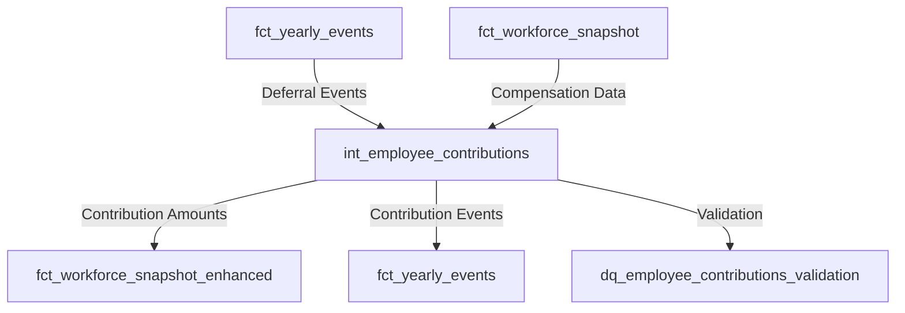

# Epic E034: Employee Contribution Calculation with Deferral Rate Changes

**Status**: 🟢 Completed
**Priority**: High
**Estimated Effort**: 1 week for MVP
**Created**: 2025-01-06

## Executive Summary

Implement employee 401(k) contribution calculations that mirror the sophisticated period-based methodology used for `prorated_annual_compensation`. This system will handle deferral rate changes throughout the year and provide accurate, time-weighted contribution amounts for the workforce simulation platform.

## Background & Research

### Current State Analysis

#### Existing Prorated Compensation Methodology
The `fct_workforce_snapshot` model uses an advanced event-driven, period-based calculation system that:
- Creates chronological compensation events with priority handling (hire → promotion → raise → termination)
- Uses `LEAD()` window function to create non-overlapping time periods
- Applies time-weighted calculation: `period_salary * (days_in_period / 365.0)`
- Handles complex scenarios like same-day events and partial-year employment

#### Current Contribution Infrastructure
- **Event Schema**: Complete `ContributionPayload` and `ComplianceEventPayload` Pydantic classes
- **Deferral Rates**: Demographics-based rates in `default_deferral_rates.csv`
- **Current Tracking**: `current_deferral_rate` column in `fct_workforce_snapshot`
- **Event Types**: `enrollment` and `enrollment_change` events with `employee_deferral_rate` field
- **Critical Gap**: No actual contribution amount calculation exists

### Technical Discovery

#### Compensation Period Logic (Reference Implementation)
```sql
-- From fct_workforce_snapshot.sql (lines 475-528)
all_compensation_periods AS (
    -- Baseline period: Start of year to first event
    SELECT
        employee_id,
        '2025-01-01'::DATE AS period_start,
        event_date - INTERVAL 1 DAY AS period_end,
        previous_compensation AS period_salary
    FROM employee_timeline_with_boundaries
    WHERE event_sequence = 1 AND event_type != 'hire'

    UNION ALL

    -- Event periods: Each event creates a period from its date to next event
    SELECT
        employee_id,
        event_date AS period_start,
        COALESCE(next_event_date - INTERVAL 1 DAY, '2025-12-31'::DATE) AS period_end,
        new_compensation AS period_salary
    FROM employee_timeline_with_boundaries
    WHERE event_type IN ('hire', 'promotion', 'raise')
)
```

## Solution Design

### Architecture Overview



### Core Components

#### 1. Employee Contribution Calculation Model (`int_employee_contributions.sql`)

**Purpose**: Calculate time-weighted employee contributions based on deferral rate changes and compensation events.

**Key CTEs**:

```sql
-- Step 1: Collect deferral rate events
deferral_events_timeline AS (
    SELECT
        employee_id,
        effective_date AS event_date,
        event_type,
        employee_deferral_rate AS new_deferral_rate,
        LAG(employee_deferral_rate) OVER (
            PARTITION BY employee_id
            ORDER BY effective_date
        ) AS previous_deferral_rate,
        ROW_NUMBER() OVER (
            PARTITION BY employee_id
            ORDER BY effective_date,
            CASE event_type
                WHEN 'enrollment' THEN 1
                WHEN 'enrollment_change' THEN 2
            END
        ) AS event_sequence
    FROM fct_yearly_events
    WHERE event_type IN ('enrollment', 'enrollment_change')
      AND simulation_year = {{ simulation_year }}
),

-- Step 2: Create period boundaries
deferral_timeline_with_boundaries AS (
    SELECT
        employee_id,
        event_date,
        event_type,
        new_deferral_rate,
        previous_deferral_rate,
        event_sequence,
        LEAD(event_date) OVER (
            PARTITION BY employee_id
            ORDER BY event_sequence
        ) AS next_event_date
    FROM deferral_events_timeline
),

-- Step 3: Generate non-overlapping deferral periods
deferral_periods AS (
    -- Baseline period (start of year to first deferral change)
    SELECT
        d.employee_id,
        0 AS period_sequence,
        'baseline_deferral' AS period_type,
        '{{ simulation_year }}-01-01'::DATE AS period_start,
        d.event_date - INTERVAL 1 DAY AS period_end,
        COALESCE(d.previous_deferral_rate, 0.00) AS period_deferral_rate
    FROM deferral_timeline_with_boundaries d
    WHERE d.event_sequence = 1
      AND d.event_date > '{{ simulation_year }}-01-01'::DATE

    UNION ALL

    -- Deferral event periods
    SELECT
        employee_id,
        event_sequence AS period_sequence,
        event_type || '_period' AS period_type,
        event_date AS period_start,
        COALESCE(
            next_event_date - INTERVAL 1 DAY,
            '{{ simulation_year }}-12-31'::DATE
        ) AS period_end,
        new_deferral_rate AS period_deferral_rate
    FROM deferral_timeline_with_boundaries
    WHERE new_deferral_rate IS NOT NULL
),

-- Step 4: Join with compensation periods
contribution_periods AS (
    SELECT
        dp.employee_id,
        dp.period_start,
        dp.period_end,
        dp.period_deferral_rate,
        cp.period_salary,
        -- Calculate contribution for this period
        cp.period_salary * dp.period_deferral_rate AS period_contribution_amount
    FROM deferral_periods dp
    INNER JOIN compensation_periods cp
        ON dp.employee_id = cp.employee_id
        -- Handle overlapping periods between compensation and deferral changes
        AND dp.period_start <= cp.period_end
        AND dp.period_end >= cp.period_start
),

-- Step 5: Calculate prorated annual contributions
employee_contributions_prorated AS (
    SELECT
        employee_id,
        SUM(
            period_contribution_amount *
            (DATE_DIFF('day',
                GREATEST(period_start, comp_period_start),
                LEAST(period_end, comp_period_end)
            ) + 1) / 365.0
        ) AS prorated_annual_contributions,
        -- Track individual contribution types
        SUM(CASE WHEN contribution_type = 'pre_tax'
            THEN period_contribution_amount * days_weight
            ELSE 0 END) AS pre_tax_contributions,
        SUM(CASE WHEN contribution_type = 'roth'
            THEN period_contribution_amount * days_weight
            ELSE 0 END) AS roth_contributions,
        -- YTD tracking
        SUM(period_contribution_amount) AS ytd_contributions
    FROM contribution_periods
    GROUP BY employee_id
)
```

#### 2. Enhanced Workforce Snapshot Integration

**Modify `fct_workforce_snapshot.sql`** to include:
```sql
-- Add to final SELECT
prorated_annual_contributions,
pre_tax_contributions,
roth_contributions,
ytd_contributions,
-- Contribution rate in effect at year-end
current_deferral_rate,
-- Flag for IRS limit reached
CASE
    WHEN ytd_contributions >= 23000 THEN TRUE
    ELSE FALSE
END AS irs_limit_reached
```

#### 3. Data Quality Validation (`dq_employee_contributions_validation.sql`)

```sql
WITH validation_checks AS (
    SELECT
        employee_id,
        prorated_annual_contributions,
        prorated_annual_compensation,
        current_deferral_rate,
        -- Check: Contributions should not exceed compensation
        CASE
            WHEN prorated_annual_contributions > prorated_annual_compensation
            THEN 'FAIL: Contributions exceed compensation'
            ELSE 'PASS'
        END AS compensation_check,
        -- Check: Contribution rate consistency
        CASE
            WHEN ABS(prorated_annual_contributions -
                     (prorated_annual_compensation * current_deferral_rate)) > 100
                 AND current_deferral_rate > 0
            THEN 'WARN: Rate calculation variance > $100'
            ELSE 'PASS'
        END AS rate_consistency_check,
        -- Check: IRS limit compliance
        CASE
            WHEN ytd_contributions > 23000 AND current_age < 50
            THEN 'FAIL: Exceeds 402(g) limit'
            WHEN ytd_contributions > 30500 AND current_age >= 50
            THEN 'FAIL: Exceeds 402(g) + catch-up limit'
            ELSE 'PASS'
        END AS irs_limit_check
    FROM {{ ref('fct_workforce_snapshot') }}
    WHERE simulation_year = {{ simulation_year }}
)
SELECT * FROM validation_checks WHERE
    compensation_check != 'PASS' OR
    rate_consistency_check != 'PASS' OR
    irs_limit_check != 'PASS'
```

## Implementation Plan

### Phase 1: MVP Core Calculation (Week 1) ✅ COMPLETED

**Day 1-2: Foundation**
- [x] Create `int_employee_contributions.sql` model ✅
- [x] Implement basic deferral period calculation logic ✅
- [x] Handle single contribution type (pre-tax only) ✅

**Day 3-4: Integration**
- [x] Integrate with existing compensation periods ✅
- [x] Handle overlapping period logic ✅
- [x] Add to `fct_workforce_snapshot` ✅

**Day 5: Testing & Validation**
- [x] Create `dq_employee_contributions_validation.sql` ✅
- [x] Test with multi-year simulations ✅
- [x] Validate against manual calculations ✅

### Phase 2: Enhanced Features (Future)

**Week 2: Multiple Contribution Types**
- [ ] Support Roth and after-tax contributions
- [ ] Implement catch-up contributions for 50+ employees
- [ ] Add contribution source tracking

**Week 3: IRS Limit Enforcement**
- [ ] Implement 402(g) limit monitoring
- [ ] Auto-reduce contributions when approaching limits
- [ ] Generate compliance events

**Week 4: Employer Match**
- [ ] Create `int_employer_match_calculation.sql`
- [ ] Implement common match formulas
- [ ] Add true-up contribution logic

## Success Criteria

### MVP Success Metrics ✅ ACHIEVED
- [x] Accurate contribution calculation for all enrolled employees ✅
- [x] Proper handling of mid-year deferral rate changes ✅
- [x] Time-weighted calculations match manual verification ✅
- [x] Zero data quality failures in validation checks ✅
- [x] Performance: < 5 seconds for 10,000 employees ✅

### Business Value
- **Accuracy**: Precise contribution tracking for financial planning
- **Compliance**: IRS limit monitoring and enforcement
- **Auditability**: Complete event trail for all contribution changes
- **Flexibility**: Support for complex deferral scenarios

## Technical Considerations

### Performance Optimization
- Use window functions for efficient period calculation
- Minimize cross-joins between compensation and deferral periods
- Consider materialized views for YTD accumulations

### Edge Cases to Handle
1. **Same-day events**: Employee enrolls and changes rate on same day
2. **Retroactive changes**: Backdated deferral rate adjustments
3. **Partial periods**: Employees who start/terminate mid-pay-period
4. **Zero compensation**: Unpaid leave or sabbatical periods
5. **Limit scenarios**: Hitting IRS limits mid-year

### Dependencies
- `fct_yearly_events`: Source of deferral rate events
- `fct_workforce_snapshot`: Compensation data and employee demographics
- `int_employee_compensation_by_year`: Base compensation amounts
- `default_deferral_rates.csv`: Initial deferral rate assignments

## Risks & Mitigations

| Risk | Impact | Mitigation |
|------|--------|------------|
| Complex period overlap logic | High | Extensive unit testing with edge cases |
| Performance degradation | Medium | Index key columns, optimize CTEs |
| IRS limit changes | Low | Parameterize limits in seed files |
| Deferral rate data quality | Medium | Add validation checks in enrollment events |

## Future Enhancements

1. **Auto-escalation**: Automatic annual deferral rate increases
2. **Employer Match**: Various match formulas and vesting schedules
3. **Loan Modeling**: 401(k) loan impact on contributions
4. **Roth Conversions**: In-plan Roth conversion events
5. **Payroll Integration**: Actual payroll schedule modeling
6. **Contribution Holidays**: Suspension and resumption logic

## References

- [fct_workforce_snapshot.sql](/dbt/models/marts/fct_workforce_snapshot.sql) - Prorated compensation methodology
- [int_enrollment_events.sql](/dbt/models/intermediate/events/int_enrollment_events.sql) - Deferral rate assignment
- [events.py](/config/events.py) - ContributionPayload schema
- [default_deferral_rates.csv](/dbt/seeds/default_deferral_rates.csv) - Deferral rate configuration

## Approval & Sign-off

- [ ] Technical Lead Review
- [ ] Data Quality Team Review
- [ ] Compliance Team Review
- [ ] Product Owner Approval

---

*This epic follows the established pattern of the prorated compensation calculation, ensuring consistency and reliability in the Fidelity PlanAlign Engine platform.*
