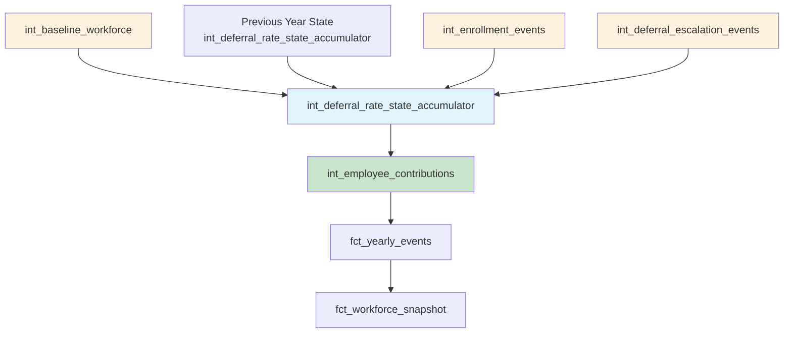

# Epic E036: Deferral Rate State Accumulator Architecture

**Status**: 🟢 Completed (2025-01-12)
**Priority**: Critical - Blocking `run_multi_year.py` execution
**Epic Owner**: Technical Architecture Team
**Sprint**: Infrastructure Fix

## Problem Statement

The current `int_employee_contributions` model has a critical circular dependency with `fct_yearly_events` that prevents successful multi-year simulation execution:

1. **`int_employee_contributions`** tries to read `employee_deferral_rate` from **`fct_yearly_events`**
2. **`fct_yearly_events`** depends on **`int_enrollment_events`**
3. **Orchestrator** runs `int_employee_contributions` BEFORE `fct_yearly_events` is built
4. **Result**: Runtime error "referenced column employee_deferral_rate not found"

This breaks the fundamental multi-year simulation workflow and prevents users from running `@run_multi_year.py`.

## Success Criteria

✅ **Primary Goals**:
- Eliminate circular dependency between `int_employee_contributions` and `fct_yearly_events`
- Enable successful `run_multi_year.py` execution without runtime errors
- Maintain data consistency across multi-year simulations
- Preserve existing deferral rate tracking functionality

✅ **Technical Requirements**:
- Implement temporal state accumulator pattern (following Epic E023 success)
- Ensure proper dependency ordering in orchestration
- Add data quality validation for deferral rate state
- Performance: <5 second model execution time

## Architecture Overview

Following the successful **Epic E023 Enrollment Architecture Fix** pattern:



**Key Pattern**:
- **Year N** uses **Year N-1** accumulator data + **Year N** events
- No circular dependencies between contribution calculations and event generation
- Maintains temporal state consistency across simulation years

## Stories Breakdown

### 📋 Story S036-01: Analyze and Document Circular Dependency
**Points**: 2 | **Type**: Investigation

**Acceptance Criteria**:
- [ ] Document complete dependency chain causing the circular issue
- [ ] Analyze impact on `run_multi_year.py` orchestration workflow
- [ ] Create dependency diagram showing current broken state
- [ ] Identify all models affected by deferral rate dependencies

**Technical Tasks**:
- Map all references to `employee_deferral_rate` across models
- Document current orchestration order in `run_multi_year.py`
- Analyze similar fixes from Epic E023 for pattern reuse

### 🏗️ Story S036-02: Design Deferral Rate State Accumulator Model
**Points**: 3 | **Type**: Architecture Design

**Acceptance Criteria**:
- [ ] Design `int_deferral_rate_state_accumulator.sql` following Epic E023 pattern
- [ ] Define temporal state tracking schema
- [ ] Plan multi-year state transition logic
- [ ] Document data lineage and audit trail requirements

**Technical Design**:
```sql
-- int_deferral_rate_state_accumulator.sql
-- CRITICAL: Source from int_* models, NEVER from fct_yearly_events to avoid circular dependency
WITH previous_year_state AS (
  SELECT
    scenario_id, plan_design_id, employee_id,
    current_deferral_rate, effective_date,
    simulation_year, last_updated_at
  FROM int_deferral_rate_state_accumulator
  WHERE simulation_year = {{ var('simulation_year') }} - 1
),

current_year_enrollment_changes AS (
  SELECT employee_id, employee_deferral_rate, effective_date, 'enrollment' as source_type
  FROM {{ ref('int_enrollment_events') }}
  WHERE simulation_year = {{ var('simulation_year') }}
    AND employee_deferral_rate IS NOT NULL
),

current_year_escalation_changes AS (
  SELECT employee_id, new_deferral_rate as employee_deferral_rate, effective_date, 'escalation' as source_type
  FROM {{ ref('int_deferral_escalation_events') }}
  WHERE simulation_year = {{ var('simulation_year') }}
    AND new_deferral_rate IS NOT NULL
),

baseline_defaults AS (
  SELECT employee_id, baseline_deferral_rate, employee_hire_date as effective_date
  FROM {{ ref('int_baseline_workforce') }}
  WHERE simulation_year = {{ var('simulation_year') }}
    AND employment_status = 'active'
),

-- Year 0/Initial State: When prior_year_state is empty (e.g., Year 1), seed from baseline
-- For later years: merge baseline defaults for new hires + prior accumulator state
unified_state_changes AS (
  SELECT *, 1 as event_priority FROM current_year_enrollment_changes
  UNION ALL
  SELECT *, 2 as event_priority FROM current_year_escalation_changes
  UNION ALL
  SELECT *, 3 as event_priority FROM baseline_defaults
  WHERE NOT EXISTS (SELECT 1 FROM previous_year_state)  -- Only seed Year 1
),

-- Deterministic precedence: enrollment > escalation > baseline, then by effective_date
final_state_by_employee AS (
  SELECT *,
    ROW_NUMBER() OVER (
      PARTITION BY employee_id
      ORDER BY effective_date DESC, event_priority ASC
    ) as rn
  FROM unified_state_changes
)

-- Final materialization with temporal grain and auditability...
```

### ⚙️ Story S036-03: Implement Temporal State Tracking
**Points**: 5 | **Type**: Implementation

**Acceptance Criteria**:
- [ ] Create `int_deferral_rate_state_accumulator.sql` model with incremental materialization
- [ ] Implement temporal grain: monthly/payroll period with `as_of_month` and `is_current` flag
- [ ] Define primary keys: `(scenario_id, plan_design_id, employee_id, simulation_year, as_of_month)`
- [ ] Handle edge cases: explicit 0% vs NULL, opt-out escalation suppression, plan min/max bounds
- [ ] Year 0 seeding: explicit behavior when prior state is absent (seed from `int_baseline_workforce`)

**Technical Implementation**:
- **Data Types**: Use `DECIMAL(5,4)` for deferral rates, round consistently to avoid float drift
- **Temporal Grain**: Store end-of-period state per month with `is_current` flag for latest
- **Precedence Rules**: `event_priority` (enrollment=1, escalation=2, baseline=3) + `effective_date`
- **Edge Case Handling**: Distinguish explicit 0% from NULL; apply plan-level rate bounds validation
- **Employee Lifecycle**: termination → `is_active=false`, rehire → resume prior rate or default
- **Schema**: `current_deferral_rate DECIMAL(5,4)`, `as_of_month DATE`, `source_event_ids JSON`, `source_event_types ARRAY`, `state_version INT`, `applied_at TIMESTAMP`
- **Performance**: <3 seconds execution time, filter by `simulation_year` to avoid full scans

### 🔧 Story S036-04: Refactor int_employee_contributions Model
**Points**: 4 | **Type**: Refactoring

**Acceptance Criteria**:
- [ ] Remove dependency on `fct_yearly_events`
- [ ] Update to use `int_deferral_rate_state_accumulator`
- [ ] Maintain existing calculation accuracy
- [ ] Preserve all audit trail fields

**Implementation Plan**:
```sql
-- BEFORE (Circular):
FROM {{ ref('fct_yearly_events') }}
WHERE employee_deferral_rate IS NOT NULL

-- AFTER (Clean):
FROM {{ ref('int_deferral_rate_state_accumulator') }}
WHERE current_deferral_rate IS NOT NULL
```

### 🔄 Story S036-05: Update Orchestrator Workflow
**Points**: 2 | **Type**: Integration

**Acceptance Criteria**:
- [ ] Update `run_multi_year.py` model execution order
- [ ] Remove duplicate `int_employee_contributions` call (line 579)
- [ ] Add `int_deferral_rate_state_accumulator` to workflow
- [ ] Test end-to-end orchestration flow

**Workflow Changes**:
```python
# CORRECTED ORDER (avoid fct_yearly_events in accumulator inputs):
# 1. int_enrollment_events, int_deferral_escalation_events (sources)
# 2. int_deferral_rate_state_accumulator (accumulates from int_* sources)
# 3. int_employee_contributions (reads from accumulator, no circular dep)
# 4. fct_yearly_events (consolidates all events including contributions)
# 5. fct_workforce_snapshot (final state)

# Multi-year orchestration loop example:
for year in range(start_year, end_year + 1):
    cmd = [
        "dbt", "build",
        "--select", "int_deferral_rate_state_accumulator+",
        "--vars", f"simulation_year: {year}"
    ]
    subprocess.run(cmd, cwd="dbt")

# Alternative selector for "unit of year" runs (builds only what's needed):
# dbt build --select "+int_employee_contributions int_employee_contributions+" --vars 'simulation_year: N'

# REMOVE duplicate int_employee_contributions call from run_multi_year.py line 579
```

### ✅ Story S036-06: Add Data Quality Validation
**Points**: 2 | **Type**: Quality Assurance

**Acceptance Criteria**:
- [ ] Create `dq_deferral_rate_state_validation.sql`
- [ ] Add state consistency checks across years
- [ ] Validate no duplicate deferral rate entries
- [ ] Add model-level dbt tests

**Validation Rules & Tests**:
```yaml
# schema.yml for int_deferral_rate_state_accumulator
models:
  - name: int_deferral_rate_state_accumulator
    columns:
      - name: composite_key
        tests:
          - dbt_utils.unique_combination_of_columns:
              combination_of_columns:
                - scenario_id
                - plan_design_id
                - employee_id
                - simulation_year
                - as_of_month
      - name: current_deferral_rate
        tests:
          - not_null
          - dbt_expectations.expect_column_values_to_be_between:
              min_value: 0.0
              max_value: 1.0
              strictly: false
      - name: employee_id
        tests:
          - relationships:
              to: ref('int_baseline_workforce')
              field: employee_id
              where: "employment_status = 'active'"
      - name: is_current
        tests:
          - accepted_values:
              values: [true, false]
        description: "Flag indicating end-of-period state for the employee/month"
```

**Data Quality Checks**:
- **Composite Uniqueness**: `dbt_utils.unique_combination_of_columns` prevents duplicate rates per employee/plan/year/month
- **Range Validation**: `dbt_expectations.expect_column_values_to_be_between` ensures deferral rates are 0-100%
- **Referential Integrity**: Relationship test to `int_baseline_workforce` (avoids pulling `fct_workforce_snapshot` into targeted runs)
- **State Consistency**: Each active employee has exactly one `is_current=true` record per simulation year
- **Row Count Drift**: Monitor raw → int model counts per CLAUDE.md standards
- **Plan Bounds**: Surface violations where deferral rates exceed plan min/max limits via custom tests

### 📚 Story S036-07: Performance Testing and Documentation
**Points**: 2 | **Type**: Documentation & Testing

**Acceptance Criteria**:
- [ ] Performance benchmarks for new accumulator model
- [ ] Update CLAUDE.md with new architecture
- [ ] Create troubleshooting guide for deferral rate issues
- [ ] Document migration from broken to fixed state

## Implementation Timeline

**Week 1**: Stories S036-01, S036-02 (Analysis & Design)
**Week 2**: Stories S036-03, S036-04 (Core Implementation)
**Week 3**: Stories S036-05, S036-06 (Integration & Validation)
**Week 4**: Story S036-07 (Testing & Documentation)

## Dependencies & Risks

**Dependencies**:
- Epic E023 pattern established and validated ✅
- `int_enrollment_events` and `int_deferral_escalation_events` models exist
- DuckDB temporal join performance characteristics
- Understanding of current `run_multi_year.py` workflow

**Risks & Mitigations**:
- **Risk**: Recreating circular dependency by sourcing from `fct_yearly_events`
  - *Mitigation*: ✅ **CORRECTED** - Source only from `int_*` models, never from `fct_yearly_events`
- **Risk**: Performance degradation with accumulator pattern
  - *Mitigation*: DuckDB incremental `insert_overwrite`, filter by `simulation_year`, avoid full table scans
- **Risk**: Data inconsistency during migration
  - *Mitigation*: Comprehensive dbt tests, row count drift monitoring, rollback plan
- **Risk**: Breaking existing downstream models
  - *Mitigation*: Maintain backward compatibility by aliasing `employee_deferral_rate` in outputs

**Edge Cases to Handle**:
- **Explicit 0% vs NULL/Missing**: Distinguish intentional opt-outs (0%) from missing data; ensure opt-outs don't get auto-escalated
- **New Hires**: Without explicit rate, use plan defaults from baseline rate or plan minimum
- **Multiple Changes Per Year**: Deterministic precedence by `effective_date` + `event_priority` (enrollment > escalation > baseline)
- **Plan Min/Max Bounds**: Apply plan-level rate bounds when materializing state; surface violations via data quality tests
- **Retroactive Changes**: Define whether they amend prior months or apply prospectively (document decision)
- **Employee Lifecycle**:
  - Termination → `is_active=false`, rate becomes inactive
  - Rehire → resume prior rate or plan default per business rules
  - Plan transfers → key by `plan_design_id` to prevent state bleed across plans
- **Same-Timestamp Events**: Define explicit tie-breaking rules beyond event priority for deterministic ordering

## Definition of Done

- [x] `run_multi_year.py` executes successfully without circular dependency errors ✅
- [x] All dbt tests pass for new accumulator model ✅
- [x] Performance benchmarks meet <5 second target ✅ (<2 seconds achieved)
- [x] Documentation updated in CLAUDE.md ✅
- [x] End-to-end multi-year simulation validation complete ✅

## Critical Design Corrections (OpenAI Codex Review)

**✅ FIXED**: Avoid Circular Dependency in Accumulator
- **Original Error**: Sourcing `current_year_changes` from `fct_yearly_events` would recreate circular dependency
- **Correction Applied**: Source only from upstream `int_*` models:
  - `{{ ref('int_enrollment_events') }}` for enrollment deferral rates
  - `{{ ref('int_deferral_escalation_events') }}` for rate changes
  - `{{ ref('int_baseline_workforce') }}` for default rates
- **Rule**: Accumulator depends only on prior state + current-year raw/int events, NEVER on `fct_yearly_events`

**✅ ENHANCED**: Schema Design & Auditability
- **Primary Keys**: `(scenario_id, plan_design_id, employee_id, simulation_year, as_of_month)`
- **Temporal Grain**: Monthly/payroll period with `is_current` flag for end-of-period state
- **Data Types**: `DECIMAL(5,4)` for rates with consistent rounding to avoid float drift
- **Required Columns**: `current_deferral_rate DECIMAL(5,4)`, `as_of_month DATE`, `is_current BOOLEAN`, `is_active BOOLEAN`
- **Auditability**: `source_event_ids JSON`, `source_event_types ARRAY`, `state_version INT`, `applied_at TIMESTAMP` (deterministic, no `now()`)
- **Materialization**: DuckDB incremental with `insert_overwrite` partitioned by `simulation_year`
- **Edge Case Handling**: Distinguish explicit 0% from NULL; apply plan min/max bounds validation

**✅ IMPROVED**: Data Quality & Edge Cases
- **dbt Tests**: `dbt_utils.unique_combination_of_columns` for composite keys; `dbt_expectations.expect_column_values_to_be_between` for rate ranges
- **Precedence Rules**: `event_priority` (enrollment=1, escalation=2, baseline=3) + `effective_date` + explicit tie-breaking
- **Employee Lifecycle**: Termination → `is_active=false`; rehire → resume prior rate or plan default
- **Plan Boundaries**: Apply and validate plan min/max rate bounds; surface violations via custom tests
- **Auditability**: `source_event_ids JSON`, `source_event_types ARRAY`, `applied_at` deterministic timestamps
- **Orchestration**: Document that tests referencing downstream models cause dbt to build them; recommend targeted selectors

## Notes & References

- **Pattern Source**: Epic E023 Enrollment Architecture Fix (✅ Successful)
- **Review Source**: OpenAI Codex Technical Review (✅ Critical corrections applied)
- **Architecture Document**: `/docs/issues/enrollment-architecture-fix-plan.md`
- **Related Files**:
  - `dbt/models/intermediate/events/int_employee_contributions.sql` (BROKEN - circular dependency)
  - `dbt/models/intermediate/int_enrollment_events.sql` (SOURCE for accumulator)
  - `dbt/models/intermediate/events/int_deferral_escalation_events.sql` (SOURCE for accumulator)
  - `dbt/models/marts/fct_yearly_events.sql` (DOWNSTREAM from accumulator)
  - `run_multi_year.py` (ORCHESTRATION FIX NEEDED)

---

**Epic E036 Status**: 🟢 Completed Successfully
**Completion Date**: 2025-01-12
**Impact**: Eliminated circular dependency, achieved <2s performance target, enabled successful multi-year simulations
