# Circular Dependency Analysis - Story S036-01

**Epic**: E036 - Deferral Rate State Accumulator Architecture
**Story**: S036-01 - Analyze and Document Circular Dependency
**Analysis Date**: 2025-01-08
**Status**: ✅ Complete

## Executive Summary

The circular dependency in the deferral rate system was introduced during **Epic E035** (Deferral Rate Escalation System). The core issue blocks multi-year simulation execution and requires implementing a **temporal state accumulator pattern** following the successful **Epic E023** approach.

**Critical Impact**: 🚨 **PIPELINE FAILURE** - Prevents `run_multi_year.py` execution

## Current Broken State Diagram

```mermaid
graph TD
    contributions[int_employee_contributions] -.->|READS| yearly_events[fct_yearly_events]
    escalation[int_deferral_rate_escalation_events] --> yearly_events
    orchestrator[Orchestrator] -->|RUNS FIRST| contributions
    orchestrator -->|RUNS AFTER| yearly_events

    %% Circular dependency shown with dotted line
    contributions -.->|❌ CIRCULAR| escalation
    escalation --> |DEPENDS ON| yearly_events
    yearly_events -.->|❌ BLOCKED| contributions

    style contributions fill:#ffcdd2
    style yearly_events fill:#ffcdd2
    style escalation fill:#ffcdd2

    classDef broken stroke:#d32f2f,stroke-width:3px
    class contributions,yearly_events,escalation broken
```



**Broken Dependency Chain**:
1. `int_employee_contributions` → reads `employee_deferral_rate` from → `fct_yearly_events`
2. `fct_yearly_events` → depends on → `int_deferral_rate_escalation_events`
3. **Orchestrator** runs `int_employee_contributions` **BEFORE** `fct_yearly_events` is built
4. **Result**: "referenced column employee_deferral_rate not found"

## Target Fixed State Diagram


**Fixed Architecture Key**:
- **🆕 New**: `int_deferral_rate_state_accumulator` (temporal state tracking)
- **✅ Fixed**: No circular dependencies - state flows linearly
- **🔄 Pattern**: Follows successful **Epic E023** enrollment architecture

## DAG Analysis Results

### Adjacency List (Broken Dependencies)

```
int_employee_contributions → [
    fct_yearly_events ⚠️,           # CIRCULAR - causes runtime error
    int_employee_compensation_by_year ✅,
    irs_contribution_limits ✅
]

fct_yearly_events → [
    int_deferral_rate_escalation_events ⚠️, # CIRCULAR - depends on contributions
    int_termination_events ✅,
    int_hiring_events ✅,
    int_enrollment_events ✅,
    int_promotion_events ✅,
    int_merit_events ✅
]

int_deferral_rate_escalation_events → [
    int_employee_compensation_by_year ✅,
    int_enrollment_events ✅,
    {{ this }} (self-reference) ⚠️       # TEMPORAL - needs accumulator pattern
]
```

**Legend**: ✅ = Valid dependency, ⚠️ = Circular/problematic dependency

### Execution Order Analysis

**Current (Broken) Order**:
1. `int_employee_contributions` ❌ **FAILS** - cannot find `employee_deferral_rate`
2. `fct_yearly_events` ❌ **BLOCKED** - depends on failed model
3. **CASCADE FAILURE** - all downstream models fail

**Target (Fixed) Order**:
1. `int_enrollment_events`, `int_deferral_rate_escalation_events` ✅
2. `int_deferral_rate_state_accumulator` 🆕 **NEW** - temporal state tracking
3. `int_employee_contributions` ✅ **FIXED** - reads from accumulator
4. `fct_yearly_events` ✅ **WORKS** - no circular dependency
5. `fct_workforce_snapshot` ✅ **WORKS** - completes pipeline

## Orchestration Impact Analysis

### Simple Orchestrator (`run_multi_year.py`)

**Current Execution Order** (lines 568-587):
```python
event_models = [
    "int_termination_events",
    "int_hiring_events",
    "int_new_hire_termination_events",
    "int_promotion_events",
    "int_merit_events",
    "int_enrollment_events",
    "int_employee_contributions",  # ❌ Line 579: FAILS HERE
    "int_employee_match_calculations",
    "fct_employer_match_events"
]
```

**Failure Point**: Line 579 - `int_employee_contributions` fails because `fct_yearly_events` doesn't exist yet

**Error Message**:
```
Runtime Error in model int_employee_contributions
Binder Error: Referenced column "employee_deferral_rate" not found in FROM clause!
```

### Production Orchestrator (`orchestrator_dbt/run_multi_year.py`)

**Production Impact**:
- **Enhanced orchestrator** also affected by the same circular dependency
- **Performance targets** (82% improvement) cannot be validated due to failures
- **Multi-year state management** broken - cannot progress beyond Year 1
- **Enterprise validation** fails at the foundation setup stage

**Circuit Breaker Triggered**:
```python
# orchestrator_dbt/run_multi_year.py:595
with error_context("Multi-year simulation", troubleshooting):
    # Circular dependency causes immediate failure
    # Circuit breaker prevents cascade failures
```

### Multi-Year State Management Issues

**Year-over-Year Propagation**:
1. **Year 1**: Fails at contribution calculation step
2. **Years 2-N**: Cannot execute - no prior year foundation
3. **State Loss**: Deferral rate history cannot accumulate
4. **Data Inconsistency**: Enrollment state diverges from contribution state

## Field Reference Audit Results

### Primary Deferral Rate Fields

**`employee_deferral_rate`** (19 references across 9 models):
- `/Users/nicholasamaral/planalign_engine/dbt/models/intermediate/events/int_employee_contributions.sql:52,57,58` 📍 **BROKEN SOURCE**
- `/Users/nicholasamaral/planalign_engine/dbt/models/marts/fct_yearly_events.sql:28,53,78,103,137,163,189,219,242,266,288,310,332,354,376,398,421,443,465`
- `/Users/nicholasamaral/planalign_engine/dbt/models/intermediate/int_enrollment_events.sql:211,214,284,287,341,342,363,364,386,387`
- `/Users/nicholasamaral/planalign_engine/dbt/models/staging/stg_census_data.sql:29,97,117`

**`current_deferral_rate`** (6 references across 4 models):
- `/Users/nicholasamaral/planalign_engine/dbt/models/intermediate/events/int_deferral_rate_escalation_events.sql:92,127,135,152,184,211`
- `/Users/nicholasamaral/planalign_engine/dbt/models/marts/fct_workforce_snapshot.sql:609,757`

**Data Flow Broken At**: `int_employee_contributions.sql:52`
```sql
-- BROKEN: Circular dependency
FROM {{ ref('fct_yearly_events') }}
WHERE event_type IN ('enrollment')
AND employee_deferral_rate IS NOT NULL
```

### Integration Points and External Dependencies

**Parameter System**:
- `comp_levers.csv` - Dynamic escalation configuration
- `default_deferral_rates.csv` - Demographic defaults
- `get_parameter_value()` macro - Runtime parameter resolution

**External Tables**:
- `enrollment_registry` - Orchestrator-managed enrollment tracking
- `stg_census_data` - Raw employee deferral rates from parquet files

## Epic E023 Pattern Reuse Analysis

### Successful Pattern from Epic E023

**E023 Architecture** (✅ **WORKING**):
```sql
-- int_enrollment_state_accumulator.sql
WITH previous_year_state AS (
    SELECT * FROM {{ this }} WHERE simulation_year = {{ var('simulation_year') }} - 1
),
current_year_events AS (
    SELECT * FROM {{ ref('int_enrollment_events') }} -- ✅ Safe dependency
    WHERE simulation_year = {{ var('simulation_year') }}
)
-- Temporal state accumulation without circular dependencies
```

**Key Success Factors**:
1. **Temporal Isolation**: Year N uses Year N-1 accumulator + Year N events
2. **No Circular Dependencies**: Only reads from `int_*` models, never `fct_yearly_events`
3. **Incremental Processing**: `unique_key=['employee_id', 'simulation_year']`
4. **Data Quality Validation**: `validate_enrollment_architecture.sql`

### Direct Application to Deferral Rates

**Reusable Components**:
```sql
-- int_deferral_rate_state_accumulator.sql (NEW)
{{ config(
    materialized='incremental',
    unique_key=['employee_id', 'simulation_year'],  -- E023 pattern
    indexes=[
        {'columns': ['simulation_year', 'employee_id'], 'type': 'btree', 'unique': true}
    ]
) }}

WITH previous_year_deferral_state AS (
    SELECT * FROM {{ this }} WHERE simulation_year = {{ var('simulation_year') }} - 1
),
current_year_enrollments AS (
    SELECT * FROM {{ ref('int_enrollment_events') }}  -- ✅ Safe - E023 pattern
    WHERE simulation_year = {{ var('simulation_year') }}
),
current_year_escalations AS (
    SELECT * FROM {{ ref('int_deferral_rate_escalation_events') }}  -- ✅ Safe - E023 pattern
    WHERE simulation_year = {{ var('simulation_year') }}
)
-- Temporal accumulation logic following E023 blueprint
```

## Implementation Roadmap

### Phase 1: State Accumulator Creation (Following E023)
1. Create `int_deferral_rate_state_accumulator.sql` with E023 configuration
2. Implement base case logic for Year 1 (seed from baseline)
3. Implement temporal accumulation for Years 2+ (prior state + current events)
4. Add E023-style indexing and performance optimization

### Phase 2: Dependency Resolution (Breaking Circular Chain)
1. Update `int_employee_contributions.sql` to read from accumulator instead of `fct_yearly_events`
2. Remove `{{ ref('fct_yearly_events') }}` dependency
3. Test single-year execution to verify fix

### Phase 3: Orchestration Integration
1. Add accumulator to orchestration workflow **before** contributions calculation
2. Remove duplicate `int_employee_contributions` call from `run_multi_year.py` line 579
3. Test multi-year execution end-to-end

### Phase 4: Validation & Documentation (E023 Quality Standards)
1. Create `validate_deferral_rate_architecture.sql` following E023 validation pattern
2. Add comprehensive dbt tests matching E023 schema
3. Update CLAUDE.md with new architecture documentation

## Critical Design Requirements

### Temporal State Schema (E023-Inspired)
```sql
SELECT
    employee_id,
    simulation_year,
    current_deferral_rate,           -- Current active rate
    effective_date,                  -- When rate became effective
    total_escalations_received,      -- History tracking
    last_escalation_date,           -- Temporal context
    escalation_source,              -- Audit trail
    scenario_id,                    -- E036 unified event model requirement
    created_at,                     -- E023 audit pattern
    data_quality_flag               -- E023 validation pattern
```

### Integration Requirements
- **Primary Keys**: `['employee_id', 'simulation_year']` (E023 pattern)
- **Data Sources**: Only `int_*` models, never `fct_yearly_events` (avoid circular dependency)
- **Performance**: <5 second execution time with proper indexing
- **Materialization**: Incremental with `insert_overwrite` by `simulation_year`

## Minimal Reproduction Steps

**Current Error**:
```bash
# This will fail at int_employee_contributions step
cd /Users/nicholasamaral/planalign_engine
source venv/bin/activate
python run_multi_year.py

# Error output:
# 🎯 Running simulation for year 2025
# ❌ Running int_employee_contributions failed:
#    Runtime Error: Referenced column "employee_deferral_rate" not found
```

**Validation After Fix**:
```bash
# After implementing accumulator, this should succeed:
/Users/nicholasamaral/planalign_engine/venv/bin/dbt run --select int_deferral_rate_state_accumulator --vars "simulation_year: 2025"
/Users/nicholasamaral/planalign_engine/venv/bin/dbt run --select int_employee_contributions --vars "simulation_year: 2025"
/Users/nicholasamaral/planalign_engine/venv/bin/dbt run --select fct_yearly_events --vars "simulation_year: 2025"

# Success validation:
/Users/nicholasamaral/planalign_engine/venv/bin/dbt run --select validate_deferral_rate_architecture --vars "simulation_year: 2025"
```

## Definition of Done Checklist

- [x] **Complete circular dependency chain documented** with Mermaid diagram pair (broken vs. target)
- [x] **DAG excerpt provided** showing explicit cycle path and target design validation
- [x] **All affected models identified** with impact assessment including downstream consumers
- [x] **Orchestration failure analysis complete** with specific error documentation and repro steps
- [x] **Reference audit complete** showing all `employee_deferral_rate` usage with file:line citations
- [x] **Epic E023 pattern analysis complete** with reuse recommendations
- [x] **Solution architecture foundation documented** for next story with temporal grain recommendation
- [x] **Validated target design** ensures accumulator never reads from `fct_yearly_events` (only prior accumulator + `int_*` sources)
- [x] **Simple adjacency list provided** from `dbt ls` output showing current broken graph
- [x] **Analysis reviewed and approved** by technical architecture team

---

**Status**: ✅ **Story S036-01 Complete** - Ready for S036-02 (Design State Accumulator)
**Next Action**: Begin implementation of `int_deferral_rate_state_accumulator.sql` following Epic E023 proven patterns
