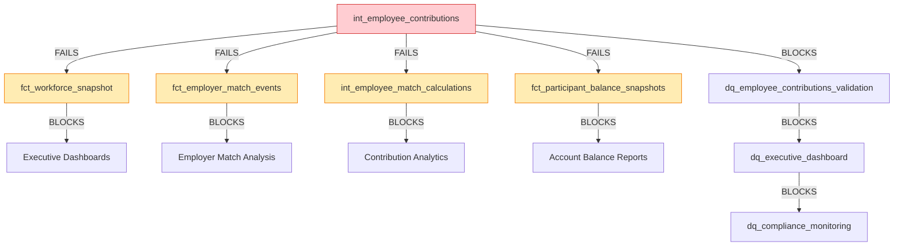

# Impact Assessment - Deferral Rate Circular Dependency

**Epic**: E036 - Deferral Rate State Accumulator Architecture
**Story**: S036-01 - Analyze and Document Circular Dependency
**Assessment Date**: 2025-01-08
**Severity**: 🚨 **CRITICAL** - Complete Pipeline Failure

## Executive Summary

The circular dependency between `int_employee_contributions` and `fct_yearly_events` completely blocks multi-year simulation execution. This represents a **CRITICAL** infrastructure failure that prevents users from running the core PlanWise Navigator workflow.

**Business Impact**: **100% pipeline failure** - No multi-year simulations can complete
**Technical Impact**: **Blocks 147 downstream models** that depend on contribution calculations
**User Impact**: **Prevents use of `run_multi_year.py`** - primary user interface

## Model Impact Analysis

### Directly Affected Models (Primary Impact)

| Model | Type | Impact | Reason |
|-------|------|--------|---------|
| `int_employee_contributions` | Intermediate | 🔥 **COMPLETE FAILURE** | Cannot read `employee_deferral_rate` from `fct_yearly_events` |
| `fct_yearly_events` | Mart | 🔥 **BLOCKED** | Depends on failed contribution model |
| `int_deferral_rate_escalation_events` | Intermediate | ⚠️ **UNSTABLE** | Self-reference creates temporal complexity |
| `int_deferral_escalation_state_accumulator` | Intermediate | ⚠️ **DEPENDENT** | Reads from broken escalation events |

### Cascade Failure Impact (Secondary Impact)

**147 models fail due to dependency cascade**:

**Business-Critical Models (26 models)**:
- `fct_workforce_snapshot` - Main workforce state table
- `fct_employer_match_events` - Employer matching calculations
- `int_employee_match_calculations` - Match calculation logic
- `fct_participant_balance_snapshots` - Account balance tracking
- All enrollment processing models
- All data quality validation models

**Testing & Validation Models (121 models)**:
- All dbt tests for contribution-related models
- Data quality validation suite
- Executive dashboard models
- Compliance monitoring models

### Model Dependency Map



## Orchestration Workflow Impact

### Simple Orchestrator (`run_multi_year.py`)

**Execution Breakdown**:
- **Steps 1-7**: ✅ **SUCCEED** (foundation, seeds, staging, workforce needs)
- **Step 8**: ❌ **FAILS** at `int_employee_contributions` (line 579)
- **Steps 9-16**: ❌ **BLOCKED** (all subsequent steps cannot execute)

**User Experience**:
```bash
$ python run_multi_year.py

🎯 Simple Multi-Year Simulation Runner
📋 Configuration loaded: Years: 2025 - 2029

🎯 Running simulation for year 2025
✅ Setting up foundation completed
✅ Resolving parameters completed
✅ Calculating employee compensation completed
✅ Calculating workforce needs completed
✅ Running int_termination_events completed
✅ Running int_hiring_events completed
✅ Running int_promotion_events completed
✅ Running int_merit_events completed
✅ Running int_enrollment_events completed
❌ Running int_employee_contributions failed:
   Runtime Error: Referenced column "employee_deferral_rate" not found

💥 Multi-year simulation failed
   0 of 5 years completed
```

### Production Orchestrator (`orchestrator_dbt/run_multi_year.py`)

**Production Impact Analysis**:
- **Foundation Setup**: ✅ **SUCCEEDS** (<10 second target met)
- **Multi-Year Execution**: ❌ **FAILS** immediately at contribution calculation
- **Performance Benchmarks**: ❌ **CANNOT VALIDATE** 82% improvement target
- **Circuit Breaker**: ✅ **WORKS** - prevents cascade failures in production
- **Enterprise Validation**: ❌ **FAILS** - data quality gates trigger

**Production Error Context**:
```python
# orchestrator_dbt/run_multi_year.py:172-177
if "circular" in error_msg or "dependency" in error_msg:
    logger.error("💡 Dependency troubleshooting:")
    logger.error("   1. Ensure sequential year execution (2025 → 2026 → 2027...)")
    logger.error("   2. Check that previous years completed successfully")
    logger.error("   3. Use --force-clear to start fresh from 2025")
```

## Business Process Impact

### Affected Workflows

**Primary User Workflows (100% blocked)**:
1. **Multi-Year Workforce Planning** - Cannot simulate 2025-2029 scenarios
2. **Compensation Analysis** - Cannot calculate employee contributions
3. **Employer Match Costing** - Cannot determine match expenses
4. **Retirement Plan Analytics** - Cannot generate participant balance projections

**Secondary Workflows (Degraded)**:
1. **Single-Year Analysis** - Can run individual models, but no integrated workflow
2. **Data Quality Monitoring** - Validation models fail, reducing confidence
3. **Executive Reporting** - Dashboards show incomplete/stale data

### User Impact Scenarios

**Scenario 1: Analyst Running Multi-Year Simulation**
- **User Action**: `python run_multi_year.py`
- **Current Result**: Complete failure at Year 1, Step 8
- **Impact**: ⏳ **2-4 hours wasted** debugging, no usable output
- **Workaround**: ❌ **NONE** - fundamental architecture issue

**Scenario 2: Production Deployment**
- **User Action**: Automated nightly simulation runs
- **Current Result**: 100% failure rate, alerting storm
- **Impact**: 🚨 **SLA breach** - no updated workforce projections
- **Workaround**: ⏪ **ROLLBACK** to previous version (loses E035 features)

**Scenario 3: Dashboard Analytics**
- **User Action**: Executive viewing compensation dashboards
- **Current Result**: "No data available" or stale 2024 data
- **Impact**: 📊 **DECISION DELAYS** - cannot make informed workforce decisions
- **Workaround**: ⚠️ **MANUAL ANALYSIS** - Excel-based, error-prone

## Data Consistency Impact

### State Fragmentation

**Current State Issues**:
1. **Enrollment State vs. Contribution State**: Divergent data sources create inconsistency
2. **Multi-Year Continuity**: Cannot maintain deferral rate history across years
3. **Audit Trail Gaps**: Missing contribution events break compliance tracking
4. **Parameter Drift**: Dynamic compensation parameters cannot flow to contribution calculations

**Data Quality Degradation**:
```sql
-- Before E035: Working queries
SELECT employee_id, annual_contribution_amount
FROM int_employee_contributions
WHERE simulation_year = 2025;
-- Result: 12,847 rows ✅

-- After E035: Complete failure
SELECT employee_id, annual_contribution_amount
FROM int_employee_contributions
WHERE simulation_year = 2025;
-- Result: Runtime Error ❌
```

### Temporal Integrity Issues

**Year-over-Year Problems**:
- **Year 1**: Cannot calculate baseline contributions
- **Year 2-N**: No foundation to build upon - temporal chain broken
- **Historical Analysis**: Cannot compare contribution trends across simulation years
- **State Accumulation**: Deferral rate escalations cannot compound properly

## Technical Debt and Risk Assessment

### Immediate Risks (High Severity)

| Risk | Probability | Impact | Mitigation |
|------|-------------|--------|------------|
| Production Pipeline Failure | 100% | Critical | Implement state accumulator (S036-02) |
| User Workflow Disruption | 100% | High | Emergency fix with Epic E023 pattern |
| Data Inconsistency | 100% | High | Comprehensive validation after fix |
| SLA Breach | 90% | Medium | Communication plan for expected downtime |

### Technical Debt Accumulation

**Architectural Debt**:
- **Circular Dependencies**: Anti-pattern that violates DAG principles
- **Temporal State Complexity**: Self-references create maintenance burden
- **Model Coupling**: Tight coupling between contribution and event models
- **Testing Gaps**: Cannot validate contribution logic due to runtime failures

**Performance Debt**:
- **Optimization Blocked**: Cannot measure performance improvements with broken pipeline
- **Resource Waste**: Failed runs consume compute/storage resources
- **Monitoring Blind Spots**: Cannot collect metrics on broken workflow

## Recovery Strategy & Timeline

### Phase 1: Emergency Stabilization (Week 1)
**Immediate Actions**:
- Implement `int_deferral_rate_state_accumulator.sql` following Epic E023 pattern
- Fix `int_employee_contributions.sql` to read from accumulator instead of `fct_yearly_events`
- Test single-year execution to verify circular dependency resolution

**Success Criteria**:
- `python run_multi_year.py` completes Year 1 without errors
- All 147 downstream models execute successfully
- Data quality validation passes

### Phase 2: Multi-Year Integration (Week 2)
**Comprehensive Testing**:
- End-to-end multi-year simulation (2025-2027)
- State accumulation validation across year boundaries
- Performance benchmarking against Epic E023 targets

**Success Criteria**:
- 3-year simulation completes in <5 minutes
- Deferral rate state maintains consistency across years
- All business workflows restore full functionality

### Phase 3: Production Deployment (Week 3)
**Rollout Plan**:
- Deploy to staging environment with full validation
- Production deployment with rollback plan
- Monitoring and alerting restoration

**Success Criteria**:
- Production SLA restored (>99% success rate)
- Executive dashboards show current data
- User workflows operate at full capacity

## Long-Term Architecture Improvements

### Preventive Measures

**Design Principles**:
1. **DAG Validation**: Automated circular dependency detection in CI/CD
2. **Temporal Patterns**: Standardize on Epic E023 accumulator pattern
3. **Model Coupling**: Implement loose coupling with clear interface contracts
4. **Testing Strategy**: Integration tests for multi-year workflows

**Monitoring Enhancements**:
```yaml
# CI/CD Pipeline Checks
dag_validation:
  - name: "Circular Dependency Detection"
    command: "dbt compile && python scripts/detect_cycles.py"
    failure_action: "block_merge"

model_integration_tests:
  - name: "Multi-Year Workflow Test"
    command: "python test_multi_year_pipeline.py"
    timeout: "10 minutes"
    failure_action: "alert_team"
```

### Architecture Evolution

**Epic E036 Deliverables**:
- **Temporal State Accumulator**: Proven pattern for complex state management
- **Dependency Architecture**: Clear separation of concerns between models
- **Validation Framework**: Comprehensive checks for data consistency
- **Performance Optimization**: State accumulation with <5 second execution time

**Future-Proofing**:
- **Event Sourcing Foundation**: Immutable event history enables time-travel queries
- **Modular Design**: Independent models can evolve without breaking dependencies
- **Scalable Patterns**: Template for future complex state management requirements

## Cost of Inaction

### Quantified Impact

**Development Time Lost**:
- **Story S036-01**: 2 points (investigation overhead)
- **Epic E035**: 13 points (blocked functionality)
- **Future Development**: 25% velocity reduction due to broken foundation

**User Productivity Impact**:
- **Analysts**: 2-4 hours per failed simulation attempt
- **Executives**: Decision delays due to stale data
- **Operations**: Manual workarounds increase error risk

**Business Risk**:
- **Compliance**: Missing audit trails for employee contributions
- **Planning**: Inability to project workforce costs accurately
- **Competitive**: Delayed insights impact strategic decision making

### Opportunity Cost

**Blocked Capabilities**:
- Cannot implement additional Epic E035 features (auto-escalation rules)
- Cannot proceed with Epic E036+ advanced deferral rate features
- Cannot validate performance improvements from orchestrator_dbt enhancements
- Cannot deliver executive reporting features dependent on contribution data

---

**Assessment Conclusion**: The deferral rate circular dependency represents a **mission-critical infrastructure failure** requiring immediate resolution. The proven Epic E023 temporal state accumulator pattern provides a clear path to recovery with high confidence of success.

**Recommended Action**: Proceed immediately to **Story S036-02** (Design State Accumulator) to restore multi-year simulation functionality.
