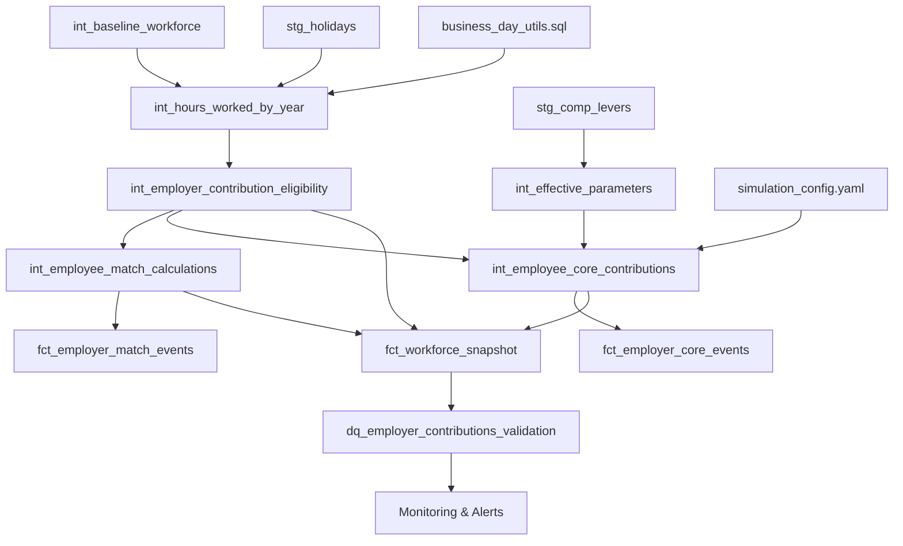

# Epic E040: Employer Contribution Enhancements

**Status**: 📋 Future Epic
**Owner**: Platform / Modeling
**Priority**: Medium (Enhancement after MVP)
**Prerequisites**: E039 - Employer Contribution Integration (MVP)
**Target Start**: After E039 completion

---

## Executive Summary

Enhance the basic employer contribution system (E039) with advanced features for enterprise-grade deployment. This epic builds on the MVP foundation to add sophisticated calculation methods, performance optimizations, comprehensive validation, and audit capabilities.

### Business Impact
- **Advanced plan modeling**: Support complex contribution formulas and eligibility rules
- **Enterprise scalability**: Performance optimizations for large-scale deployments
- **Audit compliance**: Comprehensive tracking and validation for regulatory requirements
- **Operational efficiency**: Sophisticated monitoring and troubleshooting capabilities

---

## Prerequisites and Dependencies

### Required Foundation (E039)
- ✅ Basic eligibility determination (`int_employer_eligibility`)
- ✅ Simple core contribution calculation (`int_employer_core_contributions`)
- ✅ Workforce snapshot integration with employer contribution columns
- ✅ Proven MVP functionality working reliably

### Enhancement Scope
This epic transforms the simple MVP into a comprehensive, enterprise-ready system without breaking existing functionality.

---

## Epic Architecture (Enhanced)



---

## Epic Stories

### **Story S040-01: Advanced Hours Worked Calculation** (5 points)
**Enhancement from MVP**: Replace simple 2080/0 logic with sophisticated business day calculation

**Scope:**
- DuckDB-optimized business day counting with `generate_series` and holiday exclusions
- Configurable holiday calendars (US federal, custom)
- Proper proration for hire/termination dates within year
- Macro utilities for business day operations

### **Story S040-02: Enhanced Eligibility with Reason Codes** (4 points)
**Enhancement from MVP**: Add audit trails and sophisticated eligibility logic

**Scope:**
- Eligibility reason codes ("eligible", "below_min_hours", "inactive_eoy", "other_restriction")
- Rule parameter tracking for audit compliance
- Separate match vs core eligibility determination
- Configurable thresholds via simulation_config.yaml

### **Story S040-03: Advanced Core Contribution Engine** (6 points)
**Enhancement from MVP**: Replace flat 2% with sophisticated parameter-driven system

**Scope:**
- Integration with existing `stg_comp_levers` → `int_effective_parameters` framework
- Level-based contribution rates and fixed dollar amounts
- Multi-year parameter evolution
- Event generation for complete audit trails (`fct_employer_core_events`)

### **Story S040-04: Performance-Optimized Workforce Integration** (4 points)
**Enhancement from MVP**: Add performance optimizations and advanced analytics columns

**Scope:**
- Pre-aggregated join patterns for 100K+ employee datasets
- Composite indexes for analytical query performance
- Additional columns: `total_plan_contributions`, `plan_participation_flag`
- Enhanced analytical capabilities

### **Story S040-05: Comprehensive Data Quality Framework** (3 points)
**Enhancement from MVP**: Add enterprise-grade validation and monitoring

**Scope:**
- Data quality models with realistic thresholds (<=0.5% variance tolerance)
- Primary key uniqueness validation across all models
- Cross-system consistency checks
- Performance monitoring and regression detection

### **Story S040-06: Configuration Management System** (2 points)
**Enhancement from MVP**: Add sophisticated configuration capabilities

**Scope:**
- Comprehensive simulation_config.yaml schema
- Integration with existing parameter resolution patterns
- Multi-scenario support for different plan designs
- Configuration validation and testing

---

## Technical Enhancement Details

### Advanced Hours Calculation
```sql
-- Business day calculation with holiday exclusion
WITH date_range AS (
  SELECT d::DATE AS business_date
  FROM generate_series(window_start, window_end, INTERVAL 1 DAY) AS d
  WHERE EXTRACT(DOW FROM d) NOT IN (0, 6)  -- Exclude weekends
),
business_days AS (
  SELECT dr.business_date
  FROM date_range dr
  LEFT JOIN {{ ref('stg_holidays') }} h
    ON h.holiday_date = dr.business_date
    AND h.holiday_calendar = '{{ var("holiday_calendar", "us_federal") }}'
  WHERE h.holiday_date IS NULL  -- Anti-join for performance
)
SELECT COUNT(*) * {{ var('hours_per_business_day', 8) }} as hours_worked
FROM business_days
```

### Sophisticated Core Contributions
```sql
-- Parameter-driven core contributions with level support
WITH core_rates AS (
  SELECT job_level, parameter_value AS core_rate
  FROM {{ ref('int_effective_parameters') }}
  WHERE parameter_name = 'core_contribution_rate'
    AND event_type = 'CORE_CONTRIB'
),
core_calculations AS (
  SELECT
    ee.employee_id,
    CASE
      WHEN cfa.core_flat_amount IS NOT NULL THEN cfa.core_flat_amount
      ELSE ee.eligible_compensation * COALESCE(cr.core_rate, 0.02)
    END AS core_contribution_amount
  FROM eligible_employees ee
  LEFT JOIN core_rates cr ON ee.level_id = cr.job_level
  LEFT JOIN core_flat_amounts cfa ON ee.level_id = cfa.job_level
)
```

### Advanced Workforce Snapshot
```sql
-- Pre-aggregated employer contributions with enhanced analytics
WITH employer_contributions_aggregated AS (
  SELECT
    COALESCE(m.employee_id, c.employee_id) AS employee_id,
    ROUND(COALESCE(m.employer_match_amount, 0) +
          COALESCE(c.employer_core_amount, 0), 2) AS total_employer_contributions,
    CASE WHEN COALESCE(m.employer_match_amount, 0) > 0
              OR COALESCE(c.employer_core_amount, 0) > 0
         THEN TRUE ELSE FALSE END AS has_employer_contributions
  FROM {{ ref('int_employee_match_calculations') }} m
  FULL OUTER JOIN {{ ref('int_employee_core_contributions') }} c USING (employee_id, simulation_year)
)
```

---

## Configuration Schema (Enhanced)

### simulation_config.yaml
```yaml
# Advanced employer contribution configuration
employer_contributions:
  core:
    enabled: true
    default_rate: 0.02
    eligibility:
      min_hours_worked: 1000
      require_active_eoy: true
  match:
    eligibility:
      min_hours_worked: 1000
      require_active_eoy: false

# Advanced hours calculation
hours_calculation:
  hours_per_business_day: 8.0
  holiday_calendar: "us_federal"
  business_days_only: true

# Data quality thresholds
data_quality:
  variance_tolerance: 0.005  # 0.5% acceptable variance
  pk_uniqueness_required: true
  cross_validation_enabled: true
```

### comp_levers.csv Extensions
```csv
scenario_id,fiscal_year,event_type,parameter_name,job_level,parameter_value
# Core contribution rates by level
default,2025,CORE_CONTRIB,core_contribution_rate,,0.020
default,2025,CORE_CONTRIB,core_contribution_rate,1,0.015
default,2025,CORE_CONTRIB,core_contribution_rate,2,0.020
default,2025,CORE_CONTRIB,core_contribution_rate,3,0.025

# Multi-year parameter evolution
default,2026,CORE_CONTRIB,core_contribution_rate,,0.022
default,2027,CORE_CONTRIB,core_contribution_rate,,0.024
```

---

## Data Quality Framework

### Validation Models
- `dq_employer_contributions_validation.sql` - Comprehensive validation with realistic thresholds
- `dq_pk_uniqueness_validation.sql` - Primary key validation across all models
- `dq_contribution_cross_validation.sql` - Cross-system consistency checks
- `dq_contribution_performance_monitor.sql` - Performance regression detection

### Health Scoring
```sql
-- Realistic health scoring with 0.5% variance tolerance
CASE
  WHEN error_count = 0 THEN 100
  WHEN error_count <= (total_employees * 0.005) THEN 80  -- Warning threshold
  ELSE 50  -- Failure threshold
END AS health_score
```

---

## Performance Requirements (Enhanced)

### Scalability Targets
- **100K employees**: <30 seconds for complete contribution pipeline
- **Multi-year simulation**: <5 minutes for 5-year projection
- **Memory usage**: <4GB peak for largest datasets
- **Query performance**: Sub-second analytical queries with composite indexes

### Optimization Strategies
- Pre-aggregated intermediate models to reduce join payload
- Composite indexes on `(employee_id, simulation_year)` for efficient joins
- DuckDB vectorization with `generate_series` and anti-join patterns
- Incremental materialization for large models

---

## Migration from MVP (E039)

### Backward Compatibility
- All E039 models remain functional during enhancement
- New features are additive, not replacement
- Existing analytical queries continue to work
- Graceful degradation if enhancements fail

### Enhancement Path
1. **Phase 1**: Add advanced hours calculation alongside simple version
2. **Phase 2**: Enhance eligibility with reason codes, preserve simple logic
3. **Phase 3**: Add parameter-driven core contributions, keep flat rate as fallback
4. **Phase 4**: Optimize workforce snapshot, preserve basic integration
5. **Phase 5**: Add validation framework and monitoring

### Rollback Strategy
- Each enhancement can be disabled via feature flags
- Original MVP models preserved as fallback
- Database changes are additive (new columns, not modified existing)

---

## Success Metrics (Enhanced)

### Technical Metrics
- ✅ Advanced features work correctly for 100K+ employees
- ✅ Performance targets met (<30s for contribution pipeline)
- ✅ Data quality validation passes (<=0.5% variance)
- ✅ Primary key uniqueness maintained across all models
- ✅ Cross-system consistency validation passes

### Business Metrics
- ✅ Support for complex plan designs (level-based rates, multiple scenarios)
- ✅ Comprehensive audit trails for regulatory compliance
- ✅ Enterprise-ready performance and scalability
- ✅ Advanced analytics capabilities for cost modeling

---

## Dependencies and Integration

### Upstream Dependencies
- ✅ E039 MVP system working reliably
- ✅ Existing parameter framework (`stg_comp_levers`, `int_effective_parameters`)
- ✅ Event sourcing architecture
- ✅ Multi-year simulation orchestration

### Downstream Benefits
- Enhanced cost modeling and projections
- Advanced compliance reporting capabilities
- Sophisticated plan design analysis
- Enterprise-grade monitoring and alerting

---

This epic transforms the E039 MVP into a comprehensive, enterprise-ready employer contribution system while maintaining the reliability and simplicity of the foundation.
