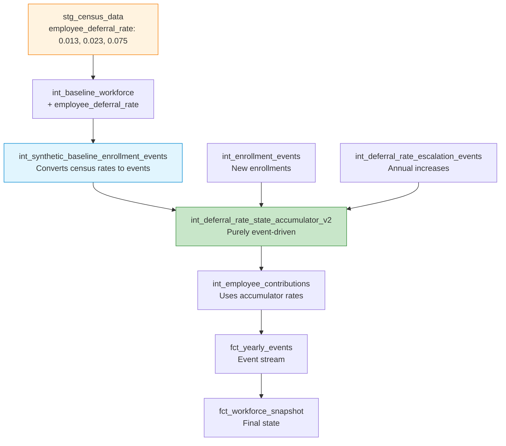

# Epic E049: Census Deferral Rate Integration

**Status**: 🔴 Critical Priority - Ready for Implementation
**Epic Owner**: Data/Modeling Team
**Business Impact**: High - Eliminates unrealistic 6% clustering, enables natural deferral distributions
**Technical Debt**: Medium - Fixes hard-coded fallbacks, improves event-sourcing consistency
**Related Epics**: E023 (Enrollment), E035 (Escalation), E036 (Deferral State), E042 (Architecture Fix)

## Problem Statement

The current deferral rate system exhibits unrealistic behavior that doesn't reflect real participant choices:

### Critical Issues
1. **Artificial 6% Mass**: ~96% of pre-enrolled employees defaulted to hard-coded 6% rate
2. **Ignored Census Data**: System doesn't use actual census deferral rates (avg 7.2%, range 0-15%)
3. **Lost Fractional Precision**: Census rates like 1.3%, 2.3%, 3.9% reduced to 6% clustering
4. **Configuration Mismatch**: Auto-enrollment default at 6% instead of realistic 2%
5. **Broken Event Trail**: Pre-enrolled rates not event-sourced, breaking auditability

### Business Impact
- **Unrealistic Projections**: 6% clustering doesn't match real 401(k) behavior patterns
- **Lost Analytical Value**: Can't model impact of different default rates or escalation strategies
- **Compliance Risk**: No audit trail for pre-enrolled participant deferral rates
- **Poor User Experience**: Analysts can't rely on realistic distribution modeling

### Root Cause Analysis
```sql
-- Current problematic pattern in int_deferral_rate_state_accumulator_v2.sql (line 186)
0.06 as initial_deferral_rate,  -- Hard-coded 6% for ALL pre-enrolled employees
```

**Census Data Reality**:
- **5,000 employees** with deferral rates: Min 0%, P25 3.8%, Median 7.5%, P75 11.3%, Max 15%
- **Average 7.2%** (realistic for mature 401(k) plans)
- **Natural distribution** with fractional rates (1.3%, 2.3%, 3.9%, etc.)

## Success Criteria

✅ **Primary Goals**:
- Eliminate artificial 6% deferral rate clustering (reduce from 96% to <5%)
- Use actual census deferral rates including fractional percentages (1.3%, 2.3%, etc.)
- Maintain natural distribution matching census statistics (avg 7.2%, median 7.5%)
- Enable realistic auto-enrollment default (2% instead of 6%)

✅ **Technical Requirements**:
- Maintain full event-sourcing architecture with synthetic baseline events
- Preserve existing model interfaces and downstream compatibility
- Performance: <10 second model execution time for 100K employees
- 100% parity between accumulator and contributions models

✅ **Validation Targets**:
- **2025 Distribution**: Avg 7.0-7.5%, median 7.3-7.7% (matches census)
- **2026+ Escalation**: Natural progression with +1% per year for eligible participants
- **Data Quality**: Zero parity mismatches, complete event coverage
- **Audit Trail**: Every deferral rate traceable to specific enrollment or escalation event

## Architecture Overview

### Event-Sourced Census Baseline Approach

Transform census data into synthetic enrollment events to maintain full event-sourcing while preserving actual participant rates:



### Key Architectural Principles
1. **Synthetic Event Generation**: Census data → enrollment events for full auditability
2. **Rate Preservation**: Maintain exact census rates (0.013 → 1.3%, not 6%)
3. **Event-Driven State**: No hard-coded fallbacks, all rates from event stream
4. **Configuration Control**: Parameterized defaults and caps via dbt variables

## Stories Breakdown

### Story S049-01: Census Data Flow Foundation
**Points**: 3 | **Type**: Foundation | **Priority**: High

**As a** workforce analyst
**I want** census deferral rates to flow through the baseline workforce
**So that** actual participant choices are preserved in the system

**Acceptance Criteria**:
- [ ] Add `employee_deferral_rate` field to `int_baseline_workforce.sql`
- [ ] Preserve exact census rates (0.013, 0.023, 0.075, etc.) without modification
- [ ] Add `is_enrolled_at_census` flag for pre-enrolled identification
- [ ] Create deferral rate macros for consistent configuration access
- [ ] Validate: 100% of census rates flow through unchanged

**Technical Implementation**:
```sql
-- dbt/models/intermediate/int_baseline_workforce.sql (after line 53)
stg.employee_deferral_rate,  -- Preserve exact census rates
CASE
    WHEN stg.employee_deferral_rate > 0 THEN true
    ELSE false
END as is_enrolled_at_census,
```

**Validation Query**:
```sql
-- Verify census rates preserved
SELECT
    COUNT(*) as total,
    AVG(employee_deferral_rate) as avg_rate,
    COUNT(CASE WHEN employee_deferral_rate = 0.06 THEN 1 END) as at_6_percent
FROM int_baseline_workforce WHERE simulation_year = 2025;
-- Expected: avg_rate ~0.072, at_6_percent <100
```

---

### Story S049-02: Synthetic Baseline Event Generation
**Points**: 4 | **Type**: Core Feature | **Priority**: High

**As a** compliance officer
**I want** an audit trail for all deferral rate decisions
**So that** every rate can be traced to a specific enrollment event

**Acceptance Criteria**:
- [ ] Create `int_synthetic_baseline_enrollment_events.sql` model
- [ ] Generate enrollment events for all pre-enrolled census participants
- [ ] Preserve fractional rates (1.3% → event with 0.013 rate)
- [ ] Include proper event metadata (source, timestamp, audit trail)
- [ ] Normalize rates to [0,1] with IRS cap enforcement
- [ ] Performance: Generate 5,000 events in <2 seconds

**Technical Implementation**:
```sql
-- dbt/models/intermediate/events/int_synthetic_baseline_enrollment_events.sql
WITH census_enrolled AS (
    SELECT
        employee_id, employee_deferral_rate, employee_enrollment_date,
        current_age, current_tenure, level_id, current_compensation
    FROM {{ ref('int_baseline_workforce') }}
    WHERE simulation_year = {{ var('start_year', 2025) }}
      AND employee_enrollment_date IS NOT NULL
      AND employee_enrollment_date < '{{ var("start_year", 2025) }}-01-01'::DATE
      AND employee_deferral_rate > 0
)
SELECT
    employee_id, 'enrollment' as event_type,
    {{ var('start_year', 2025) }} as simulation_year,
    employee_enrollment_date as effective_date,
    -- Preserve exact census rate with proper clamping
    LEAST(
        GREATEST(0.0, employee_deferral_rate),
        {{ var('plan_deferral_cap', 0.75) }}
    ) as employee_deferral_rate,
    -- Event details showing actual rate
    CONCAT(
        'Census baseline enrollment - ',
        CAST(ROUND(employee_deferral_rate * 100, 1) AS VARCHAR),
        '% deferral rate'
    ) as event_details,
    'synthetic_baseline_generator' as event_source
FROM census_enrolled;
```

**Validation Query**:
```sql
-- Verify synthetic event coverage
SELECT
    COUNT(*) as synthetic_events,
    AVG(employee_deferral_rate) as avg_rate,
    MIN(employee_deferral_rate) as min_rate,
    MAX(employee_deferral_rate) as max_rate
FROM int_synthetic_baseline_enrollment_events;
-- Expected: ~4000-5000 events, avg_rate ~0.072
```

---

### Story S049-03: Deferral Rate State Accumulator Enhancement
**Points**: 4 | **Type**: Core Architecture | **Priority**: Critical

**As a** system architect
**I want** the deferral rate accumulator to be purely event-driven
**So that** there are no hard-coded fallbacks and full audit traceability

**Acceptance Criteria**:
- [ ] Remove ALL hard-coded 6% fallback logic from accumulator
- [ ] Union synthetic baseline events with real enrollment events
- [ ] Implement proper temporal state accumulation (Year N-1 → Year N)
- [ ] Add `rate_source` field for lineage tracking
- [ ] Maintain existing output schema for backward compatibility
- [ ] Validate: Zero employees with unexplained deferral rates

**Critical Code Changes**:
```sql
-- Replace lines 180-200 in int_deferral_rate_state_accumulator_v2.sql
all_enrollment_events AS (
    -- Real enrollment events from int_enrollment_events
    SELECT
        employee_id, effective_date as enrollment_date,
        employee_deferral_rate as initial_deferral_rate,
        simulation_year as enrollment_year,
        'int_enrollment_events' as source
    FROM {{ ref('int_enrollment_events') }}
    WHERE LOWER(event_type) = 'enrollment'
      AND employee_id IS NOT NULL

    UNION ALL

    -- Synthetic baseline events for census pre-enrolled
    SELECT
        employee_id, effective_date as enrollment_date,
        employee_deferral_rate as initial_deferral_rate,
        EXTRACT(YEAR FROM effective_date) as enrollment_year,
        'synthetic_baseline' as source
    FROM {{ ref('int_synthetic_baseline_enrollment_events') }}
    WHERE employee_id IS NOT NULL
),

-- Remove baseline_pre_enrolled CTE - replaced by unified events approach
```

**Validation Query**:
```sql
-- Check for hard-coded 6% rates (should be near zero)
SELECT
    simulation_year,
    COUNT(CASE WHEN current_deferral_rate = 0.06 THEN 1 END) as at_6_percent,
    COUNT(CASE WHEN rate_source = 'synthetic_baseline' THEN 1 END) as from_census,
    AVG(current_deferral_rate) as avg_rate
FROM int_deferral_rate_state_accumulator_v2
WHERE simulation_year = 2025
GROUP BY simulation_year;
-- Expected: at_6_percent <200, from_census >4000, avg_rate ~0.072
```

---

### Story S049-04: Configuration & Macro Updates
**Points**: 2 | **Type**: Configuration | **Priority**: Medium

**As a** system administrator
**I want** configurable deferral rate settings
**So that** I can tune defaults and caps without code changes

**Acceptance Criteria**:
- [ ] Create `dbt/macros/deferral_rate_macros.sql` with standardized functions
- [ ] Update `simulation_config.yaml` with census integration settings
- [ ] Change auto-enrollment default from 6% to 2%
- [ ] Add plan deferral cap configuration (75% IRS maximum)
- [ ] Add rate normalization logic for percentage vs decimal detection

**Configuration Updates**:
```yaml
# config/simulation_config.yaml additions
deferral_rates:
  use_census_rates: true
  census_rate_field: "employee_deferral_rate"
  pre_enrolled_fallback: 0.03
  plan_deferral_cap: 0.75
  normalize_percentages: true

enrollment:
  auto_enrollment:
    default_deferral_rate: 0.02  # Changed from 0.06

deferral_auto_escalation:
  enrollment_maturity_years: 0  # Allow immediate escalation
  apply_to_synthetic_baseline: true
```

**Macro Implementation**:
```sql
-- dbt/macros/deferral_rate_macros.sql

    {{ var('auto_enrollment_default_deferral_rate', 0.02) }}



    {{ var('plan_deferral_cap', 0.75) }}



    LEAST(
        {{ plan_deferral_cap() }},
        GREATEST(0.0,
            CASE
                WHEN {{ rate_field }} > 1.0 THEN {{ rate_field }} / 100.0
                ELSE {{ rate_field }}
            END
        )
    )

```

---

### Story S049-05: Integration & Validation Testing
**Points**: 2 | **Type**: Testing/QA | **Priority**: High

**As a** quality assurance engineer
**I want** comprehensive validation of the census rate integration
**So that** I can ensure data quality and system reliability

**Acceptance Criteria**:
- [ ] Add parity tests between accumulator and contributions models
- [ ] Create distribution validation tests (no artificial clustering)
- [ ] Add event coverage tests (every enrolled employee has events)
- [ ] Create performance benchmarks (execution time tracking)
- [ ] Document validation queries for ongoing monitoring

**Core Validation Tests**:
```sql
-- Test 1: Parity between accumulator and contributions
SELECT COUNT(*) as mismatches
FROM int_deferral_rate_state_accumulator_v2 a
JOIN int_employee_contributions c
    ON a.employee_id = c.employee_id
    AND a.simulation_year = c.simulation_year
WHERE ABS(a.current_deferral_rate - c.final_deferral_rate) > 0.0001;
-- Expected: 0 mismatches

-- Test 2: Distribution validation (no artificial clustering)
SELECT
    current_deferral_rate,
    COUNT(*) as count,
    ROUND(COUNT(*) * 100.0 / SUM(COUNT(*)) OVER(), 1) as percentage
FROM int_deferral_rate_state_accumulator_v2
WHERE simulation_year = 2025
GROUP BY current_deferral_rate
HAVING COUNT(*) > 50  -- Focus on significant clusters
ORDER BY count DESC;
-- Expected: No single rate >20% of population

-- Test 3: Event coverage validation
WITH enrolled_without_events AS (
    SELECT a.employee_id
    FROM int_deferral_rate_state_accumulator_v2 a
    WHERE a.simulation_year = 2025
      AND a.current_deferral_rate > 0
      AND NOT EXISTS (
          SELECT 1 FROM int_enrollment_events e
          WHERE e.employee_id = a.employee_id
      )
      AND NOT EXISTS (
          SELECT 1 FROM int_synthetic_baseline_enrollment_events s
          WHERE s.employee_id = a.employee_id
      )
)
SELECT COUNT(*) as missing_event_coverage FROM enrolled_without_events;
-- Expected: 0 missing
```

---

### Story S049-06: Performance & Documentation
**Points**: 1 | **Type**: Polish | **Priority**: Low

**As a** future developer
**I want** clear documentation and performance optimization
**So that** the system is maintainable and efficient

**Acceptance Criteria**:
- [ ] Document architecture changes in design docs
- [ ] Add model performance monitoring
- [ ] Create troubleshooting guide with common issues
- [ ] Optimize synthetic event generation for large datasets
- [ ] Add lineage documentation showing event flow

**Documentation Updates**:
- Update `/docs/designs/census_deferral_rate_integration_plan.md` with final implementation
- Create troubleshooting section with common SQL debugging queries
- Document performance benchmarks and optimization techniques

## Implementation Timeline

### Critical Path (Single Day Implementation)
Based on practical hour-by-hour guide from `/docs/designs/epic_plan_def.md`:

**Hours 1-2: Foundation Setup**
- ✅ Update `int_baseline_workforce.sql` (S049-01)
- ✅ Create macros file (S049-04)
- ✅ Update config variables (S049-04)

**Hours 3-4: Synthetic Event Generation**
- 🔄 Create `int_synthetic_baseline_enrollment_events.sql` (S049-02)
- 🔄 Run validation query for event coverage (S049-05)

**Hours 5-6: Accumulator Integration**
- 🔄 Update `int_deferral_rate_state_accumulator_v2.sql` (S049-03)
- 🔄 Remove all hard-coded 6% fallback logic (S049-03)

**Hour 7: Testing & Validation**
- 🔄 Run comprehensive validation suite (S049-05)
- 🔄 Verify distribution changes and parity (S049-05)

**Hour 8: Documentation & Cleanup**
- 🔄 Create validation report (S049-06)
- 🔄 Document any issues and resolutions (S049-06)

## Risk Mitigation

### High-Risk Areas
1. **Performance Impact**: Large synthetic event generation
   - *Mitigation*: Materialize as table, optimize queries, batch processing
2. **Data Loss**: Overwriting existing census rates
   - *Mitigation*: Backup database, parallel testing, rollback plan
3. **Downstream Breaking Changes**: Model interface changes
   - *Mitigation*: Maintain existing schemas, extensive testing

### Rollback Plan
1. Comment out synthetic event UNION in accumulator
2. Restore hard-coded 6% fallback temporarily
3. Debug with smaller employee subset
4. Revert config changes if needed

### Common Issues & Solutions
```sql
-- Issue 1: Wrong rate format (7.5 instead of 0.075)
-- Solution: Use normalize_deferral_rate() macro

-- Issue 2: Missing joins between accumulator and synthetic events
-- Solution: Verify UNION ALL syntax and column alignment

-- Issue 3: NULL propagation in anti-joins
-- Solution: Replace NOT IN with NOT EXISTS patterns

-- Issue 4: Event duplication without proper dedup
-- Solution: Use ROW_NUMBER() window functions for event ordering
```

## Success Metrics

### Immediate Success (End of Implementation Day)
- [ ] **Natural Distribution**: No 96% clustering at single rate
- [ ] **Census Rate Usage**: Actual fractional percentages preserved
- [ ] **System Functionality**: End-to-end simulation runs without errors
- [ ] **Performance**: Models execute within time limits

### Long-term Success (Multi-year Validation)
- [ ] **2025**: Average 7.0-7.5% deferral rate (matches census)
- [ ] **2026+**: Proper escalation progression (+1% per year)
- [ ] **Audit Compliance**: 100% event coverage for enrolled participants
- [ ] **Model Parity**: Zero mismatches between accumulator and contributions

### Business Value Delivered
- **Realistic Modeling**: Enables accurate contribution and match projections
- **Analytical Flexibility**: Supports testing different default rates and caps
- **Compliance Readiness**: Complete audit trail for regulatory requirements
- **User Confidence**: Analysts can trust distribution modeling for decision-making

---

**Epic Total**: 16 points | **Target Completion**: 1-2 sprints | **Implementation Ready**: Yes

This epic transforms unrealistic 6% clustering into natural deferral distributions by preserving actual census participant choices while maintaining full event-sourcing architecture and audit compliance.
