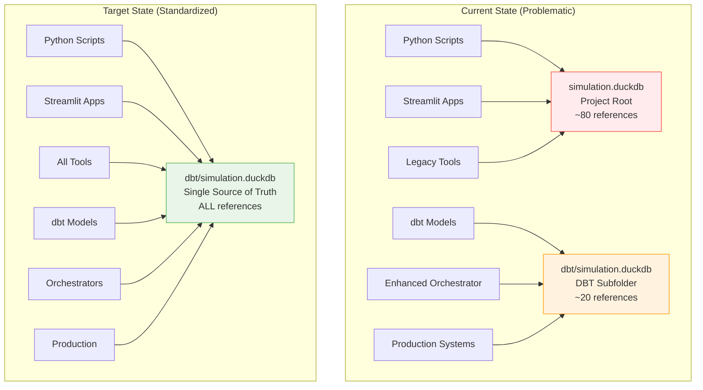

# Epic E050: Database Location Standardization

**Status**: 📋 Planning - Database Path Consolidation Initiative
**Epic Owner**: Infrastructure/DevOps Team
**Business Impact**: High - Prevents data corruption, improves developer experience
**Technical Debt**: High - Fixes critical infrastructure inconsistency
**Related Issues**: [GitHub Issue #11](https://github.com/crzyc98/planwise_navigator/issues/11)

## Problem Statement

The PlanWise Navigator codebase currently has inconsistent references to the simulation database location, creating a critical infrastructure issue that threatens data integrity and developer productivity:

### Critical Issues
1. **Dual Database Locations**: ~80 files reference `simulation.duckdb` (project root) vs ~20 files reference `dbt/simulation.duckdb` (dbt subfolder)
2. **Data Corruption Risk**: Different system components may write to different database files, leading to inconsistent state
3. **Developer Confusion**: New team members struggle to understand which database location to use
4. **CI/CD Inconsistencies**: Build pipelines may reference wrong database location depending on execution context
5. **Documentation Misalignment**: Mixed guidance across documentation and code examples

### Business Impact
- **Data Integrity Risk**: Critical simulation data could be scattered across multiple database files
- **Development Inefficiency**: Time wasted debugging database location issues and inconsistent results
- **Production Reliability**: Risk of production deployments failing due to missing database references
- **Team Onboarding Friction**: New developers face unnecessary complexity understanding the system

### Root Cause Analysis
```bash
# Current problematic patterns across codebase:

# Pattern 1: Root location (legacy, most common)
conn = duckdb.connect("simulation.duckdb")  # ~80+ files

# Pattern 2: DBT subfolder (newer, production-aligned)
conn = duckdb.connect("dbt/simulation.duckdb")  # ~20+ files

# Pattern 3: Mixed absolute paths
db_path = "/Users/.../planwise_navigator/simulation.duckdb"  # Hardcoded paths
```

**Configuration Reality**:
- **dbt profiles.yml**: Uses `dbt/simulation.duckdb` (production standard)
- **Enhanced orchestrator**: Uses `dbt/simulation.duckdb` (future direction)
- **Legacy scripts**: Mostly use root `simulation.duckdb` (needs migration)
- **Documentation**: Mixed guidance causing confusion

## Success Criteria

🎯 **Primary Goals**:
- Standardize ALL references to use `dbt/simulation.duckdb` consistently
- Eliminate risk of writing to wrong database location
- Improve developer experience with clear, consistent database path
- Enable reliable CI/CD pipeline execution

✅ **Technical Requirements**:
- Zero files referencing root `simulation.duckdb` location
- All Python scripts, utilities, and dashboards use standardized path
- Migration script handles edge cases (missing directories, file locks, permissions)
- Backward compatibility during transition period
- Performance: Migration completes in <30 seconds for typical database sizes

✅ **Validation Targets**:
- **Code Scan**: 100% of database references point to `dbt/simulation.duckdb`
- **Functional Testing**: All workflows (simulation, dashboard, scripts) work correctly
- **Migration Safety**: Zero data loss during path standardization
- **Documentation Alignment**: All examples and guides use consistent path

## Architecture Overview

### Standardization Approach

Consolidate on `dbt/simulation.duckdb` as the single source of truth:



### Key Architectural Principles
1. **Single Database Location**: `dbt/simulation.duckdb` as the exclusive database path
2. **Configuration-Driven**: Centralized database path configuration with environment variable support
3. **Migration Safety**: Automated migration with data validation and rollback capability
4. **Documentation Alignment**: All examples, guides, and comments use consistent path
5. **dbt Profile Alignment**: The DuckDB adapter must read the same path via env var to avoid split state during dbt runs

### dbt Profile Integration (Required)
To ensure dbt and Python use the same database, set the DuckDB profile to use a single env var.

Add to `dbt/profiles.yml` (or ensure equivalent in your active profile):

```yaml
duckdb:  # example target/profile
  target: optimized
  outputs:
    optimized:
      type: duckdb
      threads: 4
      path: "{{ env_var('DATABASE_PATH', 'dbt/simulation.duckdb') }}"
```

This aligns with `navigator_orchestrator.config.get_database_path()` and prevents dbt from silently creating/using a different file.

## Stories Breakdown

### Story S050-01: Database Path Configuration Centralization
**Points**: 3 | **Type**: Foundation | **Priority**: Critical

**As a** system administrator
**I want** centralized database path configuration
**So that** I can manage the database location from a single source

**Acceptance Criteria**:
- [ ] Create `DATABASE_PATH` environment variable with default `dbt/simulation.duckdb`
- [ ] Update `navigator_orchestrator/config.py` to use centralized path configuration
- [ ] Add database path validation on startup (directory exists, permissions correct)
- [ ] Create `get_database_path()` utility function for consistent path resolution
- [ ] Document configuration options for different deployment environments
- [ ] Ensure `dbt/profiles.yml` references `{{ env_var('DATABASE_PATH') }}`

**Technical Implementation**:
```python
# navigator_orchestrator/config.py
import os
from pathlib import Path

def get_database_path() -> Path:
    """Get standardized database path with environment variable support."""
    db_path = os.getenv('DATABASE_PATH', 'dbt/simulation.duckdb')
    path = Path(db_path)

    # Ensure directory exists
    path.parent.mkdir(parents=True, exist_ok=True)

    return path.resolve()

class OrchestrationConfig:
    db_path: str = str(get_database_path())
```

Also set `DATABASE_PATH` for local runs and CI:

```bash
export DATABASE_PATH="dbt/simulation.duckdb"
```

---

### Story S050-02: Migration Utility Development
**Points**: 4 | **Type**: Core Infrastructure | **Priority**: High

**As a** developer
**I want** a safe migration tool
**So that** I can move existing databases without data loss

**Acceptance Criteria**:
- [ ] Create `scripts/migrate_database_location.py` utility
- [ ] Detect existing database location (root vs dbt subfolder)
- [ ] Safely copy database with integrity validation
- [ ] Handle edge cases (missing directories, file locks, permissions)
- [ ] Provide rollback capability if migration fails
- [ ] Generate migration report with validation results
- [ ] Optionally create a compatibility symlink `simulation.duckdb -> dbt/simulation.duckdb` during deprecation window

**Technical Implementation**:
```python
# scripts/migrate_database_location.py
import shutil, duckdb, hashlib
from pathlib import Path

class DatabaseMigrator:
    def __init__(self):
        self.root_path = Path("simulation.duckdb")
        self.target_path = Path("dbt/simulation.duckdb")

    def migrate_database(self) -> bool:
        """Safely migrate database to standardized location."""
        if not self.root_path.exists():
            print("✅ No migration needed - using dbt location")
            return True

        # Create backup before migration
        backup_path = self.create_backup()

        try:
            # Copy database to target location
            self.target_path.parent.mkdir(exist_ok=True)
            shutil.copy2(self.root_path, self.target_path)

            # Validate migration
            if self.validate_migration():
                print("✅ Database migrated successfully")
                return True
            else:
                self.rollback(backup_path)
                return False

        except Exception as e:
            print(f"❌ Migration failed: {e}")
            self.rollback(backup_path)
            return False

    def validate_migration(self) -> bool:
        """Validate migrated database integrity."""
        try:
            with duckdb.connect(str(self.target_path)) as conn:
                # Check critical tables exist
                tables = conn.execute("SHOW TABLES").fetchall()
                required_tables = {'fct_yearly_events', 'fct_workforce_snapshot'}
                existing_tables = {t[0] for t in tables}

                # Basic structure check
                if not required_tables.issubset(existing_tables):
                    return False

                # Optional: compare file sizes as a coarse integrity signal
                src = self.root_path
                dst = self.target_path
                if src.exists() and dst.exists():
                    size_ok = src.stat().st_size <= dst.stat().st_size
                else:
                    size_ok = True
                return size_ok
        except Exception:
            return False
```

---

### Story S050-03: Python Scripts and Utilities Update
**Points**: 5 | **Type**: Implementation | **Priority**: High

**As a** developer
**I want** all Python scripts to use the standardized database path
**So that** there's no confusion about which database to access

**Acceptance Criteria**:
- [ ] Update all files in `/scripts/` directory (~30 files)
- [ ] Update Streamlit dashboard components (~10 files)
- [ ] Update validation and debugging scripts (~15 files)
- [ ] Update orchestrator components that use legacy paths
- [ ] Add import statement for centralized database path function
- [ ] Test each updated script to ensure functionality

**Files Requiring Updates**:
```bash
# High priority scripts (core functionality)
scripts/validate_*.py                    # Validation utilities
streamlit_dashboard/pages/*.py           # Dashboard components
workforce_validation.py                  # Core validation
run_multi_year_observability.py         # Monitoring

# Medium priority scripts (utilities)
scripts/calibrate_compensation.py       # Analysis tools
scripts/debug_*.py                       # Debugging utilities
check_*.py                              # Quick check scripts
```

**Implementation Pattern**:
```python
# Before (problematic)
conn = duckdb.connect("simulation.duckdb")

# After (standardized)
from navigator_orchestrator.config import get_database_path
conn = duckdb.connect(str(get_database_path()))
```

Add an automated scan to prevent regressions:

```python
# tests/test_no_legacy_db_paths.py
import glob, re

def test_no_legacy_db_paths():
    offenders = []
    for p in glob.glob('**/*.py', recursive=True):
        txt = open(p, 'r', encoding='utf-8', errors='ignore').read()
        if re.search(r"duckdb\.connect\(\s*['\"]simulation\.duckdb['\"]\s*\)", txt):
            offenders.append(p)
    assert not offenders, f"Legacy DB paths detected: {offenders}"
```

---

### Story S050-04: Documentation and Examples Update
**Points**: 2 | **Type**: Documentation | **Priority**: Medium

**As a** new developer
**I want** consistent documentation and examples
**So that** I understand the correct database path to use

**Acceptance Criteria**:
- [ ] Update `CLAUDE.md` with standardized path in all examples
- [ ] Update `README.md` and project documentation
- [ ] Fix all code examples in `/docs/` directory
- [ ] Update CLI help text and error messages
- [ ] Update GitHub workflow examples and comments
- [ ] Create troubleshooting guide for database path issues

**Documentation Updates**:
```markdown
# CLAUDE.md - Updated examples
```bash
# Database queries (standardized)
duckdb dbt/simulation.duckdb "SELECT COUNT(*) FROM fct_yearly_events"

# Python database access (standardized)
python -c "
from navigator_orchestrator.config import get_database_path
import duckdb
conn = duckdb.connect(str(get_database_path()))
result = conn.execute('SHOW TABLES').fetchall()
"
```

---

### Story S050-05: CI/CD and Production Updates
**Points**: 2 | **Type**: Infrastructure | **Priority**: Medium

**As a** DevOps engineer
**I want** consistent database paths in all deployment pipelines
**So that** production systems work reliably

**Acceptance Criteria**:
- [ ] Update GitHub Actions workflows (`.github/workflows/*.yml`)
- [ ] Update production deployment scripts and configurations
- [ ] Update Docker configurations if applicable
- [ ] Test CI/CD pipeline with standardized paths
- [ ] Update production troubleshooting runbooks
- [ ] Export `DATABASE_PATH` in CI env and print effective value before dbt/python steps

**Configuration Updates**:
```yaml
# .github/workflows/*.yml updates
- name: Run Database Validation
  run: |
    # Use standardized path
    python -c "
    from navigator_orchestrator.config import get_database_path
    print(f'Database path: {get_database_path()}')
    "
```

---

### Story S050-06: Testing and Validation Framework
**Points**: 3 | **Type**: Quality Assurance | **Priority**: High

**As a** quality assurance engineer
**I want** comprehensive testing of the database standardization
**So that** no functionality is broken by the migration

**Acceptance Criteria**:
- [ ] Create automated test suite for database path validation
- [ ] Test all major workflows (simulation, dashboard, validation scripts)
- [ ] Performance testing of migrated database access
- [ ] Create regression test suite to prevent future path inconsistencies
- [ ] Document test procedures for ongoing validation

**Test Implementation**:
```python
# tests/test_database_standardization.py
def test_all_scripts_use_standard_path():
    """Ensure no scripts use old database path."""
    import glob, re

    issues = []
    for file_path in glob.glob("**/*.py", recursive=True):
        with open(file_path, 'r') as f:
            content = f.read()

        # Check for old patterns
        if re.search(r'simulation\.duckdb[^/]', content):
            issues.append(f"File {file_path} uses old database path")

    assert len(issues) == 0, f"Found path issues: {issues}"

def test_database_functionality():
    """Test that database operations work with new path."""
    from navigator_orchestrator.config import get_database_path
    import duckdb

    conn = duckdb.connect(str(get_database_path()))
    tables = conn.execute("SHOW TABLES").fetchall()

    # Verify critical tables accessible
    table_names = [t[0] for t in tables]
    assert 'fct_yearly_events' in table_names
    assert 'fct_workforce_snapshot' in table_names
```

### Backward Compatibility & Deprecation Plan
- Phase 0 (optional): Create a symlink `simulation.duckdb -> dbt/simulation.duckdb` for local/dev to avoid surprises while code migrates.
- Phase 1: Communicate the deprecation of root path and add the CI scan to block new regressions.
- Phase 2: Remove symlink and delete any legacy files left at root after two release cycles.

### Additional Risks & Notes
- IDE/Notebook locks can prevent file moves; advise closing DuckDB connections before migration.
- Windows environments may not support symlinks without elevated privileges; prefer code migration over symlink reliance on Windows.
- Absolute paths in user-specific scripts can bypass the standard; the CI scan helps block these from entering the repo.

## Implementation Timeline

### Phase 1: Foundation (Days 1-2)
- **S050-01**: Database path configuration centralization
- **S050-02**: Migration utility development and testing
- Create backup of current system state

### Phase 2: Core Migration (Days 3-4)
- **S050-03**: Update Python scripts and utilities (high priority files first)
- Run migration utility on development environment
- Validate core functionality works

### Phase 3: Complete Migration (Days 5-6)
- **S050-03**: Complete remaining Python file updates
- **S050-04**: Documentation and examples update
- **S050-05**: CI/CD and production configuration updates

### Phase 4: Testing & Validation (Days 7-8)
- **S050-06**: Comprehensive testing and validation
- Production deployment preparation
- Final documentation and handover

## Risk Mitigation

### High-Risk Areas
1. **Data Loss During Migration**: Existing simulation data could be corrupted
   - *Mitigation*: Comprehensive backup strategy, copy-then-validate approach
2. **Production System Downtime**: Changes could break production workflows
   - *Mitigation*: Staged rollout, extensive testing, rollback procedures
3. **Developer Workflow Disruption**: Team members using old patterns
   - *Mitigation*: Clear communication, migration guide, pair programming sessions

### Rollback Plan
1. **Immediate Rollback**: Revert configuration changes, restore original files
2. **Database Restoration**: Copy backup database back to original locations
3. **Code Rollback**: Git revert commits, restore previous file versions
4. **Communication Plan**: Alert team to rollback, provide workaround instructions

### Common Issues & Solutions
```bash
# Issue 1: Permission denied accessing dbt/ directory
# Solution: Check directory permissions, create if needed
mkdir -p dbt && chmod 755 dbt

# Issue 2: Database locked during migration
# Solution: Close all IDE connections, use migration utility retry logic

# Issue 3: Hardcoded absolute paths in configuration
# Solution: Replace with relative paths and environment variables

# Issue 4: Missing database file in new location
# Solution: Run migration utility, validate with database existence check
```

## Success Metrics

### Immediate Success (End of Implementation)
- [ ] **Code Consistency**: Zero references to old `simulation.duckdb` root location
- [ ] **Migration Safety**: All existing data preserved and validated
- [ ] **Functional Validation**: All workflows (simulation, dashboard, scripts) operational
- [ ] **Documentation Alignment**: All guides and examples use consistent path

### Long-term Success (Post-Deployment)
- [ ] **Developer Experience**: Reduced onboarding time, fewer path-related issues
- [ ] **Production Stability**: No database-related deployment failures
- [ ] **Team Productivity**: Eliminated time spent debugging database location issues
- [ ] **System Maintainability**: Clear, consistent infrastructure patterns

### Business Value Delivered
- **Risk Elimination**: No more data corruption from split database usage
- **Developer Productivity**: Faster development cycles with clear infrastructure
- **Production Reliability**: Consistent deployment behavior across environments
- **Technical Debt Reduction**: Clean, maintainable codebase foundation

---

**Epic Total**: 19 points | **Status**: 📋 PLANNING

## Next Steps

1. **Immediate Actions**:
   - Assign epic owner and story points to team members
   - Schedule kickoff meeting to review implementation plan
   - Set up development environment for testing migration utility

2. **Pre-Implementation Checklist**:
   - [ ] Full database backup of current state
   - [ ] Development environment setup for testing
   - [ ] Team communication about upcoming changes
   - [ ] Validation test suite preparation

3. **Implementation Approach**:
   - Start with migration utility development and testing
   - Gradual rollout starting with non-critical scripts
   - Extensive validation at each phase before proceeding
   - Clear communication and documentation throughout

This epic will eliminate a critical infrastructure inconsistency that poses significant risk to data integrity and developer productivity. By standardizing on `dbt/simulation.duckdb`, we align with production patterns and create a more maintainable, reliable system.
