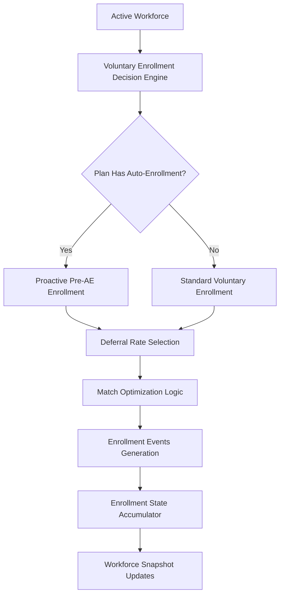

# Epic E053: Realistic Voluntary Enrollment Behavior

**Status**: In Progress
**Priority**: High
**Estimated Effort**: 1 hour (MVP)
**Sprint**: Current

## Problem Statement

The current enrollment engine primarily focuses on auto-enrollment behavior but lacks realistic voluntary enrollment patterns that reflect real-world 401(k) participation behavior. This impacts the accuracy of workforce simulation modeling for plans without auto-enrollment and doesn't capture the nuanced behavior of employees who proactively enroll before auto-enrollment deadlines.

## Business Value

- **Accurate modeling** of voluntary enrollment rates (~60% for non-auto plans)
- **Realistic deferral rate distributions** (1%-10%) based on demographics
- **Match optimization behavior** where employees tend toward match-maximizing rates
- **Proactive enrollment** before auto-enrollment windows close
- **Year-over-year enrollment** for previously non-participating employees

## Epic Scope

### Core Requirements

1. **Voluntary Enrollment Distribution Engine**
   - Age and job level influence enrollment decisions
   - Older employees and higher earners have higher participation rates
   - Deferral rates range between 1%-10% with demographic influences
   - Match maximization behavior drives rate selection

2. **Plan Type Behavior**
   - **No Auto-Enrollment Plans**: ~60% voluntary enrollment rate
   - **Auto-Enrollment Plans**: Some employees proactively enroll before auto-enrollment
   - Differentiated behavior between voluntary vs auto-enrolled populations

3. **Multi-Year Continuity**
   - Non-participating employees can voluntarily enroll in subsequent years
   - Single-digit percentage annual conversion rate
   - Maintain enrollment state across simulation years

### Technical Architecture

## Success Criteria

### Functional Requirements
- [ ] Voluntary enrollment events generated with appropriate deferral rates
- [ ] Age/job level demographics influence enrollment probability
- [ ] Match maximization behavior implemented
- [ ] Proactive enrollment before auto-enrollment deadlines
- [ ] Year-over-year voluntary enrollment for non-participants

### Data Quality Requirements
- [ ] No duplicate enrollment events per employee per year
- [ ] Enrollment rates align with demographic expectations
- [ ] Deferral rates fall within 1%-10% range with realistic distribution
- [ ] Match optimization clustering around match thresholds

### Performance Requirements
- [ ] Single year processing: <5 seconds
- [ ] Multi-year simulation: <30 seconds total
- [ ] Memory efficient for 100K+ employee datasets

## Story Breakdown

### Story S053-01: Voluntary Enrollment Distribution Engine
**Effort**: 20 minutes
**Priority**: High

Create the core engine for voluntary enrollment decisions based on demographics.

**Acceptance Criteria**:
- Enrollment probability matrix by age/job level
- Deferral rate selection with demographic influences
- Match optimization logic

### Story S053-02: Proactive Pre-Auto Enrollment Path
**Effort**: 20 minutes
**Priority**: High

Implement proactive enrollment before auto-enrollment deadlines.

**Acceptance Criteria**:
- Pre-auto enrollment window (7-35 days after hire)
- Voluntary events before auto-enrollment
- Registry prevents duplicate enrollments

### Story S053-03: Year-Over-Year Voluntary Enrollment
**Effort**: 20 minutes
**Priority**: Medium

Enable non-participants to voluntarily enroll in subsequent years.

**Acceptance Criteria**:
- Identify non-participating active employees
- Single-digit percentage voluntary enrollment
- Track enrollment source for analytics

## Implementation Strategy

### Phase 1: MVP (Current Sprint - 1 hour)
- Core voluntary enrollment engine
- Basic demographic influences
- Proactive pre-auto enrollment
- Single year validation

### Phase 2: Enhancement (Future)
- Advanced match optimization strategies
- Plan-specific enrollment behavior
- Sophisticated demographic modeling
- Multi-plan scenario support

## Technical Dependencies

### Existing Models (No Changes Required)
- `int_employee_compensation_by_year` - Employee demographics
- `int_enrollment_state_accumulator` - Enrollment tracking
- `fct_yearly_events` - Event storage

### New Models (To Be Created)
- `int_voluntary_enrollment_decision` - Core decision engine
- Enhanced `int_enrollment_events` - Voluntary logic integration

### Configuration Updates
- `simulation_config.yaml` - Voluntary enrollment parameters
- Match formula configuration for optimization logic

## Risk Mitigation

### Technical Risks
- **Circular Dependencies**: Use enrollment state accumulator pattern
- **Performance**: Leverage DuckDB columnar processing
- **Duplicate Events**: Registry-based deduplication

### Business Risks
- **Over-enrollment**: Conservative probability rates initially
- **Unrealistic Rates**: Validation against industry benchmarks
- **Complex Logic**: Start with simple demographics, iterate

## Validation Approach

### Unit Testing
- Enrollment probability calculations
- Deferral rate selection logic
- Match optimization algorithms

### Integration Testing
- Single year simulation with validation queries
- Multi-year state accumulation
- Event deduplication verification

### Business Validation
- Enrollment rate distribution analysis
- Demographic participation patterns
- Match optimization clustering validation

## Acceptance Criteria

### Epic Complete When:
- [ ] All 3 stories implemented and tested
- [ ] Single year simulation produces expected voluntary enrollment
- [ ] Multi-year simulation maintains enrollment continuity
- [ ] No performance regressions
- [ ] Documentation updated
- [ ] Code reviewed and merged

## Future Enhancements

- **Advanced Demographics**: Income quintiles, education levels
- **Plan Design Impact**: Match formulas, vesting schedules
- **Behavioral Economics**: Nudges, defaults, communication effects
- **External Factors**: Market conditions, regulatory changes

---

**Last Updated**: 2025-08-21
**Next Review**: End of current sprint
**Owner**: Development Team
