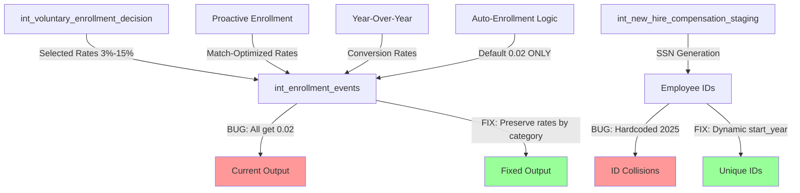

# Epic E054: Multi-Year Voluntary Enrollment and Deferral Rate Fix

**Status**: In Progress
**Priority**: High
**Estimated Effort**: 2 hours
**Sprint**: Current

## Problem Statement

The voluntary enrollment behavior (E053) and deferral rate fixes are only functioning correctly for simulation year 2025. In subsequent years (2026-2029), all employees are showing a default deferral rate of 0.02 (2%) instead of the realistic voluntary enrollment patterns and varied deferral rates that were implemented for 2025.

### Symptoms Observed
- Year 2025: Proper voluntary enrollment with varied deferral rates (1%-10% range)
- Years 2026-2029: All employees defaulting to 0.02 deferral rate
- Missing voluntary enrollment behavior in subsequent years
- Deferral rates not properly carrying forward or escalating

## Root Cause Analysis

After thorough investigation, three critical issues have been identified:

### 1. **Critical Logic Bug in int_enrollment_events.sql (Lines 217-219)**

The auto-enrollment default deferral rate (0.02) is being incorrectly applied to ALL enrollment events whenever auto-enrollment is enabled, regardless of whether the specific enrollment is actually an auto-enrollment or a voluntary/proactive enrollment:

```sql
-- CURRENT BUG:
CASE
  WHEN '{{ var("auto_enrollment_scope", "all_eligible_employees") }}' IN ('new_hires_only', 'all_eligible_employees')
    THEN {{ var('auto_enrollment_default_deferral_rate', 0.06) }}  -- Applied to ALL enrollments!
  ELSE
    -- Demographic-based rates that never get used when auto-enrollment is enabled
```

This overrides:
- Voluntary enrollment decisions (3%-15% based on demographics)
- Proactive enrollment rates (match-optimized)
- Year-over-year conversion rates
- Any non-auto-enrollment event

### 2. **Hardcoded Year Reference in int_new_hire_compensation_staging.sql (Line 102)**

SSN generation for new hires uses a hardcoded 2025 reference that breaks in subsequent years:

```sql
-- CURRENT BUG:
'SSN-' || LPAD(CAST(900000000 + ({{ simulation_year }} - 2025) * 100000 + hs.hire_sequence_num AS VARCHAR), 9, '0')
```

This causes SSN collision issues and incorrect employee ID generation after 2025.

### 3. **Inconsistent Default Year Values Across Models**

Multiple models use `var('simulation_year', 2025)` and `var('start_year', 2025)` defaults, creating potential inconsistencies when the actual start year differs from 2025.

## Business Impact

- **Inaccurate Projections**: Multi-year workforce simulations produce unrealistic uniform 2% deferral rates
- **Model Credibility**: Stakeholders lose confidence in simulation accuracy beyond year 1
- **Planning Risk**: Strategic workforce planning decisions based on flawed multi-year data
- **Compliance Risk**: Incorrect contribution projections affect plan funding requirements

## Epic Scope

### Core Requirements

1. **Fix Deferral Rate Assignment Logic**
   - Apply auto-enrollment default rate ONLY to actual auto-enrollment events
   - Preserve voluntary, proactive, and year-over-year enrollment rates
   - Calculate event_category first or replicate CASE predicates to ensure proper guarding condition
   - Ensure proper rate selection based on event_category

2. **Configuration Alignment Decision**
   - **Decision**: Set `auto_enrollment.default_deferral_rate` to consistent value (0.02 or 0.06) across config, comments, and macros
   - **Acceptance**: Default rate is consistent across config, macros, and documentation
   - Update all references to use the decided value consistently

3. **Fix Hardcoded Year References**
   - Replace all hardcoded 2025 references with dynamic start_year variable
   - Ensure SSN/ID generation works for arbitrary start years
   - Update default values to use consistent year variables

4. **Validate State Management**
   - Ensure deferral rate state accumulation works across all years
   - Verify enrollment registry properly tracks multi-year transitions
   - Confirm voluntary enrollment triggers correctly in all years

5. **Configuration Consistency**
   - Ensure "low" vs "low_income" multiplier naming is consistent across voluntary and year-over-year configs/vars
   - Standardize demographic segment naming conventions

6. **Comprehensive Testing**
   - Test deferral rate distributions for years 2025-2029
   - Verify no employees stuck at 0.02 unless auto-enrolled
   - Validate state continuity across year boundaries

## Technical Architecture



### Orchestrator Variable Passing

Per simulation year, the orchestrator must pass these dbt vars consistently:
- `simulation_year` and `start_year`
- `plan_year_start_date` and `plan_year_end_date`
- `auto_enrollment_hire_date_cutoff` and `auto_enrollment_scope`
- `auto_enrollment_default_deferral_rate` (ensure consistency with config)
- Enrollment probability/deferral vars (when customized)

This prevents SQL from relying on stale defaults and eliminates hidden year anchors.

## Success Criteria

### Functional Requirements
- [x] Root cause identified: auto-enrollment default rate override bug
- [ ] Voluntary enrollment rates (3%-15%) preserved in all years
- [ ] Deferral rates show realistic distributions in years 2026-2029
- [ ] No hardcoded year dependencies in SQL models
- [ ] State accumulation properly carries forward enrollment and deferral data

### Data Quality Requirements
- [ ] <30% of employees at exactly 0.02 in years 2026-2029 (only true auto-enrollments)
- [ ] Average deferral rate 5-7% across all years (not 2%)
- [ ] Voluntary enrollments show demographic-based distribution
- [ ] Employee ID generation works correctly for all start years

### Data Quality Gates
- [ ] **PK Uniqueness**: Primary key uniqueness on `int_enrollment_events` (employee_id, simulation_year) and `int_deferral_rate_state_accumulator_v2` (employee_id, simulation_year)
- [ ] **Plausible Mix**: Auto-enrollment vs voluntary proportions by year - alert if >90% auto-enrollment across multiple years unless scope configuration requires it
- [ ] **Naming Consistency**: "low" vs "low_income" multipliers are consistent across voluntary and year-over-year configs/vars

### Performance Requirements
- [ ] No performance regression in multi-year simulations
- [ ] Memory usage stays within acceptable bounds
- [ ] Simulation completes within standard timeframes

## Implementation Plan

### Phase 1: Critical Bug Fixes (45 minutes)

#### Fix 1: int_enrollment_events.sql (Lines 217-251)
```sql
-- FIXED LOGIC:
-- Calculate event_category first or replicate CASE predicates to ensure proper guarding
-- Only apply auto-enrollment default rate to actual auto-enrollment events
CASE
  WHEN efo.event_category = 'auto_enrollment'
    AND '{{ var("auto_enrollment_scope", "all_eligible_employees") }}' IN ('new_hires_only', 'all_eligible_employees')
    THEN {{ var('auto_enrollment_default_deferral_rate', 0.02) }}
  ELSE
    -- Preserve demographic-based rates for voluntary/proactive enrollments
    CASE efo.age_segment
      WHEN 'young' THEN
        CASE efo.income_segment
          WHEN 'low_income' THEN 0.03
          WHEN 'moderate' THEN 0.03
          WHEN 'high' THEN 0.04
          ELSE 0.06
        END
      -- ... (rest of demographic logic)
    END
END as employee_deferral_rate
```

**Note**: Ensure event_category is calculated consistently across all CTEs or replicate the same CASE predicates used in event categorization logic.

#### Fix 2: int_new_hire_compensation_staging.sql (Line 102)
```sql
-- FIXED SSN GENERATION:
'SSN-' || LPAD(CAST(900000000 + ({{ simulation_year }} - {{ start_year }}) * 100000 + hs.hire_sequence_num AS VARCHAR), 9, '0')
```

#### Fix 3: Standardize Year Variables
Update all instances of:
- `var('simulation_year', 2025)` → `var('simulation_year')`
- `var('start_year', 2025)` → `var('start_year')`
- Ensure consistent usage across all models

### Phase 2: Validation & Testing (45 minutes)

1. **Run Test Simulation**
   ```bash
   python scripts/run_multi_year_simulation.py --years 2025 2026 2027 --threads 1
   ```

2. **Validate Deferral Rate Distribution**
   ```sql
   SELECT
     simulation_year,
     ROUND(employee_deferral_rate, 2) as rate,
     COUNT(*) as employee_count,
     ROUND(COUNT(*) * 100.0 / SUM(COUNT(*)) OVER (PARTITION BY simulation_year), 1) as percentage
   FROM int_enrollment_events
   WHERE event_type = 'enrollment'
   GROUP BY simulation_year, ROUND(employee_deferral_rate, 2)
   ORDER BY simulation_year, rate;
   ```

3. **Verify State Accumulator**
   ```sql
   SELECT
     simulation_year,
     COUNT(DISTINCT employee_id) as enrolled_employees,
     AVG(current_deferral_rate) as avg_deferral_rate,
     COUNT(CASE WHEN current_deferral_rate = 0.02 THEN 1 END) as at_default_rate
   FROM int_deferral_rate_state_accumulator_v2
   GROUP BY simulation_year
   ORDER BY simulation_year;
   ```

### Phase 3: Documentation & PR (30 minutes)

1. Update CLAUDE.md with lessons learned
2. Create PR with clear description of fixes
3. Include validation query results in PR description

## Risk Mitigation

### Technical Risks
- **Regression Risk**: Test year 2025 thoroughly to ensure fixes don't break working logic
- **State Corruption**: Validate accumulator state transitions carefully
- **Performance Impact**: Monitor execution time and memory usage

### Business Risks
- **Data Consistency**: Compare results with expected industry benchmarks
- **Timeline**: Prioritize critical logic bug fix first

## Validation Queries

### Pre-Fix Validation (Confirm Bug)
```sql
-- Should show ~100% at 0.02 in years 2026-2029 (BUG)
SELECT simulation_year, employee_deferral_rate, COUNT(*)
FROM int_enrollment_events
WHERE simulation_year >= 2026 AND event_type = 'enrollment'
GROUP BY 1, 2;
```

### Post-Fix Validation (Confirm Resolution)
```sql
-- Should show varied rates 0.01-0.15 with <30% at 0.02
SELECT
  simulation_year,
  MIN(employee_deferral_rate) as min_rate,
  MAX(employee_deferral_rate) as max_rate,
  AVG(employee_deferral_rate) as avg_rate,
  STDDEV(employee_deferral_rate) as stddev_rate,
  COUNT(CASE WHEN employee_deferral_rate = 0.02 THEN 1 END) * 100.0 / COUNT(*) as pct_at_default
FROM int_enrollment_events
WHERE event_type = 'enrollment'
GROUP BY simulation_year
ORDER BY simulation_year;
```

### Data Quality Gate Validation
```sql
-- PK Uniqueness Check for int_enrollment_events
SELECT
  employee_id, simulation_year, COUNT(*) as duplicate_count
FROM int_enrollment_events
WHERE event_type = 'enrollment'
GROUP BY employee_id, simulation_year
HAVING COUNT(*) > 1;

-- PK Uniqueness Check for int_deferral_rate_state_accumulator_v2
SELECT
  employee_id, simulation_year, COUNT(*) as duplicate_count
FROM int_deferral_rate_state_accumulator_v2
GROUP BY employee_id, simulation_year
HAVING COUNT(*) > 1;

-- Auto-enrollment vs Voluntary Mix Check
SELECT
  simulation_year,
  event_category,
  COUNT(*) as enrollment_count,
  ROUND(COUNT(*) * 100.0 / SUM(COUNT(*)) OVER (PARTITION BY simulation_year), 1) as percentage
FROM int_enrollment_events
WHERE event_type = 'enrollment'
GROUP BY simulation_year, event_category
ORDER BY simulation_year, event_category;
```

## Acceptance Criteria

### Epic Complete When:
- [ ] Logic bug in int_enrollment_events.sql fixed
- [ ] Hardcoded year reference in int_new_hire_compensation_staging.sql fixed
- [ ] Multi-year simulation (2025-2029) shows varied deferral rates
- [ ] <30% of employees at 0.02 default rate in years 2026-2029
- [ ] Average deferral rate between 5-7% across all years
- [ ] All tests passing
- [ ] PR approved and merged

## Affected Files

### Primary Fixes Required:
- `dbt/models/intermediate/int_enrollment_events.sql` - Lines 217-251
- `dbt/models/intermediate/int_new_hire_compensation_staging.sql` - Line 102

### Secondary Updates:
- Models with `var('simulation_year', 2025)` defaults (standardization)
- Models with `var('start_year', 2025)` defaults (standardization)

## Notes

- The `hire_date_cutoff` configuration is working as designed - it correctly filters employees for auto-enrollment eligibility
- The voluntary enrollment decision logic (int_voluntary_enrollment_decision.sql) is working correctly
- The issue is specifically in how int_enrollment_events.sql applies deferral rates

---

**Created**: 2025-08-21
**Updated**: 2025-08-21
**Owner**: Development Team
**Related Epics**: E053 (Realistic Voluntary Enrollment), E036 (Deferral Rate State Accumulator)
