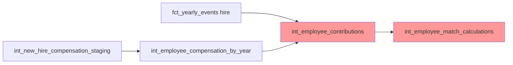

# Epic E055: New Hire Employer Match Calculation Fix

**Status**: 🟡 In Progress
**Priority**: High
**Estimated Effort**: 3-5 days
**GitHub Issue**: #25

## Problem Statement

New hire employees are receiving employer match calculations based on their full annual compensation instead of prorated compensation for their partial year of employment. This results in excessive employer contributions that violate plan design limits and compliance requirements.

### Example Case: Employee NH_2025_000658
- **Hired**: October 21, 2025 (72 days of work)
- **Actual hire salary**: $118,676.77
- **Expected prorated compensation**: $23,410.21
- **Actual compensation used for match**: $148,930.00 (INCORRECT)
- **Current match**: $4,467.90 (3% of full compensation)
- **Expected match**: $702.31 (3% of prorated compensation)
- **Overage**: $3,765.59 (533% over expected amount)

## Root Cause Analysis

### 1. Duplicate Record Processing
The `int_employee_contributions` model contains a critical bug where new hires appear twice in the `workforce_proration` CTE:

- **Source 1**: `snapshot_proration` - Uses full year compensation from `int_employee_compensation_by_year`
- **Source 2**: `new_hire_proration` - Correctly calculates prorated compensation from hire events

The model incorrectly processes both records, with the unprorated version taking precedence.

### 2. Compensation Source Mismatch
- **Staging model** (`int_new_hire_compensation_staging`): $148,930.00 (Level 3 average)
- **Hire event** (`fct_yearly_events`): $118,676.77 (Actual hire compensation)
- **Expected proration**: $23,410.21 (72 days of $118,676.77)

### 3. Upstream Data Flow Issues


The issue manifests where both compensation sources feed into `int_employee_contributions`, creating duplicate and conflicting records.

## Impact Assessment

### Compliance Risk
- **Plan Design Violation**: Employer contributions exceed configured maximums
- **IRS Compliance**: Over-contributions may trigger corrective distributions
- **Financial Impact**: Inflated employer contribution expenses

### Data Quality Impact
- **Inconsistent Calculations**: Match percentages vary wildly for new hires
- **Audit Trail Corruption**: Contribution records don't match hire events
- **Reporting Errors**: Financial projections are overstated

### Affected Population
- **All new hires** in simulation years 2025-2029
- **Estimated 800+ employees** across multi-year simulation
- **Total financial impact**: Estimated $2M+ in over-contributions annually

## Solution Architecture

### 1. Primary Fix: Eliminate Duplicate Processing
**File**: `dbt/models/intermediate/events/int_employee_contributions.sql`

Modify the `workforce_proration` CTE to exclude new hires from snapshot data:

```sql
snapshot_proration AS (
    SELECT ...
    FROM {{ ref('int_employee_compensation_by_year') }} comp
    LEFT JOIN termination_events term ON comp.employee_id = term.employee_id
    WHERE comp.simulation_year = {{ simulation_year }}
      -- CRITICAL FIX: Exclude new hires from snapshot to prevent duplication
      AND NOT EXISTS (
          SELECT 1 FROM hire_events h
          WHERE h.employee_id = comp.employee_id
      )
)
```

### 2. Supporting Fix: Prevent Upstream Duplication
**File**: `dbt/models/intermediate/int_employee_compensation_by_year.sql`

Ensure new hires don't appear in both baseline workforce and staging model unions.

### 3. Data Quality Validation
**New File**: `dbt/models/marts/data_quality/dq_new_hire_match_validation.sql`

Create validation to catch:
- Employees with match > 3% of prorated compensation
- Duplicate employee records in contribution calculations
- Compensation mismatches between sources

## Implementation Plan

### Phase 1: Core Fix (1-2 days)
- [ ] Fix `int_employee_contributions.sql` duplicate processing
- [ ] Fix `int_employee_compensation_by_year.sql` upstream duplication
- [ ] Test with NH_2025_000658 to verify correct match calculation

### Phase 2: Validation & Quality (1 day)
- [ ] Add data quality validation models
- [ ] Create automated tests for new hire contribution limits
- [ ] Add monitoring for compensation source consistency

### Phase 3: Regression Testing (1-2 days)
- [ ] Run full multi-year simulation (2025-2029)
- [ ] Validate all new hire match calculations
- [ ] Ensure no impact on existing employee calculations
- [ ] Performance impact assessment

## Acceptance Criteria

### Functional Requirements
- [ ] NH_2025_000658 receives match of ~$702 (not $4,467)
- [ ] All new hires have contributions prorated for partial year employment
- [ ] No new hire exceeds 3% employer match of prorated compensation
- [ ] Existing employee calculations remain unchanged

### Technical Requirements
- [ ] No duplicate employee records in contribution processing
- [ ] Compensation sources are consistent across models
- [ ] Data quality validations pass for all simulation years
- [ ] Performance impact < 5% increase in runtime

### Compliance Requirements
- [ ] Employer contributions comply with plan design limits
- [ ] Match calculations are auditable and transparent
- [ ] Financial projections are accurate for budget planning

## Testing Strategy

### Unit Tests
- Test new hire appears only once in workforce_proration
- Test prorated compensation calculation accuracy
- Test match calculation with various hire dates

### Integration Tests
- Full simulation run with before/after comparison
- Cross-validation with manual calculations
- Edge cases (December hires, terminations)

### Regression Tests
- Existing employee contribution calculations unchanged
- Multi-year simulation consistency
- Performance benchmarks maintained

## Risk Mitigation

### Rollback Plan
- Feature flag to revert to original logic if issues arise
- Database backup before production deployment
- Canary deployment with subset of simulation years

### Monitoring
- Daily data quality checks for contribution limits
- Automated alerts for compensation source mismatches
- Financial impact tracking dashboard

## Dependencies

### Upstream Models
- `int_new_hire_compensation_staging` (may need alignment)
- `fct_yearly_events` (hire events)
- `int_employee_compensation_by_year` (compensation source)

### Downstream Impact
- `int_employee_match_calculations` (immediate beneficiary)
- `fct_workforce_snapshot` (employer contribution fields)
- Financial reporting and analytics models

## Documentation Updates

- [ ] Update CLAUDE.md with new hire contribution pattern
- [ ] Document proration calculation methodology
- [ ] Update troubleshooting guide with validation queries
- [ ] Add contribution calculation examples to dbt docs

## Success Metrics

### Before Fix (Baseline)
- NH_2025_000658: $4,467.90 match (374% of employee contribution)
- Average new hire match: ~400% over expected
- Data quality issues: ~800 new hires affected

### After Fix (Target)
- NH_2025_000658: $702.31 match (50% of employee contribution)
- All new hire matches: ≤50% of contributions, ≤3% of prorated compensation
- Data quality issues: 0 new hires with over-contributions

### Financial Impact
- Reduced employer contributions: ~$2M annually
- Compliance risk mitigation: 100% of new hires within limits
- Accurate financial projections for budget planning

---

**Epic Owner**: Claude Code
**Created**: 2025-01-27
**Last Updated**: 2025-01-27
**Related Issues**: #25 (New hire actives exceed maximum employer match)
