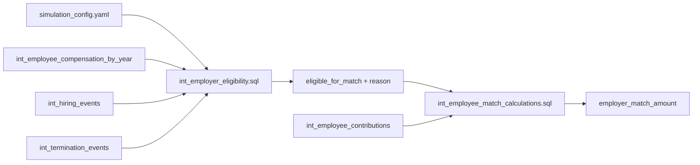

# Epic E058: Employer Match Eligibility Configuration

## Executive Summary

Currently, the employer match calculations in PlanWise Navigator calculate match amounts for ALL employees without considering eligibility requirements. While the system has sophisticated eligibility logic for employer core contributions, the match calculations lack this capability. This epic adds configurable eligibility requirements to the employer match feature, bringing it to parity with the core contribution eligibility framework, while preserving backward compatibility by default.

## Problem Statement

### Current State
- **No Eligibility Filtering**: The `dbt/models/intermediate/events/int_employee_match_calculations.sql` model calculates matches for all employees regardless of eligibility.
- **Simple Eligibility Flag (Unused)**: The `dbt/models/intermediate/int_employer_eligibility.sql` model exposes `eligible_for_match` using a simple rule (active status + 1000 hours), but this flag is not applied in match calculations.
- **Inconsistent Configuration**: Core contributions have configurable eligibility; match eligibility is not configurable.
- **Compliance Risk**: Cannot model real‑world ERISA eligibility requirements for matching contributions.

### Business Impact
- Cannot accurately model plans with different eligibility requirements for match vs. core contributions
- Risk of overstating employer liabilities in simulations
- Limited ability to model complex eligibility scenarios required by plan sponsors

## Solution Overview

Add a comprehensive eligibility configuration framework to the employer match feature that mirrors the existing core contribution eligibility system, allowing for:
- Configurable tenure requirements
- Active status requirements
- Minimum hours thresholds
- Special handling for new hires and terminations
- Independent configuration from core contribution eligibility
- Backward‑compatible behavior toggle (opt‑in to enforcement)

## Success Criteria

1. **Configuration Parity**: Match eligibility configuration has same capabilities as core eligibility.
2. **Zero Match for Ineligible**: Employees not meeting eligibility criteria receive $0 match.
3. **Backward Compatibility (Default Off)**: Existing simulations continue to work unless `apply_match_eligibility` is enabled.
4. **Audit Trail**: Clear tracking of eligibility determination for each employee, including a reason code.
5. **Performance**: No significant performance degradation from eligibility checks.
6. **Contracts & Tests**: dbt model contracts and schema tests updated (uniqueness, not‑null, accepted values).

## Technical Design

### 1. Configuration Schema

#### Update `config/simulation_config.yaml`:
```yaml
employer_match:
  active_formula: 'simple_match'

  # NEW: Backward-compatibility toggle (default false keeps current behavior)
  apply_eligibility: false

  # NEW: Eligibility requirements for match contributions
  eligibility:
    minimum_tenure_years: 0              # Minimum years of service (default: 0)
    require_active_at_year_end: true     # Must be active on Dec 31 (default: true)
    minimum_hours_annual: 1000           # Minimum hours worked (default: 1000)
    allow_new_hires: true                # Allow new hires to qualify (tenure exception)
    allow_terminated_new_hires: false    # Allow new-hire terminations to qualify
    allow_experienced_terminations: false# Allow experienced terminations to qualify

  formulas:
    # ... existing formula definitions ...
```

### 2. Data Flow Architecture



### 3. Model Updates

#### A. `int_employer_eligibility.sql` Enhancements

```sql
-- Read match eligibility config from variables




-- Extract match eligibility parameters with defaults







-- Apply sophisticated eligibility logic for match
CASE
    WHEN NOT {{ apply_match_eligibility }} THEN
        -- Backward-compatible: preserve existing simple rule unless explicitly enabled
        (employment_status_eoy = 'active' AND annual_hours_worked >= 1000)
    WHEN annual_hours_worked >= {{ match_minimum_hours }}
         AND (
              current_tenure >= {{ match_minimum_tenure_years }}
              OR ({{ 'true' if match_allow_new_hires else 'false' }} AND is_new_hire_this_year)
         )
         AND (
              
                  employment_status_eoy = 'active'
                  OR ({{ 'true' if match_allow_terminated_new_hires else 'false' }} AND is_new_hire_this_year AND employment_status_eoy = 'terminated')
                  OR ({{ 'true' if match_allow_experienced_terminations else 'false' }} AND NOT is_new_hire_this_year AND employment_status_eoy = 'terminated')
              
                  TRUE
              
         )
    THEN TRUE
    ELSE FALSE
END AS eligible_for_match,

-- Optional: reason code for auditability
CASE
    WHEN NOT {{ apply_match_eligibility }} THEN 'backward_compatibility_simple_rule'
    WHEN annual_hours_worked < {{ match_minimum_hours }} THEN 'insufficient_hours'
    WHEN current_tenure < {{ match_minimum_tenure_years }} AND NOT is_new_hire_this_year THEN 'insufficient_tenure'
    
    WHEN employment_status_eoy != 'active' AND NOT (
         ({{ 'true' if match_allow_terminated_new_hires else 'false' }} AND is_new_hire_this_year AND employment_status_eoy = 'terminated') OR
         ({{ 'true' if match_allow_experienced_terminations else 'false' }} AND NOT is_new_hire_this_year AND employment_status_eoy = 'terminated')
    ) THEN 'inactive_eoy'
    
    ELSE 'eligible'
END AS match_eligibility_reason
```

#### B. `int_employee_match_calculations.sql` Integration

```sql
WITH employee_contributions AS (
  SELECT
    ec.employee_id,
    ec.simulation_year,
    ec.annual_contribution_amount AS annual_deferrals,
    ec.prorated_annual_compensation AS eligible_compensation,
    ec.effective_annual_deferral_rate AS deferral_rate,
    ec.is_enrolled_flag AS is_enrolled,
    -- Join eligibility determination
    COALESCE(elig.eligible_for_match, FALSE) AS is_eligible_for_match
  FROM {{ ref('int_employee_contributions') }} ec
  LEFT JOIN {{ ref('int_employer_eligibility') }} elig
    ON ec.employee_id = elig.employee_id
   AND ec.simulation_year = elig.simulation_year
  WHERE ec.simulation_year = {{ simulation_year }}
),

-- Calculate match with eligibility filter
final_match AS (
  SELECT
    employee_id,
    simulation_year,
    eligible_compensation,
    deferral_rate,
    annual_deferrals,
    is_eligible_for_match,
    CASE WHEN is_eligible_for_match THEN employer_match_amount ELSE 0 END AS employer_match_amount,
    CASE
      WHEN NOT is_eligible_for_match THEN 'ineligible'
      WHEN annual_deferrals = 0 THEN 'no_deferrals'
      ELSE 'calculated'
    END AS match_status
  FROM all_matches
)
```

### 4. Variable Passing

Update the orchestrator to pass match eligibility configuration as dbt variables (nested under `employer_match` for eligibility; keep existing top‑level `active_match_formula` and `match_formulas` for formulas to remain compatible with current models):

```python
def get_dbt_variables(config, simulation_year):
    """Generate dbt variables from configuration."""
    variables = {
        'simulation_year': simulation_year,
        # ... existing variables ...

        # Match eligibility configuration
        'employer_match': {
            'apply_eligibility': bool(config.employer_match.apply_eligibility),
            'eligibility': {
                'minimum_tenure_years': int(config.employer_match.eligibility.minimum_tenure_years),
                'require_active_at_year_end': bool(config.employer_match.eligibility.require_active_at_year_end),
                'minimum_hours_annual': int(config.employer_match.eligibility.minimum_hours_annual),
                'allow_new_hires': bool(config.employer_match.eligibility.allow_new_hires),
                'allow_terminated_new_hires': bool(config.employer_match.eligibility.allow_terminated_new_hires),
                'allow_experienced_terminations': bool(config.employer_match.eligibility.allow_experienced_terminations)
            }
        },

        # Existing employer match model vars (compatibility with current dbt models)
        'active_match_formula': config.employer_match.active_formula,
        'match_formulas': config.employer_match.formulas,
    }
    return variables
```

Note: The `int_employer_eligibility.sql` model should read match eligibility from `var('employer_match')` while `int_employee_match_calculations.sql` continues to read formulas from `active_match_formula`/`match_formulas` for compatibility.

### 5. Contracts, Tests, and DQ Gates

- Update `dbt/models/intermediate/schema.yml`:
  - Add `match_eligibility_reason` column (accepted values: `eligible`, `insufficient_hours`, `insufficient_tenure`, `inactive_eoy`, `backward_compatibility_simple_rule`).
  - Ensure `(employee_id, simulation_year)` uniqueness remains enforced for `int_employer_eligibility` and `int_employee_match_calculations`.
  - Add `accepted_values` and `not_null` tests for `eligible_for_match` and `match_status`.
- Respect row‑count drift ≤ 0.5% through staging→intermediate.
- Keep `SELECT` columns explicit; uppercase SQL keywords; 2‑space indentation; use `{{ ref() }}`.

### 6. Event‑Sourcing Alignment

- Eligibility derives from yearly state built from events (`int_hiring_events`, `int_termination_events`) and `int_employee_compensation_by_year` to maintain event→state lineage.
- Do not mutate event data; eligibility flags and reasons are deterministic functions of event‑sourced inputs.
- Avoid circular dependencies with accumulators (e.g., keep eligibility independent of enrollment state accumulators).

## Implementation Plan

### Phase 1: Configuration and Eligibility Model (2 days)
1. Update `simulation_config.yaml` with match eligibility section
2. Enhance `int_employer_eligibility.sql` to read and apply match‑specific rules (with `apply_eligibility` toggle)
3. Add backward compatibility for missing configuration (defaults to simple rule)
4. Emit `match_eligibility_reason` for auditability

### Phase 2: Match Calculation Integration (1 day)
1. Update `int_employee_match_calculations.sql` to join with eligibility
2. Apply eligibility filtering to match calculations; preserve formula vars
3. Add `match_status` tracking field

### Phase 3: Orchestrator Updates (1 day)
1. Update configuration parsing to include match eligibility and `apply_eligibility`
2. Pass nested `employer_match.eligibility` to dbt alongside existing formula vars
3. Update any configuration validation (Pydantic) for types and defaults

### Phase 4: Tests & Validation (0.5 day)
1. Add/extend `schema.yml` tests for new columns and accepted values
2. Run targeted builds: `dbt run --select int_employer_eligibility int_employee_match_calculations`
3. Run tests: `dbt test --select int_employer_eligibility int_employee_match_calculations`
4. Validate row‑count drift and performance dashboards

## Validation Steps

- From `/dbt` directory:
  - `dbt run --select int_employer_eligibility`
  - `dbt run --select int_employee_match_calculations fct_employer_match_events`
  - `dbt test --select int_employer_eligibility int_employee_match_calculations`
- Spot‑check examples: verify ineligible employees produce `employer_match_amount = 0` and `match_status = 'ineligible'`.

## Risks & Mitigations

- Behavior changes if eligibility is applied by default. Mitigation: keep `apply_eligibility=false` by default and provide a clear enablement path.
- Potential circular dependencies. Mitigation: restrict inputs to event‑sourced state and existing intermediate models; avoid referencing accumulators used by enrollment.
- Performance regressions. Mitigation: filter and join on `(employee_id, simulation_year)` with appropriate indexes and keep CTEs column‑scoped.

### Phase 4: Testing and Documentation (2 days)
1. Add comprehensive tests in `schema.yml`
2. Create test scenarios with different eligibility configurations
3. Update documentation with configuration examples
4. Validate multi-year eligibility transitions

## Testing Strategy

### Unit Tests
- Test each eligibility parameter independently
- Verify backward compatibility when config is missing
- Test edge cases (new hires, terminations, partial year)

### Integration Tests
```sql
-- Test: Only eligible employees receive match
SELECT
    COUNT(*) as ineligible_with_match
FROM {{ ref('int_employee_match_calculations') }} m
JOIN {{ ref('int_employer_eligibility') }} e
    ON m.employee_id = e.employee_id
    AND m.simulation_year = e.simulation_year
WHERE e.eligible_for_match = FALSE
    AND m.employer_match_amount > 0;
-- Expected: 0

-- Test: All eligible enrolled employees with deferrals receive match
SELECT
    COUNT(*) as eligible_without_match
FROM {{ ref('int_employee_match_calculations') }} m
JOIN {{ ref('int_employer_eligibility') }} e
    ON m.employee_id = e.employee_id
    AND m.simulation_year = e.simulation_year
WHERE e.eligible_for_match = TRUE
    AND m.annual_deferrals > 0
    AND m.employer_match_amount = 0;
-- Expected: 0
```

### Scenario Tests
1. **Default Configuration**: Verify current behavior is maintained
2. **Strict Eligibility**: 2-year tenure, active at EOY, no exceptions
3. **Liberal Eligibility**: Immediate eligibility for all employees
4. **Different from Core**: Match and core with different requirements

## Rollout Plan

### Phase 1: Development Environment
- Implement changes in feature branch
- Run comprehensive test suite
- Validate with sample data

### Phase 2: Staging Validation
- Deploy to staging environment
- Run parallel simulations with/without eligibility
- Compare results for expected differences

### Phase 3: Production Deployment
- Deploy with default configuration matching current behavior
- Allow opt-in to new eligibility features
- Monitor for any unexpected impacts

## Risk Mitigation

| Risk | Mitigation |
|------|------------|
| Breaking existing simulations | Default configuration maintains current behavior |
| Performance degradation | Eligibility JOIN is on indexed columns; test with 100K+ employees |
| Configuration complexity | Provide clear examples and defaults |
| Eligibility logic errors | Comprehensive test coverage; reuse proven core eligibility pattern |

## Dependencies

- Epic E022: Eligibility Engine (provides base eligibility framework)
- Epic E025: Match Engine (provides match calculation logic)
- Epic E039: Employer Contribution Integration (provides integration patterns)

## Success Metrics

1. **Accuracy**: 100% of ineligible employees receive $0 match
2. **Performance**: <5% increase in match calculation runtime
3. **Adoption**: Configuration used in 50% of new simulations within 3 months
4. **Quality**: Zero eligibility-related bugs in first month

## Future Enhancements

1. **Service-Based Vesting**: Add vesting schedules for match contributions
2. **Entry Date Rules**: Support quarterly/semi-annual entry dates
3. **Classification-Based Rules**: Different eligibility by employee class
4. **Safe Harbor Provisions**: Auto-eligibility for safe harbor plans
5. **Break-in-Service Rules**: Handle rehire eligibility complexities

## Configuration Examples

### Example 1: Traditional 401(k) Plan
```yaml
employer_match:
  eligibility:
    minimum_tenure_years: 1
    require_active_at_year_end: true
    minimum_hours_annual: 1000
    allow_new_hires: false
    allow_terminated_new_hires: false
    allow_experienced_terminations: false
```

### Example 2: Immediate Eligibility Plan
```yaml
employer_match:
  eligibility:
    minimum_tenure_years: 0
    require_active_at_year_end: false
    minimum_hours_annual: 0
    allow_new_hires: true
    allow_terminated_new_hires: true
    allow_experienced_terminations: true
```

### Example 3: Different Match vs. Core Eligibility
```yaml
employer_match:
  eligibility:
    minimum_tenure_years: 0  # Immediate for match
    minimum_hours_annual: 500  # Lower threshold

employer_core_contribution:
  eligibility:
    minimum_tenure_years: 1  # 1 year for core
    minimum_hours_annual: 1000  # Higher threshold
```

## Acceptance Criteria

- [ ] Configuration schema updated with match eligibility section
- [ ] `int_employer_eligibility.sql` calculates match eligibility using configuration
- [ ] `int_employee_match_calculations.sql` applies eligibility filtering
- [ ] Zero match amounts for ineligible employees
- [ ] Backward compatibility maintained
- [ ] All tests passing
- [ ] Documentation updated with examples
- [ ] Multi-year simulations handle eligibility transitions correctly

## Notes

- This epic brings match eligibility to feature parity with core contribution eligibility
- The implementation reuses the proven pattern from Epic E022 (Eligibility Engine)
- Default configuration maintains current behavior for backward compatibility
- Future enhancements can add more sophisticated eligibility rules as needed
