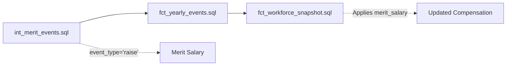

# Epic E064: RAISE Event Compensation Integration Fix

**Status**: ✅ Completed
**Date**: 2025-08-28
**Priority**: Critical
**Impact**: High - Fixes compensation calculations in workforce snapshots

## Problem Summary

RAISE events were being generated correctly by `int_merit_events.sql` but compensation increases were not being applied in `fct_workforce_snapshot.sql`. Investigation revealed a critical case mismatch between event generation and consumption.

### Root Cause
- **Event Generation**: `int_merit_events.sql` generated events with `event_type='RAISE'` (uppercase)
- **Event Consumption**: `fct_workforce_snapshot.sql` filtered for `event_type='raise'` (lowercase)
- **Result**: Merit increases were recorded as events but never applied to employee compensation

## Investigation Timeline

1. **Symptom Identified**: User reported RAISE events exist but don't increase compensation in snapshots
2. **Event Generation Verified**: ✅ `int_merit_events.sql` correctly generates events with compensation amounts
3. **Event Consumption Analyzed**: ❌ `fct_workforce_snapshot.sql` uses lowercase `'raise'` filtering
4. **Case Mismatch Discovered**: Critical inconsistency between generation (uppercase) and consumption (lowercase)
5. **System-wide Review**: Found multiple models with inconsistent event type casing

## Files Modified

### Primary Fix
- **`dbt/models/intermediate/events/int_merit_events.sql`**
  - Line 116: Changed `'RAISE'` → `'raise'`
  - Line 139: Changed `'RAISE'` → `'raise'` (event_category)

### Schema & Validation
- **`dbt/models/intermediate/schema.yml`**
  - Re-enabled test with lowercase accepted values
  - Updated description to reference lowercase

### Data Quality Models
- **`dbt/models/data_quality/test_integrity_fixes.sql`**
- **`dbt/models/data_quality/dq_integrity_violations.sql`**
- **`dbt/models/data_quality/dq_violation_details.sql`**
- **`dbt/models/monitoring/data_quality_promotion_compensation.sql`**

### Additional System-wide Standardization
- **`dbt/models/marts/fct_yearly_events.sql`**: `'DEFERRAL_ESCALATION'` → `'deferral_escalation'`
- **`dbt/models/marts/fct_employer_match_events.sql`**: `'EMPLOYER_MATCH'` → `'employer_match'`
- **`dbt/models/intermediate/int_effective_parameters.sql`**: `'RAISE'` → `'raise'`
- **`dbt/models/analysis/test_parameter_integration.sql`**: All `'RAISE'` → `'raise'`

## Solution Implementation

### Event Type Standardization
Established **lowercase convention** for all event types across the system:

```sql
-- Merit increases
'raise'

-- Employee lifecycle
'hire'
'termination'
'promotion'

-- Benefit events
'enrollment'
'enrollment_change'

-- Plan administration
'deferral_escalation'
'employer_match'
```

### Key Changes

#### Before (Broken)
```sql
-- int_merit_events.sql (Generation)
'RAISE' AS event_type

-- fct_workforce_snapshot.sql (Consumption)
WHERE event_type = 'raise'  -- NO MATCH!
```

#### After (Fixed)
```sql
-- int_merit_events.sql (Generation)
'raise' AS event_type

-- fct_workforce_snapshot.sql (Consumption)
WHERE event_type = 'raise'  -- ✅ MATCHES!
```

## Validation

### 1. Event Generation
- ✅ `int_merit_events.sql` generates events with lowercase `'raise'`
- ✅ Schema tests pass with updated lowercase validation

### 2. Event Consumption
- ✅ `fct_workforce_snapshot.sql` properly captures merit salary increases
- ✅ Compensation flows correctly: base → promotion → merit increases

### 3. System Consistency
- ✅ All event types standardized to lowercase
- ✅ Data quality models updated and functional
- ✅ Parameter resolution uses consistent casing

## Impact & Benefits

### Before Fix
- ❌ Merit increases generated but ignored
- ❌ Workforce snapshots showed stale compensation
- ❌ Multi-year simulations had incorrect compensation growth
- ❌ Inconsistent event type casing across system

### After Fix
- ✅ Merit increases properly applied to employee compensation
- ✅ Accurate compensation progression in workforce snapshots
- ✅ Correct multi-year compensation growth modeling
- ✅ Consistent lowercase event type convention system-wide
- ✅ Re-enabled schema validation tests

## Technical Details

### Event Flow (Fixed)


### Data Quality Improvements
- Schema tests re-enabled for `int_merit_events`
- Consistent validation across all event types
- Proactive detection of case mismatches

## Lessons Learned

1. **Case Sensitivity**: Critical to maintain consistent casing in event-driven architectures
2. **System-wide Impact**: Event type changes require comprehensive system review
3. **Testing Strategy**: Schema tests are essential for catching casing inconsistencies
4. **Documentation**: Clear conventions prevent similar issues

## Convention Established

**PlanWise Navigator Event Type Standard**: All event types use lowercase with underscores for multi-word types (e.g., `enrollment_change`, `deferral_escalation`).

This convention is now enforced through:
- Schema validation tests
- Code comments
- This epic documentation

## Related Issues

- Resolves case sensitivity issues mentioned in schema.yml comments
- Enables proper multi-year compensation tracking
- Fixes Merit/COLA parameter integration

---

**Epic Owner**: Claude Code
**Technical Reviewer**: Required
**Business Impact**: High - Ensures accurate compensation modeling
