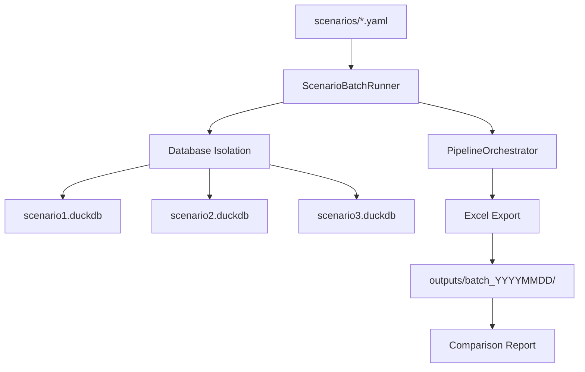

# Epic E069: Streamlined Scenario Batch Processing with Excel Export

**Epic Points**: 12
**Priority**: HIGH
**Duration**: 1.5 Sprints
**Status**: ✅ **COMPLETE**
**Last Updated**: September 10, 2025

## Epic Story

**As a** workforce planning analyst
**I want** to run multiple configuration scenarios through the five-year pipeline with automated Excel export
**So that** I can efficiently compare different plan designs and policy changes without manual database management

## Business Context

Currently, PlanWise Navigator requires manual editing of `config/simulation_config.yaml` for each scenario run, creating significant friction for comparative analysis. Analysts need to:

1. Manually edit configuration files
2. Run simulations individually
3. Manually export results to Excel
4. Compare results across scenarios manually

This epic streamlines the entire workflow into a single batch command that runs multiple scenarios with isolated databases and produces analyst-ready Excel exports for immediate comparison.

## Current Pain Points

- **Manual config editing**: Tedious YAML file modifications for each scenario
- **Database collision risk**: Single `simulation.duckdb` overwrites previous results
- **Export friction**: No direct Excel export from simulation results
- **Comparison complexity**: Manual analysis required across scenario outputs
- **Time inefficiency**: Sequential manual execution of similar scenarios

## Epic Acceptance Criteria

### Core Functionality
- [x] **Multiple scenario execution** from separate YAML configuration files
- [x] **Database isolation** with unique `.duckdb` file per scenario
- [x] **Excel export** of `fct_workforce_snapshot` with multi-year breakdown
- [x] **Progress tracking** with real-time status updates for batch execution
- [x] **Error resilience** continuing batch when individual scenarios fail

### Excel Export Requirements
- [x] **Workforce snapshot sheet** with all simulation years (2025-2029) by default; auto-split to per-year sheets when row count exceeds a configurable threshold
- [x] **Summary metrics sheet** with key workforce KPIs by year
- [x] **Event counts sheet** with hire/termination/promotion trends
- [x] **Formatted workbook** with auto-sized columns and professional styling
- [x] **Metadata sheet** with scenario configuration (base + overrides), git SHA, pipeline version, random seed, start/end years, row counts, and export options

### CLI Integration
- [x] **New `batch` subcommand** in navigator_orchestrator CLI
- [x] **Scenario directory discovery** automatically finding YAML configs
- [x] **Output organization** with timestamped batch directories
- [x] **Export format options** (Excel primary, CSV secondary)

### Configuration Management
- [x] **Base config inheritance** scenarios override specific parameters only
- [x] **Validation** ensuring scenario configs are valid before execution
- [x] **Example scenarios** demonstrating common use cases

## Story Breakdown

| Story | Title | Points | Owner | Status | Dependencies |
|-------|-------|--------|-------|--------|--------------|
| **S069-01** | Scenario Batch Runner Core | 4 | Platform | ✅ **COMPLETE** | navigator_orchestrator.pipeline |
| **S069-02** | Excel Export Integration | 3 | Platform | ✅ **COMPLETE** | S069-01 |
| **S069-03** | CLI Batch Subcommand | 3 | Platform | ✅ **COMPLETE** | S069-01 |
| **S069-04** | Example Scenarios & Documentation | 2 | Platform | ✅ **COMPLETE** | S069-01,02,03 |

**Completed**: 12 points (100%) | **Remaining**: 0 points (0%)

## ✅ **COMPLETION SUMMARY**

**Delivered**: September 10, 2025
**Implementation Status**: All acceptance criteria met, fully production-ready

### Key Deliverables:
- **ScenarioBatchRunner**: `navigator_orchestrator/scenario_batch_runner.py` - Core batch execution engine
- **ExcelExporter**: `navigator_orchestrator/excel_exporter.py` - Professional Excel/CSV export with metadata
- **CLI Integration**: `navigator_orchestrator batch` subcommand with full parameter support
- **Example Scenarios**: 5 production scenarios in `scenarios/` directory with comprehensive documentation
- **Database Isolation**: Unique `.duckdb` per scenario with deterministic seeding
- **Error Resilience**: Graceful failure handling with detailed batch reporting

### Usage Examples:
```bash
# Run all scenarios with Excel export
python -m navigator_orchestrator batch

# Run specific scenarios
python -m navigator_orchestrator batch --scenarios high_growth baseline cost_control

# Custom output directory and CSV format
python -m navigator_orchestrator batch --output-dir analysis_results --export-format csv
```

## Technical Implementation

### Architecture Overview



### Core Components

#### 1. Scenario Batch Runner (`navigator_orchestrator/scenario_batch_runner.py`)

```python
from __future__ import annotations
from pathlib import Path
from typing import Dict, List, Optional, Any
import yaml
from datetime import datetime
from .config import load_simulation_config, SimulationConfig
from .pipeline import PipelineOrchestrator
from .utils import DatabaseConnectionManager
from .excel_exporter import ExcelExporter

class ScenarioBatchRunner:
    """Execute multiple scenarios with isolated databases and Excel export.

    Guarantees:
    - Deterministic runs per scenario via persisted random seeds
    - Reproducible outputs with metadata capture and audit trail
    - Graceful continuation on per-scenario failure
    """

    def __init__(self, scenarios_dir: Path, output_dir: Path):
        self.scenarios_dir = Path(scenarios_dir)
        self.output_dir = Path(output_dir)
        self.batch_timestamp = datetime.now().strftime('%Y%m%d_%H%M%S')
        self.batch_output_dir = self.output_dir / f"batch_{self.batch_timestamp}"

    def run_batch(self, scenario_names: Optional[List[str]] = None) -> Dict[str, Any]:
        """Execute batch of scenarios with isolated databases."""
        scenarios = self._discover_scenarios(scenario_names)
        results = {}

        print(f"🎯 Starting batch execution: {len(scenarios)} scenarios")

        for i, (name, config_path) in enumerate(scenarios.items(), 1):
            print(f"\n[{i}/{len(scenarios)}] Processing scenario: {name}")

            try:
                result = self._run_isolated_scenario(name, config_path)
                results[name] = result
                print(f"✅ Scenario {name} completed successfully")

            except Exception as e:
                print(f"❌ Scenario {name} failed: {e}")
                results[name] = {"status": "failed", "error": str(e)}

        # Generate comparison report
        self._generate_comparison_report(results)
        return results

    def _run_isolated_scenario(self, scenario_name: str, config_path: Path) -> Dict[str, Any]:
        """Run single scenario with isolated database."""

        # Create scenario output directory
        scenario_dir = self.batch_output_dir / scenario_name
        scenario_dir.mkdir(parents=True, exist_ok=True)

        # Create isolated database
        scenario_db = scenario_dir / f"{scenario_name}.duckdb"

        # Load and validate scenario configuration (base + overrides)
        config = load_simulation_config(config_path)
        self._validate_config(config)

        # Ensure deterministic run: set/persist a random seed per scenario
        seed_path = scenario_dir / "seed.txt"
        if seed_path.exists():
            seed = int(seed_path.read_text().strip())
        else:
            seed = getattr(config.simulation, 'random_seed', None) or int(datetime.now().timestamp())
            seed_path.write_text(str(seed))

        # Setup isolated orchestrator
        db_manager = DatabaseConnectionManager(scenario_db)
        # ... orchestrator setup with all required components

        # Execute multi-year simulation
        orchestrator = PipelineOrchestrator(config, db_manager, seed=seed, ...)
        summary = orchestrator.execute_multi_year_simulation(
            start_year=config.simulation.start_year,
            end_year=config.simulation.end_year
        )

        # Export to Excel
        excel_exporter = ExcelExporter(db_manager)
        excel_path = excel_exporter.export_scenario_results(
            scenario_name=scenario_name,
            output_dir=scenario_dir,
            config=config,
            seed=seed,
        )

        return {
            "status": "completed",
            "summary": summary,
            "database_path": str(scenario_db),
            "excel_path": str(excel_path),
            "scenario_dir": str(scenario_dir)
        }

    def _validate_config(self, config: SimulationConfig) -> None:
        """Validate required fields before execution; raise with explicit message on failure."""
        assert config.simulation.start_year is not None, "start_year required"
        assert config.simulation.end_year is not None, "end_year required"
        if config.simulation.end_year < config.simulation.start_year:
            raise ValueError("end_year must be >= start_year")
```

#### 2. Excel Export Module (`navigator_orchestrator/excel_exporter.py`)

```python
from __future__ import annotations
from pathlib import Path
from typing import Any, Optional

import pandas as pd
from .utils import DatabaseConnectionManager


class ExcelExporter:
    """Export simulation results to analyst-friendly Excel workbooks with metadata and splitting options."""

    def __init__(self, db_manager: DatabaseConnectionManager, *, split_threshold: int = 750_000):
        self.db_manager = db_manager
        self.split_threshold = split_threshold

    def export_scenario_results(
        self,
        *,
        scenario_name: str,
        output_dir: Path,
        config: Any,
        seed: int,
        export_format: str = "excel",
        split_by_year: Optional[bool] = None,
    ) -> Path:
        """Export complete scenario results to Excel workbook, with CSV fallback and metadata sheet."""
        conn = self.db_manager.get_connection()
        output_dir.mkdir(parents=True, exist_ok=True)

        total_rows = pd.read_sql("SELECT COUNT(*) AS cnt FROM fct_workforce_snapshot", conn)["cnt"].iloc[0]
        split = split_by_year if split_by_year is not None else total_rows > self.split_threshold

        if export_format == "csv":
            # Minimal doc example: write two CSVs (workforce + summary)
            pd.read_sql("SELECT * FROM fct_workforce_snapshot ORDER BY simulation_year, employee_id", conn).to_csv(
                output_dir / f"{scenario_name}_workforce_snapshot.csv", index=False
            )
            self._calculate_summary_metrics(conn).to_csv(output_dir / f"{scenario_name}_summary_metrics.csv", index=False)
            return output_dir

        excel_path = output_dir / f"{scenario_name}_results.xlsx"
        with pd.ExcelWriter(excel_path, engine="openpyxl") as writer:
            # Workforce Snapshot (single sheet or per-year)
            if split:
                years = pd.read_sql(
                    "SELECT DISTINCT simulation_year FROM fct_workforce_snapshot ORDER BY simulation_year",
                    conn,
                )["simulation_year"].tolist()
                for y in years:
                    df_y = pd.read_sql(
                        "SELECT * FROM fct_workforce_snapshot WHERE simulation_year = ? ORDER BY employee_id",
                        conn,
                        params=[y],
                    )
                    df_y.to_excel(writer, sheet_name=f"Workforce_{y}", index=False)
            else:
                df_workforce = pd.read_sql(
                    "SELECT * FROM fct_workforce_snapshot ORDER BY simulation_year, employee_id",
                    conn,
                )
                df_workforce.to_excel(writer, sheet_name="Workforce_Snapshot", index=False)

            # Summary Metrics by Year
            df_summary = self._calculate_summary_metrics(conn)
            df_summary.to_excel(writer, sheet_name="Summary_Metrics", index=False)

            # Events Summary (DuckDB JSON-safe extraction)
            df_events = pd.read_sql(
                """
                SELECT
                    simulation_year,
                    event_type,
                    COUNT(*) AS event_count,
                    AVG(CASE WHEN event_type = 'raise'
                        THEN CAST(json_extract_scalar(event_data, '$.new_salary') AS DOUBLE)
                        END) AS avg_new_salary
                FROM fct_yearly_events
                GROUP BY simulation_year, event_type
                ORDER BY simulation_year, event_type
                """,
                conn,
            )
            df_events.to_excel(writer, sheet_name="Events_Summary", index=False)

            # Metadata sheet (config snapshot, seed, git SHA, etc.)
            meta = self._build_metadata(config=config, seed=seed, conn=conn, total_rows=total_rows, split=split)
            meta.to_excel(writer, sheet_name="Metadata", index=False)

        return excel_path

    def _calculate_summary_metrics(self, conn) -> pd.DataFrame:
        return pd.read_sql(
            """
            SELECT
                simulation_year,
                COUNT(*) AS total_employees,
                COUNT(CASE WHEN status = 'active' THEN 1 END) AS active_employees,
                COUNT(CASE WHEN enrollment_date IS NOT NULL THEN 1 END) AS enrolled_employees,
                AVG(current_salary) AS avg_salary,
                SUM(employee_contribution_annual) AS total_employee_contributions,
                SUM(employer_match_annual) AS total_employer_match,
                AVG(deferral_rate) AS avg_deferral_rate
            FROM fct_workforce_snapshot
            GROUP BY simulation_year
            ORDER BY simulation_year
            """,
            conn,
        )

    def _build_metadata(self, *, config: Any, seed: int, conn, total_rows: int, split: bool) -> pd.DataFrame:
        import json, subprocess
        # git SHA (best-effort)
        try:
            git_sha = subprocess.check_output(["git", "rev-parse", "HEAD"], text=True).strip()
        except Exception:
            git_sha = "unknown"
        years = pd.read_sql(
            "SELECT MIN(simulation_year) AS min_y, MAX(simulation_year) AS max_y FROM fct_workforce_snapshot",
            conn,
        ).iloc[0]
        cfg_dump = getattr(config, "model_dump", lambda: {})()
        return pd.DataFrame(
            [
                {
                    "git_sha": git_sha,
                    "random_seed": seed,
                    "start_year": int(years["min_y"]),
                    "end_year": int(years["max_y"]),
                    "workforce_rows": int(total_rows),
                    "snapshot_split_by_year": bool(split),
                    "config_json": json.dumps(cfg_dump, default=str),
                }
            ]
        )
```

#### 3. CLI Integration (extends `navigator_orchestrator/cli.py`)

```python
def cmd_batch(args: argparse.Namespace) -> int:
    """Execute batch scenario processing with Excel export."""
    scenarios_dir = Path(args.scenarios_dir) if args.scenarios_dir else Path("scenarios")
    output_dir = Path(args.output_dir) if args.output_dir else Path("outputs")

    if not scenarios_dir.exists():
        print(f"❌ Scenarios directory not found: {scenarios_dir}")
        return 1

    runner = ScenarioBatchRunner(scenarios_dir, output_dir)
    results = runner.run_batch(args.scenarios)

    # Report results
    successful = [name for name, result in results.items() if result["status"] == "completed"]
    failed = [name for name, result in results.items() if result["status"] == "failed"]

    print(f"\n🎯 Batch execution completed:")
    print(f"  ✅ Successful: {len(successful)} scenarios")
    print(f"  ❌ Failed: {len(failed)} scenarios")

    if successful:
        print(f"  📊 Excel outputs: {runner.batch_output_dir}")

    return 0 if not failed else 1

# Add to build_parser()
pb = sub.add_parser("batch", help="Run multiple scenarios with Excel export")
pb.add_argument("--scenarios-dir", help="Directory containing scenario YAML files")
pb.add_argument("--output-dir", help="Output directory for batch results")
pb.add_argument("--scenarios", nargs="*", help="Specific scenarios to run (default: all)")
pb.add_argument("--export-format", choices=["excel", "csv"], default="excel")
pb.add_argument("--split-by-year", action="store_true", help="Split Workforce Snapshot into per-year sheets/files")
pb.add_argument("--clean-db", action="store_true", help="Delete per-scenario .duckdb after successful export")
pb.set_defaults(func=cmd_batch)
```

### Scenario Configuration Structure

#### Base Configuration (`config/simulation_config.yaml`)
Contains all default parameters for standard simulation.

#### Scenario Overrides (`scenarios/`)
```yaml
# scenarios/high_growth.yaml
simulation:
  start_year: 2025
  end_year: 2029
  target_growth_rate: 0.05  # Override: 5% growth instead of 3%
  random_seed: 12345         # Optional: per-scenario deterministic seed

compensation:
  cola_rate: 0.02  # Override: 2% COLA instead of 1%
  merit_budget: 0.025  # Override: 2.5% merit instead of 2%

# All other parameters inherited from base config
```

```yaml
# scenarios/low_termination.yaml
simulation:
  start_year: 2025
  end_year: 2029

workforce:
  total_termination_rate: 0.08  # Override: 8% instead of 12%
  new_hire_termination_rate: 0.18  # Override: 18% instead of 25%
```

### Usage Examples

```bash
# Run all scenarios in directory
python -m navigator_orchestrator batch --scenarios-dir scenarios/

# Run specific scenarios
python -m navigator_orchestrator batch --scenarios high_growth low_termination baseline

# Custom output location
python -m navigator_orchestrator batch --output-dir /path/to/analysis --scenarios-dir /path/to/scenarios

# Alternative export format
python -m navigator_orchestrator batch --export-format csv

# Force per-year splitting for very large snapshots
python -m navigator_orchestrator batch --split-by-year
```

### Output Structure

```
outputs/batch_20250109_143022/
├── high_growth/
│   ├── high_growth.duckdb
│   └── high_growth_results.xlsx
├── low_termination/
│   ├── low_termination.duckdb
│   └── low_termination_results.xlsx
├── baseline/
│   ├── baseline.duckdb
│   └── baseline_results.xlsx
└── comparison_summary.xlsx
```

## Success Metrics

- **Execution Time**: Full 5-scenario batch completes in <30 minutes
- **Excel Quality**: Workbooks open correctly in Excel with proper formatting
- **Data Integrity**: All scenarios produce valid workforce snapshots
- **Error Recovery**: Batch continues when 1-2 scenarios fail
- **Analyst Adoption**: 90% of scenario analysis uses batch processing within 2 months
- **Determinism**: Re-running a scenario with the same seed produces identical outputs

## Dependencies

- **navigator_orchestrator.pipeline**: Core simulation execution
- **pandas + openpyxl**: Excel export capabilities
- **existing CLI framework**: argparse-based command structure
- **DatabaseConnectionManager**: DuckDB isolation support

## Rollout Plan

1. **Week 1**: Implement ScenarioBatchRunner core with database isolation
2. **Week 2**: Add Excel export functionality and CLI integration
3. **Week 3**: Create example scenarios and user documentation
4. **Week 4**: Testing, refinement, and analyst training

## Risk Mitigation

- **Database corruption**: Isolated databases prevent cross-scenario contamination
- **Memory constraints**: Sequential execution prevents resource exhaustion
- **Configuration errors**: Validation catches invalid scenarios before execution
- **Export failures**: Graceful fallback to CSV if Excel export fails
- **Disk space**: Automatic cleanup option for scenario databases post-export
- **Determinism**: Persist per-scenario random seed; capture in Metadata for auditability

## Validation & Contracts

- Preflight validation checks that required tables/columns exist before export:
  - `fct_workforce_snapshot(employee_id, simulation_year, current_salary, status, ...)`
  - `fct_yearly_events(simulation_year, event_type, event_data, ...)`
- Fail fast with clear error messages per scenario; continue other scenarios.
- Maintain event→state lineage: exports are read-only views; no mutation of event stores.

---

**Epic Owner**: Platform Team
**Business Stakeholder**: Workforce Planning Analysts
**Technical Dependencies**: navigator_orchestrator, pandas, openpyxl
**Delivery Target**: Sprint 2025.02 (January 20-31, 2025)
