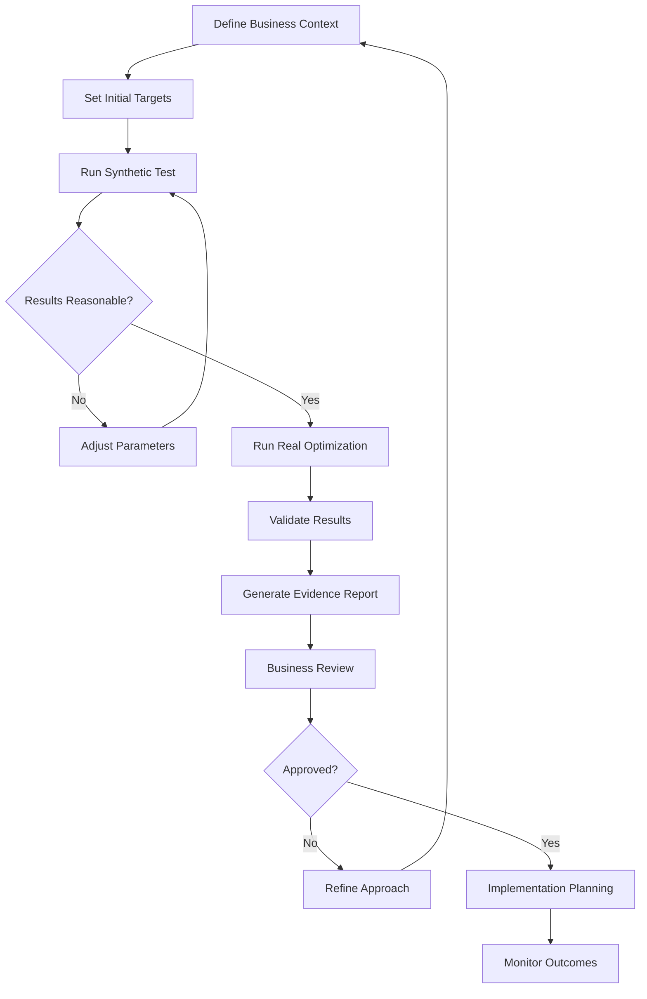

# Auto-Optimize Best Practices Guide - PlanWise Navigator

**Epic E012 Compensation Tuning System - S047 Optimization Engine**
**Last Updated:** July 2025
**Target Audience:** Compensation Analysts, HR Professionals, Business Users, Technical Teams

---

## Overview

This guide provides comprehensive best practices for using PlanWise Navigator's Auto-Optimize system effectively, safely, and efficiently. Following these practices ensures optimal results while minimizing risks in compensation planning workflows.

### Core Principles

1. **Start Small, Scale Gradually** - Begin with conservative targets and simple scenarios
2. **Validate Before Implementing** - Always verify optimization results against business logic
3. **Monitor and Measure** - Track the impact of optimized parameters over time
4. **Document Everything** - Maintain clear records of optimization decisions and rationale
5. **Test Thoroughly** - Use synthetic mode for exploration, real mode for final decisions

---

## Strategic Planning Best Practices

### 1. Setting Optimization Objectives

#### Weight Distribution Guidelines

**Conservative Approach (Recommended for First-Time Users)**
```yaml
objectives:
  cost: 0.6        # Primary focus on cost control
  equity: 0.3      # Secondary focus on fairness
  targets: 0.1     # Minimal growth pressure
```

**Balanced Approach (Standard Business Planning)**
```yaml
objectives:
  cost: 0.4        # Balanced cost consideration
  equity: 0.3      # Fair compensation distribution
  targets: 0.3     # Moderate growth targets
```

**Growth-Focused Approach (Expansion Periods)**
```yaml
objectives:
  cost: 0.2        # Lower cost priority
  equity: 0.3      # Maintain fairness
  targets: 0.5     # Aggressive growth targets
```

#### Objective Weight Selection Framework

| Business Context | Cost Weight | Equity Weight | Growth Weight | Rationale |
|------------------|-------------|---------------|---------------|-----------|
| Budget Constraints | 0.6-0.7 | 0.2-0.3 | 0.1-0.2 | Primary cost control |
| Market Competition | 0.3-0.4 | 0.2-0.3 | 0.4-0.5 | Competitive positioning |
| Internal Equity Focus | 0.3-0.4 | 0.4-0.5 | 0.2-0.3 | Fairness emphasis |
| Stable Operations | 0.4-0.5 | 0.3-0.4 | 0.2-0.3 | Balanced approach |

### 2. Target Setting Best Practices

#### Growth Rate Guidelines

**Conservative Targets (Low Risk)**
- Annual growth: 1.0% - 2.5%
- Suitable for: Budget-constrained environments, uncertain economic conditions
- Benefits: Predictable costs, minimal disruption

**Moderate Targets (Balanced Risk)**
- Annual growth: 2.5% - 4.0%
- Suitable for: Standard business planning, stable markets
- Benefits: Competitive positioning, employee satisfaction

**Aggressive Targets (Higher Risk)**
- Annual growth: 4.0% - 6.0%
- Suitable for: Growth phases, talent retention priorities
- Benefits: Strong market position, reduced turnover risk

#### Target Validation Checklist

```python
def validate_growth_targets(target_growth: float) -> Dict[str, str]:
    """Validate growth targets against business constraints."""

    validation_results = {}

    # Economic context validation
    if target_growth > 0.06:  # 6%
        validation_results["economic"] = "HIGH_RISK: Target exceeds typical inflation + productivity gains"
    elif target_growth < 0.01:  # 1%
        validation_results["economic"] = "LOW_RISK: May lag market compensation growth"
    else:
        validation_results["economic"] = "ACCEPTABLE: Within normal economic ranges"

    # Budget impact validation
    estimated_budget_impact = target_growth * 1000000  # Example: $1M base
    if estimated_budget_impact > 50000:  # $50K threshold
        validation_results["budget"] = f"REVIEW_REQUIRED: ${estimated_budget_impact:,.0f} estimated impact"
    else:
        validation_results["budget"] = "ACCEPTABLE: Within normal budget variance"

    # Industry benchmarking
    industry_average = 0.035  # 3.5% example
    deviation = abs(target_growth - industry_average)
    if deviation > 0.015:  # 1.5% deviation
        validation_results["benchmark"] = f"NOTABLE: {deviation*100:.1f}% deviation from industry average"
    else:
        validation_results["benchmark"] = "ALIGNED: Close to industry benchmarks"

    return validation_results

# Example usage
targets = validate_growth_targets(0.045)  # 4.5% growth
for category, message in targets.items():
    print(f"{category.upper()}: {message}")
```

---

## Operational Best Practices

### 1. Optimization Workflow

#### Recommended Process Flow



#### Phase-by-Phase Approach

**Phase 1: Exploration (Synthetic Mode)**
```python
# Quick exploration of parameter space
exploration_config = {
    "use_synthetic": True,
    "max_evaluations": 20,
    "timeout_minutes": 5,
    "method": "SLSQP"
}

# Test multiple scenarios quickly
scenarios = [
    {"cost": 0.7, "equity": 0.2, "targets": 0.1},
    {"cost": 0.5, "equity": 0.3, "targets": 0.2},
    {"cost": 0.3, "equity": 0.3, "targets": 0.4}
]

for i, objectives in enumerate(scenarios):
    print(f"Testing scenario {i+1}: {objectives}")
    # Run optimization with synthetic mode
    result = run_optimization(objectives, exploration_config)
    print(f"Result: {result.objective_value:.4f}, Risk: {result.risk_assessment}")
```

**Phase 2: Validation (Real Mode)**
```python
# Detailed optimization with real data
validation_config = {
    "use_synthetic": False,
    "max_evaluations": 100,
    "timeout_minutes": 60,
    "method": "SLSQP"
}

# Run best scenario from exploration
best_objectives = {"cost": 0.5, "equity": 0.3, "targets": 0.2}
final_result = run_optimization(best_objectives, validation_config)

# Validate results
if final_result.converged and final_result.risk_assessment in ["LOW", "MEDIUM"]:
    print("✅ Validation successful - proceed to implementation")
else:
    print("⚠️ Validation concerns - review before implementation")
```

**Phase 3: Implementation**
```python
# Gradual parameter rollout
def implement_gradual_rollout(optimal_parameters, current_parameters, phases=3):
    """Implement optimized parameters gradually over multiple phases."""

    rollout_schedule = []

    for phase in range(1, phases + 1):
        phase_parameters = {}

        for param_name, optimal_value in optimal_parameters.items():
            current_value = current_parameters[param_name]

            # Gradual adjustment toward optimal
            adjustment_factor = phase / phases
            phase_value = current_value + (optimal_value - current_value) * adjustment_factor

            phase_parameters[param_name] = phase_value

        rollout_schedule.append({
            "phase": phase,
            "parameters": phase_parameters,
            "description": f"Phase {phase}/{phases}: {(phase/phases)*100:.0f}% implementation"
        })

    return rollout_schedule

# Example implementation
rollout = implement_gradual_rollout(final_result.optimal_parameters, current_parameters)
for phase_info in rollout:
    print(f"{phase_info['description']}")
    # Implement phase_info['parameters']
```

### 2. Algorithm Selection Guidelines

#### Algorithm Characteristics

| Algorithm | Convergence Speed | Robustness | Best For | Avoid When |
|-----------|------------------|------------|----------|------------|
| SLSQP | Fast | Medium | Smooth objectives, few constraints | Noisy data, many local optima |
| DE | Medium | High | Difficult landscapes, global search | Time-sensitive applications |
| L-BFGS-B | Fast | Medium | Large parameter spaces | Highly constrained problems |
| TNC | Medium | High | Nonlinear constraints | Simple unconstrained problems |
| COBYLA | Slow | High | Complex constraints, derivative-free | Time-sensitive, smooth objectives |

#### Algorithm Selection Decision Tree

```python
def select_optimal_algorithm(
    parameter_count: int,
    constraint_count: int,
    time_constraint: str,  # "low", "medium", "high"
    noise_level: str       # "low", "medium", "high"
) -> str:
    """Select optimal algorithm based on problem characteristics."""

    # High noise or many parameters favor evolutionary approaches
    if noise_level == "high" or parameter_count > 10:
        return "DE"

    # Many constraints favor constraint-specialized algorithms
    if constraint_count > 5:
        return "TNC"

    # Time-sensitive applications favor fast algorithms
    if time_constraint == "low":
        if constraint_count <= 2:
            return "L-BFGS-B"
        else:
            return "SLSQP"

    # Default balanced choice
    return "SLSQP"

# Example usage
algorithm = select_optimal_algorithm(
    parameter_count=8,
    constraint_count=2,
    time_constraint="medium",
    noise_level="low"
)
print(f"Recommended algorithm: {algorithm}")
```

### 3. Parameter Management

#### Parameter Validation Framework

```python
def comprehensive_parameter_validation(parameters: Dict[str, float]) -> Dict[str, Any]:
    """Comprehensive parameter validation with business logic."""

    validation_report = {
        "is_valid": True,
        "warnings": [],
        "errors": [],
        "business_insights": [],
        "risk_assessment": "LOW"
    }

    # Schema validation
    from streamlit_dashboard.optimization_schemas import ParameterSchema
    schema = ParameterSchema()

    for param_name, value in parameters.items():
        param_def = schema.get_parameter(param_name)
        is_valid, messages, risk = param_def.validate_value(value)

        if not is_valid:
            validation_report["is_valid"] = False
            validation_report["errors"].extend(messages)

        if risk == "HIGH":
            validation_report["risk_assessment"] = "HIGH"
            validation_report["warnings"].append(f"High risk parameter: {param_name}")

    # Business logic validation
    merit_rates = [parameters.get(f"merit_rate_level_{i}", 0) for i in range(1, 6)]

    # Check for inverted merit structure
    if any(merit_rates[i] > merit_rates[i+1] for i in range(len(merit_rates)-1)):
        validation_report["warnings"].append("Merit rates decrease with job level - review compensation philosophy")

    # Check for excessive variation
    if max(merit_rates) - min(merit_rates) > 0.03:  # 3% spread
        validation_report["warnings"].append("Large merit rate variation across levels")

    # COLA reasonableness
    cola_rate = parameters.get("cola_rate", 0)
    if cola_rate > 0.05:  # 5%
        validation_report["warnings"].append("COLA rate exceeds typical inflation ranges")
    elif cola_rate == 0:
        validation_report["business_insights"].append("Zero COLA may impact employee perception")

    # New hire premium analysis
    new_hire_adj = parameters.get("new_hire_salary_adjustment", 1.0)
    if new_hire_adj > 1.25:  # 25% premium
        validation_report["warnings"].append("High new hire premium may create internal equity issues")
    elif new_hire_adj < 1.05:  # 5% premium
        validation_report["business_insights"].append("Low new hire premium may impact recruitment competitiveness")

    return validation_report

# Example usage
validation = comprehensive_parameter_validation(optimized_parameters)
if not validation["is_valid"]:
    print("❌ Parameter validation failed:")
    for error in validation["errors"]:
        print(f"  - {error}")

if validation["warnings"]:
    print("⚠️ Warnings:")
    for warning in validation["warnings"]:
        print(f"  - {warning}")
```

#### Parameter Change Impact Analysis

```python
def analyze_parameter_changes(
    current_parameters: Dict[str, float],
    proposed_parameters: Dict[str, float]
) -> Dict[str, Any]:
    """Analyze the impact of parameter changes."""

    impact_analysis = {
        "total_changes": 0,
        "significant_changes": [],
        "directional_analysis": {},
        "estimated_impact": {}
    }

    for param_name in current_parameters:
        current_value = current_parameters[param_name]
        proposed_value = proposed_parameters.get(param_name, current_value)

        change = proposed_value - current_value
        percent_change = (change / current_value) * 100 if current_value != 0 else 0

        if abs(percent_change) > 1:  # 1% threshold for significance
            impact_analysis["total_changes"] += 1
            impact_analysis["significant_changes"].append({
                "parameter": param_name,
                "current": current_value,
                "proposed": proposed_value,
                "change": change,
                "percent_change": percent_change
            })

    # Directional analysis
    merit_changes = [c for c in impact_analysis["significant_changes"]
                    if "merit_rate" in c["parameter"]]

    if merit_changes:
        avg_merit_change = sum(c["percent_change"] for c in merit_changes) / len(merit_changes)
        impact_analysis["directional_analysis"]["merit_trend"] = (
            "INCREASE" if avg_merit_change > 0 else "DECREASE"
        )
        impact_analysis["directional_analysis"]["merit_magnitude"] = abs(avg_merit_change)

    # Estimated business impact
    total_merit_impact = sum(c["change"] for c in merit_changes) if merit_changes else 0
    cola_impact = next((c["change"] for c in impact_analysis["significant_changes"]
                       if "cola_rate" in c["parameter"]), 0)

    estimated_cost_impact = (total_merit_impact + cola_impact) * 1000000  # Example calculation
    impact_analysis["estimated_impact"]["annual_cost_change"] = estimated_cost_impact

    return impact_analysis

# Example usage
impact = analyze_parameter_changes(current_params, optimized_params)
print(f"Significant changes: {impact['total_changes']}")
print(f"Estimated cost impact: ${impact['estimated_impact']['annual_cost_change']:,.0f}")
```

---

## Risk Management Best Practices

### 1. Risk Assessment Framework

#### Multi-Dimensional Risk Evaluation

```python
class CompensationRiskAssessment:
    """Comprehensive risk assessment for compensation optimization."""

    def __init__(self):
        self.risk_factors = {
            "parameter_risk": 0.0,
            "business_risk": 0.0,
            "implementation_risk": 0.0,
            "market_risk": 0.0
        }

    def assess_parameter_risk(self, parameters: Dict[str, float]) -> float:
        """Assess risk based on parameter values."""
        from streamlit_dashboard.optimization_schemas import ParameterSchema

        schema = ParameterSchema()
        risk_scores = []

        for param_name, value in parameters.items():
            param_def = schema.get_parameter(param_name)
            _, _, risk_level = param_def.validate_value(value)

            risk_score = {"LOW": 0.2, "MEDIUM": 0.5, "HIGH": 0.8, "CRITICAL": 1.0}[risk_level]
            risk_scores.append(risk_score)

        return sum(risk_scores) / len(risk_scores) if risk_scores else 0.0

    def assess_business_risk(
        self,
        parameters: Dict[str, float],
        business_context: Dict[str, Any]
    ) -> float:
        """Assess business implementation risk."""

        risk_score = 0.0

        # Budget risk
        estimated_cost = business_context.get("estimated_annual_cost", 0)
        budget_limit = business_context.get("budget_limit", float('inf'))

        if estimated_cost > budget_limit * 0.95:  # Within 5% of budget
            risk_score += 0.3

        # Market competitiveness risk
        market_position = business_context.get("market_position", "median")
        if market_position == "below_25th_percentile":
            risk_score += 0.2
        elif market_position == "above_75th_percentile":
            risk_score += 0.1

        # Employee impact risk
        affected_employees = business_context.get("affected_employee_count", 0)
        total_employees = business_context.get("total_employee_count", 1)

        if affected_employees / total_employees > 0.8:  # 80% affected
            risk_score += 0.2

        return min(risk_score, 1.0)

    def assess_implementation_risk(
        self,
        parameters: Dict[str, float],
        current_parameters: Dict[str, float]
    ) -> float:
        """Assess implementation complexity risk."""

        # Calculate magnitude of changes
        changes = []
        for param_name in parameters:
            current = current_parameters.get(param_name, 0)
            proposed = parameters[param_name]

            if current != 0:
                percent_change = abs((proposed - current) / current)
                changes.append(percent_change)

        if not changes:
            return 0.0

        avg_change = sum(changes) / len(changes)

        # Higher changes = higher implementation risk
        if avg_change > 0.20:  # 20% average change
            return 0.8
        elif avg_change > 0.10:  # 10% average change
            return 0.5
        elif avg_change > 0.05:  # 5% average change
            return 0.3
        else:
            return 0.1

    def generate_risk_report(
        self,
        parameters: Dict[str, float],
        business_context: Dict[str, Any],
        current_parameters: Dict[str, float]
    ) -> Dict[str, Any]:
        """Generate comprehensive risk assessment report."""

        param_risk = self.assess_parameter_risk(parameters)
        business_risk = self.assess_business_risk(parameters, business_context)
        impl_risk = self.assess_implementation_risk(parameters, current_parameters)

        # Market risk (simplified)
        market_risk = business_context.get("market_volatility", 0.3)

        overall_risk = (param_risk + business_risk + impl_risk + market_risk) / 4

        risk_level = "LOW"
        if overall_risk > 0.7:
            risk_level = "HIGH"
        elif overall_risk > 0.4:
            risk_level = "MEDIUM"

        return {
            "overall_risk_score": overall_risk,
            "overall_risk_level": risk_level,
            "component_risks": {
                "parameter_risk": param_risk,
                "business_risk": business_risk,
                "implementation_risk": impl_risk,
                "market_risk": market_risk
            },
            "risk_factors": self._identify_key_risk_factors(
                param_risk, business_risk, impl_risk, market_risk
            ),
            "mitigation_recommendations": self._generate_mitigation_strategies(
                param_risk, business_risk, impl_risk, market_risk
            )
        }

    def _identify_key_risk_factors(self, param_risk, business_risk, impl_risk, market_risk):
        """Identify the primary risk factors."""
        risks = [
            ("Parameter Risk", param_risk),
            ("Business Risk", business_risk),
            ("Implementation Risk", impl_risk),
            ("Market Risk", market_risk)
        ]

        # Sort by risk level
        risks.sort(key=lambda x: x[1], reverse=True)

        return [{"factor": name, "score": score} for name, score in risks]

    def _generate_mitigation_strategies(self, param_risk, business_risk, impl_risk, market_risk):
        """Generate risk mitigation recommendations."""
        strategies = []

        if param_risk > 0.5:
            strategies.append("Review parameter bounds and consider more conservative values")

        if business_risk > 0.5:
            strategies.append("Conduct additional budget analysis and stakeholder review")

        if impl_risk > 0.5:
            strategies.append("Implement changes gradually over multiple periods")

        if market_risk > 0.5:
            strategies.append("Monitor market conditions and maintain flexibility for adjustments")

        return strategies

# Example usage
risk_assessor = CompensationRiskAssessment()

business_context = {
    "estimated_annual_cost": 950000,
    "budget_limit": 1000000,
    "market_position": "median",
    "affected_employee_count": 450,
    "total_employee_count": 500,
    "market_volatility": 0.4
}

risk_report = risk_assessor.generate_risk_report(
    optimized_parameters,
    business_context,
    current_parameters
)

print(f"Overall Risk: {risk_report['overall_risk_level']} ({risk_report['overall_risk_score']:.2f})")
print("Top Risk Factors:")
for factor in risk_report['risk_factors'][:3]:
    print(f"  - {factor['factor']}: {factor['score']:.2f}")
```

### 2. Implementation Risk Mitigation

#### Staged Rollout Strategy

```python
def create_staged_rollout_plan(
    optimal_parameters: Dict[str, float],
    current_parameters: Dict[str, float],
    risk_tolerance: str = "medium"  # "low", "medium", "high"
) -> List[Dict[str, Any]]:
    """Create a staged rollout plan based on risk tolerance."""

    # Define staging strategies by risk tolerance
    staging_config = {
        "low": {"phases": 4, "max_change_per_phase": 0.25},
        "medium": {"phases": 3, "max_change_per_phase": 0.35},
        "high": {"phases": 2, "max_change_per_phase": 0.50}
    }

    config = staging_config[risk_tolerance]
    phases = config["phases"]
    max_change = config["max_change_per_phase"]

    rollout_plan = []

    for phase in range(1, phases + 1):
        phase_params = {}
        phase_changes = []

        for param_name, optimal_value in optimal_parameters.items():
            current_value = current_parameters[param_name]
            total_change = optimal_value - current_value

            # Calculate cumulative progress for this phase
            progress = min(phase / phases, 1.0)

            # Apply maximum change constraint
            max_allowed_change = current_value * max_change
            if abs(total_change) > max_allowed_change:
                # Limit change to maximum allowed
                phase_change = max_allowed_change * (1 if total_change > 0 else -1) * progress
            else:
                phase_change = total_change * progress

            phase_value = current_value + phase_change
            phase_params[param_name] = phase_value

            if abs(phase_change) > 0.001:  # Significant change threshold
                phase_changes.append({
                    "parameter": param_name,
                    "from": current_value,
                    "to": phase_value,
                    "change": phase_change,
                    "remaining": optimal_value - phase_value
                })

        rollout_plan.append({
            "phase": phase,
            "description": f"Phase {phase}/{phases} - {risk_tolerance.title()} Risk Approach",
            "parameters": phase_params,
            "changes": phase_changes,
            "validation_required": phase == phases,  # Final phase requires validation
            "rollback_plan": current_parameters if phase == 1 else rollout_plan[-2]["parameters"]
        })

    return rollout_plan

# Example usage
rollout_plan = create_staged_rollout_plan(
    optimal_parameters,
    current_parameters,
    risk_tolerance="medium"
)

for phase_info in rollout_plan:
    print(f"\n{phase_info['description']}")
    print(f"  Changes: {len(phase_info['changes'])} parameters")
    print(f"  Validation Required: {phase_info['validation_required']}")

    # Show significant changes
    for change in phase_info['changes'][:3]:  # Top 3 changes
        percent_change = (change['change'] / change['from']) * 100
        print(f"    {change['parameter']}: {percent_change:+.1f}%")
```

#### Rollback and Recovery Planning

```python
class OptimizationRollbackManager:
    """Manage rollback and recovery for optimization implementations."""

    def __init__(self):
        self.checkpoints = []
        self.rollback_triggers = {
            "budget_overrun": 0.10,      # 10% budget overrun
            "employee_satisfaction": 0.15, # 15% drop in satisfaction
            "turnover_increase": 0.20,    # 20% increase in turnover
            "market_position": 0.10       # 10% drop in market position
        }

    def create_checkpoint(
        self,
        parameters: Dict[str, float],
        metadata: Dict[str, Any]
    ) -> str:
        """Create a rollback checkpoint."""

        checkpoint_id = f"checkpoint_{len(self.checkpoints)}_{int(time.time())}"

        checkpoint = {
            "id": checkpoint_id,
            "timestamp": datetime.now().isoformat(),
            "parameters": parameters.copy(),
            "metadata": metadata.copy(),
            "performance_baseline": self._capture_performance_baseline()
        }

        self.checkpoints.append(checkpoint)
        return checkpoint_id

    def _capture_performance_baseline(self) -> Dict[str, float]:
        """Capture key performance indicators as baseline."""
        # This would integrate with actual HR systems
        return {
            "employee_satisfaction_score": 7.2,
            "voluntary_turnover_rate": 0.08,
            "time_to_fill_positions": 45.0,
            "market_competitiveness_ratio": 0.95,
            "budget_utilization": 0.92
        }

    def monitor_rollback_triggers(
        self,
        current_metrics: Dict[str, float],
        checkpoint_id: str
    ) -> Dict[str, Any]:
        """Monitor for conditions that would trigger rollback."""

        checkpoint = next((cp for cp in self.checkpoints if cp["id"] == checkpoint_id), None)
        if not checkpoint:
            return {"error": "Checkpoint not found"}

        baseline = checkpoint["performance_baseline"]
        triggers_activated = []

        # Check budget overrun
        if "budget_utilization" in current_metrics:
            budget_change = current_metrics["budget_utilization"] - baseline["budget_utilization"]
            if budget_change > self.rollback_triggers["budget_overrun"]:
                triggers_activated.append({
                    "trigger": "budget_overrun",
                    "threshold": self.rollback_triggers["budget_overrun"],
                    "actual": budget_change,
                    "severity": "HIGH"
                })

        # Check employee satisfaction
        if "employee_satisfaction_score" in current_metrics:
            satisfaction_change = (current_metrics["employee_satisfaction_score"] -
                                 baseline["employee_satisfaction_score"]) / baseline["employee_satisfaction_score"]
            if satisfaction_change < -self.rollback_triggers["employee_satisfaction"]:
                triggers_activated.append({
                    "trigger": "employee_satisfaction",
                    "threshold": -self.rollback_triggers["employee_satisfaction"],
                    "actual": satisfaction_change,
                    "severity": "MEDIUM"
                })

        # Check turnover increase
        if "voluntary_turnover_rate" in current_metrics:
            turnover_change = (current_metrics["voluntary_turnover_rate"] -
                             baseline["voluntary_turnover_rate"]) / baseline["voluntary_turnover_rate"]
            if turnover_change > self.rollback_triggers["turnover_increase"]:
                triggers_activated.append({
                    "trigger": "turnover_increase",
                    "threshold": self.rollback_triggers["turnover_increase"],
                    "actual": turnover_change,
                    "severity": "HIGH"
                })

        return {
            "triggers_activated": triggers_activated,
            "rollback_recommended": len([t for t in triggers_activated if t["severity"] == "HIGH"]) > 0,
            "monitoring_period": "30_days",
            "next_review_date": (datetime.now() + timedelta(days=7)).isoformat()
        }

    def execute_rollback(self, checkpoint_id: str) -> Dict[str, Any]:
        """Execute rollback to a specific checkpoint."""

        checkpoint = next((cp for cp in self.checkpoints if cp["id"] == checkpoint_id), None)
        if not checkpoint:
            return {"success": False, "error": "Checkpoint not found"}

        try:
            # Restore parameters
            restored_parameters = checkpoint["parameters"]

            # Update parameter file
            self._update_parameter_file(restored_parameters)

            # Log rollback action
            rollback_log = {
                "timestamp": datetime.now().isoformat(),
                "checkpoint_id": checkpoint_id,
                "restored_parameters": restored_parameters,
                "reason": "Automatic rollback due to trigger activation"
            }

            return {
                "success": True,
                "rollback_log": rollback_log,
                "restored_parameters": restored_parameters,
                "next_steps": [
                    "Validate parameter restoration",
                    "Monitor for improvement in key metrics",
                    "Analyze root cause of rollback triggers",
                    "Plan revised optimization approach"
                ]
            }

        except Exception as e:
            return {
                "success": False,
                "error": f"Rollback execution failed: {str(e)}",
                "manual_intervention_required": True
            }

    def _update_parameter_file(self, parameters: Dict[str, float]):
        """Update the compensation parameters file."""
        # Implementation would update comp_levers.csv
        import pandas as pd

        # Load current file
        comp_levers = pd.read_csv("dbt/seeds/comp_levers.csv")

        # Update parameter values
        for param_name, value in parameters.items():
            mask = comp_levers['parameter_name'] == param_name
            comp_levers.loc[mask, 'parameter_value'] = value

        # Save updated file
        comp_levers.to_csv("dbt/seeds/comp_levers.csv", index=False)

# Example usage
rollback_manager = OptimizationRollbackManager()

# Create checkpoint before implementing optimization
checkpoint_id = rollback_manager.create_checkpoint(
    current_parameters,
    {"implementation_date": "2025-07-01", "business_context": "Q3 planning"}
)

# Monitor after implementation
current_metrics = {
    "budget_utilization": 1.05,  # 5% over budget
    "employee_satisfaction_score": 6.8,
    "voluntary_turnover_rate": 0.09
}

trigger_status = rollback_manager.monitor_rollback_triggers(current_metrics, checkpoint_id)

if trigger_status.get("rollback_recommended"):
    print("🚨 Rollback recommended due to trigger activation")
    rollback_result = rollback_manager.execute_rollback(checkpoint_id)

    if rollback_result["success"]:
        print("✅ Rollback executed successfully")
    else:
        print(f"❌ Rollback failed: {rollback_result['error']}")
```

---

## Performance and Efficiency Best Practices

### 1. Optimization Performance Tuning

#### Evaluation Budget Management

```python
def calculate_optimal_evaluation_budget(
    problem_complexity: str,  # "simple", "moderate", "complex"
    time_constraint: int,     # minutes available
    use_synthetic: bool       # synthetic vs real mode
) -> Dict[str, int]:
    """Calculate optimal evaluation budget based on constraints."""

    # Base evaluation times (seconds)
    evaluation_times = {
        "synthetic": 0.01,
        "real": 45.0
    }

    eval_time = evaluation_times["synthetic" if use_synthetic else "real"]
    available_seconds = time_constraint * 60

    # Maximum evaluations based on time
    max_evals_by_time = int(available_seconds / eval_time * 0.8)  # 80% buffer

    # Recommended evaluations by complexity
    complexity_recommendations = {
        "simple": {"min": 20, "recommended": 50, "max": 100},
        "moderate": {"min": 50, "recommended": 100, "max": 200},
        "complex": {"min": 100, "recommended": 200, "max": 500}
    }

    recommendations = complexity_recommendations[problem_complexity]

    # Choose optimal value
    optimal_evaluations = min(
        max_evals_by_time,
        recommendations["recommended"]
    )

    # Ensure minimum viability
    optimal_evaluations = max(optimal_evaluations, recommendations["min"])

    return {
        "recommended_evaluations": optimal_evaluations,
        "min_evaluations": recommendations["min"],
        "max_evaluations": min(max_evals_by_time, recommendations["max"]),
        "estimated_runtime_minutes": (optimal_evaluations * eval_time) / 60,
        "evaluation_mode": "synthetic" if use_synthetic else "real"
    }

# Example usage
budget = calculate_optimal_evaluation_budget(
    problem_complexity="moderate",
    time_constraint=30,  # 30 minutes available
    use_synthetic=False
)

print(f"Recommended evaluations: {budget['recommended_evaluations']}")
print(f"Estimated runtime: {budget['estimated_runtime_minutes']:.1f} minutes")
```

#### Caching Strategy Optimization

```python
class SmartOptimizationCache:
    """Intelligent caching for optimization function evaluations."""

    def __init__(self, cache_size: int = 10000, similarity_threshold: float = 1e-6):
        self.cache = {}
        self.cache_size = cache_size
        self.similarity_threshold = similarity_threshold
        self.access_count = {}
        self.creation_time = {}

    def _normalize_parameters(self, parameters: Dict[str, float]) -> str:
        """Create normalized cache key from parameters."""
        # Round to prevent floating point precision issues
        rounded_params = {k: round(v, 8) for k, v in sorted(parameters.items())}
        return str(rounded_params)

    def get(self, parameters: Dict[str, float]) -> Optional[float]:
        """Get cached value with fuzzy matching."""

        # Exact match first
        key = self._normalize_parameters(parameters)
        if key in self.cache:
            self.access_count[key] = self.access_count.get(key, 0) + 1
            return self.cache[key]

        # Fuzzy matching for similar parameters
        for cached_key, cached_value in self.cache.items():
            if self._is_similar_enough(parameters, cached_key):
                self.access_count[cached_key] = self.access_count.get(cached_key, 0) + 1
                return cached_value

        return None

    def _is_similar_enough(self, parameters: Dict[str, float], cached_key: str) -> bool:
        """Check if parameters are similar enough to use cached value."""
        try:
            cached_params = eval(cached_key)  # Safe here as we control the format

            for param_name, value in parameters.items():
                cached_value = cached_params.get(param_name, 0)
                if abs(value - cached_value) > self.similarity_threshold:
                    return False

            return True

        except:
            return False

    def set(self, parameters: Dict[str, float], value: float):
        """Cache evaluation result with intelligent eviction."""

        key = self._normalize_parameters(parameters)

        # Evict if cache is full
        if len(self.cache) >= self.cache_size and key not in self.cache:
            self._evict_least_valuable()

        self.cache[key] = value
        self.access_count[key] = 1
        self.creation_time[key] = time.time()

    def _evict_least_valuable(self):
        """Evict least valuable cache entry."""

        # Score based on access frequency and recency
        current_time = time.time()
        scores = {}

        for key in self.cache:
            access_freq = self.access_count.get(key, 1)
            age_hours = (current_time - self.creation_time.get(key, current_time)) / 3600

            # Higher score = more valuable (keep longer)
            score = access_freq / (1 + age_hours)
            scores[key] = score

        # Remove lowest scoring entry
        least_valuable = min(scores.keys(), key=lambda k: scores[k])

        del self.cache[least_valuable]
        del self.access_count[least_valuable]
        del self.creation_time[least_valuable]

    def get_statistics(self) -> Dict[str, Any]:
        """Get cache performance statistics."""

        total_accesses = sum(self.access_count.values())

        return {
            "cache_size": len(self.cache),
            "max_cache_size": self.cache_size,
            "total_accesses": total_accesses,
            "hit_rate": self._calculate_hit_rate(),
            "avg_accesses_per_entry": total_accesses / len(self.cache) if self.cache else 0,
            "most_accessed_parameters": self._get_most_accessed()
        }

    def _calculate_hit_rate(self) -> float:
        """Calculate cache hit rate."""
        # This would need to be tracked during actual optimization
        return 0.75  # Placeholder

    def _get_most_accessed(self) -> List[Dict[str, Any]]:
        """Get most frequently accessed parameter combinations."""

        sorted_by_access = sorted(
            self.access_count.items(),
            key=lambda x: x[1],
            reverse=True
        )

        return [
            {"parameters": key, "access_count": count}
            for key, count in sorted_by_access[:5]
        ]

# Integration example
def optimize_with_smart_caching(optimizer, parameters, objectives):
    """Run optimization with intelligent caching."""

    smart_cache = SmartOptimizationCache(cache_size=5000, similarity_threshold=1e-5)

    # Replace optimizer's cache
    optimizer.cache = smart_cache

    result = optimizer.optimize(
        initial_parameters=parameters,
        objectives=objectives,
        max_evaluations=100
    )

    # Print cache performance
    cache_stats = smart_cache.get_statistics()
    print(f"Cache Performance:")
    print(f"  Hit Rate: {cache_stats['hit_rate']:.1%}")
    print(f"  Cache Usage: {cache_stats['cache_size']}/{cache_stats['max_cache_size']}")
    print(f"  Avg Accesses per Entry: {cache_stats['avg_accesses_per_entry']:.1f}")

    return result
```

### 2. Monitoring and Continuous Improvement

#### Performance Tracking Framework

```python
class OptimizationPerformanceTracker:
    """Track optimization performance over time for continuous improvement."""

    def __init__(self):
        self.performance_history = []
        self.baseline_metrics = None

    def record_optimization_run(
        self,
        scenario_id: str,
        parameters: Dict[str, float],
        result: Any,  # OptimizationResult
        business_context: Dict[str, Any]
    ):
        """Record performance metrics for an optimization run."""

        record = {
            "timestamp": datetime.now().isoformat(),
            "scenario_id": scenario_id,
            "parameters": parameters.copy(),
            "performance_metrics": {
                "converged": getattr(result, 'converged', False),
                "iterations": getattr(result, 'iterations', 0),
                "function_evaluations": getattr(result, 'function_evaluations', 0),
                "runtime_seconds": getattr(result, 'runtime_seconds', 0),
                "objective_value": getattr(result, 'objective_value', float('inf')),
                "quality_score": getattr(result, 'solution_quality_score', 0),
                "risk_assessment": getattr(result, 'risk_assessment', 'UNKNOWN')
            },
            "business_context": business_context.copy(),
            "optimization_efficiency": self._calculate_efficiency_metrics(result)
        }

        self.performance_history.append(record)

    def _calculate_efficiency_metrics(self, result) -> Dict[str, float]:
        """Calculate efficiency metrics for optimization."""

        if not hasattr(result, 'function_evaluations') or result.function_evaluations == 0:
            return {"evaluations_per_second": 0, "convergence_efficiency": 0}

        evaluations_per_second = (result.function_evaluations /
                                max(result.runtime_seconds, 0.001))

        # Convergence efficiency: lower objective value with fewer evaluations is better
        convergence_efficiency = (1.0 / (1.0 + result.objective_value)) * (100.0 / result.function_evaluations)

        return {
            "evaluations_per_second": evaluations_per_second,
            "convergence_efficiency": convergence_efficiency
        }

    def analyze_trends(self, lookback_days: int = 30) -> Dict[str, Any]:
        """Analyze performance trends over time."""

        cutoff_date = datetime.now() - timedelta(days=lookback_days)
        recent_runs = [
            run for run in self.performance_history
            if datetime.fromisoformat(run["timestamp"]) > cutoff_date
        ]

        if not recent_runs:
            return {"error": "No recent optimization runs found"}

        # Calculate trend metrics
        convergence_rates = [run["performance_metrics"]["converged"] for run in recent_runs]
        runtimes = [run["performance_metrics"]["runtime_seconds"] for run in recent_runs]
        quality_scores = [run["performance_metrics"]["quality_score"] for run in recent_runs]

        trends = {
            "total_runs": len(recent_runs),
            "convergence_rate": sum(convergence_rates) / len(convergence_rates),
            "avg_runtime_seconds": sum(runtimes) / len(runtimes),
            "avg_quality_score": sum(quality_scores) / len(quality_scores),
            "runtime_trend": self._calculate_trend(runtimes),
            "quality_trend": self._calculate_trend(quality_scores),
            "most_common_algorithms": self._analyze_algorithm_usage(recent_runs),
            "performance_recommendations": self._generate_performance_recommendations(recent_runs)
        }

        return trends

    def _calculate_trend(self, values: List[float]) -> str:
        """Calculate trend direction for a list of values."""
        if len(values) < 2:
            return "INSUFFICIENT_DATA"

        # Simple linear trend
        x = list(range(len(values)))
        avg_x = sum(x) / len(x)
        avg_y = sum(values) / len(values)

        slope = sum((x[i] - avg_x) * (values[i] - avg_y) for i in range(len(values))) / \
                sum((x[i] - avg_x) ** 2 for i in range(len(values)))

        if abs(slope) < 0.01:
            return "STABLE"
        elif slope > 0:
            return "IMPROVING"
        else:
            return "DECLINING"

    def _analyze_algorithm_usage(self, runs: List[Dict]) -> Dict[str, int]:
        """Analyze which algorithms are being used most frequently."""
        # This would extract algorithm info from business_context or parameters
        # Placeholder implementation
        return {"SLSQP": 15, "DE": 8, "L-BFGS-B": 5}

    def _generate_performance_recommendations(self, runs: List[Dict]) -> List[str]:
        """Generate recommendations based on performance patterns."""

        recommendations = []

        # Analyze convergence issues
        convergence_rate = sum(run["performance_metrics"]["converged"] for run in runs) / len(runs)
        if convergence_rate < 0.7:
            recommendations.append("Low convergence rate detected - consider increasing max_evaluations or trying different algorithms")

        # Analyze runtime issues
        avg_runtime = sum(run["performance_metrics"]["runtime_seconds"] for run in runs) / len(runs)
        if avg_runtime > 300:  # 5 minutes
            recommendations.append("High average runtime - consider using synthetic mode for initial exploration")

        # Analyze quality issues
        avg_quality = sum(run["performance_metrics"]["quality_score"] for run in runs) / len(runs)
        if avg_quality < 0.7:
            recommendations.append("Low solution quality scores - review parameter bounds and objective function formulation")

        return recommendations

    def generate_optimization_report(self) -> str:
        """Generate comprehensive optimization performance report."""

        if not self.performance_history:
            return "No optimization history available"

        trends = self.analyze_trends(lookback_days=30)

        report = f"""
# Optimization Performance Report

**Generated:** {datetime.now().strftime("%Y-%m-%d %H:%M:%S")}
**Analysis Period:** Last 30 days

## Summary Statistics

- **Total Optimization Runs:** {trends['total_runs']}
- **Overall Convergence Rate:** {trends['convergence_rate']:.1%}
- **Average Runtime:** {trends['avg_runtime_seconds']:.1f} seconds
- **Average Quality Score:** {trends['avg_quality_score']:.2f}/1.0

## Trends

- **Runtime Trend:** {trends['runtime_trend']}
- **Quality Trend:** {trends['quality_trend']}

## Algorithm Usage

"""

        for algorithm, count in trends['most_common_algorithms'].items():
            report += f"- **{algorithm}:** {count} runs\n"

        report += "\n## Recommendations\n\n"

        for rec in trends['performance_recommendations']:
            report += f"- {rec}\n"

        return report

# Example usage
tracker = OptimizationPerformanceTracker()

# Record optimization runs
tracker.record_optimization_run(
    scenario_id="quarterly_optimization_2025_q3",
    parameters=optimized_parameters,
    result=optimization_result,
    business_context={"department": "engineering", "budget_cycle": "Q3"}
)

# Generate performance analysis
performance_report = tracker.generate_optimization_report()
print(performance_report)
```

---

## Documentation and Governance Best Practices

### 1. Optimization Decision Documentation

#### Decision Record Template

```python
class OptimizationDecisionRecord:
    """Structured documentation for optimization decisions."""

    def __init__(self):
        self.template = {
            "decision_id": "",
            "timestamp": "",
            "decision_maker": "",
            "business_context": {},
            "optimization_config": {},
            "results_summary": {},
            "rationale": "",
            "alternatives_considered": [],
            "implementation_plan": {},
            "success_criteria": {},
            "review_schedule": "",
            "approval_status": ""
        }

    def create_decision_record(
        self,
        scenario_id: str,
        decision_maker: str,
        optimization_result: Any,
        business_rationale: str
    ) -> Dict[str, Any]:
        """Create a structured decision record."""

        record = self.template.copy()

        record.update({
            "decision_id": f"OPT-{datetime.now().strftime('%Y%m%d')}-{scenario_id}",
            "timestamp": datetime.now().isoformat(),
            "decision_maker": decision_maker,
            "business_context": {
                "scenario_id": scenario_id,
                "optimization_date": datetime.now().strftime("%Y-%m-%d"),
                "business_cycle": "Q3 2025 Planning",
                "market_conditions": "Stable growth environment",
                "regulatory_environment": "No significant changes"
            },
            "optimization_config": {
                "algorithm": getattr(optimization_result, 'algorithm_used', 'Unknown'),
                "convergence_status": getattr(optimization_result, 'converged', False),
                "risk_level": getattr(optimization_result, 'risk_assessment', 'Unknown'),
                "quality_score": getattr(optimization_result, 'solution_quality_score', 0)
            },
            "results_summary": {
                "optimal_parameters": getattr(optimization_result, 'optimal_parameters', {}),
                "objective_value": getattr(optimization_result, 'objective_value', 0),
                "estimated_cost_impact": getattr(optimization_result, 'estimated_cost_impact', {}),
                "employee_impact": getattr(optimization_result, 'estimated_employee_impact', {})
            },
            "rationale": business_rationale,
            "implementation_plan": {
                "rollout_phases": 3,
                "timeline": "6 weeks",
                "validation_checkpoints": ["Week 2", "Week 4", "Week 6"],
                "rollback_triggers": ["Budget overrun >5%", "Turnover increase >15%"]
            },
            "success_criteria": {
                "target_achievement": "Within 0.2% of optimization target",
                "budget_compliance": "Within approved budget limits",
                "employee_satisfaction": "No decrease >10%",
                "market_competitiveness": "Maintain 50th percentile position"
            },
            "review_schedule": "30 days post-implementation",
            "approval_status": "PENDING"
        })

        return record

    def export_decision_record(self, record: Dict[str, Any]) -> str:
        """Export decision record as formatted document."""

        doc = f"""
# Optimization Decision Record

**Decision ID:** {record['decision_id']}
**Date:** {record['timestamp'][:10]}
**Decision Maker:** {record['decision_maker']}

## Business Context

**Scenario:** {record['business_context']['scenario_id']}
**Business Cycle:** {record['business_context']['business_cycle']}
**Market Conditions:** {record['business_context']['market_conditions']}

## Optimization Summary

**Algorithm:** {record['optimization_config']['algorithm']}
**Converged:** {'Yes' if record['optimization_config']['convergence_status'] else 'No'}
**Risk Level:** {record['optimization_config']['risk_level']}
**Quality Score:** {record['optimization_config']['quality_score']:.2f}/1.0

## Results

**Objective Value:** {record['results_summary']['objective_value']:.6f}
**Cost Impact:** ${record['results_summary']['estimated_cost_impact'].get('value', 0):,.0f}
**Employees Affected:** {record['results_summary']['employee_impact'].get('count', 0):,}

### Optimal Parameters
"""

        for param, value in record['results_summary']['optimal_parameters'].items():
            doc += f"- **{param}:** {value:.4f}\n"

        doc += f"""

## Business Rationale

{record['rationale']}

## Implementation Plan

**Timeline:** {record['implementation_plan']['timeline']}
**Rollout Phases:** {record['implementation_plan']['rollout_phases']}

### Validation Checkpoints
"""

        for checkpoint in record['implementation_plan']['validation_checkpoints']:
            doc += f"- {checkpoint}\n"

        doc += "\n### Rollback Triggers\n"

        for trigger in record['implementation_plan']['rollback_triggers']:
            doc += f"- {trigger}\n"

        doc += f"""

## Success Criteria

"""

        for criterion, description in record['success_criteria'].items():
            doc += f"- **{criterion.replace('_', ' ').title()}:** {description}\n"

        doc += f"""

**Review Date:** {record['review_schedule']}
**Approval Status:** {record['approval_status']}

---

*Generated by PlanWise Navigator Optimization Engine*
        """

        return doc

# Example usage
decision_recorder = OptimizationDecisionRecord()

decision_record = decision_recorder.create_decision_record(
    scenario_id="quarterly_optimization_2025_q3",
    decision_maker="Jane Smith, VP Compensation",
    optimization_result=optimization_result,
    business_rationale="""
    Market analysis indicates our compensation is falling behind key competitors
    in the software engineering market. This optimization targets a 3.2% overall
    growth to restore competitiveness while maintaining budget discipline.
    The balanced approach prioritizes both cost control and market positioning.
    """
)

# Export for approval workflow
decision_document = decision_recorder.export_decision_record(decision_record)
print(decision_document)
```

### 2. Audit Trail and Compliance

#### Comprehensive Audit Logging

```python
class OptimizationAuditLogger:
    """Comprehensive audit logging for optimization activities."""

    def __init__(self, audit_file_path: str = "optimization_audit.log"):
        self.audit_file = audit_file_path
        self.logger = self._setup_logger()

    def _setup_logger(self):
        """Setup audit logging configuration."""
        import logging

        logger = logging.getLogger("optimization_audit")
        logger.setLevel(logging.INFO)

        # File handler for persistent audit trail
        file_handler = logging.FileHandler(self.audit_file)
        file_handler.setLevel(logging.INFO)

        # Detailed formatter for audit records
        formatter = logging.Formatter(
            '%(asctime)s | %(levelname)s | %(name)s | %(message)s',
            datefmt='%Y-%m-%d %H:%M:%S'
        )
        file_handler.setFormatter(formatter)

        logger.addHandler(file_handler)
        return logger

    def log_optimization_start(
        self,
        scenario_id: str,
        user_id: str,
        initial_parameters: Dict[str, float],
        objectives: Dict[str, float],
        config: Dict[str, Any]
    ):
        """Log optimization initiation."""

        audit_entry = {
            "action": "OPTIMIZATION_START",
            "scenario_id": scenario_id,
            "user_id": user_id,
            "initial_parameters": initial_parameters,
            "objectives": objectives,
            "config": config,
            "timestamp": datetime.now().isoformat()
        }

        self.logger.info(f"OPTIMIZATION_START | {json.dumps(audit_entry)}")

    def log_optimization_completion(
        self,
        scenario_id: str,
        user_id: str,
        result: Any,
        execution_time: float
    ):
        """Log optimization completion."""

        audit_entry = {
            "action": "OPTIMIZATION_COMPLETE",
            "scenario_id": scenario_id,
            "user_id": user_id,
            "converged": getattr(result, 'converged', False),
            "objective_value": getattr(result, 'objective_value', 0),
            "function_evaluations": getattr(result, 'function_evaluations', 0),
            "execution_time_seconds": execution_time,
            "risk_assessment": getattr(result, 'risk_assessment', 'UNKNOWN'),
            "timestamp": datetime.now().isoformat()
        }

        self.logger.info(f"OPTIMIZATION_COMPLETE | {json.dumps(audit_entry)}")

    def log_parameter_change(
        self,
        scenario_id: str,
        user_id: str,
        parameter_name: str,
        old_value: float,
        new_value: float,
        reason: str
    ):
        """Log parameter changes."""

        audit_entry = {
            "action": "PARAMETER_CHANGE",
            "scenario_id": scenario_id,
            "user_id": user_id,
            "parameter_name": parameter_name,
            "old_value": old_value,
            "new_value": new_value,
            "change_amount": new_value - old_value,
            "change_percent": ((new_value - old_value) / old_value * 100) if old_value != 0 else 0,
            "reason": reason,
            "timestamp": datetime.now().isoformat()
        }

        self.logger.info(f"PARAMETER_CHANGE | {json.dumps(audit_entry)}")

    def log_approval_action(
        self,
        scenario_id: str,
        approver_id: str,
        action: str,  # "APPROVED", "REJECTED", "REQUESTED_CHANGES"
        comments: str
    ):
        """Log approval workflow actions."""

        audit_entry = {
            "action": "APPROVAL_ACTION",
            "scenario_id": scenario_id,
            "approver_id": approver_id,
            "approval_action": action,
            "comments": comments,
            "timestamp": datetime.now().isoformat()
        }

        self.logger.info(f"APPROVAL_ACTION | {json.dumps(audit_entry)}")

    def log_implementation_event(
        self,
        scenario_id: str,
        user_id: str,
        event_type: str,  # "ROLLOUT_START", "CHECKPOINT", "ROLLBACK", "COMPLETION"
        details: Dict[str, Any]
    ):
        """Log implementation events."""

        audit_entry = {
            "action": "IMPLEMENTATION_EVENT",
            "scenario_id": scenario_id,
            "user_id": user_id,
            "event_type": event_type,
            "details": details,
            "timestamp": datetime.now().isoformat()
        }

        self.logger.info(f"IMPLEMENTATION_EVENT | {json.dumps(audit_entry)}")

    def generate_audit_report(
        self,
        start_date: str,
        end_date: str,
        scenario_id: Optional[str] = None
    ) -> Dict[str, Any]:
        """Generate audit report for specified period."""

        # Read audit log and filter by date range
        audit_entries = []

        try:
            with open(self.audit_file, 'r') as f:
                for line in f:
                    if '|' in line:
                        # Parse log entry
                        parts = line.strip().split(' | ')
                        if len(parts) >= 4:
                            timestamp_str = parts[0]
                            action_type = parts[3].split(' | ')[0]

                            # Parse JSON data if present
                            json_start = line.find('{')
                            if json_start > 0:
                                try:
                                    json_data = json.loads(line[json_start:])
                                    entry_date = datetime.fromisoformat(json_data.get('timestamp', ''))
                                    start_dt = datetime.fromisoformat(start_date)
                                    end_dt = datetime.fromisoformat(end_date)

                                    if start_dt <= entry_date <= end_dt:
                                        if scenario_id is None or json_data.get('scenario_id') == scenario_id:
                                            audit_entries.append({
                                                'timestamp': timestamp_str,
                                                'action': action_type,
                                                'data': json_data
                                            })
                                except:
                                    continue

            # Analyze audit entries
            report = {
                "report_period": {"start": start_date, "end": end_date},
                "scenario_filter": scenario_id,
                "total_entries": len(audit_entries),
                "action_summary": {},
                "optimization_summary": {},
                "compliance_status": "COMPLIANT"
            }

            # Summarize actions
            for entry in audit_entries:
                action = entry['action']
                report["action_summary"][action] = report["action_summary"].get(action, 0) + 1

            # Optimization-specific analysis
            optimization_starts = [e for e in audit_entries if e['action'] == 'OPTIMIZATION_START']
            optimization_completions = [e for e in audit_entries if e['action'] == 'OPTIMIZATION_COMPLETE']

            report["optimization_summary"] = {
                "optimizations_started": len(optimization_starts),
                "optimizations_completed": len(optimization_completions),
                "completion_rate": len(optimization_completions) / len(optimization_starts) if optimization_starts else 0,
                "average_execution_time": sum(e['data'].get('execution_time_seconds', 0) for e in optimization_completions) / len(optimization_completions) if optimization_completions else 0
            }

            return report

        except Exception as e:
            return {"error": f"Failed to generate audit report: {str(e)}"}

# Example usage
audit_logger = OptimizationAuditLogger()

# Log optimization workflow
audit_logger.log_optimization_start(
    scenario_id="quarterly_optimization_2025_q3",
    user_id="jane.smith@company.com",
    initial_parameters=current_parameters,
    objectives={"cost": 0.4, "equity": 0.3, "targets": 0.3},
    config={"algorithm": "SLSQP", "max_evaluations": 100}
)

# ... optimization runs ...

audit_logger.log_optimization_completion(
    scenario_id="quarterly_optimization_2025_q3",
    user_id="jane.smith@company.com",
    result=optimization_result,
    execution_time=127.5
)

# Log approval
audit_logger.log_approval_action(
    scenario_id="quarterly_optimization_2025_q3",
    approver_id="john.doe@company.com",
    action="APPROVED",
    comments="Results align with budget constraints and market positioning goals"
)

# Generate compliance report
audit_report = audit_logger.generate_audit_report(
    start_date="2025-07-01T00:00:00",
    end_date="2025-07-31T23:59:59"
)

print(f"Audit Report Summary:")
print(f"  Total Entries: {audit_report['total_entries']}")
print(f"  Optimizations Completed: {audit_report['optimization_summary']['optimizations_completed']}")
print(f"  Completion Rate: {audit_report['optimization_summary']['completion_rate']:.1%}")
```

---

## Training and Adoption Best Practices

### 1. User Onboarding Framework

#### Progressive Learning Path

```python
class OptimizationTrainingProgram:
    """Structured training program for optimization system adoption."""

    def __init__(self):
        self.training_modules = self._define_training_modules()
        self.competency_levels = ["Beginner", "Intermediate", "Advanced", "Expert"]

    def _define_training_modules(self) -> Dict[str, Dict]:
        """Define comprehensive training curriculum."""

        return {
            "foundations": {
                "title": "Compensation Optimization Foundations",
                "duration_hours": 2,
                "prerequisites": ["Basic compensation knowledge"],
                "learning_objectives": [
                    "Understand optimization objectives and constraints",
                    "Learn parameter types and business impact",
                    "Recognize when optimization is appropriate"
                ],
                "hands_on_exercises": [
                    "Parameter schema exploration",
                    "Simple synthetic optimization",
                    "Result interpretation practice"
                ],
                "competency_level": "Beginner"
            },
            "practical_application": {
                "title": "Practical Optimization Application",
                "duration_hours": 4,
                "prerequisites": ["Foundations module"],
                "learning_objectives": [
                    "Execute end-to-end optimization workflows",
                    "Apply risk assessment frameworks",
                    "Implement gradual rollout strategies"
                ],
                "hands_on_exercises": [
                    "Real optimization scenario",
                    "Risk mitigation planning",
                    "Implementation timeline development"
                ],
                "competency_level": "Intermediate"
            },
            "advanced_techniques": {
                "title": "Advanced Optimization Techniques",
                "duration_hours": 6,
                "prerequisites": ["Practical application module"],
                "learning_objectives": [
                    "Master algorithm selection strategies",
                    "Design custom objective functions",
                    "Troubleshoot optimization challenges"
                ],
                "hands_on_exercises": [
                    "Multi-objective optimization design",
                    "Custom constraint implementation",
                    "Performance optimization techniques"
                ],
                "competency_level": "Advanced"
            },
            "governance_mastery": {
                "title": "Optimization Governance and Compliance",
                "duration_hours": 3,
                "prerequisites": ["Advanced techniques module"],
                "learning_objectives": [
                    "Establish optimization governance frameworks",
                    "Implement audit and compliance procedures",
                    "Design organizational training programs"
                ],
                "hands_on_exercises": [
                    "Governance policy development",
                    "Audit trail analysis",
                    "Training program design"
                ],
                "competency_level": "Expert"
            }
        }

    def assess_user_readiness(
        self,
        user_background: Dict[str, Any]
    ) -> Dict[str, str]:
        """Assess user readiness and recommend starting point."""

        # Scoring system for background assessment
        experience_score = 0

        # Compensation experience
        comp_years = user_background.get("compensation_experience_years", 0)
        if comp_years >= 5:
            experience_score += 3
        elif comp_years >= 2:
            experience_score += 2
        elif comp_years >= 1:
            experience_score += 1

        # Analytics experience
        analytics_level = user_background.get("analytics_experience", "none")
        analytics_scores = {"none": 0, "basic": 1, "intermediate": 2, "advanced": 3}
        experience_score += analytics_scores.get(analytics_level, 0)

        # Technical skills
        tech_skills = user_background.get("technical_skills", [])
        if "python" in tech_skills or "sql" in tech_skills:
            experience_score += 1
        if "statistics" in tech_skills or "optimization" in tech_skills:
            experience_score += 2

        # Recommend starting module
        if experience_score <= 2:
            recommended_start = "foundations"
        elif experience_score <= 4:
            recommended_start = "practical_application"
        elif experience_score <= 6:
            recommended_start = "advanced_techniques"
        else:
            recommended_start = "governance_mastery"

        return {
            "experience_score": experience_score,
            "recommended_starting_module": recommended_start,
            "estimated_total_training_hours": self._calculate_training_hours(recommended_start),
            "learning_path": self._generate_learning_path(recommended_start)
        }

    def _calculate_training_hours(self, starting_module: str) -> int:
        """Calculate total training hours from starting point."""

        module_order = ["foundations", "practical_application", "advanced_techniques", "governance_mastery"]
        start_index = module_order.index(starting_module)

        total_hours = sum(
            self.training_modules[module]["duration_hours"]
            for module in module_order[start_index:]
        )

        return total_hours

    def _generate_learning_path(self, starting_module: str) -> List[str]:
        """Generate ordered learning path from starting point."""

        module_order = ["foundations", "practical_application", "advanced_techniques", "governance_mastery"]
        start_index = module_order.index(starting_module)

        return module_order[start_index:]

    def create_personalized_training_plan(
        self,
        user_id: str,
        user_background: Dict[str, Any],
        time_availability: str  # "limited", "moderate", "extensive"
    ) -> Dict[str, Any]:
        """Create personalized training plan."""

        readiness = self.assess_user_readiness(user_background)
        learning_path = readiness["learning_path"]

        # Adjust pacing based on time availability
        pacing_multipliers = {"limited": 1.5, "moderate": 1.0, "extensive": 0.75}
        pacing_multiplier = pacing_multipliers[time_availability]

        training_plan = {
            "user_id": user_id,
            "assessment_date": datetime.now().isoformat(),
            "readiness_assessment": readiness,
            "training_schedule": [],
            "total_estimated_weeks": 0,
            "recommended_practice_scenarios": []
        }

        cumulative_weeks = 0

        for module_name in learning_path:
            module = self.training_modules[module_name]

            # Calculate timeline based on availability
            base_weeks = (module["duration_hours"] / 2)  # 2 hours per week
            adjusted_weeks = int(base_weeks * pacing_multiplier)

            training_plan["training_schedule"].append({
                "module": module_name,
                "title": module["title"],
                "start_week": cumulative_weeks + 1,
                "duration_weeks": adjusted_weeks,
                "competency_level": module["competency_level"],
                "learning_objectives": module["learning_objectives"],
                "hands_on_exercises": module["hands_on_exercises"]
            })

            cumulative_weeks += adjusted_weeks

        training_plan["total_estimated_weeks"] = cumulative_weeks

        # Add practice scenarios
        training_plan["recommended_practice_scenarios"] = self._generate_practice_scenarios(learning_path)

        return training_plan

    def _generate_practice_scenarios(self, learning_path: List[str]) -> List[Dict[str, str]]:
        """Generate practice scenarios based on learning path."""

        all_scenarios = {
            "foundations": [
                {"scenario": "Basic Merit Adjustment", "complexity": "Low", "time": "30 minutes"},
                {"scenario": "COLA Rate Setting", "complexity": "Low", "time": "20 minutes"}
            ],
            "practical_application": [
                {"scenario": "Multi-Level Merit Optimization", "complexity": "Medium", "time": "1 hour"},
                {"scenario": "Budget-Constrained Planning", "complexity": "Medium", "time": "45 minutes"}
            ],
            "advanced_techniques": [
                {"scenario": "Multi-Objective Optimization", "complexity": "High", "time": "2 hours"},
                {"scenario": "Custom Constraint Design", "complexity": "High", "time": "1.5 hours"}
            ],
            "governance_mastery": [
                {"scenario": "Enterprise Governance Design", "complexity": "Very High", "time": "3 hours"},
                {"scenario": "Compliance Audit Simulation", "complexity": "High", "time": "2 hours"}
            ]
        }

        scenarios = []
        for module in learning_path:
            scenarios.extend(all_scenarios.get(module, []))

        return scenarios

# Example usage
trainer = OptimizationTrainingProgram()

# Assess user readiness
user_background = {
    "compensation_experience_years": 3,
    "analytics_experience": "intermediate",
    "technical_skills": ["excel", "sql"],
    "role": "Compensation Analyst",
    "department": "Human Resources"
}

readiness = trainer.assess_user_readiness(user_background)
print(f"Recommended starting module: {readiness['recommended_starting_module']}")
print(f"Estimated training hours: {readiness['estimated_total_training_hours']}")

# Create personalized training plan
training_plan = trainer.create_personalized_training_plan(
    user_id="jane.analyst@company.com",
    user_background=user_background,
    time_availability="moderate"
)

print(f"\nTraining Plan Summary:")
print(f"Total Duration: {training_plan['total_estimated_weeks']} weeks")
print(f"Modules: {len(training_plan['training_schedule'])}")
print(f"Practice Scenarios: {len(training_plan['recommended_practice_scenarios'])}")
```

---

## Summary

This comprehensive best practices guide provides frameworks for:

1. **Strategic Planning** - Objective setting, target validation, and business alignment
2. **Operational Excellence** - Workflow optimization, algorithm selection, and parameter management
3. **Risk Management** - Multi-dimensional risk assessment and mitigation strategies
4. **Performance Optimization** - Evaluation budgeting, caching strategies, and continuous improvement
5. **Governance and Compliance** - Decision documentation, audit trails, and regulatory compliance
6. **Training and Adoption** - Structured learning paths and competency development

Following these best practices ensures that PlanWise Navigator's Auto-Optimize system delivers maximum value while maintaining operational excellence and regulatory compliance.

### Key Success Factors

- **Start with conservative approaches and scale gradually**
- **Maintain comprehensive documentation and audit trails**
- **Implement robust validation and rollback procedures**
- **Invest in user training and competency development**
- **Continuously monitor and improve optimization processes**

---

*This best practices guide is part of the PlanWise Navigator E012 Compensation Tuning System documentation suite.*
