# Layered Defense Strategy Implementation Guide

## Overview

This guide provides a comprehensive roadmap for implementing the **Layered Defense Strategy** (Epic E014) to address the "fix one thing, break another" challenge in Fidelity PlanAlign Engine development.

## Problem Statement

**Challenge**: Making changes to one part of the system frequently breaks unrelated functionality
**Impact**: Reduced developer confidence, increased debugging time, unstable production environment
**Root Cause**: Lack of systematic safeguards to catch breaking changes before they reach production

## Strategic Solution

The **Layered Defense Strategy** implements multiple complementary safeguards:

```mermaid
graph TD
    A[Code Changes] --> B[Pre-commit Hooks]
    B --> C[Local CI Script]
    C --> D[dbt Contracts]
    D --> E[Automated Tests]
    E --> F[Data Quality Checks]
    F --> G[Production Deploy]

    B --> H[🚫 Linting Errors]
    C --> I[🚫 Compilation Failures]
    D --> J[🚫 Schema Violations]
    E --> K[🚫 Regression Failures]
    F --> L[🚫 Data Quality Issues]
```



## Implementation Phases

### Phase 1: Foundation (Sprint 8-9) - 18 Points

**Immediate wins with minimal disruption**

#### Story S063: Developer CI Script (5 points)
- **What**: Local validation script developers run before commits
- **Value**: Catch 80% of common issues locally vs. in CI/CD
- **Timeline**: Sprint 8
- **Effort**: 1-2 days development + testing

#### Story S064: Tag Critical Models (3 points)
- **What**: Identify and tag critical dbt models for enhanced protection
- **Value**: Focus testing efforts on highest-impact models
- **Timeline**: Sprint 8
- **Effort**: 1 day analysis + tagging

#### Story S065: dbt Contracts (10 points)
- **What**: Enforce schema contracts on 3+ core models
- **Value**: Prevent breaking schema changes at compile time
- **Timeline**: Sprint 9
- **Effort**: 3-4 days implementation + testing

### Phase 2: Automation (Sprint 10-11) - 21 Points

**Systematic automation of quality checks**

#### Story S066: Pre-commit Hooks (8 points)
- **What**: Automated checks run before every git commit
- **Value**: Prevent broken code from entering version control
- **Timeline**: Sprint 10
- **Effort**: 2-3 days setup + team training

#### Story S067: Regression Testing (13 points)
- **What**: Comprehensive automated test suite runs weekly
- **Value**: Proactive detection of system regressions
- **Timeline**: Sprint 11
- **Effort**: 4-5 days development + integration

### Phase 3: Advanced Protection (Sprint 12-13) - 15 Points

**Enterprise-grade safeguards for maximum reliability**

#### Story S068: Snapshot Testing (8 points)
- **What**: Compare critical model outputs against known-good baselines
- **Value**: Detect subtle data regressions automatically
- **Timeline**: Sprint 12
- **Effort**: 3-4 days implementation

#### Story S069: Feature Flags Research (7 points)
- **What**: Plan controlled rollout mechanism for major changes
- **Value**: Reduce risk of large changes, enable quick rollbacks
- **Timeline**: Sprint 13
- **Effort**: 2-3 days research + planning

## Quick Start Checklist

If you want to implement immediately, start with these high-impact, low-effort items:

### Week 1: Manual CI Script
```bash
# 1. Copy the CI script from Epic documentation
cp docs/scripts/run_ci_tests.sh scripts/
chmod +x scripts/run_ci_tests.sh

# 2. Test it works
./scripts/run_ci_tests.sh

# 3. Document usage in README
echo "Run ./scripts/run_ci_tests.sh before commits" >> README.md
```

### Week 2: Tag Critical Models
```yaml
# Add to critical model configs in schema.yml
config:
  tags: ["critical", "locked"]
```

### Week 3: Test Contract on One Model
```yaml
# Add contract to stg_census_data
config:
  contract:
    enforced: true
```

## Success Metrics

### Quantitative Goals
- **Zero ERROR-level data quality issues**: All critical checks pass
- **95%+ CI success rate**: Failed builds become rare occurrences
- **<2 minute local validation**: Fast feedback loop for developers
- **50% reduction in "surprise" bugs**: Fewer issues discovered in production

### Qualitative Outcomes
- **Developer Confidence**: Team feels safe making changes
- **Faster Development**: Less time spent debugging preventable issues
- **Stakeholder Trust**: Reliable, consistent data outputs
- **Maintainable Codebase**: New team members can contribute safely

## ROI Analysis

### Time Investment
- **Total Implementation**: ~54 story points (~3-4 weeks for 1 developer)
- **Ongoing Maintenance**: ~2-3 hours/week monitoring and updates

### Time Savings
- **Prevented Debugging**: 4-6 hours/week per developer
- **Reduced Production Issues**: 2-3 hours/week operations time
- **Faster Onboarding**: New developers productive 50% faster

### Cost-Benefit
- **Break-even**: 2-3 months after full implementation
- **Annual Savings**: 200-300 developer hours (~$40K-60K value)
- **Risk Reduction**: Prevent major production outages

## Common Pitfalls and Solutions

### Pitfall: "Too Much Process"
**Problem**: Developers see safeguards as slowing them down
**Solution**: Emphasize time savings, make tools fast and user-friendly

### Pitfall: "False Positives"
**Problem**: Tests fail for benign changes
**Solution**: Start conservative, tune based on real usage patterns

### Pitfall: "Tool Fatigue"
**Problem**: Too many new tools introduced at once
**Solution**: Phased rollout, ensure each phase delivers clear value

## Technology Stack

### Required Tools
- **dbt 1.8.8+**: Contract support, modern testing features
- **Python 3.11+**: pytest, pylint, mypy for testing/linting
- **pre-commit**: Git hook management
- **GitHub Actions**: CI/CD automation (or equivalent)

### Optional Enhancements
- **SQLFluff**: SQL linting and formatting
- **dbt-utils**: Extended test macros
- **Great Expectations**: Advanced data validation
- **Slack/Teams**: Alert integration

## Team Training Plan

### Week 1: Introduction
- Epic overview and rationale
- Demo of manual CI script
- Q&A on concerns and benefits

### Week 2: Hands-on Practice
- Each developer uses CI script for 1 week
- Pair programming sessions for contract implementation
- Feedback collection and tool refinement

### Week 3: Full Integration
- Pre-commit hooks enabled for all team members
- Regression test suite deployed
- Monitor adoption and address issues

## Next Steps

1. **Get Buy-in**: Review this guide with your team and stakeholders
2. **Pilot Phase**: Implement S063 (CI script) as a 1-week trial
3. **Measure Impact**: Track time savings and issue reduction
4. **Full Rollout**: Follow the phased implementation plan
5. **Continuous Improvement**: Regular retrospectives and tool refinement

## Questions to Consider

- **Timeline**: Can your team dedicate 1-2 sprints to this initiative?
- **Priority**: How does this compare to feature development priorities?
- **Resources**: Do you need external help for implementation?
- **Scope**: Should you start with a subset of the stories?

---

**The key insight**: The "fix one thing, break another" problem is solvable with systematic safeguards. The investment in defensive tooling pays dividends in developer productivity and system reliability.**

*When you're ready to move forward, start with the CI script (S063) - it's the highest-impact, lowest-effort place to begin.*
