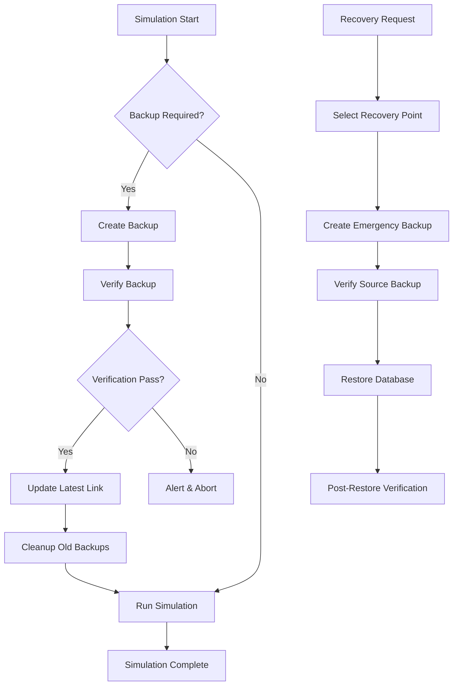

# Production Data Safety & Backup System Operational Runbook

**Epic E043: Production Data Safety & Backup System**
**Document Version**: 1.0
**Last Updated**: August 18, 2025
**Status**: Implementation Complete

## Overview

This runbook provides comprehensive operational procedures for PlanWise Navigator's production data safety and backup system. The system provides enterprise-grade protection against data loss with automated backups, verification, and recovery capabilities.

## System Architecture

### Components

1. **BackupManager** (`navigator_orchestrator/backup_manager.py`)
   - Automated backup creation with atomic operations
   - Backup verification and integrity checking
   - Automated cleanup and retention management
   - Latest symlink management

2. **RecoveryManager** (`navigator_orchestrator/recovery_manager.py`)
   - Comprehensive backup verification
   - Recovery point management
   - Emergency backup creation
   - Automated restore procedures

3. **Configuration Management** (`navigator_orchestrator/config.py`)
   - Production safety configuration validation
   - Environment variable override support
   - Secure defaults and validation

### Data Flow



## Quick Start (5 Minutes)

### Initial Setup

```bash
# 1. Create backup infrastructure
mkdir -p backups logs

# 2. Setup configuration
cat > config/orchestration_config.yaml << EOF
simulation:
  start_year: 2025
  end_year: 2029
  random_seed: 42
  target_growth_rate: 0.03

compensation:
  cola_rate: 0.005
  merit_budget: 0.025

workforce:
  total_termination_rate: 0.12
  new_hire_termination_rate: 0.25

production_safety:
  db_path: "simulation.duckdb"
  backup_enabled: true
  backup_dir: "backups"
  backup_retention_days: 7
  backup_before_simulation: true
  verify_backups: true
  max_backup_size_gb: 10.0
  log_level: "INFO"
  log_dir: "logs"
  require_backup_before_run: true
  enable_emergency_backups: true

scenario_id: "default"
plan_design_id: "standard_401k"
EOF

# 3. Add to .gitignore
echo "backups/" >> .gitignore
echo "logs/" >> .gitignore

# 4. Test backup system
python -c "
from navigator_orchestrator.backup_manager import BackupManager
from navigator_orchestrator.config import load_orchestration_config, get_backup_configuration

config = load_orchestration_config()
backup_config = get_backup_configuration(config)
bm = BackupManager(**backup_config)
backup_path = bm.create_backup()
print(f'Backup created: {backup_path}')
"
```

### Verification

```bash
# Verify backup system status
python -c "
from navigator_orchestrator.backup_manager import BackupManager
from navigator_orchestrator.recovery_manager import RecoveryManager

bm = BackupManager()
rm = RecoveryManager(bm)

print('=== BACKUP STATUS ===')
status = bm.get_backup_status()
for key, value in status.items():
    print(f'{key}: {value}')

print('\n=== RECOVERY STATUS ===')
recovery_status = rm.get_recovery_status()
for key, value in recovery_status.items():
    print(f'{key}: {value}')
"
```

## Operational Procedures

### 1. Daily Operations

#### Morning Health Check
```bash
# Check backup system health
python -c "
from navigator_orchestrator.backup_manager import BackupManager
from navigator_orchestrator.recovery_manager import RecoveryManager

bm = BackupManager()
rm = RecoveryManager(bm)

# Get system status
backup_status = bm.get_backup_status()
recovery_status = rm.get_recovery_status()

print(f'Backup Count: {backup_status[\"backup_count\"]}')
print(f'Total Size: {backup_status[\"total_size_gb\"]:.2f} GB')
print(f'Database Size: {backup_status[\"database_size_gb\"]:.2f} GB')
print(f'Recovery Readiness: {recovery_status[\"recovery_readiness\"]}')
print(f'Verified Recovery Points: {recovery_status[\"verified_recovery_points\"]}')

# Alert if issues found
if backup_status['backup_count'] < 3:
    print('⚠️  WARNING: Low backup count')
if recovery_status['recovery_readiness'] == 'poor':
    print('🚨 CRITICAL: Poor recovery readiness')
"
```

#### Pre-Simulation Backup
```bash
# Manual backup before simulation (automatic if configured)
python -c "
from navigator_orchestrator.backup_manager import BackupManager

bm = BackupManager()
backup = bm.create_backup()
print(f'Pre-simulation backup created: {backup.backup_path}')
print(f'Creation time: {backup.creation_time:.2f}s')
print(f'Verification: {backup.verification_status}')
"
```

### 2. Backup Management

#### List Available Backups
```bash
python -c "
from navigator_orchestrator.backup_manager import BackupManager

bm = BackupManager()
backups = bm.list_backups()

print('Available Backups:')
for i, backup in enumerate(backups):
    print(f'{i+1}. {backup.backup_path.name}')
    print(f'   Timestamp: {backup.timestamp}')
    print(f'   Size: {backup.backup_size / (1024**2):.1f} MB')
    print()
"
```

#### Verify Specific Backup
```bash
python -c "
from navigator_orchestrator.backup_manager import BackupManager
from navigator_orchestrator.recovery_manager import RecoveryManager
from pathlib import Path

backup_path = Path('backups/simulation_20250818_143000.duckdb')  # Adjust path
rm = RecoveryManager(BackupManager())

validation = rm.verify_backup_comprehensive(backup_path)
print(f'Verification Success: {validation.success}')
print(f'Integrity Score: {validation.data_integrity_score:.2f}')
print(f'Checks Performed: {len(validation.checks_performed)}')
if validation.warnings:
    print(f'Warnings: {validation.warnings}')
if validation.errors:
    print(f'Errors: {validation.errors}')
"
```

#### Manual Backup Creation
```bash
python -c "
from navigator_orchestrator.backup_manager import BackupManager

bm = BackupManager()
backup = bm.create_backup()
print(f'Manual backup created: {backup.backup_path}')
"
```

### 3. Recovery Procedures

#### Emergency Recovery (Latest Backup)
```bash
# Emergency restore from latest backup
python -c "
from navigator_orchestrator.backup_manager import BackupManager
from navigator_orchestrator.recovery_manager import RecoveryManager

bm = BackupManager()
rm = RecoveryManager(bm)

print('Starting emergency recovery...')
operation = rm.restore_from_backup()

print(f'Recovery Operation: {operation.operation_id}')
print(f'Success: {operation.success}')
print(f'Duration: {operation.duration:.2f}s')
if not operation.success:
    print(f'Error: {operation.details.get(\"error\", \"Unknown error\")}')
"
```

#### Point-in-Time Recovery
```bash
# Recovery from specific backup
python -c "
from navigator_orchestrator.backup_manager import BackupManager
from navigator_orchestrator.recovery_manager import RecoveryManager
from pathlib import Path

bm = BackupManager()
rm = RecoveryManager(bm)

# Specify backup path
backup_path = Path('backups/simulation_20250818_120000.duckdb')  # Adjust timestamp

print(f'Starting point-in-time recovery from: {backup_path}')
operation = rm.restore_from_backup(backup_path=backup_path)

print(f'Recovery Operation: {operation.operation_id}')
print(f'Success: {operation.success}')
print(f'Duration: {operation.duration:.2f}s')
"
```

#### Recovery Point Assessment
```bash
# List and assess all recovery points
python -c "
from navigator_orchestrator.backup_manager import BackupManager
from navigator_orchestrator.recovery_manager import RecoveryManager

rm = RecoveryManager(BackupManager())
recovery_points = rm.get_recovery_points()

print('Available Recovery Points:')
for i, rp in enumerate(recovery_points):
    print(f'{i+1}. {rp.backup_path.name}')
    print(f'   Timestamp: {rp.timestamp}')
    print(f'   Integrity Score: {rp.data_integrity_score:.2f}')
    print(f'   Table Count: {rp.table_count}')
    print(f'   Total Rows: {rp.total_rows:,}')
    print(f'   Status: {rp.verification_status}')
    print()
"
```

### 4. Maintenance Operations

#### Cleanup Old Backups
```bash
# Manual cleanup (automatic by default)
python -c "
from navigator_orchestrator.backup_manager import BackupManager

bm = BackupManager()
bm._cleanup_old_backups()
print('Backup cleanup completed')
"
```

#### Update Backup Retention
```bash
# Change retention policy
python -c "
from navigator_orchestrator.backup_manager import BackupManager, BackupConfiguration

config = BackupConfiguration(retention_days=14)  # 14 days instead of 7
bm = BackupManager(config)
print(f'Backup retention updated to {config.retention_days} days')
"
```

## Troubleshooting Guide

### Common Issues

#### Issue: "Database file not found"
**Cause**: Database path configuration incorrect or file moved
**Solution**:
```bash
# Check current working directory
pwd

# Verify database exists
ls -la simulation.duckdb

# Check configuration
python -c "
from navigator_orchestrator.config import load_orchestration_config
config = load_orchestration_config()
print(f'Configured DB path: {config.production_safety.db_path}')
"
```

#### Issue: "Backup directory not writable"
**Cause**: Insufficient permissions on backup directory
**Solution**:
```bash
# Check permissions
ls -la backups/

# Fix permissions
chmod 755 backups/
sudo chown $USER:$USER backups/

# Test write access
touch backups/.test && rm backups/.test && echo "Write access OK"
```

#### Issue: "Insufficient disk space"
**Cause**: Not enough space for backup operations
**Solution**:
```bash
# Check disk usage
df -h .

# Check backup directory size
du -sh backups/

# Clean old backups manually if needed
ls -la backups/simulation_*.duckdb | head -20  # Show oldest
# Remove specific old backups: rm backups/simulation_20250801_*.duckdb
```

#### Issue: "Backup verification failed"
**Cause**: Corrupted backup or database issues
**Solution**:
```bash
# Try comprehensive verification
python -c "
from navigator_orchestrator.backup_manager import BackupManager
from navigator_orchestrator.recovery_manager import RecoveryManager
from pathlib import Path

backup_path = Path('backups/latest.duckdb')
rm = RecoveryManager(BackupManager())

validation = rm.verify_backup_comprehensive(backup_path)
print('Detailed verification results:')
print(f'Success: {validation.success}')
print(f'Checks: {validation.checks_performed}')
print(f'Warnings: {validation.warnings}')
print(f'Errors: {validation.errors}')
"

# If backup is corrupted, use previous backup
python -c "
from navigator_orchestrator.backup_manager import BackupManager

bm = BackupManager()
backups = bm.list_backups()
print('Available backups (newest first):')
for i, backup in enumerate(backups[:5]):
    print(f'{i+1}. {backup.backup_path.name} - {backup.timestamp}')
"
```

#### Issue: "Recovery operation failed"
**Cause**: Various issues during restore process
**Solution**:
```bash
# Check recovery operation details
python -c "
# Look at last recovery log
with open('logs/recovery/recovery_audit.log', 'r') as f:
    lines = f.readlines()
    print('Last 10 recovery log entries:')
    for line in lines[-10:]:
        print(line.strip())
"

# Try with different recovery point
python -c "
from navigator_orchestrator.backup_manager import BackupManager
from navigator_orchestrator.recovery_manager import RecoveryManager

rm = RecoveryManager(BackupManager())
recovery_points = rm.get_recovery_points()

# Try second-newest backup
if len(recovery_points) > 1:
    print(f'Trying recovery from: {recovery_points[1].backup_path}')
    operation = rm.restore_from_backup(backup_path=recovery_points[1].backup_path)
    print(f'Success: {operation.success}')
"
```

### Performance Optimization

#### Large Database Backups
For databases > 5GB:
```bash
# Disable verification for speed (not recommended for production)
python -c "
from navigator_orchestrator.backup_manager import BackupManager, BackupConfiguration

config = BackupConfiguration(verify_backups=False)
bm = BackupManager(config)
backup = bm.create_backup()
print(f'Fast backup created: {backup.backup_path}')
"
```

#### Monitor Backup Performance
```bash
# Track backup creation time
python -c "
from navigator_orchestrator.backup_manager import BackupManager
import time

bm = BackupManager()
start_time = time.time()
backup = bm.create_backup()
total_time = time.time() - start_time

print(f'Backup Performance:')
print(f'Total Time: {total_time:.2f}s')
print(f'Creation Time: {backup.creation_time:.2f}s')
print(f'File Size: {backup.backup_size / (1024**3):.2f} GB')
print(f'Throughput: {(backup.backup_size / (1024**2)) / backup.creation_time:.1f} MB/s')
"
```

## Security Considerations

### File Permissions
```bash
# Set secure permissions on backup directory
chmod 700 backups/
chmod 600 backups/*.duckdb

# Set secure permissions on log directory
chmod 700 logs/
chmod 600 logs/*.log
```

### Backup Encryption (Future Enhancement)
Currently backups are stored unencrypted. For production deployment with sensitive data, consider:
- Encrypting backup files at rest
- Secure backup storage location
- Access control for backup directories
- Audit logging of backup access

## Integration with Simulation Pipeline

### Automatic Backup Integration
The backup system integrates with the simulation pipeline through configuration:

```python
# Example integration in orchestrator
from navigator_orchestrator.config import load_orchestration_config
from navigator_orchestrator.backup_manager import BackupManager
from navigator_orchestrator.recovery_manager import RecoveryManager

# Load configuration
config = load_orchestration_config()

# Initialize backup system
backup_config = get_backup_configuration(config)
backup_manager = BackupManager(**backup_config)
recovery_manager = RecoveryManager(backup_manager)

# Pre-simulation backup if required
if config.production_safety.backup_before_simulation:
    backup_manager.create_backup()

# Run simulation...
# (simulation code here)

# Post-simulation verification
status = backup_manager.get_backup_status()
recovery_status = recovery_manager.get_recovery_status()
```

## Monitoring and Alerting

### Health Check Script
Create a monitoring script for automated health checks:

```python
#!/usr/bin/env python3
"""
Production Data Safety Health Check
Run this script regularly to monitor backup system health
"""

from navigator_orchestrator.backup_manager import BackupManager
from navigator_orchestrator.recovery_manager import RecoveryManager
from datetime import datetime, timedelta
import sys

def health_check():
    try:
        bm = BackupManager()
        rm = RecoveryManager(bm)

        # Get system status
        backup_status = bm.get_backup_status()
        recovery_status = rm.get_recovery_status()

        # Check backup count
        if backup_status['backup_count'] < 3:
            print("CRITICAL: Less than 3 backups available")
            return False

        # Check recent backups
        if recovery_status['recent_recovery_points'] == 0:
            print("WARNING: No recent backups (last 24 hours)")

        # Check recovery readiness
        if recovery_status['recovery_readiness'] in ['poor', 'critical']:
            print(f"CRITICAL: Poor recovery readiness - {recovery_status['recovery_readiness']}")
            return False

        # Check database accessibility
        if not recovery_status['database_status']['accessible']:
            print("CRITICAL: Database not accessible")
            return False

        print("HEALTHY: All backup system checks passed")
        return True

    except Exception as e:
        print(f"ERROR: Health check failed - {str(e)}")
        return False

if __name__ == "__main__":
    success = health_check()
    sys.exit(0 if success else 1)
```

### Log Monitoring
Monitor these log files for issues:
- `logs/backup_manager.log` - Backup operations
- `logs/recovery/recovery_audit.log` - Recovery operations
- `logs/dbt.log` - Simulation pipeline logs

Key patterns to watch for:
- "Backup creation failed"
- "Verification failed"
- "Insufficient disk space"
- "Recovery operation failed"

## Appendix

### Configuration Reference

Complete production safety configuration options:

```yaml
production_safety:
  # Database configuration
  db_path: "simulation.duckdb"                    # Path to simulation database

  # Backup configuration
  backup_enabled: true                            # Enable automatic backups
  backup_dir: "backups"                          # Backup directory path
  backup_retention_days: 7                       # Backup retention period (days)
  backup_before_simulation: true                 # Create backup before each simulation

  # Verification settings
  verify_backups: true                           # Enable backup verification
  max_backup_size_gb: 10.0                      # Maximum backup size in GB

  # Logging configuration
  log_level: "INFO"                              # Logging level (DEBUG/INFO/WARNING/ERROR)
  log_dir: "logs"                                # Log directory path

  # Safety checks
  require_backup_before_run: true                # Require backup before simulation
  enable_emergency_backups: true                # Create emergency backup on restore
```

### Environment Variable Overrides

Override configuration using environment variables:

```bash
# Database path
export NAV_PRODUCTION_SAFETY__DB_PATH="custom_simulation.duckdb"

# Backup settings
export NAV_PRODUCTION_SAFETY__BACKUP_RETENTION_DAYS=14
export NAV_PRODUCTION_SAFETY__VERIFY_BACKUPS=false

# Logging
export NAV_PRODUCTION_SAFETY__LOG_LEVEL="DEBUG"
```

### API Reference

Key classes and methods:

#### BackupManager
- `create_backup()` - Create new backup with verification
- `list_backups()` - List all available backups
- `restore_backup(backup_path)` - Restore from specific backup
- `get_backup_status()` - Get comprehensive backup status

#### RecoveryManager
- `verify_backup_comprehensive(backup_path)` - Full backup verification
- `get_recovery_points()` - List all recovery points with status
- `test_recovery_point(recovery_point)` - Test specific recovery point
- `restore_from_backup(backup_path, verify, emergency)` - Full restore with safety checks
- `get_recovery_status()` - Get recovery system status

#### Configuration
- `load_orchestration_config(path)` - Load and validate configuration
- `validate_production_configuration(config)` - Validate production settings
- `get_backup_configuration(config)` - Extract backup settings

---

**Document Maintained By**: Platform Engineering Team
**Review Schedule**: Monthly
**Next Review**: September 18, 2025
