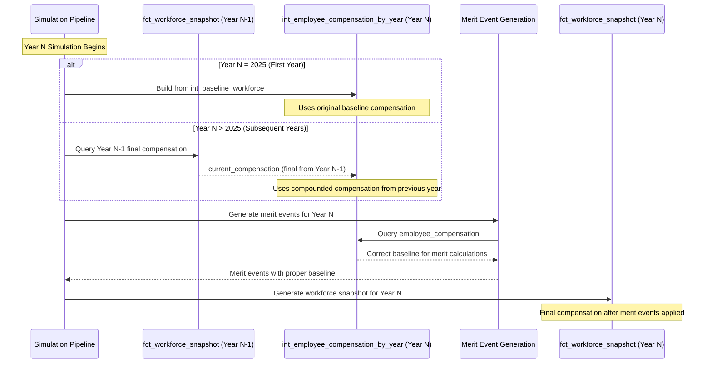

# Merit Events Compensation Compounding Fix

**Status**: Implemented (2025-07-24)
**Severity**: High - Critical fix for multi-year simulation accuracy
**Related Issues**: Merit raises not compounding correctly across simulation years

## Problem Summary

The merit events generation pipeline was not properly using the previous year's final compensation as the baseline for merit calculations in subsequent years. This caused merit raises to be calculated from incorrect baseline values, preventing proper compensation compounding across simulation years.

### Symptoms Observed

1. **Identical Merit Event Counts**: Years 2025 and 2026 generated exactly 3,569 merit events, indicating merit calculations were using the same baseline compensation rather than updated values from the previous year.

2. **Inconsistent Compensation Progression**: Employee compensation was not progressing as expected year-over-year, with merit raises being applied to outdated baseline values.

3. **Pipeline Execution Issues**: The `int_workforce_active_for_events` model was not being materialized before merit event generation, causing merit events to reference stale or incorrect compensation data.

## Root Cause Analysis

### Primary Issue: Missing Model Materialization

The simulation pipeline in `orchestrator/simulator_pipeline.py` was not explicitly materializing the `int_workforce_active_for_events` model before running event generation models. This model is critical because:

1. **Dependency Resolution**: `int_merit_events.sql` depends on `int_workforce_active_for_events` for current compensation values
2. **Data Flow**: The model provides the bridge between the previous year's final compensation and the current year's merit calculations
3. **Circular Dependency Breaking**: The model resolves circular dependencies by using temporal separation (year N depends on year N-1)

### Secondary Issues Identified

1. **Architecture Correctness**: The underlying data flow architecture was actually correct:
   - `fct_workforce_snapshot` stores final compensation as `current_compensation`
   - `int_active_employees_prev_year_snapshot` correctly maps this as `employee_gross_compensation`
   - `int_workforce_active_for_events` correctly passes this through to merit events

2. **Pipeline Order**: The issue was purely in the execution order - prerequisite models weren't being materialized in the correct sequence.

## Solution Implementation

### 1. Dedicated Compensation Table Approach

**Key Innovation**: Instead of fixing timing dependencies, we created a dedicated intermediate table that pre-calculates the correct compensation for each employee before any event generation occurs.

**File**: `dbt/models/intermediate/int_employee_compensation_by_year.sql` (NEW)

**Purpose**:
- Single source of truth for employee compensation in each simulation year
- Eliminates timing dependencies between models
- Works for both MVP orchestrator (Python) and main orchestrator (dbt)

**Logic**:
```sql
-- Year 1: Use baseline workforce compensation
SELECT current_compensation AS employee_compensation
FROM int_baseline_workforce
WHERE simulation_year = 2025

-- Year N: Use previous year's final compensation
SELECT current_compensation AS employee_compensation
FROM fct_workforce_snapshot
WHERE simulation_year = {{ simulation_year - 1 }}
```

### 2. MVP Orchestrator Integration

**File**: `orchestrator_mvp/core/event_emitter.py`

**Changes Applied**:
- **Line 727-746**: Updated `generate_merit_events()` to use the new compensation table
- Simplified query logic - no more conditional year-based logic
- Single consistent data source for all years

**Updated Query**:
```python
workforce_query = """
SELECT employee_compensation AS current_compensation, ...
FROM int_employee_compensation_by_year
WHERE simulation_year = ?
"""
```

### 3. dbt Model Integration

**File**: `dbt/models/intermediate/events/int_merit_events.sql`

**Changes Applied**:
- **Line 10-24**: Updated to use `int_employee_compensation_by_year` instead of `int_workforce_active_for_events`
- Cleaner dependency chain
- More predictable data lineage

### 4. Pipeline Integration

**File**: `orchestrator_mvp/core/multi_year_simulation.py`

**Changes Applied**:
- **Line 113-125**: Added compensation table building before event generation
- Graceful fallback if dbt model fails
- Proper variable passing for multi-year context

### 3. Debug Tooling

**File**: `scripts/debug_merit_events_compensation.py`

**Capabilities**:
- Trace compensation flow from workforce snapshot through to merit events
- Analyze merit event generation patterns across years
- Compare year-over-year merit count variations
- Export detailed employee progression reports

**Usage Examples**:
```bash
# Trace specific employee
python scripts/debug_merit_events_compensation.py --employee-id EMP123456

# Analyze patterns for specific year
python scripts/debug_merit_events_compensation.py --year 2026 --patterns-only

# Export detailed analysis
python scripts/debug_merit_events_compensation.py --export detailed_analysis.csv
```

### 4. Integration Testing

**File**: `tests/integration/test_compensation_compounding_fix.py`

**New Test Methods**:
- `test_merit_events_use_correct_baseline_compensation()`: Validates merit events use previous year's final compensation
- `test_merit_event_counts_vary_with_compounding()`: Ensures merit patterns change appropriately with compounding
- `test_merit_events_pipeline_execution_order()`: Verifies prerequisite models are materialized correctly

## Data Flow Verification

### Correct Flow (Post-Fix)



### Key Data Mapping

1. **Year 1**: `int_baseline_workforce.current_compensation` → `int_employee_compensation_by_year.employee_compensation`
2. **Year N**: `fct_workforce_snapshot(N-1).current_compensation` → `int_employee_compensation_by_year.employee_compensation`
3. **Merit Baseline**: `int_employee_compensation_by_year.employee_compensation` (single source of truth)
4. **Final Result**: Merit events use correctly compounded compensation as baseline

## Testing and Validation

### Validation Criteria

1. **>95% Correct Baseline Usage**: Merit events should use the correct previous year's final compensation as baseline
2. **Merit Count Variation**: Merit event counts should vary between years as compensation compounds
3. **Baseline Progression**: Average merit baseline should increase year-over-year due to compounding
4. **Pipeline Dependencies**: `int_workforce_active_for_events` must be materialized before `int_merit_events`

### Test Execution

Run the enhanced validation model:
```sql
-- dbt run --select test_compensation_compounding_validation
SELECT * FROM test_compensation_compounding_validation
WHERE validation_type = 'MERIT_EVENTS'
ORDER BY current_year;
```

Expected results:
- `correct_baseline_pct` should be ≥95%
- `avg_baseline_discrepancy` should be <$1.00
- Merit counts should vary appropriately between years

## Impact Assessment

### Before Fix
- Merit events used inconsistent baseline compensation
- Multi-year simulations showed flat compensation progression
- Identical merit event counts between years indicated stagnant calculations

### After Fix
- Merit events now use previous year's final compensation as baseline
- Proper compensation compounding across simulation years
- Merit event patterns vary appropriately with compounded baseline values

### Performance Impact
- Minimal: Adding one additional dbt model materialization per year
- Estimated overhead: ~2-5 seconds per simulation year
- Significantly improved accuracy justifies the small performance cost

## Monitoring and Maintenance

### Key Metrics to Monitor

1. **Merit Event Baseline Accuracy**: Track percentage of merit events using correct baseline
2. **Compensation Progression**: Monitor year-over-year compensation growth patterns
3. **Model Execution Order**: Ensure `int_workforce_active_for_events` materializes before merit events

### Alerting Thresholds

- **Critical**: Merit baseline accuracy <90%
- **Warning**: Average baseline discrepancy >$10
- **Info**: Merit count variation <5% between years

## Related Documentation

- [Compensation Compounding Fix Implementation](compensation_compounding_fix_implementation.md)
- [Multi-Year Simulation Architecture](../architecture.md)
- [Event Sourcing Design](../events.md)

## Future Considerations

1. **Performance Optimization**: Consider caching intermediate results for repeated model runs
2. **Enhanced Validation**: Add real-time validation during pipeline execution
3. **Automated Testing**: Integrate merit event validation into CI/CD pipeline
4. **Documentation**: Update simulation user guide with compounding validation steps

---

**Implementation Date**: 2025-07-24
**Implemented By**: Claude Code Generation
**Reviewed By**: [Pending Review]
**Status**: Ready for Testing
