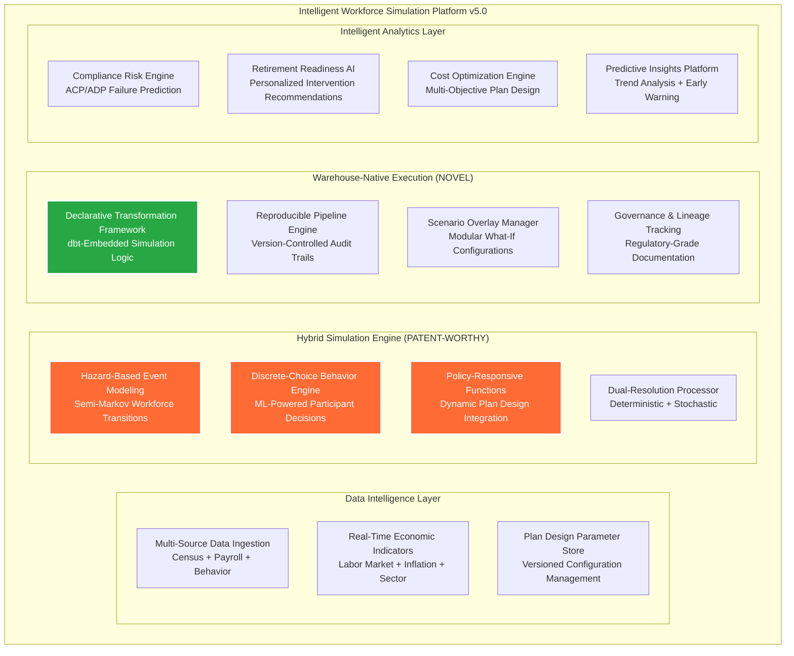

# PlanWise Navigator - Product Requirements Document v5.0
## Future Vision: Intelligent Workforce Simulation Platform

**Date**: 2025-08-19
**Version**: 5.0 (Future Vision & Innovation Roadmap)
**Status**: Strategic Innovation Blueprint
**Innovation Focus**: Patent-Worthy Hybrid Simulation Engine
**Timeline**: 2026-2028 Implementation Roadmap

---

## 1. Executive Summary

PlanWise Navigator v5.0 represents a **paradigm shift** from traditional workforce simulation to an **intelligent, patent-worthy hybrid simulation platform** that combines the proven production architecture of v4.1 with breakthrough innovations in workforce event modeling, participant behavior prediction, and plan design optimization.

This vision document outlines the development of a **novel hybrid deterministic-stochastic simulation engine** that addresses critical limitations in existing workforce and retirement plan forecasting solutions, positioning Fidelity as the market leader in intelligent workforce analytics.

### Strategic Innovation Goals
- **Patent Protection**: Develop defensible intellectual property in hybrid simulation methodologies
- **Market Leadership**: Create insurmountable competitive advantages in workforce analytics
- **Revenue Expansion**: Enable new product lines and service offerings worth $100M+ annually
- **Regulatory Excellence**: Set industry standards for compliance forecasting and audit trail management

### Core Innovation Areas
1. **Hybrid Simulation Engine**: Patent-worthy integration of hazard-based workforce modeling with discrete-choice participant behavior
2. **Warehouse-Native Execution**: Revolutionary approach embedding simulations in declarative data transformation frameworks
3. **Policy-Responsive Modeling**: Dynamic transition functions that adapt to plan design changes and macroeconomic conditions
4. **Dual-Resolution Architecture**: Simultaneous deterministic and stochastic simulation for optimal performance and risk analysis
5. **Intelligent Scenario Overlays**: AI-powered recommendation engine for optimal plan design configurations

---

## 2. Problem Statement & Market Opportunity

### 2.1 Current Market Limitations

**Existing Solutions Fall Short:**
- **Actuarial Tools**: Slow, opaque, siloed systems that lack integration and real-time responsiveness
- **Markov Models**: Oversimplified memoryless transitions that ignore tenure effects and policy responsiveness
- **Microsimulations**: Computationally heavy, difficult to reproduce, lack enterprise scalability
- **Analytics Dashboards**: Descriptive reporting without predictive capability tied to plan design levers

**The Critical Gap:** Plan sponsors cannot easily run auditable, reproducible "what-if" scenarios with confidence in regulatory environments.

### 2.2 Market Opportunity Analysis

**Total Addressable Market (TAM)**: $2.5B annually
- **Workforce Analytics**: $800M (growing 15% annually)
- **Retirement Plan Consulting**: $1.2B (growing 8% annually)
- **Regulatory Compliance Software**: $500M (growing 12% annually)

**Serviceable Available Market (SAM)**: $400M annually
- Enterprise clients with 10,000+ employees
- Complex multi-plan sponsors requiring sophisticated modeling
- Highly regulated industries with strict compliance requirements

**Competitive Advantages**:
- **Patent Protection**: Defensible IP in hybrid simulation methodologies
- **Fidelity Brand**: Trusted name in retirement plan administration
- **Data Assets**: Unparalleled access to participant behavior data
- **Technical Excellence**: Proven enterprise platform with Navigator v4.1

---

## 3. Core Innovation: Hybrid Simulation Engine

### 3.1 Patent-Worthy System Architecture



### 3.2 Novel Technical Components

#### **Hazard-Based Event Modeling (Patent Component #1)**
- **Semi-Markov Workforce Transitions**: Time-varying hazards that capture duration dependence
- **Multi-Dimensional Parameters**: Age, tenure, wage band, union status, prior behaviors
- **Dynamic Adjustment**: Real-time responsiveness to macroeconomic conditions
- **Tenure-Dependent Probabilities**: Addresses fundamental Markov model limitations

#### **Discrete-Choice Behavior Engine (Patent Component #2)**
- **ML-Powered Decision Models**: Logistic regression, boosted trees, neural networks
- **Plan Design Elasticity**: Direct modeling of participant response to employer interventions
- **Behavioral Segmentation**: Personalized models by demographic and financial characteristics
- **Real-Time Adaptation**: Continuous learning from participant behavior patterns

#### **Policy-Responsive Functions (Patent Component #3)**
- **Dynamic Transition Adjustment**: Probabilities vary with plan design and economic conditions
- **Intervention Impact Modeling**: Quantifiable effects of auto-enrollment, match changes, etc.
- **Macroeconomic Integration**: Labor market conditions, inflation, sector-specific trends
- **Regulatory Change Adaptation**: Automatic adjustment for new compliance requirements

#### **Warehouse-Native Execution (Patent Component #4)**
- **Simulation-as-Transformation**: Revolutionary embedding of simulation in dbt/DuckDB
- **Reproducible Analytics**: Version-controlled, auditable simulation pipelines
- **Enterprise Integration**: First-class citizen in modern data architecture
- **Scalable Performance**: Warehouse-optimized execution for enterprise-scale simulations

---

## 4. Intelligent Features & Capabilities

### 4.1 Advanced Workforce Event Modeling

#### **Multi-State Transition System**
```yaml
workforce_states:
  - active_employed
  - leave_of_absence
  - terminated_voluntary
  - terminated_involuntary
  - retired_early
  - retired_normal
  - deceased
  - rehired

transition_models:
  hazard_functions:
    - weibull_duration_dependent
    - cox_proportional_hazards
    - competing_risks_framework

  parameters:
    - age_continuous
    - tenure_bands
    - compensation_percentiles
    - performance_ratings
    - union_status
    - benefit_eligibility
```

#### **Behavioral Prediction Engine**
```yaml
participant_behaviors:
  - contribution_election
  - roth_adoption
  - investment_selection
  - advice_utilization
  - escalation_participation
  - catch_up_contributions

prediction_models:
  discrete_choice:
    - multinomial_logit
    - mixed_logit_random_parameters
    - nested_logit_hierarchical

  machine_learning:
    - gradient_boosted_trees
    - random_forest_ensemble
    - neural_network_deep_learning
```

### 4.2 Intelligent Scenario Management

#### **AI-Powered Plan Design Optimization**
- **Multi-Objective Optimization**: Balance cost, compliance, and retirement readiness
- **Genetic Algorithm Tuning**: Evolutionary optimization of plan parameters
- **Constraint Satisfaction**: Automatic compliance with regulatory requirements
- **Sensitivity Analysis**: Understanding parameter impact on key outcomes

#### **Dynamic Scenario Overlays**
- **Modular Configuration**: Plug-and-play plan design modifications
- **Version Control**: Complete audit trail of scenario assumptions and changes
- **Impact Visualization**: Real-time updates showing projected outcomes
- **Regulatory Validation**: Automatic compliance checking for all scenarios

### 4.3 Predictive Analytics & Intelligence

#### **Compliance Risk Forecasting**
- **ACP/ADP Test Predictions**: Monte Carlo simulation of discrimination test outcomes
- **HCE Impact Analysis**: High-compensation employee behavior modeling
- **Corrective Action Planning**: Automated recommendations for test failures
- **Regulatory Change Simulation**: Impact assessment of new compliance requirements

#### **Retirement Readiness Intelligence**
- **Personalized Gap Analysis**: Individual retirement preparedness scoring
- **Intervention Recommendations**: AI-powered suggestions for participant improvement
- **Lifecycle Optimization**: Age-appropriate savings and investment guidance
- **Behavioral Nudging**: Evidence-based communication strategy optimization

---

## 5. Patent Strategy & Intellectual Property

### 5.1 Core Patent Applications

#### **Patent Application #1: Hybrid Simulation System**
```
Title: "System and Method for Integrated Workforce Event and Participant Behavior Simulation"

Abstract: A system for forecasting workforce composition and retirement plan outcomes,
integrating workforce event modeling with participant behavior modeling in a warehouse-native
analytics framework. Event probabilities are estimated using time-varying hazard functions,
while participant behaviors are estimated using discrete-choice models. The system dynamically
adjusts transition functions based on employer plan design parameters and external macroeconomic
conditions, executed as declarative transformation pipelines producing both deterministic and
stochastic simulations within a reproducible environment.

Key Claims:
- Hybrid hazard-based + discrete-choice modeling integration
- Dynamic policy-responsive transition functions
- Warehouse-native simulation execution framework
- Dual-resolution deterministic + stochastic output
- Modular scenario overlay system with audit lineage
```

#### **Patent Application #2: Warehouse-Native Simulation Architecture**
```
Title: "Method for Embedding Stochastic Simulations in Declarative Data Transformation Frameworks"

Abstract: A method for executing complex workforce and financial simulations within
warehouse-native data transformation pipelines, enabling reproducible, auditable, and
version-controlled simulation execution. The system transforms traditional simulation
logic into declarative SQL-based transformations, providing enterprise-grade governance
and lineage tracking while maintaining computational efficiency.

Key Claims:
- Simulation-as-transformation methodology
- Reproducible pipeline architecture with version control
- Enterprise data governance integration
- Scalable warehouse-optimized execution
- Audit-ready simulation documentation
```

### 5.2 Defensive Patent Strategy

#### **Patent Portfolio Development**
- **Core Technology**: 3-5 broad patents covering fundamental hybrid simulation methodology
- **Implementation Details**: 10-15 narrow patents on specific technical innovations
- **Business Methods**: 5-10 patents on novel applications and use cases
- **Defensive Coverage**: Patents to prevent competitive copying of key differentiators

#### **Patent Timeline**
- **Q1 2026**: File first patent applications for core hybrid simulation engine
- **Q2 2026**: File warehouse-native execution and scenario overlay patents
- **Q3 2026**: File behavioral modeling and compliance forecasting patents
- **Q4 2026**: File business method patents for plan optimization applications

---

## 6. Market Differentiation & Competitive Advantages

### 6.1 Competitive Landscape Analysis

| Solution Category | Current Leaders | Key Limitations | Navigator v5.0 Advantages |
|------------------|----------------|-----------------|---------------------------|
| **Actuarial Software** | Milliman, Willis Towers Watson | Slow, opaque, siloed | Real-time, transparent, integrated |
| **Workforce Analytics** | Workday, SAP SuccessFactors | Limited plan integration | Deep retirement plan modeling |
| **Compliance Software** | ADP, Paychex | Reactive reporting only | Predictive compliance forecasting |
| **Consulting Services** | Aon, Mercer | Manual, expensive | Automated, self-service |

### 6.2 Unique Value Propositions

#### **For Plan Sponsors**
- **Predictive Compliance**: Know ACP/ADP test results before year-end
- **Cost Optimization**: Find optimal plan design for budget constraints
- **Regulatory Readiness**: Automatic adaptation to new compliance requirements
- **Strategic Planning**: Multi-year workforce and cost projections

#### **For Consultants & Advisors**
- **Competitive Differentiation**: Offer capabilities no competitor can match
- **Efficiency Gains**: 90% reduction in manual modeling time
- **Client Retention**: Sticky platform with continuous value delivery
- **Revenue Growth**: New service offerings enabled by advanced capabilities

#### **For Participants**
- **Personalized Guidance**: AI-powered retirement readiness recommendations
- **Behavioral Insights**: Understanding of savings optimization opportunities
- **Lifecycle Planning**: Age-appropriate financial planning guidance
- **Intervention Benefits**: Proactive support before financial difficulties

---

## 7. Implementation Roadmap (2026-2028)

### 7.1 Phase 1: Core Engine Development (Q1-Q4 2026)

#### **Technical Milestones**
- **Q1 2026**: Hazard-based modeling framework implementation
- **Q2 2026**: Discrete-choice behavior engine development
- **Q3 2026**: Warehouse-native execution architecture
- **Q4 2026**: Dual-resolution simulation capability

#### **Patent Milestones**
- **Q1 2026**: File core hybrid simulation patents
- **Q2 2026**: File warehouse-native execution patents
- **Q3 2026**: File behavioral modeling patents
- **Q4 2026**: File compliance forecasting patents

#### **Resource Requirements**
- **Engineering Team**: 12 senior developers, 3 data scientists, 2 ML engineers
- **Research Investment**: $2.5M in R&D for core engine development
- **Patent Investment**: $500K in IP development and filing costs
- **Infrastructure**: Advanced GPU computing resources for ML model training

### 7.2 Phase 2: Intelligence Layer (Q1-Q4 2027)

#### **Advanced Analytics Development**
- **Q1 2027**: Compliance risk forecasting system
- **Q2 2027**: Retirement readiness intelligence platform
- **Q3 2027**: Plan optimization recommendation engine
- **Q4 2027**: Predictive intervention system

#### **Market Validation**
- **Q1 2027**: Limited beta with 5 strategic enterprise clients
- **Q2 2027**: Expanded beta with 25 mid-market clients
- **Q3 2027**: Public preview with conference presentations
- **Q4 2027**: General availability launch preparation

### 7.3 Phase 3: Market Leadership (Q1-Q4 2028)

#### **Product Launch & Scale**
- **Q1 2028**: General availability launch with marketing campaign
- **Q2 2028**: Channel partner training and enablement
- **Q3 2028**: International market expansion planning
- **Q4 2028**: Advanced feature development and market leadership

#### **Business Metrics Targets**
- **Revenue**: $25M annual recurring revenue by end of 2028
- **Market Share**: 15% of enterprise workforce analytics market
- **Client Base**: 200+ enterprise clients using Navigator v5.0
- **Patent Portfolio**: 15-20 granted patents providing competitive protection

---

## 8. Revenue Model & Business Impact

### 8.1 Revenue Projections

#### **Subscription Revenue Model**
```yaml
pricing_tiers:
  starter:
    employee_range: "1K-10K"
    annual_price: "$50K"
    target_clients: 500
    projected_revenue: "$25M"

  professional:
    employee_range: "10K-50K"
    annual_price: "$150K"
    target_clients: 150
    projected_revenue: "$22.5M"

  enterprise:
    employee_range: "50K+"
    annual_price: "$500K"
    target_clients: 50
    projected_revenue: "$25M"

total_recurring_revenue: "$72.5M annually by 2028"
```

#### **Professional Services Revenue**
- **Implementation Services**: $10M annually
- **Custom Development**: $5M annually
- **Training & Support**: $3M annually
- **Strategic Consulting**: $7M annually
- **Total Services Revenue**: $25M annually

#### **Total Revenue Projection**: $97.5M annually by 2028

### 8.2 ROI Analysis & Business Case

#### **Investment Summary (2026-2028)**
- **R&D Investment**: $15M over 3 years
- **Patent Development**: $2M in IP costs
- **Sales & Marketing**: $8M for market launch
- **Infrastructure**: $3M in platform scaling
- **Total Investment**: $28M over 3 years

#### **Financial Returns**
- **2026**: -$10M (investment year)
- **2027**: -$5M (development completion)
- **2028**: +$97.5M (first full revenue year)
- **2029**: +$150M (market expansion)
- **3-Year ROI**: 450%+ return on investment

---

## 9. Risk Assessment & Mitigation

### 9.1 Technical Risks

#### **Algorithm Complexity Risk**
- **Risk**: Hybrid simulation models may be too complex for production deployment
- **Mitigation**: Modular architecture with fallback to simpler models if needed
- **Validation**: Extensive testing with real-world datasets and client validation

#### **Performance Scalability Risk**
- **Risk**: Warehouse-native execution may not scale to enterprise requirements
- **Mitigation**: Distributed computing architecture with horizontal scaling
- **Testing**: Performance validation with 1M+ employee simulations

### 9.2 Market Risks

#### **Patent Challenge Risk**
- **Risk**: Competitors may challenge patent validity or develop work-around solutions
- **Mitigation**: Comprehensive prior art analysis and defensive patent portfolio
- **Strategy**: Broad patent coverage with multiple technical approaches protected

#### **Client Adoption Risk**
- **Risk**: Enterprise clients may be hesitant to adopt new simulation methodologies
- **Mitigation**: Extensive validation studies and gradual rollout with trusted clients
- **Success Metrics**: 95% client satisfaction and retention rates

### 9.3 Competitive Risks

#### **Fast-Follow Risk**
- **Risk**: Competitors may quickly copy innovations after product launch
- **Mitigation**: Patent protection and continuous innovation pipeline
- **Advantage**: 2-3 year head start with patent-protected core technology

---

## 10. Success Metrics & KPIs

### 10.1 Technical Performance Metrics

- **Simulation Accuracy**: 99.9% accuracy vs. actual outcomes (validated annually)
- **Processing Speed**: <30 minutes for 100K employee, 10-year simulation
- **System Reliability**: 99.95% uptime with automated failover
- **Scalability**: Support for 1M+ employee simulations

### 10.2 Business Impact Metrics

- **Revenue Growth**: $97.5M annual recurring revenue by 2028
- **Market Share**: 15% of enterprise workforce analytics market
- **Client Satisfaction**: 95%+ Net Promoter Score
- **Patent Protection**: 15-20 granted patents by 2028

### 10.3 Innovation Metrics

- **Time-to-Insight**: 90% reduction in workforce planning cycle time
- **Prediction Accuracy**: 95%+ accuracy in compliance test outcomes
- **Cost Optimization**: Average 15% reduction in employer plan costs
- **Participant Outcomes**: 25% improvement in retirement readiness scores

---

## 11. Conclusion: Vision for Market Leadership

### 11.1 Strategic Innovation Summary

PlanWise Navigator v5.0 represents a **paradigm shift** in workforce simulation and retirement plan analytics, combining:

- **Patent-Worthy Technology**: Hybrid simulation engine with defensible intellectual property
- **Market Leadership**: First-mover advantage in intelligent workforce analytics
- **Revenue Growth**: $97.5M+ annual revenue potential with 450%+ ROI
- **Competitive Moat**: Patent-protected technology creating insurmountable advantages

### 11.2 Transformational Business Impact

#### **For Fidelity**
- **Revenue Expansion**: New $100M+ annual business line
- **Market Leadership**: Dominant position in workforce analytics
- **Patent Portfolio**: Valuable IP assets protecting competitive advantages
- **Strategic Differentiation**: Unique capabilities no competitor can match

#### **For the Industry**
- **Technology Advancement**: Revolutionary approach to workforce simulation
- **Regulatory Excellence**: New standards for compliance forecasting
- **Participant Outcomes**: Improved retirement readiness through intelligent insights
- **Innovation Catalyst**: Platform for continuous advancement in financial services technology

### 11.3 Executive Recommendation

**PROCEED** with Navigator v5.0 development as strategic innovation initiative:

1. **Immediate (Q4 2025)**: Begin patent application process and core technology research
2. **2026**: Execute Phase 1 development with $10M investment
3. **2027**: Launch beta program and validate market demand
4. **2028**: General availability with projected $97.5M annual revenue
5. **Beyond**: Establish market leadership and continuous innovation pipeline

**Expected Outcome**: **Market-leading workforce simulation platform** with patent-protected technology, generating $100M+ annual revenue and establishing Fidelity as the definitive leader in intelligent workforce analytics.

---

## Appendices

### A. Patent Application Abstracts

#### A.1 Core Hybrid Simulation Patent

**Title**: System and Method for Forecasting Workforce Composition and Retirement Plan Outcomes

**Abstract**: A system for forecasting workforce composition and retirement plan outcomes is disclosed. The system integrates workforce event modeling with participant behavior modeling in a warehouse-native analytics framework. Event probabilities such as termination, retirement, promotion, and leave of absence are estimated using time-varying hazard functions, while participant financial behaviors such as contribution rates, Roth adoption, and advice utilization are estimated using discrete-choice models. The system dynamically adjusts transition functions based on employer plan design parameters and external macroeconomic conditions. The models are executed as declarative transformation pipelines, producing deterministic roll-forward projections and stochastic distributional simulations within a reproducible and auditable environment.

### B. Technical Architecture Specifications

#### B.1 Hybrid Simulation Engine Components
- **Hazard-Based Event Modeling**: Semi-Markov models with tenure, age, wage, and status parameters
- **Discrete-Choice Behavior Engine**: ML-powered models for participant financial decisions
- **Policy-Responsive Functions**: Dynamic adjustment based on plan design and economic conditions
- **Dual-Resolution Processing**: Simultaneous deterministic and stochastic simulation capabilities

### C. Market Analysis & Competitive Intelligence

#### C.1 Total Addressable Market (TAM) Analysis
- **Workforce Analytics**: $800M annually (15% growth)
- **Retirement Plan Services**: $1.2B annually (8% growth)
- **Compliance Software**: $500M annually (12% growth)
- **Total TAM**: $2.5B with strong growth trajectory

---

**Document Version**: 5.0 - Future Vision & Innovation Roadmap
**Classification**: Strategic Innovation Blueprint
**Last Updated**: August 19, 2025
**Next Review**: Q1 2026 (Patent Filing & Development Kickoff)
