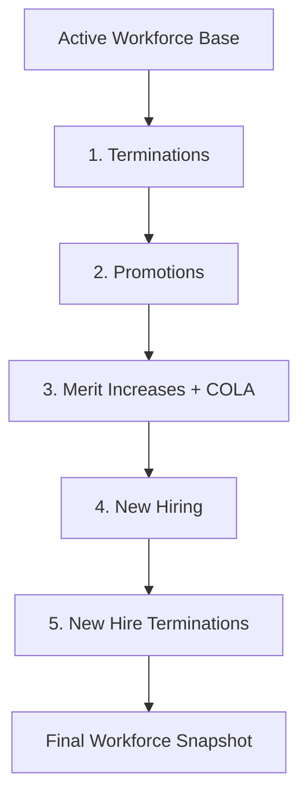

# Fidelity PlanAlign Engine: Workforce Dynamics Modeling Process

## Overview

Fidelity PlanAlign Engine implements a sophisticated **event-sourced workforce simulation** that models organizational dynamics through immutable audit trails. The system orchestrates complex workforce transitions (hiring, terminations, promotions) using enterprise-grade algorithms that ensure reproducibility, transparency, and regulatory compliance.

## Core Architecture

### Event Sourcing Foundation

The simulation follows an **immutable event sourcing pattern** where every workforce change is recorded as a time-stamped, UUID-stamped event:

- **HIRE**: New employee onboarding with compensation and demographic data
- **TERMINATION**: Employee departures with reason codes and effective dates
- **PROMOTION**: Level advancement with salary adjustments
- **MERIT_INCREASE**: Compensation adjustments (COLA, merit, market corrections)
- **BENEFIT_ENROLLMENT**: Plan participation changes

**Key Principle**: Any workforce state can be reconstructed from the complete event log, enabling historical analysis, compliance auditing, and scenario validation.

## Simulation Orchestration

### Annual Processing Sequence

The simulation follows a precise **5-stage event sequence** executed annually:



This ordering ensures **logical consistency**:
- Terminations happen before hiring (realistic flow)
- Promotions occur before merit increases (affects salary bands)
- New hire terminations are separate from experienced departures

### Multi-Year Dependencies

Each simulation year builds on the previous year's **workforce snapshot**:

- **Year 1 (2025)**: Uses 2024 baseline census data
- **Subsequent Years**: Previous year's ending workforce with age+1, tenure+1
- **Dependency Validation**: Strict checks ensure complete data before proceeding

## Active Workforce Baseline

### Baseline Establishment

The simulation starts with a **cleaned census baseline** (`int_baseline_workforce`):

1. **Data Source**: 2024 employee census with compensation, demographics, tenure
2. **Level Assignment**: Dynamic mapping based on compensation ranges
3. **Age Calculation**: As of simulation start date (2024-12-31)
4. **Data Quality**: Removes invalid records, standardizes formats

### Year-over-Year Progression

**Workforce Continuity** is maintained through `int_workforce_previous_year`:
- Ages all employees by +1 year
- Increments tenure by +1 year
- Preserves all compensation and demographic attributes
- Creates foundation for next year's event processing

## Workforce Transition Algorithms

### 1. Termination Engine

**Current Implementation**: Quota-based deterministic randomization *(Architectural Gap - See Below)*

```sql
-- Calculate termination quota
termination_quota = CEIL(active_workforce_count * total_termination_rate)

-- Deterministic selection using employee ID hash
SELECT employee_id
FROM active_workforce
ORDER BY ABS(HASH(employee_id))  -- Reproducible randomization
LIMIT termination_quota
```

**Key Features**:
- **Reproducible**: Same random seed produces identical results
- **Unbiased**: Hash-based selection avoids demographic clustering
- **Configurable**: Termination rates adjustable via simulation config
- **Audit Trail**: Complete record of who was selected and why

**⚠️ Architectural Note**: Sophisticated hazard-based termination probability infrastructure exists (`int_hazard_termination.sql`) but is **not currently used** in the actual selection logic. The system calculates individual termination probabilities based on age, tenure, and level multipliers, but the implementation defaults to simple quota-based selection rather than applying these calculated probabilities. This creates an inconsistency with the promotion and merit systems which correctly use hazard-based individual probabilities.

### 2. Promotion Engine

**Hazard-Based Probability Model**: Considers tenure, age, and level constraints

```sql
-- Eligibility criteria
WHERE tenure_years >= 1        -- Minimum tenure requirement
  AND level_id < 5            -- Cannot promote beyond max level
  AND age < 65                -- No near-retirement promotions

-- Probability calculation
promotion_rate = base_rate * tenure_multiplier * age_multiplier *
                 GREATEST(0, 1 - level_dampener * (level_id - 1))
```

**Probability Factors**:
- **Base Rate**: 10% annual promotion probability
- **Tenure Multiplier**: Higher tenure increases chances
- **Age Multiplier**: Peak promotion probability in mid-career
- **Level Dampener**: 15% reduction per level (harder to advance at senior levels)

**Selection Process**:
```sql
-- Deterministic random value per employee
random_value = (HASH(employee_id) % 1000) / 1000.0

-- Promote if random value falls below calculated probability
WHERE random_value < promotion_rate
```

### 3. Hiring Engine

**Mathematical Model**: Sophisticated formula accounting for departures and growth targets

```sql
total_hires_needed = CEIL(
    (experienced_terminations + growth_amount) /
    (1 - new_hire_termination_rate)
)

WHERE:
  experienced_terminations = CEIL(workforce_count * termination_rate)
  growth_amount = workforce_count * target_growth_rate
  new_hire_termination_rate = 0.25  -- 25% of new hires leave
```

**This formula ensures**:
- **Precise Growth**: Ending workforce exactly matches growth target
- **Attrition Buffer**: Accounts for new hires who will terminate
- **Replacement Hiring**: Covers experienced employee departures

**New Hire Characteristics**:
- **Level Distribution**: Weighted toward entry levels (40% Level 1, 30% Level 2)
- **Age Assignment**: Deterministic sequence (25, 28, 32, 35, 40 years)
- **Compensation**: Level-based averages with small variance (±10%)
- **Unique IDs**: `NH_YYYY_######` format for tracking

### 4. Merit/COLA Engine

**Two-Component System**:

1. **Cost of Living Adjustment (COLA)**: Universal percentage increase
2. **Merit Increases**: Performance-based individual adjustments

**Implementation**:
- **COLA**: Applied to all active employees uniformly
- **Merit**: Hazard-based selection similar to promotions
- **Timing**: Processed after promotions to use updated salary bands
- **Proration**: Complex period-based calculations for mid-year events

## Individual Selection Logic

### How We Pick Who Gets What Event

**The system uses deterministic randomization to ensure**:
- **Reproducibility**: Same parameters always produce identical results
- **Fairness**: No demographic bias in selection algorithms
- **Auditability**: Complete trail of selection logic for compliance

#### Termination Selection *(Current Quota-Based Implementation)*
```python
# Current implementation - quota-based selection
termination_quota = ceil(active_workforce_count * total_termination_rate)

for each active_employee:
    hash_value = hash(employee_id + simulation_seed)
    random_rank = abs(hash_value) % large_prime

# Select top N employees by random_rank where N = termination_quota
selected_for_termination = employees.order_by(random_rank).limit(quota)
```

**⚠️ Unused Hazard Infrastructure**: The system has sophisticated termination hazard calculations that could be used:
```python
# Available but unused hazard-based approach
for each active_employee:
    base_rate = 0.04  # 4% base termination rate

    # Age multipliers: <25: 0.7x, 25-34: 1.3x, 35-44: 1.0x, 45-54: 1.6x, 55+: 1.4x
    age_multiplier = get_age_multiplier(employee_age)

    # Tenure multipliers: <2yr: 1.8x, 2-4yr: 0.6x, 5-9yr: 0.5x, 10+yr: 0.4x
    tenure_multiplier = get_tenure_multiplier(employee_tenure)

    termination_probability = base_rate * age_multiplier * tenure_multiplier

    random_value = (hash(employee_id + simulation_seed) % 1000) / 1000.0

    if random_value < termination_probability:
        # Employee selected for termination based on individual risk profile
        terminate_employee()
```

#### Promotion Selection
```python
# Conceptual algorithm
for each eligible_employee:
    base_probability = 0.10  # 10% base rate

    # Apply multipliers based on employee characteristics
    tenure_factor = min(1.5, 1.0 + (tenure_years - 1) * 0.1)
    age_factor = age_promotion_curve(age)  # Peak around 35-45
    level_factor = max(0.1, 1.0 - 0.15 * (level_id - 1))

    final_probability = base_probability * tenure_factor * age_factor * level_factor

    # Deterministic random value per employee
    random_value = (hash(employee_id + simulation_seed) % 1000) / 1000.0

    if random_value < final_probability:
        promote_employee()
```

## Event Sourcing and State Management

### Immutable Event Log

All workforce changes flow through `fct_yearly_events`:

```sql
CREATE TABLE fct_yearly_events (
    event_id UUID PRIMARY KEY,
    employee_id VARCHAR,
    event_type VARCHAR,  -- HIRE, TERMINATION, PROMOTION, MERIT_INCREASE
    simulation_year INTEGER,
    effective_date DATE,

    -- Event-specific details
    old_compensation DECIMAL,
    new_compensation DECIMAL,
    old_level INTEGER,
    new_level INTEGER,
    termination_reason VARCHAR,

    -- Audit fields
    created_timestamp TIMESTAMP,
    simulation_run_id UUID
);
```

### Snapshot Reconstruction

The `fct_workforce_snapshot` table reconstructs point-in-time workforce states:

1. **Start with baseline**: Previous year's ending workforce
2. **Apply events sequentially**: Process all events for current year
3. **Calculate final state**: Active employees, compensation, demographics
4. **Generate status codes**: Track employee lifecycle (active, terminated, new_hire, etc.)

### Compensation Period Calculations

Complex **prorated compensation** handling for mid-year events:

```sql
-- Example: Employee promoted mid-year
total_compensation =
    (old_salary / 12) * months_at_old_level +
    (new_salary / 12) * months_at_new_level +
    bonus_payments +
    cola_adjustments
```

## Data Quality and Validation

### Asset Checks

The system includes comprehensive validation:

- **Compensation Outliers**: Flags salaries outside expected ranges
- **Progression Validation**: Ensures realistic career advancement paths
- **Growth Target Accuracy**: Validates actual vs. target workforce growth
- **Event Consistency**: Checks for logical impossibilities (e.g., promoting terminated employees)

### Business Rule Enforcement

- **Age Limits**: No promotions for employees near retirement (65+)
- **Tenure Requirements**: Minimum service time for promotions (12+ months)
- **Level Constraints**: Cannot promote beyond organizational level caps
- **Compensation Bands**: All salaries must fit within level-appropriate ranges

## Configurability and Reproducibility

### Simulation Parameters

Key settings controlled via `config/simulation_config.yaml`:

```yaml
simulation:
  start_year: 2025
  end_year: 2029
  target_growth_rate: 0.03  # 3% annual growth
  random_seed: 42           # For reproducibility

termination_rates:
  base_rate: 0.12           # 12% annual turnover
  new_hire_rate: 0.25       # 25% of new hires leave

promotion_rates:
  base_rate: 0.10           # 10% annual promotion rate
  level_dampener: 0.15      # 15% reduction per level
```

### Reproducibility Guarantees

- **Deterministic Randomization**: Hash-based selection using employee IDs
- **Seed Control**: Random seed parameter ensures identical runs
- **Event Ordering**: Consistent processing sequence prevents race conditions
- **State Snapshots**: Point-in-time workforce states for validation

## Technical Implementation Details

### Dagster Orchestration

Assets and jobs coordinate the simulation workflow:

```python
# Key assets in dependency order
@asset
def int_baseline_workforce() -> pd.DataFrame: ...

@asset(deps=[int_baseline_workforce])
def int_termination_events() -> pd.DataFrame: ...

@asset(deps=[int_termination_events])
def int_promotion_events() -> pd.DataFrame: ...

@asset(deps=[int_promotion_events])
def int_hiring_events() -> pd.DataFrame: ...

@asset(deps=[int_hiring_events])
def fct_yearly_events() -> pd.DataFrame: ...

@asset(deps=[fct_yearly_events])
def fct_workforce_snapshot() -> pd.DataFrame: ...
```

### dbt Model Architecture

SQL models implement the business logic:

- **Staging Models** (`stg_*`): Raw data cleaning and standardization
- **Intermediate Models** (`int_*`): Business rule implementation
- **Fact Models** (`fct_*`): Final outputs and consolidated views

### DuckDB Performance Optimizations

- **Columnar Storage**: Efficient analytical queries over time series data
- **Connection Management**: Proper resource cleanup with context managers
- **Serialization**: DataFrames instead of DuckDB objects for Dagster compatibility

## Architectural Inconsistencies and Improvement Opportunities

### Termination vs. Other Event Types

The current implementation has a significant **architectural inconsistency** in how different workforce events are processed:

| Event Type | Selection Method | Uses Hazard Infrastructure | Individual Risk Factors |
|------------|------------------|---------------------------|-------------------------|
| **Promotions** | ✅ Hazard-based probabilities | ✅ Yes | ✅ Age, tenure, level multipliers |
| **Merit Increases** | ✅ Hazard-based probabilities | ✅ Yes | ✅ Demographic-based rates |
| **Terminations** | ❌ Quota-based randomization | ❌ No (infrastructure exists but unused) | ❌ Uniform selection regardless of risk |

### Available but Unused Termination Hazards

The system contains sophisticated termination probability calculations in `int_hazard_termination.sql`:

- **Age-Based Risk**: Different termination rates by age band (highest for 25-34 and 45-54 age groups)
- **Tenure-Based Risk**: New employees (< 2 years) have 1.8x higher termination probability
- **Experience Curve**: Long-tenure employees (10+ years) have 0.4x lower termination probability
- **Mathematical Model**: `termination_rate = base_rate * age_multiplier * tenure_multiplier`

### Impact of Current Gap

**Modeling Limitations**:
- Cannot simulate realistic turnover patterns (e.g., higher new employee attrition)
- Uniform termination probability across all demographics
- Missed opportunity for more accurate workforce planning scenarios

**Business Impact**:
- Less realistic simulation results for retention planning
- Cannot model targeted retention strategies based on risk profiles
- Potential misalignment between modeled and actual turnover patterns

### Path to Consistency

To align terminations with the hazard-based architecture used by other events:

1. **Modify Selection Logic**: Update `int_termination_events.sql` to use probability-based selection like promotions
2. **Connect Hazard Infrastructure**: Link existing `int_hazard_termination.sql` calculations to actual selection
3. **Maintain Reproducibility**: Preserve deterministic randomization using employee ID hashing
4. **Validate Results**: Ensure aggregate termination rates still match configuration targets

This would create a **unified hazard-based architecture** across all workforce transition events while maintaining the enterprise-grade auditability and reproducibility requirements.

## Summary

Fidelity PlanAlign Engine's workforce modeling process provides **enterprise-grade simulation capabilities** through:

1. **Mathematical Rigor**: Sophisticated algorithms for workforce transitions
2. **Individual-Level Precision**: Deterministic selection of specific employees for events
3. **Complete Auditability**: Immutable event logs enabling full reconstruction
4. **Business Rule Compliance**: Configurable constraints matching organizational policies
5. **Reproducible Results**: Seed-controlled randomization for consistent outcomes
6. **Scalable Architecture**: Event sourcing pattern supporting multi-year simulations

This approach enables organizations to model complex workforce scenarios with confidence, providing actionable insights for strategic planning while maintaining the transparency and compliance required for enterprise decision-making.
