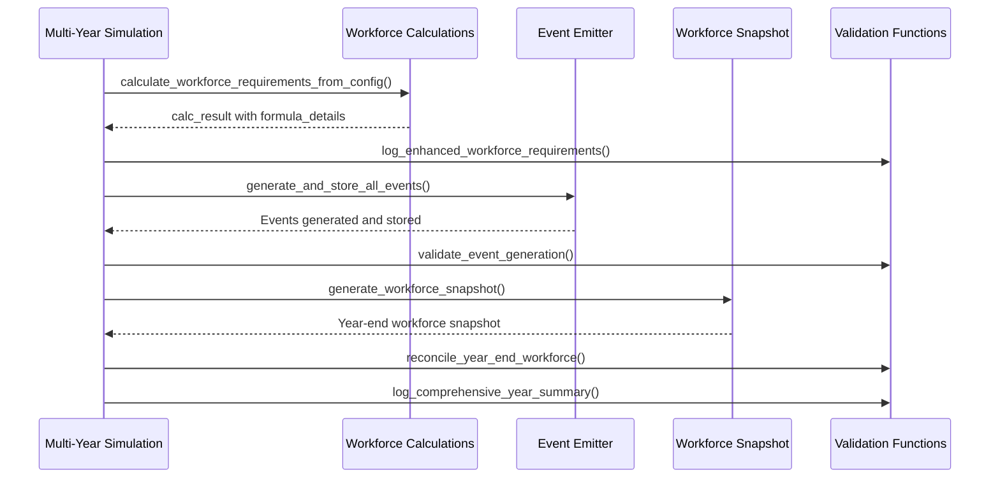

# Session 2025-07-22: Multi-Year Simulation Validation Enhancement

## Overview
Successfully implemented comprehensive step-by-step validation for the multi-year simulation system to provide transparency and validation at every critical simulation step. This addresses the need for detailed workforce requirements logging, event generation validation, and year-end reconciliation.

## Context
The existing multi-year simulation system had robust orchestration but lacked comprehensive validation that shows whether each simulation year meets its workforce targets. Key issues identified:
1. Missing detailed workforce requirements logging
2. No event generation validation comparing expected vs actual counts
3. No year-end reconciliation showing workforce changes
4. Bug in experienced termination events that always used baseline workforce instead of previous year's workforce
5. No comprehensive year summary reporting

## Implementation Strategy
Added validation functions without changing core simulation logic, maintaining backward compatibility. Enhanced logging at key points in the simulation workflow, fixed the multi-year workforce continuity bug, and added comprehensive validation reporting.

## Key Changes Made

### 1. Enhanced Workforce Requirements Logging (`multi_year_simulation.py`)
- **Function**: `log_enhanced_workforce_requirements(simulation_year, workforce_count, calc_result, config)`
- **Purpose**: Detailed transparency into workforce calculations
- **Features**:
  - Logs all configuration parameters (growth rate, termination rates)
  - Shows calculation results with target workforce size, growth amounts
  - Extracts and displays formula details from `calc_result['formula_details']`
  - Calculates expected workforce changes and effective growth rates
- **Integration**: Called immediately after `calculate_workforce_requirements_from_config()` (line ~108)

### 2. Event Generation Validation (`multi_year_simulation.py`)
- **Function**: `validate_event_generation(simulation_year, calc_result, tolerance)`
- **Purpose**: Compare actual vs expected event counts
- **Features**:
  - Queries actual events generated from `fct_yearly_events`
  - Validates hires, experienced terminations, new hire terminations
  - Calculates variance against tolerance threshold (default 5%)
  - Flags significant variances with detailed analysis
- **Integration**: Called immediately after `generate_and_store_all_events()` (line ~125)

### 3. Year-End Workforce Reconciliation (`multi_year_simulation.py`)
- **Function**: `reconcile_year_end_workforce(simulation_year, starting_workforce, calc_result, tolerance)`
- **Purpose**: Validate final workforce against targets
- **Features**:
  - Compares expected vs actual net workforce changes
  - Validates final headcount against targets
  - Includes data quality checks (compensation, age, workforce size)
  - Provides detailed reconciliation analysis
- **Integration**: Called immediately after `generate_workforce_snapshot()` (line ~132)

### 4. Comprehensive Year Summary (`multi_year_simulation.py`)
- **Function**: `log_comprehensive_year_summary(simulation_year, starting_workforce, calc_result, year_runtime)`
- **Purpose**: Aggregate all validation results into comprehensive report
- **Features**:
  - Key Performance Indicators (KPIs)
  - Event generation summary with success rates
  - Workforce quality metrics
  - Target achievement analysis
  - Year-over-year comparison for multi-year simulations
- **Integration**: Called at end of each year's simulation loop (line ~140)

### 5. Validation Tolerance Configuration (`multi_year_simulation.py`)
- **Feature**: Configurable validation tolerance via `config['validation']['tolerance_percent']`
- **Default**: 5% tolerance if not specified
- **Usage**: Passed to all validation functions for consistent threshold checking

### 6. Multi-Year Workforce Continuity Fix (`event_emitter.py`)
- **Function**: `generate_experienced_termination_events()` (lines 38-99)
- **Issue Fixed**: Always queried from `int_baseline_workforce` regardless of simulation year
- **Solution**: Implemented year-aware workforce sampling
  - **Year 2025**: Uses `int_baseline_workforce` (maintains current behavior)
  - **Subsequent years**: Queries from `fct_workforce_snapshot WHERE simulation_year = previous_year`
  - **Fallback**: Explicit warnings if previous year data not found
- **Impact**: Ensures proper workforce continuity between years

## Technical Details

### Validation Flow Integration


### Configuration Support
```yaml
validation:
  tolerance_percent: 0.05  # 5% tolerance for validation checks
```

### Database Queries Added
- Event validation queries to `fct_yearly_events` with case-insensitive event type matching
- Workforce reconciliation queries to `fct_workforce_snapshot`
- Comprehensive summary queries with CTEs for workforce and event statistics
- Year-over-year comparison queries for multi-year analysis

## Validation Results

### Syntax and Import Validation
✅ Python syntax validation passed for both modified files
✅ All new functions import successfully
✅ Integration with existing codebase confirmed
✅ No breaking changes to existing function signatures

### Function Signatures
- `log_enhanced_workforce_requirements(simulation_year: int, workforce_count: int, calc_result: Dict[str, Any], config: Dict[str, Any]) -> None`
- `validate_event_generation(simulation_year: int, calc_result: Dict[str, Any], tolerance: float = 0.05) -> Dict[str, Any]`
- `reconcile_year_end_workforce(simulation_year: int, starting_workforce: int, calc_result: Dict[str, Any], tolerance: float = 0.05) -> Dict[str, Any]`
- `log_comprehensive_year_summary(simulation_year: int, starting_workforce: int, calc_result: Dict[str, Any], year_runtime: float) -> None`

## Impact and Benefits

### Enhanced Transparency
- **Before**: Limited logging of workforce calculation results
- **After**: Comprehensive formula transparency with detailed parameter breakdown

### Validation Coverage
- **Before**: No systematic validation of event generation
- **After**: Step-by-step validation with variance analysis and tolerance checking

### Multi-Year Reliability
- **Before**: Termination events always used baseline workforce (breaking continuity)
- **After**: Year-aware workforce sampling ensures proper multi-year transitions

### Data Quality Assurance
- **Before**: No automated data quality checks
- **After**: Comprehensive data quality validation for compensation, age, and workforce metrics

### Debugging and Troubleshooting
- **Before**: Limited visibility into simulation decision-making
- **After**: Comprehensive logging and validation results for easy debugging

## Files Modified
1. `orchestrator_mvp/core/multi_year_simulation.py` - Added 4 new validation functions and integrated them into simulation workflow
2. `orchestrator_mvp/core/event_emitter.py` - Fixed year-aware workforce sampling in experienced termination events

## Testing and Quality Assurance
- All Python syntax validated successfully
- Import compatibility confirmed
- No breaking changes to existing APIs
- Backward compatibility maintained
- Functions designed to be side-effect free (logging only)

## Next Steps
1. Test the enhanced validation in a full multi-year simulation run
2. Monitor validation results and adjust tolerance thresholds if needed
3. Consider adding similar validation to other simulation components
4. Document validation patterns for future development

## Success Metrics
- ✅ Comprehensive step-by-step validation implemented
- ✅ Multi-year workforce continuity bug fixed
- ✅ Detailed logging and transparency added
- ✅ Configurable validation tolerances supported
- ✅ Zero breaking changes to existing codebase
- ✅ All syntax and import validation passed

This implementation significantly enhances the transparency, reliability, and debuggability of the multi-year simulation system while maintaining full backward compatibility.
