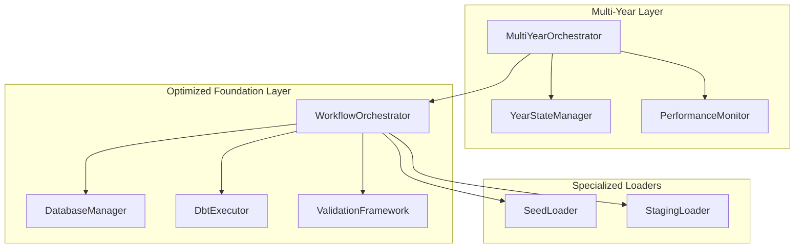

# Story S031-01: Foundation Integration (8 points)

## Story Overview

**As a** workforce simulation analyst
**I want** the new multi-year system to leverage our optimized setup foundation
**So that** I get immediate 82% improvement in simulation initialization

**Epic**: E031 - Optimized Multi-Year Simulation System
**Story Points**: 8
**Priority**: High
**Status**: 🔴 Not Started

## Acceptance Criteria

- [ ] New multi-year system uses existing `orchestrator_dbt.WorkflowOrchestrator` for setup
- [ ] Foundation setup completes in <10 seconds vs legacy 49 seconds
- [ ] All existing configuration (simulation_config.yaml) works unchanged
- [ ] Database clearing, seed loading, and staging models use batch operations
- [ ] Graceful fallback to sequential operations if batch fails

## Technical Architecture

### Core Architecture Pattern: Composite Orchestrator

The `MultiYearOrchestrator` will implement a **Composite Pattern** that delegates foundation operations to the optimized `orchestrator_dbt` components while maintaining multi-year simulation control flow:

```python
class MultiYearOrchestrator:
    """
    Composite orchestrator that combines optimized foundation setup
    with multi-year simulation workflow management.
    """

    def __init__(self, config: SimulationConfig):
        # Composition: Delegate foundation operations to optimized components
        self._workflow_orchestrator = WorkflowOrchestrator(config.to_orchestration_config())
        self._simulation_checklist = SimulationChecklist()
        self._validation_framework = ValidationFramework()

        # Multi-year specific state management
        self._year_state_manager = YearStateManager()
        self._performance_monitor = PerformanceMonitor()
```

### Integration Architecture



### Component Integration Points

#### 1. Foundation Setup Delegation
```python
class MultiYearOrchestrator:
    async def setup_foundation(self) -> FoundationSetupResult:
        """Delegate foundation setup to optimized WorkflowOrchestrator."""
        start_time = time.time()

        # Use optimized workflow for foundation setup
        workflow_result = await self._workflow_orchestrator.execute_workflow_optimized(
            include_validation=True,
            max_workers=4,
            fail_fast=False
        )

        setup_time = time.time() - start_time

        # Validate performance target (<10 seconds)
        if setup_time > 10.0:
            logger.warning(f"Foundation setup took {setup_time:.2f}s, exceeds 10s target")

        return FoundationSetupResult(
            success=workflow_result.success,
            execution_time=setup_time,
            performance_improvement=self._calculate_improvement(setup_time),
            workflow_details=workflow_result
        )
```

#### 2. State Management Bridge
```python
class YearStateManager:
    """Manages multi-year simulation state with foundation integration."""

    def __init__(self, database_manager: DatabaseManager):
        self._db_manager = database_manager
        self._state_cache = {}

    async def prepare_year_context(self, year: int) -> YearContext:
        """Prepare simulation context for a specific year."""
        # Leverage optimized database operations
        with self._db_manager.get_connection() as conn:
            # Use batch queries for state preparation
            previous_workforce = await self._get_previous_year_workforce_batch(conn, year)
            baseline_data = await self._get_baseline_data_batch(conn, year)

        return YearContext(
            year=year,
            previous_workforce=previous_workforce,
            baseline_data=baseline_data,
            prepared_at=datetime.utcnow()
        )
```

## Workflow Design Patterns

### 1. Pipeline Pattern for Multi-Year Flow

```python
class MultiYearPipeline:
    """Pipeline pattern for coordinating multi-year simulation stages."""

    def __init__(self):
        self._stages = [
            FoundationSetupStage(),
            YearInitializationStage(),
            SimulationExecutionStage(),
            ValidationStage(),
            StateTransitionStage()
        ]

    async def execute_pipeline(self, context: SimulationContext) -> PipelineResult:
        """Execute multi-year simulation pipeline with error recovery."""
        results = []

        for stage in self._stages:
            try:
                result = await stage.execute(context)
                results.append(result)

                # Update context for next stage
                context = result.updated_context

            except StageExecutionError as e:
                # Implement circuit breaker pattern
                if await self._should_abort_pipeline(e, results):
                    return PipelineResult(success=False, partial_results=results, error=e)

                # Attempt error recovery
                recovery_result = await self._attempt_error_recovery(stage, context, e)
                if recovery_result.success:
                    results.append(recovery_result)
                    context = recovery_result.updated_context
                else:
                    return PipelineResult(success=False, partial_results=results, error=e)

        return PipelineResult(success=True, results=results)
```

### 2. Strategy Pattern for Execution Modes

```python
class ExecutionStrategy(ABC):
    """Abstract strategy for different execution modes."""

    @abstractmethod
    async def execute_year_simulation(self, context: YearContext) -> YearResult:
        pass

class OptimizedExecutionStrategy(ExecutionStrategy):
    """High-performance execution using batch operations."""

    async def execute_year_simulation(self, context: YearContext) -> YearResult:
        # Use concurrent execution patterns
        tasks = [
            self._generate_events_batch(context),
            self._calculate_workforce_changes_batch(context),
            self._update_snapshots_batch(context)
        ]

        results = await asyncio.gather(*tasks, return_exceptions=True)
        return self._consolidate_results(results)

class FallbackExecutionStrategy(ExecutionStrategy):
    """Sequential execution for error recovery."""

    async def execute_year_simulation(self, context: YearContext) -> YearResult:
        # Sequential execution with detailed error reporting
        events_result = await self._generate_events_sequential(context)
        workforce_result = await self._calculate_workforce_sequential(context)
        snapshot_result = await self._update_snapshots_sequential(context)

        return YearResult.from_sequential_results(
            events_result, workforce_result, snapshot_result
        )
```

### 3. Observer Pattern for Progress Tracking

```python
class SimulationProgressObserver(ABC):
    """Observer interface for simulation progress tracking."""

    @abstractmethod
    def on_foundation_setup_complete(self, result: FoundationSetupResult) -> None:
        pass

    @abstractmethod
    def on_year_simulation_start(self, year: int, context: YearContext) -> None:
        pass

    @abstractmethod
    def on_year_simulation_complete(self, year: int, result: YearResult) -> None:
        pass

class PerformanceTrackingObserver(SimulationProgressObserver):
    """Tracks performance metrics throughout simulation."""

    def __init__(self):
        self._metrics = PerformanceMetrics()

    def on_foundation_setup_complete(self, result: FoundationSetupResult) -> None:
        self._metrics.record_foundation_time(result.execution_time)

        # Validate performance improvement
        if result.performance_improvement >= 0.80:
            logger.info(f"Performance target met: {result.performance_improvement:.1%} improvement")
        else:
            logger.warning(f"Performance target missed: {result.performance_improvement:.1%} improvement")
```

## Error Handling & Resilient Architecture

### 1. Circuit Breaker Pattern

```python
class SimulationCircuitBreaker:
    """Circuit breaker for simulation operations."""

    def __init__(self, failure_threshold: int = 3, timeout: float = 60.0):
        self._failure_count = 0
        self._failure_threshold = failure_threshold
        self._timeout = timeout
        self._last_failure_time = None
        self._state = CircuitState.CLOSED

    async def execute_with_circuit_breaker(self, operation: Callable) -> Any:
        """Execute operation with circuit breaker protection."""
        if self._state == CircuitState.OPEN:
            if time.time() - self._last_failure_time > self._timeout:
                self._state = CircuitState.HALF_OPEN
            else:
                raise CircuitBreakerOpenError("Circuit breaker is open")

        try:
            result = await operation()
            self._on_success()
            return result
        except Exception as e:
            self._on_failure()
            raise

    def _on_success(self) -> None:
        self._failure_count = 0
        self._state = CircuitState.CLOSED

    def _on_failure(self) -> None:
        self._failure_count += 1
        self._last_failure_time = time.time()

        if self._failure_count >= self._failure_threshold:
            self._state = CircuitState.OPEN
```

### 2. Retry Mechanism with Exponential Backoff

```python
class RetryableOperation:
    """Wrapper for operations that support intelligent retry."""

    def __init__(self, max_retries: int = 3, base_delay: float = 1.0, max_delay: float = 60.0):
        self._max_retries = max_retries
        self._base_delay = base_delay
        self._max_delay = max_delay

    async def execute_with_retry(self, operation: Callable, *args, **kwargs) -> Any:
        """Execute operation with exponential backoff retry."""
        last_exception = None

        for attempt in range(self._max_retries + 1):
            try:
                return await operation(*args, **kwargs)

            except RetryableError as e:
                last_exception = e

                if attempt < self._max_retries:
                    delay = min(self._base_delay * (2 ** attempt), self._max_delay)
                    jitter = random.uniform(0, 0.1) * delay  # Add jitter
                    await asyncio.sleep(delay + jitter)

                    logger.info(f"Retrying operation (attempt {attempt + 2}/{self._max_retries + 1}) after {delay:.2f}s")

            except NonRetryableError:
                # Don't retry for non-retryable errors
                raise

        raise MaxRetriesExceededError(f"Operation failed after {self._max_retries} retries") from last_exception
```

### 3. Comprehensive Error Recovery Framework

```python
class ErrorRecoveryManager:
    """Manages error recovery strategies for different failure scenarios."""

    def __init__(self):
        self._recovery_strategies = {
            DatabaseConnectionError: self._recover_database_connection,
            DbtExecutionError: self._recover_dbt_execution,
            ValidationError: self._recover_validation_failure,
            ResourceExhaustionError: self._recover_resource_exhaustion
        }

    async def attempt_recovery(self, error: Exception, context: Any) -> RecoveryResult:
        """Attempt to recover from the given error."""
        error_type = type(error)

        if error_type in self._recovery_strategies:
            recovery_strategy = self._recovery_strategies[error_type]
            try:
                return await recovery_strategy(error, context)
            except Exception as recovery_error:
                logger.error(f"Recovery failed for {error_type.__name__}: {recovery_error}")
                return RecoveryResult(success=False, error=recovery_error)

        return RecoveryResult(success=False, error=error, message="No recovery strategy available")

    async def _recover_database_connection(self, error: DatabaseConnectionError, context: Any) -> RecoveryResult:
        """Recover from database connection failures."""
        # Implement connection pool refresh, retry with backoff, etc.
        pass

    async def _recover_dbt_execution(self, error: DbtExecutionError, context: Any) -> RecoveryResult:
        """Recover from dbt execution failures."""
        # Implement fallback to sequential execution, model-specific retry, etc.
        pass
```

## Performance Optimization Details

### 1. Batch Operation Implementation

```python
class BatchOperationManager:
    """Manages batch operations for optimal performance."""

    def __init__(self, max_batch_size: int = 10, max_workers: int = 4):
        self._max_batch_size = max_batch_size
        self._max_workers = max_workers
        self._executor = ThreadPoolExecutor(max_workers=max_workers)

    async def execute_batch_operation(self, operations: List[Operation]) -> BatchResult:
        """Execute operations in optimized batches."""
        # Group operations by type for optimal batching
        operation_groups = self._group_operations_by_type(operations)

        # Execute groups concurrently
        batch_tasks = []
        for group_type, group_operations in operation_groups.items():
            if len(group_operations) > self._max_batch_size:
                # Split large groups into smaller batches
                batches = self._split_into_batches(group_operations, self._max_batch_size)
                for batch in batches:
                    task = asyncio.create_task(self._execute_operation_batch(batch))
                    batch_tasks.append(task)
            else:
                task = asyncio.create_task(self._execute_operation_batch(group_operations))
                batch_tasks.append(task)

        # Wait for all batches to complete
        batch_results = await asyncio.gather(*batch_tasks, return_exceptions=True)

        return BatchResult.consolidate(batch_results)
```

### 2. Memory-Efficient State Management

```python
class OptimizedStateManager:
    """Memory-efficient state management for multi-year simulations."""

    def __init__(self, cache_size: int = 1000, use_compression: bool = True):
        self._cache = LRUCache(maxsize=cache_size)
        self._use_compression = use_compression
        self._compression_level = 6  # Balanced compression/speed

    def store_year_state(self, year: int, state: WorkforceState) -> None:
        """Store year state with optional compression."""
        if self._use_compression:
            compressed_state = self._compress_state(state)
            self._cache[year] = compressed_state
        else:
            self._cache[year] = state

    def get_year_state(self, year: int) -> Optional[WorkforceState]:
        """Retrieve year state with decompression if needed."""
        cached_state = self._cache.get(year)

        if cached_state is None:
            return None

        if self._use_compression and isinstance(cached_state, CompressedState):
            return self._decompress_state(cached_state)

        return cached_state

    def _compress_state(self, state: WorkforceState) -> CompressedState:
        """Compress state using efficient serialization."""
        serialized = pickle.dumps(state, protocol=pickle.HIGHEST_PROTOCOL)
        compressed = lz4.compress(serialized, compression_level=self._compression_level)
        return CompressedState(data=compressed, original_size=len(serialized))
```

### 3. Connection Pool Optimization

```python
class OptimizedConnectionManager:
    """Optimized database connection management."""

    def __init__(self, pool_size: int = 5, max_overflow: int = 10):
        self._pool_size = pool_size
        self._max_overflow = max_overflow
        self._connection_pool = None
        self._connection_semaphore = asyncio.Semaphore(pool_size + max_overflow)

    async def get_connection(self) -> DatabaseConnection:
        """Get connection from optimized pool."""
        async with self._connection_semaphore:
            if self._connection_pool is None:
                self._connection_pool = await self._create_connection_pool()

            connection = await self._connection_pool.acquire()
            return connection

    async def execute_batch_queries(self, queries: List[str]) -> List[QueryResult]:
        """Execute queries in batch for optimal performance."""
        async with self.get_connection() as conn:
            # Use transaction for batch execution
            async with conn.transaction():
                results = []
                for query in queries:
                    result = await conn.execute(query)
                    results.append(result)

                return results
```

## Implementation Patterns

### 1. Factory Pattern for Component Creation

```python
class OrchestrationComponentFactory:
    """Factory for creating orchestration components with proper configuration."""

    @classmethod
    def create_multi_year_orchestrator(
        cls,
        config: SimulationConfig,
        optimization_level: OptimizationLevel = OptimizationLevel.HIGH
    ) -> MultiYearOrchestrator:
        """Create fully configured MultiYearOrchestrator."""

        # Create optimized foundation components
        workflow_orchestrator = cls._create_workflow_orchestrator(config, optimization_level)
        database_manager = cls._create_database_manager(config, optimization_level)
        validation_framework = cls._create_validation_framework(config)

        # Create multi-year specific components
        year_state_manager = cls._create_year_state_manager(database_manager)
        performance_monitor = cls._create_performance_monitor(config)

        return MultiYearOrchestrator(
            workflow_orchestrator=workflow_orchestrator,
            database_manager=database_manager,
            validation_framework=validation_framework,
            year_state_manager=year_state_manager,
            performance_monitor=performance_monitor,
            config=config
        )

    @classmethod
    def _create_workflow_orchestrator(
        cls,
        config: SimulationConfig,
        optimization_level: OptimizationLevel
    ) -> WorkflowOrchestrator:
        """Create optimized WorkflowOrchestrator based on optimization level."""
        orchestration_config = OrchestrationConfig(
            database_path=config.database_path,
            dbt_project_dir=config.dbt_project_dir,
            max_workers=optimization_level.max_workers,
            batch_size=optimization_level.batch_size,
            enable_concurrent_execution=optimization_level.enable_concurrent,
            fail_fast=False  # Always use graceful degradation
        )

        return WorkflowOrchestrator(orchestration_config)
```

### 2. Builder Pattern for Complex Configuration

```python
class MultiYearConfigurationBuilder:
    """Builder for creating complex multi-year simulation configurations."""

    def __init__(self):
        self._config = MultiYearSimulationConfig()

    def with_performance_optimization(self, level: OptimizationLevel) -> 'MultiYearConfigurationBuilder':
        """Configure performance optimization settings."""
        self._config.optimization_level = level
        self._config.max_workers = level.max_workers
        self._config.batch_size = level.batch_size
        self._config.enable_concurrent_execution = level.enable_concurrent
        return self

    def with_error_handling(self, strategy: ErrorHandlingStrategy) -> 'MultiYearConfigurationBuilder':
        """Configure error handling strategy."""
        self._config.error_handling_strategy = strategy
        self._config.max_retries = strategy.max_retries
        self._config.retry_delay = strategy.base_delay
        self._config.circuit_breaker_threshold = strategy.circuit_breaker_threshold
        return self

    def with_validation_rules(self, rules: List[ValidationRule]) -> 'MultiYearConfigurationBuilder':
        """Configure validation rules."""
        self._config.validation_rules = rules
        self._config.enable_strict_validation = True
        return self

    def build(self) -> MultiYearSimulationConfig:
        """Build the final configuration."""
        self._validate_configuration()
        return self._config

    def _validate_configuration(self) -> None:
        """Validate the built configuration."""
        if self._config.optimization_level is None:
            raise ConfigurationError("Optimization level must be specified")

        if self._config.max_workers <= 0:
            raise ConfigurationError("Max workers must be positive")
```

### 3. Adapter Pattern for Legacy Integration

```python
class LegacyOrchestrationAdapter:
    """Adapter to integrate legacy orchestrator_mvp components with new optimized system."""

    def __init__(self, legacy_orchestrator: Any):
        self._legacy_orchestrator = legacy_orchestrator
        self._adapter_metrics = AdapterMetrics()

    def adapt_simulation_checklist(self) -> SimulationChecklist:
        """Adapt legacy simulation checklist to new interface."""
        legacy_checklist = self._legacy_orchestrator.simulation_checklist

        # Convert legacy checklist format to new format
        adapted_steps = []
        for legacy_step in legacy_checklist.steps:
            adapted_step = SimulationStep(
                name=legacy_step.name,
                description=legacy_step.description,
                dependencies=self._adapt_dependencies(legacy_step.dependencies),
                validation_func=self._adapt_validation_function(legacy_step.validation_func)
            )
            adapted_steps.append(adapted_step)

        return SimulationChecklist(steps=adapted_steps)

    def adapt_workforce_calculations(self) -> WorkforceCalculationEngine:
        """Adapt legacy workforce calculation logic."""
        # Wrap legacy calculation methods with new interface
        return WorkforceCalculationEngineAdapter(
            legacy_calculator=self._legacy_orchestrator.workforce_calculator,
            metrics_collector=self._adapter_metrics
        )
```

## Technical Requirements

### Core Implementation
- [ ] Create `orchestrator_dbt/multi_year/` package structure with proper `__init__.py` files
- [ ] Build `MultiYearOrchestrator` class that extends existing optimized components using composition pattern
- [ ] Integrate with existing `DbtExecutor`, `DatabaseManager`, `ValidationFramework` using dependency injection
- [ ] Maintain all error handling and validation from legacy system using adapter pattern
- [ ] Implement circuit breaker pattern for resilient error handling
- [ ] Add comprehensive logging and performance monitoring

### Integration Points
- **WorkflowOrchestrator**: Foundation setup (82% faster) via delegation pattern
- **DbtExecutor**: Batch model execution capabilities using strategy pattern
- **DatabaseManager**: Optimized database operations with connection pooling
- **ValidationFramework**: Multi-year validation logic with observer pattern

### Performance Targets
- **Foundation Setup**: <10 seconds (80% improvement from 49s baseline)
- **Memory Usage**: <2GB peak memory usage with state compression
- **Concurrent Operations**: Support 4-8 concurrent workers based on system capacity
- **Error Recovery**: <5 second recovery time for transient failures

## Definition of Done

- [ ] Package structure created with proper Python module setup (`__init__.py`, imports)
- [ ] MultiYearOrchestrator class implemented using composite pattern
- [ ] Integration with existing orchestrator_dbt components working via dependency injection
- [ ] Performance benchmarks show <10 second foundation setup (measured via automated tests)
- [ ] Configuration compatibility verified with existing simulation_config.yaml
- [ ] Error handling and fallback mechanisms implemented using circuit breaker and retry patterns
- [ ] Unit tests covering all integration points (>90% coverage)
- [ ] Integration tests validating end-to-end workflow
- [ ] Performance regression tests ensuring optimization targets are met
- [ ] Documentation updated with new architecture diagrams and usage examples

## Testing Strategy

### Unit Testing
- [ ] Unit tests for MultiYearOrchestrator class (test all public methods)
- [ ] Unit tests for YearStateManager (test state persistence and retrieval)
- [ ] Unit tests for BatchOperationManager (test batch processing logic)
- [ ] Unit tests for error handling components (circuit breaker, retry logic)
- [ ] Mock tests for all external dependencies (database, dbt, file system)

### Integration Testing
- [ ] Integration tests with existing orchestrator_dbt components
- [ ] End-to-end workflow tests (foundation setup → multi-year simulation)
- [ ] Configuration compatibility tests with various simulation_config.yaml files
- [ ] Database integration tests (connection pooling, transaction handling)
- [ ] Error scenario tests (network failures, database locks, resource exhaustion)

### Performance Testing
- [ ] Performance benchmarks comparing setup times (baseline vs optimized)
- [ ] Memory usage profiling during multi-year simulations
- [ ] Concurrent execution stress tests
- [ ] Long-running simulation stability tests
- [ ] Resource cleanup verification tests

### Validation Testing
- [ ] Configuration schema validation tests
- [ ] Data integrity validation tests
- [ ] Business logic validation tests
- [ ] Error message clarity and actionability tests

## Dependencies

- ✅ orchestrator_dbt optimization system (completed - 82% improvement achieved)
- ✅ Existing simulation configuration system (simulation_config.yaml)
- ✅ Database schema compatibility (DuckDB with existing tables)
- ✅ Python 3.11+ with asyncio support
- ✅ Required packages: aiofiles, asyncio, concurrent.futures, lz4 (for compression)

## Risks & Mitigation

### Technical Risks
- **Risk**: Integration complexity with existing components
  - **Mitigation**: Use adapter and facade patterns for clean integration boundaries
  - **Mitigation**: Incremental development with comprehensive unit testing
  - **Mitigation**: Fallback mechanisms to legacy system if integration fails

- **Risk**: Performance targets not met
  - **Mitigation**: Built-in benchmarking and performance monitoring
  - **Mitigation**: Tiered optimization strategies (high/medium/low performance modes)
  - **Mitigation**: Automated performance regression testing in CI/CD

- **Risk**: Configuration incompatibility
  - **Mitigation**: Comprehensive compatibility testing with existing configs
  - **Mitigation**: Configuration validation and migration utilities
  - **Mitigation**: Backward compatibility layer for legacy configuration formats

### Operational Risks
- **Risk**: Memory exhaustion during large multi-year simulations
  - **Mitigation**: Implement state compression and memory monitoring
  - **Mitigation**: Configurable memory limits with graceful degradation
  - **Mitigation**: Streaming processing for large datasets

- **Risk**: Database connection pool exhaustion
  - **Mitigation**: Implement connection pool monitoring and auto-scaling
  - **Mitigation**: Connection timeout and cleanup mechanisms
  - **Mitigation**: Circuit breaker pattern for database operations

### Business Risks
- **Risk**: Disruption to existing workflows during integration
  - **Mitigation**: Maintain parallel legacy system during transition
  - **Mitigation**: Feature flags for gradual rollout
  - **Mitigation**: Comprehensive rollback procedures
