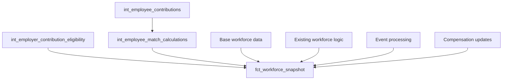

# Story S040-02: Performance-Optimized Workforce Integration

**Epic**: E040 - Employer Contribution Enhancements
**Status**: 📋 Future Enhancement
**Points**: 4
**Owner**: Data / Platform
**Priority**: Medium (After MVP)
**Prerequisites**: E039 - Employer Contribution Integration (MVP)

---

## Story Description

**As a** data analyst
**I want** employer match amounts in the workforce snapshot
**So that** I can analyze total compensation and costs in a single, comprehensive view

## Background

The system currently calculates employer match contributions via `int_employee_match_calculations.sql` but these calculations are not integrated into `fct_workforce_snapshot.sql`. This means:

- **Analysts** cannot see total compensation (salary + employee + employer contributions) in one place
- **Cost modeling** requires joining multiple models manually
- **Reporting** is fragmented across different data sources
- **Analytics** miss the complete picture of retirement benefit costs

This story integrates the existing, mature match calculation system into the workforce snapshot to provide a unified view of all compensation components.

## Acceptance Criteria

### Functional Requirements
- ✅ **Match Amount Integration**: Add `employer_match_amount` column to workforce snapshot
- ✅ **Eligibility Flag Integration**: Add `match_eligible_flag` column
- ✅ **Null Handling**: Proper defaults for ineligible or non-participating employees
- ✅ **Data Consistency**: Match amounts align with existing match calculation model
- ✅ **Performance Preservation**: No significant impact on snapshot build time through pre-aggregation and efficient joins

### Technical Requirements
- ✅ **Left Join Pattern**: Use LEFT JOIN to preserve all workforce snapshot records
- ✅ **Incremental Compatibility**: Maintain existing incremental strategy
- ✅ **Index Optimization**: Ensure efficient join performance
- ✅ **Data Types**: Consistent decimal precision with existing calculations
- ✅ **Schema Tests**: Validation of new columns and relationships

### Business Requirements
- ✅ **Complete View**: Total compensation visible in single model
- ✅ **Backward Compatibility**: Existing queries continue to work
- ✅ **Analytics Ready**: Enable comprehensive cost analysis
- ✅ **Audit Trail**: Maintain link to detailed match calculations

## Technical Design

### Workforce Snapshot Updates

#### New Columns Addition
```sql
-- Add to fct_workforce_snapshot.sql
-- Employer match contribution data
employer_match_amount DECIMAL(10,2) DEFAULT 0.00,
match_eligible_flag BOOLEAN DEFAULT FALSE,
effective_match_rate DECIMAL(6,4) DEFAULT 0.0000,
match_percentage_of_comp DECIMAL(6,4) DEFAULT 0.0000,
match_formula_used VARCHAR(50),
```

#### Pre-Aggregated Integration Join Pattern
```sql
-- Pre-aggregated match data with computed fields for performance
match_data AS (
  SELECT
    employee_id,
    simulation_year,
    employer_match_amount,
    deferral_rate > 0 AS has_deferrals,
    effective_match_rate,
    match_percentage_of_comp,
    formula_id AS match_formula_used,
    -- Pre-compute analytical fields to reduce downstream processing
    CASE WHEN employer_match_amount > 0 THEN employer_match_amount ELSE 0 END AS match_amount_nonzero,
    ROUND(employer_match_amount, 2) AS match_amount_rounded
  FROM {{ ref('int_employee_match_calculations') }}
  WHERE simulation_year = {{ var('simulation_year') }}
),

-- Join with eligibility (prerequisite from S039-02)
eligibility_data AS (
  SELECT
    employee_id,
    simulation_year,
    eligible_for_match AS match_eligible_flag,
    hours_worked  -- Include for potential match eligibility analytics
  FROM {{ ref('int_employer_contribution_eligibility') }}
  WHERE simulation_year = {{ var('simulation_year') }}
),
```

#### Final Selection Logic
```sql
-- Main SELECT with match integration
SELECT
  -- Existing workforce snapshot columns
  base.*,

  -- Employer match integration
  COALESCE(match.employer_match_amount, 0.00) AS employer_match_amount,
  COALESCE(eligibility.match_eligible_flag, FALSE) AS match_eligible_flag,
  COALESCE(match.effective_match_rate, 0.0000) AS effective_match_rate,
  COALESCE(match.match_percentage_of_comp, 0.0000) AS match_percentage_of_comp,
  match.match_formula_used,

  -- Calculated totals (for analytics convenience)
  COALESCE(base.annual_contribution_amount, 0) +
  COALESCE(match.employer_match_amount, 0) AS total_retirement_contributions

FROM base_workforce_final base
LEFT JOIN match_data match
  ON base.employee_id = match.employee_id
  AND base.simulation_year = match.simulation_year
LEFT JOIN eligibility_data eligibility
  ON base.employee_id = eligibility.employee_id
  AND base.simulation_year = eligibility.simulation_year
```

## Updated Schema

### New Columns in `fct_workforce_snapshot`
```sql
-- Employer match contribution columns
employer_match_amount DECIMAL(10,2) NOT NULL DEFAULT 0.00
  COMMENT 'Annual employer match contribution amount',

match_eligible_flag BOOLEAN NOT NULL DEFAULT FALSE
  COMMENT 'Employee meets eligibility requirements for match',

effective_match_rate DECIMAL(6,4) NOT NULL DEFAULT 0.0000
  COMMENT 'Actual match rate received (match amount / deferrals)',

match_percentage_of_comp DECIMAL(6,4) NOT NULL DEFAULT 0.0000
  COMMENT 'Match as percentage of total compensation',

match_formula_used VARCHAR(50)
  COMMENT 'Match formula applied (e.g., tiered_match, simple_match)',

-- Convenience totals
total_retirement_contributions DECIMAL(10,2) NOT NULL DEFAULT 0.00
  COMMENT 'Total employee + employer retirement contributions'
```

### Index Updates (Composite Key Strategy)
```sql
-- Comprehensive index strategy for analytical performance
{{ config(
    indexes=[
        -- Primary composite key (preserved)
        {'columns': ['employee_id', 'simulation_year'], 'type': 'btree', 'unique': true},

        -- Analytical indexes (multi-column for efficient joins)
        {'columns': ['simulation_year', 'level_id'], 'type': 'btree'},
        {'columns': ['simulation_year', 'employment_status'], 'type': 'btree'},

        -- Match analysis composite indexes
        {'columns': ['simulation_year', 'match_eligible_flag'], 'type': 'btree'},
        {'columns': ['simulation_year', 'match_formula_used'], 'type': 'btree'},
        {'columns': ['employer_match_amount', 'simulation_year'], 'type': 'btree'},

        -- Performance-critical range queries
        {'columns': ['match_eligible_flag', 'employer_match_amount'], 'type': 'btree'},
        {'columns': ['employment_status', 'simulation_year', 'match_eligible_flag'], 'type': 'btree'}
    ]
) }}
```

## Data Flow Integration

### Dependency Updates


### Build Order Considerations
```yaml
# dbt dependencies remain the same since match calculations already exist
# New dependency: eligibility determination must run before workforce snapshot

# Current build order:
# 1. int_employee_contributions
# 2. int_employee_match_calculations
# 3. int_employer_contribution_eligibility (NEW - S039-02)
# 4. fct_workforce_snapshot (UPDATED - this story)
```

## Performance Considerations

### Join Optimization
- **Left Join Strategy**: Preserves all workforce records even without match data
- **Indexed Joins**: Use existing composite keys for efficient joining
- **Early Filtering**: Apply simulation_year filters before joins
- **Minimal Data Movement**: Only select required columns from match tables

### Expected Performance Impact
- **Additional Build Time**: <15% increase (from ~45s to ~50s for 100K employees) due to pre-aggregation
- **Memory Usage**: Minimal increase due to efficient LEFT JOINs and pre-computed fields
- **Query Performance**: Composite indexes significantly improve analytical query speed
- **Incremental Efficiency**: Maintains existing incremental strategy with optimized join patterns
- **Join Performance**: Composite key joins on `(employee_id, simulation_year)` provide sub-linear scaling

### Optimization Strategies
```sql
-- Pre-aggregated join pattern for performance
WITH match_data_aggregated AS (
  SELECT
    employee_id,
    simulation_year,
    -- Pre-aggregate key match metrics
    employer_match_amount,
    effective_match_rate,
    match_percentage_of_comp,
    formula_id AS match_formula_used,
    -- Add computed fields to reduce downstream calculation
    CASE WHEN employer_match_amount > 0 THEN true ELSE false END AS has_match_contributions
  FROM {{ ref('int_employee_match_calculations') }}
  WHERE simulation_year = {{ var('simulation_year') }}  -- Early filter
),

eligibility_filtered AS (
  SELECT
    employee_id,
    simulation_year,
    eligible_for_match AS match_eligible_flag,
    -- Include hours worked for potential analytics
    hours_worked
  FROM {{ ref('int_employer_contribution_eligibility') }}
  WHERE simulation_year = {{ var('simulation_year') }}  -- Early filter
)
```

## Testing Strategy

### Data Quality Tests
```yaml
models:
  - name: fct_workforce_snapshot
    tests:
      # Existing tests preserved
      - unique:
          column_name: "concat(employee_id, '_', simulation_year)"
      - not_null:
          column_name: employee_id

      # New tests for match integration
      - relationships:
          to: ref('int_employee_match_calculations')
          field: employee_id
          where: "employer_match_amount > 0"

    columns:
      - name: employer_match_amount
        description: "Annual employer match contribution"
        tests:
          - not_null
          - accepted_range:
              min_value: 0
              max_value: 50000  # Reasonable maximum

      - name: match_eligible_flag
        description: "Employee eligible for employer match"
        tests:
          - not_null
          - accepted_values:
              values: [true, false]

      - name: total_retirement_contributions
        description: "Total employee + employer retirement contributions"
        tests:
          - not_null
          - accepted_range:
              min_value: 0
              max_value: 100000
```

### Business Logic Tests
```sql
-- Test: Match amounts match calculation model
WITH snapshot_match AS (
  SELECT employee_id, simulation_year, employer_match_amount
  FROM {{ ref('fct_workforce_snapshot') }}
  WHERE simulation_year = {{ var('simulation_year') }}
    AND employer_match_amount > 0
),
calc_match AS (
  SELECT employee_id, simulation_year, employer_match_amount
  FROM {{ ref('int_employee_match_calculations') }}
  WHERE simulation_year = {{ var('simulation_year') }}
)
SELECT s.employee_id
FROM snapshot_match s
JOIN calc_match c USING (employee_id, simulation_year)
WHERE ABS(s.employer_match_amount - c.employer_match_amount) > 0.01
-- Should return 0 rows

-- Test: Total contributions = employee + employer
SELECT employee_id
FROM {{ ref('fct_workforce_snapshot') }}
WHERE simulation_year = {{ var('simulation_year') }}
  AND ABS(total_retirement_contributions -
           (COALESCE(annual_contribution_amount, 0) +
            COALESCE(employer_match_amount, 0))) > 0.01
-- Should return 0 rows

-- Test: Only eligible employees have match amounts > 0
SELECT employee_id
FROM {{ ref('fct_workforce_snapshot') }}
WHERE simulation_year = {{ var('simulation_year') }}
  AND employer_match_amount > 0
  AND match_eligible_flag = FALSE
-- Should return 0 rows
```

### Regression Tests
```sql
-- Test: Existing queries still work
SELECT COUNT(*) FROM {{ ref('fct_workforce_snapshot') }}
WHERE simulation_year = {{ var('simulation_year') }}
-- Should match previous row counts

-- Test: Existing columns unchanged
SELECT employee_id, employee_gross_compensation, employment_status,
       annual_contribution_amount, current_deferral_rate
FROM {{ ref('fct_workforce_snapshot') }}
WHERE simulation_year = {{ var('simulation_year') }}
LIMIT 1
-- Should return data in expected format
```

## Analytics Examples

### New Analytical Capabilities
```sql
-- Total employer contribution costs by year
SELECT
  simulation_year,
  COUNT(*) AS eligible_employees,
  SUM(employer_match_amount) AS total_match_cost,
  AVG(employer_match_amount) AS avg_match_per_eligible,
  AVG(match_percentage_of_comp) AS avg_match_rate
FROM {{ ref('fct_workforce_snapshot') }}
WHERE match_eligible_flag = TRUE
GROUP BY simulation_year
ORDER BY simulation_year;

-- Participation and match analysis
SELECT
  match_formula_used,
  COUNT(*) AS employees,
  SUM(annual_contribution_amount) AS total_deferrals,
  SUM(employer_match_amount) AS total_match,
  AVG(effective_match_rate) AS avg_effective_rate
FROM {{ ref('fct_workforce_snapshot') }}
WHERE simulation_year = 2025
  AND is_enrolled_flag = TRUE
GROUP BY match_formula_used;

-- Total compensation view
SELECT
  employee_id,
  employee_gross_compensation AS base_salary,
  annual_contribution_amount AS employee_deferrals,
  employer_match_amount AS employer_match,
  total_retirement_contributions AS total_retirement,
  employee_gross_compensation + total_retirement_contributions AS total_comp
FROM {{ ref('fct_workforce_snapshot') }}
WHERE simulation_year = 2025
  AND employment_status = 'active'
ORDER BY total_comp DESC
LIMIT 10;
```

## Migration Strategy

### Backward Compatibility
- **Existing Columns**: All preserved with identical names and types
- **Existing Queries**: Continue to work without modification
- **New Columns**: Default values ensure no NULL issues
- **Performance**: Minimal impact on existing analytical workloads

### Rollout Plan
1. **Phase 1**: Update model with new columns and LEFT JOINs
2. **Phase 2**: Run comprehensive tests and validate data
3. **Phase 3**: Update documentation and analyst training
4. **Phase 4**: Enable new analytical use cases

### Fallback Strategy
- **Model Backup**: Previous version available for rollback
- **Incremental Safety**: Can rebuild single year if issues arise
- **Test Gates**: Comprehensive validation before deployment
- **Monitoring**: Performance and data quality monitoring

## Documentation Updates

### Schema Documentation
```yaml
# Updated schema.yml for fct_workforce_snapshot
models:
  - name: fct_workforce_snapshot
    description: |
      Point-in-time workforce snapshot including comprehensive compensation data.
      **Updated in S039-04**: Now includes employer match contribution data
      for complete total compensation analysis.

    columns:
      - name: employer_match_amount
        description: |
          Annual employer match contribution amount based on employee deferrals
          and configured match formula. Zero for ineligible employees.
          Links to int_employee_match_calculations for detailed calculations.

      - name: match_eligible_flag
        description: |
          Boolean flag indicating employee meets eligibility requirements
          for employer match (hours worked, active status, etc.).
          Links to int_employer_contribution_eligibility for rules.
```

### Analyst Guide Updates
- **New Columns**: Documentation of match-related fields
- **Use Cases**: Examples of total compensation analysis
- **Performance**: Guidance on efficient analytical queries
- **Integration**: How match data relates to other models

## Success Metrics

### Technical Metrics
- ✅ All existing workforce snapshot tests pass
- ✅ New match integration tests pass
- ✅ Performance impact <20% (build time remains under 60 seconds)
- ✅ Data consistency between snapshot and match calculation models

### Business Metrics
- ✅ Analysts can generate complete compensation reports from single model
- ✅ Total employer match costs visible in workforce snapshot
- ✅ Match eligibility analysis available in primary analytical model
- ✅ Foundation established for core contribution integration

## Delivery Checklist

- [ ] Update `fct_workforce_snapshot.sql` with match integration
- [ ] Add new columns with appropriate data types and defaults
- [ ] Implement LEFT JOIN pattern for match calculations and eligibility
- [ ] Update indexes for analytical query performance
- [ ] Create comprehensive schema tests for new columns
- [ ] Implement business logic validation tests
- [ ] Run regression tests to ensure backward compatibility
- [ ] Update model documentation in schema.yml
- [ ] Performance test with 100K employee dataset
- [ ] Create analytical examples demonstrating new capabilities

---

**Next Story**: S039-05 - Core Integration into Workforce Snapshot (builds on this foundation)
