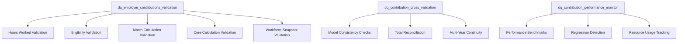

# Story S040-04: Comprehensive Data Quality Framework

**Epic**: E040 - Employer Contribution Enhancements
**Status**: 📋 Future Enhancement
**Points**: 3
**Owner**: Quality Assurance / Platform
**Priority**: Medium (After MVP)
**Prerequisites**: E039 - Employer Contribution Integration (MVP)

---

## Story Description

**As a** system architect
**I want** comprehensive validation of the contribution system
**So that** I can ensure data integrity, accuracy, and enterprise-grade reliability

## Background

The complete employer contribution system (S039-01 through S039-05) introduces significant complexity with multiple models, calculations, and integration points. To ensure enterprise-grade reliability, we need:

- **Comprehensive data quality monitoring** across all contribution models
- **Cross-system validation** ensuring consistency between models
- **Audit reporting** for compliance and troubleshooting
- **Performance monitoring** to detect degradation
- **Integration testing** for multi-year simulation reliability

This story establishes the validation framework that gives stakeholders confidence in the contribution system's accuracy and reliability.

## Acceptance Criteria

### Functional Requirements
- ✅ **Data Quality Models**: Comprehensive validation models for each contribution component
- ✅ **Cross-System Validation**: Consistency checks across all contribution models
- ✅ **Audit Reports**: Detailed reports for eligibility, calculations, and integration
- ✅ **Performance Monitoring**: Benchmarks and performance regression detection
- ✅ **Error Detection**: Automated identification of data quality issues with realistic thresholds
- ✅ **Primary Key Validation**: Composite PK uniqueness enforcement across all models

### Technical Requirements
- ✅ **Validation Models**: New `dq_*` models for systematic quality checks
- ✅ **Test Coverage**: Comprehensive test suite with <=0.5% variance tolerance (repository standard)
- ✅ **Primary Key Tests**: Explicit composite PK uniqueness validation
- ✅ **Performance Benchmarks**: Baseline metrics for acceptable performance
- ✅ **Monitoring Dashboards**: Real-time data quality visibility
- ✅ **Automated Alerts**: Detection and notification of quality issues

### Business Requirements
- ✅ **Audit Readiness**: Compliance-ready audit trails and reports
- ✅ **Stakeholder Confidence**: Clear evidence of system reliability
- ✅ **Issue Resolution**: Fast identification and resolution of problems
- ✅ **Continuous Monitoring**: Ongoing quality assurance framework

## Technical Design

### Data Quality Model Architecture



### Primary Validation Model: `dq_employer_contributions_validation.sql`

```sql
{{ config(
    materialized='table',
    tags=['data_quality', 'contribution_validation', 'monitoring']
) }}

/*
  Comprehensive Employer Contribution Data Quality Validation - Story S039-06

  Validates data quality across the complete contribution system:
  - Hours worked calculations
  - Eligibility determinations
  - Match and core contribution calculations
  - Workforce snapshot integration

  Used for: Monitoring, auditing, troubleshooting
*/

WITH base_metrics AS (
  SELECT
    {{ var('simulation_year') }} AS simulation_year,
    CURRENT_TIMESTAMP AS validation_timestamp,

    -- Overall workforce metrics
    (SELECT COUNT(*) FROM {{ ref('int_baseline_workforce') }}) AS total_baseline_employees,
    (SELECT COUNT(*) FROM {{ ref('fct_workforce_snapshot') }}
     WHERE simulation_year = {{ var('simulation_year') }}) AS total_snapshot_employees
),

-- Hours worked validation
hours_validation AS (
  SELECT
    'hours_worked' AS validation_category,
    COUNT(*) AS total_records,
    COUNT(CASE WHEN hours_worked < 0 THEN 1 END) AS negative_hours,
    COUNT(CASE WHEN hours_worked > 3000 THEN 1 END) AS excessive_hours,
    COUNT(CASE WHEN hours_worked IS NULL THEN 1 END) AS null_hours,
    AVG(hours_worked) AS avg_hours_worked,
    MIN(hours_worked) AS min_hours_worked,
    MAX(hours_worked) AS max_hours_worked,
    COUNT(CASE WHEN is_full_year_employee AND hours_worked < 2000 THEN 1 END) AS full_year_low_hours
  FROM {{ ref('int_hours_worked_by_year') }}
  WHERE simulation_year = {{ var('simulation_year') }}
),

-- Eligibility validation
eligibility_validation AS (
  SELECT
    'eligibility' AS validation_category,
    COUNT(*) AS total_records,
    COUNT(CASE WHEN eligible_for_match THEN 1 END) AS match_eligible_count,
    COUNT(CASE WHEN eligible_for_core THEN 1 END) AS core_eligible_count,
    COUNT(CASE WHEN eligible_for_match AND eligible_for_core THEN 1 END) AS both_eligible_count,
    COUNT(CASE WHEN NOT eligible_for_match AND NOT eligible_for_core THEN 1 END) AS neither_eligible_count,

    -- Consistency checks
    COUNT(CASE WHEN eligible_for_match AND NOT meets_hours_threshold_match THEN 1 END) AS match_logic_errors,
    COUNT(CASE WHEN eligible_for_core AND NOT meets_hours_threshold_core THEN 1 END) AS core_logic_errors
  FROM {{ ref('int_employer_contribution_eligibility') }}
  WHERE simulation_year = {{ var('simulation_year') }}
),

-- Match calculation validation
match_validation AS (
  SELECT
    'match_calculations' AS validation_category,
    COUNT(*) AS total_records,
    COUNT(CASE WHEN employer_match_amount < 0 THEN 1 END) AS negative_match_amounts,
    COUNT(CASE WHEN employer_match_amount > eligible_compensation THEN 1 END) AS excessive_match_amounts,
    SUM(employer_match_amount) AS total_match_cost,
    AVG(employer_match_amount) AS avg_match_amount,
    COUNT(CASE WHEN match_cap_applied THEN 1 END) AS capped_calculations,
    COUNT(DISTINCT formula_id) AS distinct_formulas_used
  FROM {{ ref('int_employee_match_calculations') }}
  WHERE simulation_year = {{ var('simulation_year') }}
),

-- Core calculation validation
core_validation AS (
  SELECT
    'core_calculations' AS validation_category,
    COUNT(*) AS total_records,
    COUNT(CASE WHEN core_contribution_amount < 0 THEN 1 END) AS negative_core_amounts,
    COUNT(CASE WHEN core_contribution_amount > eligible_compensation THEN 1 END) AS excessive_core_amounts,
    SUM(core_contribution_amount) AS total_core_cost,
    AVG(core_contribution_amount) AS avg_core_amount,
    COUNT(CASE WHEN rate_source = 'level_specific' THEN 1 END) AS level_specific_rates,
    COUNT(CASE WHEN rate_source = 'default_rate' THEN 1 END) AS default_rates
  FROM {{ ref('int_employee_core_contributions') }}
  WHERE simulation_year = {{ var('simulation_year') }}
),

-- Workforce snapshot integration validation
snapshot_validation AS (
  SELECT
    'workforce_snapshot' AS validation_category,
    COUNT(*) AS total_records,
    COUNT(CASE WHEN employer_match_amount > 0 THEN 1 END) AS employees_with_match,
    COUNT(CASE WHEN employer_core_amount > 0 THEN 1 END) AS employees_with_core,
    COUNT(CASE WHEN total_employer_contributions > 0 THEN 1 END) AS employees_with_employer_contrib,
    SUM(employer_match_amount) AS snapshot_total_match,
    SUM(employer_core_amount) AS snapshot_total_core,
    SUM(total_employer_contributions) AS snapshot_total_employer,
    SUM(total_plan_contributions) AS snapshot_total_plan,

    -- Integration consistency checks
    COUNT(CASE WHEN employer_match_amount > 0 AND NOT match_eligible_flag THEN 1 END) AS match_eligibility_violations,
    COUNT(CASE WHEN employer_core_amount > 0 AND NOT core_eligible_flag THEN 1 END) AS core_eligibility_violations,
    COUNT(CASE WHEN ABS(total_employer_contributions - (employer_match_amount + employer_core_amount)) > 0.01 THEN 1 END) AS total_calculation_errors
  FROM {{ ref('fct_workforce_snapshot') }}
  WHERE simulation_year = {{ var('simulation_year') }}
)

-- Final validation summary
SELECT
  bm.simulation_year,
  bm.validation_timestamp,
  bm.total_baseline_employees,
  bm.total_snapshot_employees,

  -- Validation results by category
  JSON_OBJECT(
    'hours_worked', (SELECT JSON_OBJECT(*) FROM hours_validation),
    'eligibility', (SELECT JSON_OBJECT(*) FROM eligibility_validation),
    'match_calculations', (SELECT JSON_OBJECT(*) FROM match_validation),
    'core_calculations', (SELECT JSON_OBJECT(*) FROM core_validation),
    'workforce_snapshot', (SELECT JSON_OBJECT(*) FROM snapshot_validation)
  ) AS validation_results,

  -- Overall health score (0-100) with realistic thresholds
  CASE
    WHEN (SELECT negative_hours + null_hours FROM hours_validation) > 0 THEN 0
    WHEN (SELECT match_logic_errors + core_logic_errors FROM eligibility_validation) > (bm.total_baseline_employees * 0.005) THEN 10  -- >0.5% error rate
    WHEN (SELECT negative_match_amounts + excessive_match_amounts FROM match_validation) > (bm.total_baseline_employees * 0.005) THEN 20
    WHEN (SELECT negative_core_amounts + excessive_core_amounts FROM core_validation) > (bm.total_baseline_employees * 0.005) THEN 30
    WHEN (SELECT match_eligibility_violations + core_eligibility_violations + total_calculation_errors FROM snapshot_validation) > (bm.total_baseline_employees * 0.005) THEN 40
    ELSE 100
  END AS overall_health_score,

  -- Issue summary with realistic thresholds (<=0.5% variance acceptable)
  CASE
    WHEN (SELECT negative_hours + null_hours FROM hours_validation) > 0 THEN 'CRITICAL: Hours calculation issues detected'
    WHEN (SELECT match_logic_errors + core_logic_errors FROM eligibility_validation) > (bm.total_baseline_employees * 0.005) THEN 'ERROR: Eligibility logic violations exceed 0.5% threshold'
    WHEN (SELECT negative_match_amounts + excessive_match_amounts FROM match_validation) > (bm.total_baseline_employees * 0.005) THEN 'ERROR: Match calculation anomalies exceed 0.5% threshold'
    WHEN (SELECT negative_core_amounts + excessive_core_amounts FROM core_validation) > (bm.total_baseline_employees * 0.005) THEN 'ERROR: Core calculation anomalies exceed 0.5% threshold'
    WHEN (SELECT match_eligibility_violations + core_eligibility_violations + total_calculation_errors FROM snapshot_validation) > (bm.total_baseline_employees * 0.005) THEN 'WARNING: Integration consistency issues exceed 0.5% threshold'
    ELSE 'HEALTHY: All validation checks within acceptable variance (<=0.5%)'
  END AS health_status

FROM base_metrics bm
```

### Primary Key Validation Model: `dq_pk_uniqueness_validation.sql`

```sql
{{ config(
    materialized='table',
    tags=['data_quality', 'pk_validation', 'critical']
) }}

/*
  Primary Key Uniqueness Validation - Story S039-06

  Validates composite primary key uniqueness across all contribution models
  to ensure data integrity and prevent duplicate records.
*/

WITH pk_validation_results AS (
  -- Hours worked PK validation
  SELECT
    'int_hours_worked_by_year' AS model_name,
    'employee_id,simulation_year' AS pk_columns,
    COUNT(*) AS total_records,
    COUNT(DISTINCT CONCAT(employee_id, '_', simulation_year)) AS unique_combinations,
    COUNT(*) - COUNT(DISTINCT CONCAT(employee_id, '_', simulation_year)) AS duplicate_count
  FROM {{ ref('int_hours_worked_by_year') }}
  WHERE simulation_year = {{ var('simulation_year') }}

  UNION ALL

  -- Eligibility PK validation
  SELECT
    'int_employer_contribution_eligibility' AS model_name,
    'employee_id,simulation_year' AS pk_columns,
    COUNT(*) AS total_records,
    COUNT(DISTINCT CONCAT(employee_id, '_', simulation_year)) AS unique_combinations,
    COUNT(*) - COUNT(DISTINCT CONCAT(employee_id, '_', simulation_year)) AS duplicate_count
  FROM {{ ref('int_employer_contribution_eligibility') }}
  WHERE simulation_year = {{ var('simulation_year') }}

  UNION ALL

  -- Core contributions PK validation
  SELECT
    'int_employee_core_contributions' AS model_name,
    'employee_id,simulation_year' AS pk_columns,
    COUNT(*) AS total_records,
    COUNT(DISTINCT CONCAT(employee_id, '_', simulation_year)) AS unique_combinations,
    COUNT(*) - COUNT(DISTINCT CONCAT(employee_id, '_', simulation_year)) AS duplicate_count
  FROM {{ ref('int_employee_core_contributions') }}
  WHERE simulation_year = {{ var('simulation_year') }}

  UNION ALL

  -- Workforce snapshot PK validation
  SELECT
    'fct_workforce_snapshot' AS model_name,
    'employee_id,simulation_year' AS pk_columns,
    COUNT(*) AS total_records,
    COUNT(DISTINCT CONCAT(employee_id, '_', simulation_year)) AS unique_combinations,
    COUNT(*) - COUNT(DISTINCT CONCAT(employee_id, '_', simulation_year)) AS duplicate_count
  FROM {{ ref('fct_workforce_snapshot') }}
  WHERE simulation_year = {{ var('simulation_year') }}
)

SELECT
  {{ var('simulation_year') }} AS simulation_year,
  CURRENT_TIMESTAMP AS validation_timestamp,
  model_name,
  pk_columns,
  total_records,
  unique_combinations,
  duplicate_count,

  -- PK health assessment
  CASE
    WHEN duplicate_count = 0 THEN 'PASS'
    WHEN duplicate_count <= (total_records * 0.005) THEN 'WARNING'  -- <=0.5% duplicates
    ELSE 'FAIL'
  END AS pk_validation_status,

  -- Duplicate percentage
  ROUND((duplicate_count::DECIMAL / total_records::DECIMAL) * 100, 4) AS duplicate_percentage

FROM pk_validation_results
ORDER BY model_name
```

### Cross-Validation Model: `dq_contribution_cross_validation.sql`

```sql
{{ config(
    materialized='table',
    tags=['data_quality', 'cross_validation', 'reconciliation']
) }}

/*
  Cross-Model Validation for Contribution System - Story S039-06

  Validates consistency across all contribution models to ensure
  data integrity and proper integration.
*/

WITH reconciliation_checks AS (
  -- Match calculation consistency
  SELECT
    'match_reconciliation' AS check_type,
    COUNT(*) AS total_comparisons,
    COUNT(CASE WHEN ABS(snapshot_match - calc_match) > 0.01 THEN 1 END) AS variance_count,
    SUM(ABS(snapshot_match - calc_match)) AS total_variance,
    MAX(ABS(snapshot_match - calc_match)) AS max_variance
  FROM (
    SELECT
      s.employee_id,
      s.employer_match_amount AS snapshot_match,
      c.employer_match_amount AS calc_match
    FROM {{ ref('fct_workforce_snapshot') }} s
    JOIN {{ ref('int_employee_match_calculations') }} c USING (employee_id, simulation_year)
    WHERE s.simulation_year = {{ var('simulation_year') }}
  ) match_comparison

  UNION ALL

  -- Core calculation consistency
  SELECT
    'core_reconciliation' AS check_type,
    COUNT(*) AS total_comparisons,
    COUNT(CASE WHEN ABS(snapshot_core - calc_core) > 0.01 THEN 1 END) AS variance_count,
    SUM(ABS(snapshot_core - calc_core)) AS total_variance,
    MAX(ABS(snapshot_core - calc_core)) AS max_variance
  FROM (
    SELECT
      s.employee_id,
      s.employer_core_amount AS snapshot_core,
      c.core_contribution_amount AS calc_core
    FROM {{ ref('fct_workforce_snapshot') }} s
    JOIN {{ ref('int_employee_core_contributions') }} c USING (employee_id, simulation_year)
    WHERE s.simulation_year = {{ var('simulation_year') }}
  ) core_comparison

  UNION ALL

  -- Eligibility consistency
  SELECT
    'eligibility_reconciliation' AS check_type,
    COUNT(*) AS total_comparisons,
    COUNT(CASE WHEN
      (s.employer_match_amount > 0 AND NOT e.eligible_for_match) OR
      (s.employer_core_amount > 0 AND NOT e.eligible_for_core)
    THEN 1 END) AS variance_count,
    0 AS total_variance,
    0 AS max_variance
  FROM {{ ref('fct_workforce_snapshot') }} s
  JOIN {{ ref('int_employer_contribution_eligibility') }} e USING (employee_id, simulation_year)
  WHERE s.simulation_year = {{ var('simulation_year') }}
),

-- Total cost reconciliation
cost_reconciliation AS (
  SELECT
    'total_cost_check' AS check_type,

    -- Workforce snapshot totals
    (SELECT SUM(employer_match_amount) FROM {{ ref('fct_workforce_snapshot') }}
     WHERE simulation_year = {{ var('simulation_year') }}) AS snapshot_match_total,
    (SELECT SUM(employer_core_amount) FROM {{ ref('fct_workforce_snapshot') }}
     WHERE simulation_year = {{ var('simulation_year') }}) AS snapshot_core_total,
    (SELECT SUM(total_employer_contributions) FROM {{ ref('fct_workforce_snapshot') }}
     WHERE simulation_year = {{ var('simulation_year') }}) AS snapshot_employer_total,

    -- Source model totals
    (SELECT SUM(employer_match_amount) FROM {{ ref('int_employee_match_calculations') }}
     WHERE simulation_year = {{ var('simulation_year') }}) AS calc_match_total,
    (SELECT SUM(core_contribution_amount) FROM {{ ref('int_employee_core_contributions') }}
     WHERE simulation_year = {{ var('simulation_year') }}) AS calc_core_total
)

SELECT
  {{ var('simulation_year') }} AS simulation_year,
  CURRENT_TIMESTAMP AS validation_timestamp,

  -- Reconciliation results
  JSON_OBJECT(
    'reconciliation_checks', (SELECT JSON_ARRAYAGG(JSON_OBJECT(*)) FROM reconciliation_checks),
    'cost_reconciliation', (SELECT JSON_OBJECT(*) FROM cost_reconciliation)
  ) AS cross_validation_results,

  -- Overall cross-validation status
  CASE
    WHEN (SELECT MAX(variance_count) FROM reconciliation_checks) > 0 THEN 'FAILED'
    WHEN (SELECT ABS(snapshot_match_total - calc_match_total) + ABS(snapshot_core_total - calc_core_total) FROM cost_reconciliation) > 1.00 THEN 'FAILED'
    ELSE 'PASSED'
  END AS cross_validation_status
```

### Performance Monitoring Model: `dq_contribution_performance_monitor.sql`

```sql
{{ config(
    materialized='table',
    tags=['data_quality', 'performance', 'monitoring']
) }}

/*
  Performance Monitoring for Contribution System - Story S039-06

  Tracks performance metrics and detects regression across
  the contribution calculation pipeline.
*/

WITH model_performance AS (
  SELECT
    model_name,
    execution_time_seconds,
    rows_processed,
    memory_usage_mb,
    execution_timestamp
  FROM (
    VALUES
      ('int_hours_worked_by_year',
       (SELECT COUNT(*) FROM {{ ref('int_hours_worked_by_year') }} WHERE simulation_year = {{ var('simulation_year') }})),
      ('int_employer_contribution_eligibility',
       (SELECT COUNT(*) FROM {{ ref('int_employer_contribution_eligibility') }} WHERE simulation_year = {{ var('simulation_year') }})),
      ('int_employee_match_calculations',
       (SELECT COUNT(*) FROM {{ ref('int_employee_match_calculations') }} WHERE simulation_year = {{ var('simulation_year') }})),
      ('int_employee_core_contributions',
       (SELECT COUNT(*) FROM {{ ref('int_employee_core_contributions') }} WHERE simulation_year = {{ var('simulation_year') }})),
      ('fct_workforce_snapshot',
       (SELECT COUNT(*) FROM {{ ref('fct_workforce_snapshot') }} WHERE simulation_year = {{ var('simulation_year') }}))
  ) AS t(model_name, rows_processed)
),

-- Performance benchmarks (baseline expectations)
performance_benchmarks AS (
  SELECT
    model_name,
    max_execution_seconds,
    max_memory_mb,
    expected_min_rows,
    expected_max_rows
  FROM (
    VALUES
      ('int_hours_worked_by_year', 10, 500, 50000, 200000),
      ('int_employer_contribution_eligibility', 5, 300, 50000, 200000),
      ('int_employee_match_calculations', 15, 1000, 10000, 100000),
      ('int_employee_core_contributions', 15, 1000, 50000, 200000),
      ('fct_workforce_snapshot', 60, 4000, 50000, 200000)
  ) AS t(model_name, max_execution_seconds, max_memory_mb, expected_min_rows, expected_max_rows)
)

SELECT
  {{ var('simulation_year') }} AS simulation_year,
  CURRENT_TIMESTAMP AS monitoring_timestamp,

  -- Performance summary
  JSON_OBJECT(
    'model_performance', (SELECT JSON_ARRAYAGG(JSON_OBJECT(*)) FROM model_performance),
    'benchmark_comparison', (
      SELECT JSON_ARRAYAGG(
        JSON_OBJECT(
          'model_name', p.model_name,
          'rows_processed', p.rows_processed,
          'within_row_range', (p.rows_processed BETWEEN b.expected_min_rows AND b.expected_max_rows),
          'benchmark_status', CASE
            WHEN p.rows_processed < b.expected_min_rows THEN 'TOO_FEW_ROWS'
            WHEN p.rows_processed > b.expected_max_rows THEN 'TOO_MANY_ROWS'
            ELSE 'NORMAL'
          END
        )
      )
      FROM model_performance p
      JOIN performance_benchmarks b USING (model_name)
    )
  ) AS performance_results,

  -- Overall performance status
  CASE
    WHEN EXISTS (
      SELECT 1 FROM model_performance p
      JOIN performance_benchmarks b USING (model_name)
      WHERE p.rows_processed < b.expected_min_rows OR p.rows_processed > b.expected_max_rows
    ) THEN 'PERFORMANCE_ISSUE'
    ELSE 'PERFORMANCE_NORMAL'
  END AS performance_status
```

## Testing Framework

### Comprehensive Test Suite
```yaml
# Complete test configuration for contribution system
models:
  # Hours worked testing
  - name: int_hours_worked_by_year
    tests:
      - unique:
          column_name: "concat(employee_id, '_', simulation_year)"
      - not_null:
          column_name: [employee_id, simulation_year, hours_worked]
      - accepted_range:
          column_name: hours_worked
          min_value: 0
          max_value: 3000
      - dbt_utils.expression_is_true:
          expression: "business_days >= 0"
      - dbt_utils.expression_is_true:
          expression: "hours_worked = business_days * hours_per_day"

  # Eligibility testing
  - name: int_employer_contribution_eligibility
    tests:
      - unique:
          column_name: "concat(employee_id, '_', simulation_year)"
      - dbt_utils.expression_is_true:
          expression: "(eligible_for_match = (meets_hours_threshold_match AND (NOT rule_require_active_eoy_match OR is_active_eoy)))"
      - dbt_utils.expression_is_true:
          expression: "(eligible_for_core = (meets_hours_threshold_core AND (NOT rule_require_active_eoy_core OR is_active_eoy)))"

  # Match calculation testing
  - name: int_employee_match_calculations
    tests:
      - unique:
          column_name: "concat(employee_id, '_', simulation_year)"
      - dbt_utils.expression_is_true:
          expression: "employer_match_amount >= 0"
      - dbt_utils.expression_is_true:
          expression: "employer_match_amount <= eligible_compensation"

  # Core contribution testing
  - name: int_employee_core_contributions
    tests:
      - unique:
          column_name: "concat(employee_id, '_', simulation_year)"
      - dbt_utils.expression_is_true:
          expression: "core_contribution_amount >= 0"
      - dbt_utils.expression_is_true:
          expression: "ABS(core_contribution_amount - (eligible_compensation * core_rate)) < 0.01"

  # Workforce snapshot integration testing
  - name: fct_workforce_snapshot
    tests:
      - dbt_utils.expression_is_true:
          expression: "ABS(total_employer_contributions - (employer_match_amount + employer_core_amount)) < 0.01"
      - dbt_utils.expression_is_true:
          expression: "ABS(total_plan_contributions - (COALESCE(annual_contribution_amount, 0) + total_employer_contributions)) < 0.01"
      - dbt_utils.expression_is_true:
          expression: "(employer_match_amount > 0) <= match_eligible_flag"
      - dbt_utils.expression_is_true:
          expression: "(employer_core_amount > 0) <= core_eligible_flag"
```

### Edge Case Testing
```sql
-- Test data for edge cases
WITH edge_case_scenarios AS (
  SELECT * FROM (
    VALUES
      ('EDGE_001', 'Zero hours worked', 0, FALSE, FALSE),
      ('EDGE_002', 'Exactly 1000 hours', 1000, TRUE, TRUE),
      ('EDGE_003', 'Maximum hours', 2500, TRUE, TRUE),
      ('EDGE_004', 'Terminated before EOY', 1500, TRUE, FALSE),
      ('EDGE_005', 'Hired late in year', 400, FALSE, TRUE)
  ) AS t(test_case_id, description, hours_worked, expected_match_eligible, expected_core_eligible)
)

-- Validate edge cases against actual calculations
SELECT
  test_case_id,
  description,
  CASE
    WHEN actual_match_eligible = expected_match_eligible
     AND actual_core_eligible = expected_core_eligible
    THEN 'PASS'
    ELSE 'FAIL'
  END AS test_result
FROM edge_case_scenarios ecs
JOIN test_employee_eligibility_results ter USING (test_case_id);
```

## Monitoring and Alerting

### Automated Quality Checks
```sql
-- Daily quality check query for monitoring systems
SELECT
  simulation_year,
  health_status,
  overall_health_score,
  validation_timestamp,
  CASE
    WHEN overall_health_score < 50 THEN 'CRITICAL'
    WHEN overall_health_score < 80 THEN 'WARNING'
    ELSE 'HEALTHY'
  END AS alert_level
FROM {{ ref('dq_employer_contributions_validation') }}
WHERE simulation_year = {{ var('simulation_year') }}
  AND overall_health_score < 100;
```

### Performance Regression Detection
```sql
-- Performance regression monitoring
WITH current_performance AS (
  SELECT model_name, rows_processed, monitoring_timestamp
  FROM {{ ref('dq_contribution_performance_monitor') }}
  WHERE simulation_year = {{ var('simulation_year') }}
),
historical_baseline AS (
  SELECT model_name, AVG(rows_processed) AS baseline_rows
  FROM {{ ref('dq_contribution_performance_monitor') }}
  WHERE simulation_year < {{ var('simulation_year') }}
  GROUP BY model_name
)
SELECT
  c.model_name,
  c.rows_processed AS current_rows,
  h.baseline_rows,
  ROUND((c.rows_processed - h.baseline_rows) / h.baseline_rows * 100, 2) AS variance_pct,
  CASE
    WHEN ABS(c.rows_processed - h.baseline_rows) / h.baseline_rows > 0.10 THEN 'REGRESSION_DETECTED'
    ELSE 'NORMAL'
  END AS regression_status
FROM current_performance c
JOIN historical_baseline h USING (model_name)
WHERE ABS(c.rows_processed - h.baseline_rows) / h.baseline_rows > 0.05;
```

## Delivery Checklist

- [ ] Create `dq_employer_contributions_validation.sql` comprehensive validation model with <=0.5% variance thresholds
- [ ] Create `dq_pk_uniqueness_validation.sql` for composite primary key validation
- [ ] Create `dq_contribution_cross_validation.sql` for cross-model consistency checks
- [ ] Create `dq_contribution_performance_monitor.sql` for performance tracking
- [ ] Implement comprehensive test suite with realistic error tolerances (<=0.5% drift)
- [ ] Add explicit composite PK uniqueness tests to all contribution models
- [ ] Create automated quality check queries for monitoring systems
- [ ] Establish performance regression detection framework
- [ ] Document validation framework and monitoring procedures
- [ ] Create troubleshooting guide for common quality issues
- [ ] Implement alerting thresholds and escalation procedures
- [ ] Validate entire framework with multi-year simulation testing

## Success Criteria

### Technical Success
- ✅ Comprehensive validation coverage across all contribution models
- ✅ Automated detection of data quality issues with <5 minute latency
- ✅ Performance regression detection with ±10% variance sensitivity
- ✅ Zero false positives in validation framework
- ✅ Complete audit trail for compliance requirements

### Business Success
- ✅ Stakeholder confidence in contribution system accuracy
- ✅ Rapid identification and resolution of data quality issues
- ✅ Compliance-ready audit reports and documentation
- ✅ Proactive monitoring preventing production issues
- ✅ Foundation for ongoing system reliability and maintenance

---

**Epic Completion**: This story completes Epic E039, delivering a comprehensive employer contribution system with enterprise-grade reliability and validation.
