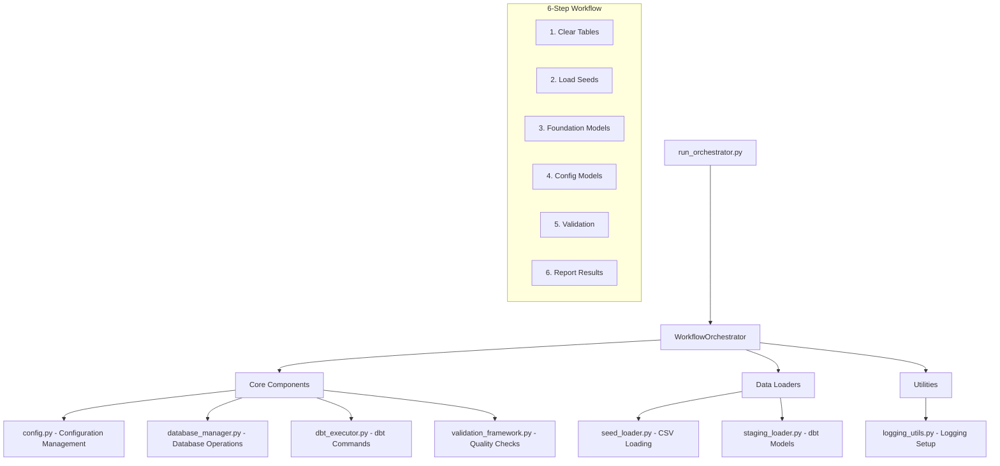

# PlanWise Navigator - orchestrator_dbt Claude Development Guide

A comprehensive, production-ready orchestration system for one-time setup of the PlanWise Navigator workforce simulation environment. This package provides database clearing, CSV seed loading, and staging model execution with enterprise-grade validation and error handling.

---

## **1. Purpose & Scope**

The `orchestrator_dbt` package delivers a **focused, modular alternative** to the complex multi-year orchestrator for **setup operations only**:

- **One-time database setup**: Clear tables, load seeds, run staging models
- **Production-ready validation**: Comprehensive data quality and business logic checks
- **Error recovery**: Robust handling of common setup failures with clear guidance
- **Performance monitoring**: Step-by-step timing and success rate tracking

**What it does**: Gets your database from empty/inconsistent state to simulation-ready
**What it doesn't do**: Multi-year simulations, event generation, workforce snapshots (use `orchestrator_mvp` for those)

---

## **2. Architecture Overview**



---

## **3. Core Components Deep Dive**

### **Configuration Management (`core/config.py`)**

**Enterprise-grade configuration** with structured validation:

```python
from orchestrator_dbt.core.config import OrchestrationConfig

# Load with defaults
config = OrchestrationConfig()

# Load with custom config file
config = OrchestrationConfig(Path("custom_config.yaml"))

# Access structured settings
print(config.database.path)           # Database file path
print(config.dbt.project_dir)         # dbt project directory
print(config.setup.clear_tables)      # Whether to clear tables
print(config.validation.min_baseline_workforce_count)  # Validation thresholds
```

**Key Features**:
- **Hierarchical structure**: Database, dbt, setup, validation sections
- **Environment variable overrides**: `DUCKDB_PATH`, `DBT_TARGET`, etc.
- **Automatic validation**: Checks file existence, directory permissions
- **dbt variable integration**: Seamless variable passing to dbt models

### **Database Management (`core/database_manager.py`)**

**Production database operations** with proper connection management:

```python
from orchestrator_dbt.core.database_manager import DatabaseManager

db_manager = DatabaseManager(config)

# Managed connections (recommended)
with db_manager.get_connection() as conn:
    result = conn.execute("SELECT COUNT(*) FROM employees").fetchone()

# Table operations
tables = db_manager.list_tables(pattern="stg_")  # Find staging tables
exists = db_manager.table_exists("stg_census_data")
row_count = db_manager.get_table_row_count("stg_census_data")

# Bulk operations
clear_result = db_manager.clear_tables(["stg_", "int_", "fct_"])
validation = db_manager.validate_database_state()
```

**Key Features**:
- **Context-managed connections**: Automatic cleanup, no connection leaks
- **Foreign key handling**: Drops constraints before table clearing
- **Retry logic**: Handles table dependencies during clearing
- **Comprehensive validation**: Database accessibility, table statistics

### **dbt Execution (`core/dbt_executor.py`)**

**Robust dbt command execution** with comprehensive error handling:

```python
from orchestrator_dbt.core.dbt_executor import DbtExecutor

dbt_executor = DbtExecutor(config)

# Single model execution
result = dbt_executor.run_model("stg_census_data", vars_dict={"simulation_year": 2025})

# Batch operations
results = dbt_executor.run_models(["stg_census_data", "stg_config_job_levels"])

# Seed operations
result = dbt_executor.load_seed("config_job_levels")
result = dbt_executor.load_all_seeds()

# Discovery operations
models = dbt_executor.list_models()
seeds = dbt_executor.list_seeds()
version = dbt_executor.get_dbt_version()
```

**Key Features**:
- **Variable handling**: JSON serialization for complex variables
- **Error contextualization**: Clear error messages with stdout/stderr
- **Command construction**: Automatic target, threads, profiles-dir handling
- **Timeout protection**: 1-hour timeout for long-running operations

### **Validation Framework (`core/validation_framework.py`)**

**Enterprise data quality validation** with severity levels:

```python
from orchestrator_dbt.core.validation_framework import ValidationFramework

validator = ValidationFramework(config, db_manager)

# Individual validations
seed_result = validator.validate_seed_data_integrity()
staging_result = validator.validate_staging_models()
workforce_result = validator.validate_baseline_workforce()

# Comprehensive validation
summary = validator.run_comprehensive_validation()

print(f"Overall success: {summary.is_valid}")
print(f"Success rate: {summary.success_rate:.1f}%")
print(f"Critical failures: {summary.critical_failures}")

# Handle failures
for failure in summary.get_critical_failures():
    print(f"CRITICAL: {failure.check_name} - {failure.message}")
```

**Validation Types**:
- **Seed data integrity**: Required tables, row counts, data completeness
- **Staging model validation**: Model existence, successful materialization
- **Baseline workforce**: Employee counts, compensation validity, data quality
- **Census data quality**: Duplicates, null values, business rule validation
- **Configuration consistency**: Cross-table relationships, parameter validation

---

## **4. Data Loading System**

### **Seed Loader (`loaders/seed_loader.py`)**

**Intelligent CSV loading** with dependency management:

```python
from orchestrator_dbt.loaders.seed_loader import SeedLoader

seed_loader = SeedLoader(config, dbt_executor)

# Discovery
available_seeds = seed_loader.discover_seed_files()  # 14 seeds found

# Dependency-aware loading
optimal_order = seed_loader.get_optimal_load_order()
# Returns: ['config_job_levels', 'scenario_meta', 'comp_levers', ...]

# Batch loading with fail-fast
result = seed_loader.load_seeds_in_optimal_order(fail_fast=True)
print(f"Success rate: {result.success_rate:.1f}%")

# Individual seed loading
seed_result = seed_loader.load_seed("config_job_levels")
```

**Dependency Intelligence**:
```python
# Automatic dependency resolution
dependencies = {
    "comp_levers": ["scenario_meta"],
    "config_termination_hazard_age_multipliers": ["config_termination_hazard_base"],
    "config_promotion_hazard_tenure_multipliers": ["config_promotion_hazard_base"],
    # ... full dependency tree
}
```

### **Staging Loader (`loaders/staging_loader.py`)**

**Smart staging model execution** with dependency ordering:

```python
from orchestrator_dbt.loaders.staging_loader import StagingLoader

staging_loader = StagingLoader(config, dbt_executor)

# Foundation models (critical path)
foundation_result = staging_loader.run_foundation_models()
# Runs: stg_census_data, stg_config_job_levels, stg_comp_levers

# Configuration models (parallel-safe)
config_result = staging_loader.run_configuration_models()
# Runs: all stg_config_* models

# Custom execution order
optimal_order = staging_loader.get_optimal_execution_order()
result = staging_loader.run_staging_models_in_optimal_order()
```

---

## **5. Workflow Orchestration**

### **Main Orchestrator (`workflow_orchestrator.py`)**

**Complete workflow coordination** with step tracking:

```python
from orchestrator_dbt import WorkflowOrchestrator

orchestrator = WorkflowOrchestrator()

# Complete setup (6 steps)
result = orchestrator.run_complete_setup()
print(f"Success: {result.success}")
print(f"Steps: {result.steps_completed}/{result.steps_total}")
print(f"Runtime: {result.total_execution_time:.1f}s")

# Quick setup (3 steps)
result = orchestrator.run_quick_setup()

# System status
status = orchestrator.get_system_status()
print(f"Ready: {status['ready_for_setup']}")
```

**Workflow Steps**:
1. **clear_database_tables**: Drop existing simulation tables
2. **load_seed_data**: Load 14 CSV files in dependency order
3. **run_foundation_staging_models**: Execute critical staging models
4. **run_configuration_staging_models**: Execute configuration models
5. **validate_setup_results**: Comprehensive data quality validation
6. **Report results**: Summary with execution metrics

---

## **6. CLI Interface**

### **Command Line Usage**

```bash
# Complete setup workflow
python orchestrator_dbt/run_orchestrator.py

# Quick setup (foundation only)
python orchestrator_dbt/run_orchestrator.py --quick

# System status check
python orchestrator_dbt/run_orchestrator.py --status

# Custom configuration
python orchestrator_dbt/run_orchestrator.py --config path/to/config.yaml

# Verbose logging
python orchestrator_dbt/run_orchestrator.py --verbose

# Quiet mode (errors only)
python orchestrator_dbt/run_orchestrator.py --quiet
```

**CLI Features**:
- **Rich output**: Progress indicators, success/failure icons, timing
- **Status checking**: Pre-flight validation before workflow execution
- **Error guidance**: Clear messages for common failure modes
- **Exit codes**: Standard shell integration (0=success, 1=failure, 130=interrupted)

---

## **7. Integration Patterns**

### **With Existing Orchestrator MVP**

```python
# Pattern: Use orchestrator_dbt for setup, orchestrator_mvp for simulation
from orchestrator_dbt import WorkflowOrchestrator as SetupOrchestrator
from orchestrator_mvp.core import MultiYearSimulationOrchestrator

# 1. Setup phase
setup = SetupOrchestrator()
setup_result = setup.run_complete_setup()

if not setup_result.success:
    raise Exception("Setup failed - cannot proceed with simulation")

# 2. Simulation phase
config = load_simulation_config()
simulation = MultiYearSimulationOrchestrator(2025, 2029, config)
sim_result = simulation.run_simulation()
```

### **With Dagster Assets**

```python
# Pattern: Convert orchestrator steps to Dagster assets
from dagster import asset
from orchestrator_dbt.core.database_manager import DatabaseManager

@asset
def setup_database_clean(context) -> dict:
    """Clear database tables for simulation setup."""
    config = OrchestrationConfig()
    db_manager = DatabaseManager(config)

    result = db_manager.clear_tables()
    context.log.info(f"Cleared {result.total_dropped} tables")

    return {"tables_dropped": result.total_dropped}

@asset(deps=[setup_database_clean])
def setup_seed_data(context) -> dict:
    """Load seed data for simulation setup."""
    # ... orchestrator_dbt integration
```

### **With Custom Configuration**

```yaml
# custom_setup_config.yaml
setup:
  clear_tables: true
  clear_table_patterns: ["stg_", "int_", "fct_"]  # Skip dim_ tables
  load_seeds: true
  run_staging_models: true
  validate_results: false  # Skip validation for speed

validation:
  min_baseline_workforce_count: 500  # Lower threshold for dev
  required_seed_tables: ["comp_levers", "config_job_levels"]  # Minimal set
```

---

## **8. Error Handling & Recovery**

### **Common Failure Modes**

**Database Lock Issues**:
```
❌ Database connection failed: Conflicting lock is held
💡 Close any open database connections in your IDE or other tools
```

**dbt Execution Failures**:
```
❌ dbt model stg_census_data failed
💡 Check census parquet file exists: data/census_preprocessed.parquet
💡 Verify parquet file has required columns: employee_id, hire_date, compensation
```

**Validation Failures**:
```
❌ Baseline workforce validation failed: 500 < 1000 active employees
💡 Check census data quality - may need more employee records
💡 Adjust min_baseline_workforce_count in configuration if this is expected
```

### **Recovery Strategies**

**Partial Failure Recovery**:
```python
# Resume from specific step
orchestrator = WorkflowOrchestrator()

# Check what's already completed
status = orchestrator.get_system_status()
if status['seeds_available'] and not status['staging_models_available']:
    # Seeds are loaded, run staging models only
    result = orchestrator.staging_loader.run_staging_models_in_optimal_order()
```

**Configuration Adjustment**:
```python
# Skip problematic validations
config = OrchestrationConfig()
config.setup.validate_results = False
config.validation.min_baseline_workforce_count = 100

orchestrator = WorkflowOrchestrator()
result = orchestrator.run_complete_setup()
```

---

## **9. Performance & Monitoring**

### **Performance Benchmarks**

| Operation | Expected Time | Row Processing |
|-----------|---------------|----------------|
| Clear Tables | 5-10 seconds | 25 tables |
| Load Seeds | 20-30 seconds | 14 CSV files |
| Foundation Models | 60-120 seconds | 100K+ employees |
| Config Models | 30-60 seconds | Configuration data |
| Validation | 15-30 seconds | Quality checks |
| **Total Workflow** | **2-4 minutes** | **Complete setup** |

### **Monitoring Integration**

```python
# Custom monitoring wrapper
def monitor_setup_workflow():
    orchestrator = WorkflowOrchestrator()

    start_time = time.time()
    result = orchestrator.run_complete_setup()
    total_time = time.time() - start_time

    # Send metrics to monitoring system
    send_metric("setup.success_rate", 1.0 if result.success else 0.0)
    send_metric("setup.execution_time", total_time)
    send_metric("setup.steps_completed", result.steps_completed)

    if result.final_validation:
        send_metric("setup.validation_score", result.final_validation.success_rate)

    return result
```

---

## **10. Testing & Validation**

### **Built-in Test Suite**

```bash
# Run comprehensive validation tests
python orchestrator_dbt/test_setup.py

# Expected output:
# 🧪 Testing configuration loading... ✅
# 🧪 Testing orchestrator initialization... ✅
# 🧪 Testing system status check... ✅
# 🧪 Testing component discovery... ✅
# 🧪 Testing database connection... ✅
# 🧪 Testing dbt availability... ✅
#
# 🎉 All tests passed! Success Rate: 100.0%
```

### **Custom Validation**

```python
# Add custom validation checks
from orchestrator_dbt.core.validation_framework import ValidationFramework, ValidationResult

class CustomValidator(ValidationFramework):
    def validate_custom_business_rules(self) -> ValidationResult:
        """Custom business rule validation."""
        with self.db_manager.get_connection() as conn:
            # Custom validation logic
            result = conn.execute("SELECT COUNT(*) FROM custom_table").fetchone()

            if result[0] < 100:
                return ValidationResult(
                    check_name="custom_rules",
                    status=ValidationStatus.FAILED,
                    severity=ValidationSeverity.ERROR,
                    message="Custom validation failed"
                )

            return ValidationResult(
                check_name="custom_rules",
                status=ValidationStatus.PASSED,
                severity=ValidationSeverity.INFO,
                message="Custom validation passed"
            )
```

---

## **11. Development Guidelines**

### **Adding New Components**

**New Loader Example**:
```python
# orchestrator_dbt/loaders/custom_loader.py
from ..core.config import OrchestrationConfig
from ..core.dbt_executor import DbtExecutor

class CustomLoader:
    def __init__(self, config: OrchestrationConfig, dbt_executor: DbtExecutor):
        self.config = config
        self.dbt_executor = dbt_executor

    def load_custom_data(self) -> CustomLoadResult:
        # Implementation
        pass
```

**Integration Pattern**:
```python
# Add to workflow_orchestrator.py
def _execute_custom_loading(self) -> WorkflowStep:
    custom_loader = CustomLoader(self.config, self.dbt_executor)
    return self._execute_step("custom_loading", custom_loader.load_custom_data)
```

### **Configuration Extension**

```python
# Extend config.py with new settings
@dataclass
class CustomConfig:
    custom_setting: str = "default_value"
    custom_threshold: int = 100

# In OrchestrationConfig.__init__
self.custom = self._init_custom_config()
```

### **Error Handling Standards**

```python
# Standard error handling pattern
try:
    result = operation()
    logger.info(f"✅ Operation completed: {result}")
    return SuccessResult(result)
except SpecificError as e:
    logger.error(f"❌ Specific error occurred: {e}")
    logger.error("💡 User guidance for resolution")
    return FailureResult(error=str(e), guidance="Resolution steps")
except Exception as e:
    logger.error(f"💥 Unexpected error: {e}")
    return FailureResult(error=str(e))
```

---

## **12. Deployment & Operations**

### **Production Deployment**

```bash
# Production setup checklist
1. ✅ Virtual environment activated
2. ✅ Database file permissions correct
3. ✅ dbt project accessible
4. ✅ Configuration file validated
5. ✅ Seed files present (14 expected)
6. ✅ Staging models present (14 expected)

# Production execution
python orchestrator_dbt/run_orchestrator.py --quiet > setup.log 2>&1
if [ $? -eq 0 ]; then
    echo "Setup successful"
else
    echo "Setup failed - check setup.log"
    exit 1
fi
```

### **CI/CD Integration**

```yaml
# GitHub Actions example
- name: Setup PlanWise Database
  run: |
    source venv/bin/activate
    python orchestrator_dbt/run_orchestrator.py --status
    python orchestrator_dbt/run_orchestrator.py --quick
  env:
    DUCKDB_PATH: ${{ github.workspace }}/test.duckdb
```

### **Monitoring & Alerting**

```python
# Production monitoring
def production_setup_with_monitoring():
    try:
        orchestrator = WorkflowOrchestrator()
        result = orchestrator.run_complete_setup()

        if not result.success:
            send_alert("PlanWise setup failed", result.get_failed_steps())

        return result
    except Exception as e:
        send_critical_alert("PlanWise setup crashed", str(e))
        raise
```

---

## **Best Practices Summary**

1. **Always check system status** before running workflow
2. **Use fail_fast=True** for seed loading in production
3. **Monitor execution times** for performance regression detection
4. **Implement custom validations** for business-specific requirements
5. **Use structured logging** for operational visibility
6. **Handle database locks gracefully** with clear user guidance
7. **Test configuration changes** in development environment first
8. **Backup database** before running setup in production

---

**The orchestrator_dbt package provides enterprise-grade setup orchestration for PlanWise Navigator, enabling reliable, repeatable, and monitored database initialization workflows.**
