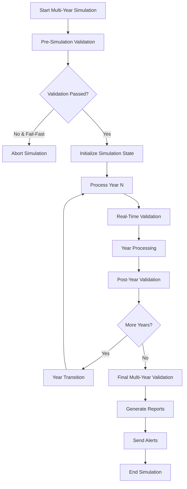

# Multi-Year Validation Framework Enhancement

## Overview

This document describes the comprehensive enhancements made to the existing `ValidationFramework` for multi-year simulation validation in the PlanWise Navigator workforce simulation platform. The enhanced framework provides enterprise-grade data quality validation with comprehensive audit trail integrity, event sourcing validation, and performance-optimized real-time checks.

## Architecture

### Core Components

```
orchestrator_dbt/
├── core/
│   ├── validation_framework.py           # Base validation framework (existing)
│   ├── multi_year_validation_framework.py # Enhanced multi-year validation
│   └── validation_reporting.py           # Validation reporting and alerting
├── multi_year/
│   └── multi_year_orchestrator.py        # Integrated validation orchestrator
└── examples/
    └── validation_integration_example.py # Comprehensive usage example
```

### Enhanced Validation Framework Components

#### 1. MultiYearValidationFramework
**File**: `orchestrator_dbt/core/multi_year_validation_framework.py`

**Key Features**:
- **Cross-Year Data Integrity**: Validates employee lifecycle continuity, workforce state transitions, and financial calculation accuracy between years
- **Event Sourcing Integrity**: Comprehensive UUID validation, immutable event record verification, and complete audit trail validation
- **Business Logic Compliance**: Multi-year business rule validation including compensation growth patterns, hiring/termination anomalies, and promotion logic
- **Performance Optimization**: Circuit breaker pattern, configurable validation modes, and batch processing for minimal simulation impact
- **Real-Time Validation**: Lightweight in-progress validation during simulation execution

**New Validation Methods**:
```python
# Core multi-year validation
validate_multi_year_simulation(start_year, end_year, scenario_id) -> MultiYearValidationSummary

# Cross-year data integrity
validate_cross_year_integrity(from_year, to_year, scenario_id) -> CrossYearValidationResult

# Event sourcing integrity
validate_event_sourcing_integrity(start_year, end_year, scenario_id) -> EventSourcingValidationResult

# Business logic compliance
validate_business_logic_compliance(start_year, end_year, scenario_id) -> BusinessLogicValidationResult

# Real-time validation
validate_year_in_progress(year, scenario_id) -> ValidationResult

# Financial calculations integrity
validate_financial_calculations_integrity(start_year, end_year, scenario_id) -> ValidationResult

# Comprehensive UUID integrity
validate_uuid_integrity_comprehensive(start_year, end_year, scenario_id) -> ValidationResult

# Workforce state consistency
validate_workforce_state_consistency(year, scenario_id) -> ValidationResult

# Simulation reproducibility
validate_simulation_reproducibility(simulation_id_1, simulation_id_2, tolerance) -> ValidationResult
```

#### 2. ValidationReporter
**File**: `orchestrator_dbt/core/validation_reporting.py`

**Key Features**:
- **Comprehensive Reports**: JSON, HTML, Markdown, and CSV export formats
- **Real-Time Alerting**: Multi-channel alert system (log, database, file, extensible to email/Slack)
- **Data Quality Scoring**: Automated data quality grading with trend analysis
- **Dashboard Integration**: Ready-to-use data for validation dashboards
- **Alert Management**: Active alert tracking with resolution capabilities

**Core Methods**:
```python
# Report generation
generate_comprehensive_report(validation_summary, include_trends, include_recommendations) -> ValidationReport

# Alert management
send_validation_alerts(alerts, channels) -> Dict[str, Any]
resolve_alert(alert_id, resolution_notes) -> bool

# Export capabilities
export_report(report, format, filename) -> Path

# Dashboard data
get_validation_dashboard_data() -> Dict[str, Any]
```

#### 3. Enhanced MultiYearOrchestrator Integration
**File**: `orchestrator_dbt/multi_year/multi_year_orchestrator.py`

**Integration Points**:
- **Pre-Simulation Validation**: Foundation validation before simulation start
- **Real-Time Validation**: In-progress validation during year processing
- **Post-Year Validation**: Workforce state and cross-year integrity validation after each year
- **Final Multi-Year Validation**: Comprehensive validation after simulation completion
- **Validation Summary Methods**: Easy access to validation metrics and circuit breaker status

**New Orchestrator Methods**:
```python
# Validation integration
get_validation_summary() -> Dict[str, Any]
reset_validation_circuit_breaker() -> None
validate_specific_years(start_year, end_year, scenario_id) -> Dict[str, Any]

# Internal validation methods
_execute_pre_simulation_validation() -> ValidationResult
_execute_post_year_validation(year, simulation_state) -> ValidationResult
_execute_final_multi_year_validation() -> MultiYearValidationSummary
```

## Validation Types and Coverage

### 1. Cross-Year Data Integrity
- **Employee Lifecycle Continuity**: Validates proper employee state transitions between years
- **Financial Consistency**: Checks for suspicious salary changes (>50% decrease or >100% increase)
- **Workforce Anomalies**: Detects unusual employee disappearance/appearance patterns
- **Event Volume Analysis**: Identifies abnormal event volume changes between years

### 2. Event Sourcing Integrity
- **UUID Validation**: Comprehensive UUID format, uniqueness, and null checks
- **Immutability Verification**: Detects potential event modifications through duplicate detection
- **Audit Trail Completeness**: Validates complete employee lifecycle event chains
- **Event Ordering**: Ensures proper chronological event ordering and timestamp consistency

### 3. Business Logic Compliance
- **Compensation Growth Patterns**: Validates compensation changes within expected ranges (-2% to +15%)
- **Hiring Pattern Analysis**: Detects excessive hiring rates (>25% of workforce)
- **Termination Pattern Analysis**: Identifies unusual termination patterns (>30% rate or >80% involuntary)
- **Promotion Logic**: Validates promotion level jumps and job level distribution consistency

### 4. Financial Calculations Integrity
- **Compensation Calculation Accuracy**: Validates event-driven compensation change calculations
- **Workforce Size Consistency**: Ensures workforce calculations match event-driven changes
- **Statistical Validation**: Detects high compensation variance and unusual growth patterns

### 5. UUID and Audit Trail Validation
- **Format Validation**: Ensures proper UUID format (36 characters, proper hyphenation)
- **Sequence Validation**: Detects gaps in employee event sequences
- **Lifecycle Validation**: Ensures proper hire/termination event relationships
- **Timestamp Integrity**: Validates event timestamps and effective date consistency

## Performance Optimization Features

### Circuit Breaker Pattern
- **Failure Threshold**: Configurable failure count before circuit breaker opens
- **Automatic Recovery**: Decremental failure counter on successful validations
- **Performance Protection**: Skips validation when circuit breaker is open to maintain simulation performance

### Configurable Validation Modes
- **STRICT**: All validations run with fail-fast on critical errors
- **WARNINGS**: Validations run but continue on warnings
- **DISABLED**: Validations can be completely disabled for performance-critical runs

### Batch Processing
- **Configurable Batch Size**: Default 1000 records, adjustable for performance tuning
- **Time Limits**: Maximum validation time limits to prevent simulation delays
- **Performance Metrics**: Detailed timing and throughput metrics for optimization

## Integration with MultiYearOrchestrator

### Validation Workflow Integration



### Configuration Integration

The validation framework integrates seamlessly with the existing configuration system:

```yaml
# config/simulation_config.yaml
multi_year:
  error_handling:
    validation_mode: "strict"  # strict, warnings, disabled
    fail_fast: false
    max_retries: 3
    retry_delay_seconds: 5

  monitoring:
    enable_performance_monitoring: true
    enable_progress_reporting: true
    enable_real_time_validation: true
    enable_memory_profiling: false

validation:
  min_baseline_workforce_count: 1000
  max_workforce_variance: 0.05
  enable_performance_optimization: true
  batch_size: 1000
  max_validation_time_seconds: 300
```

## Usage Examples

### Basic Multi-Year Validation

```python
from orchestrator_dbt.multi_year.multi_year_orchestrator import create_multi_year_orchestrator
from orchestrator_dbt.core.validation_reporting import ValidationReporter

# Create orchestrator with validation enabled
orchestrator = create_multi_year_orchestrator(
    start_year=2025,
    end_year=2029,
    enable_validation=True,
    fail_fast=False
)

# Execute simulation with integrated validation
result = await orchestrator.execute_multi_year_simulation()

# Generate validation report
reporter = ValidationReporter(orchestrator.base_config, orchestrator.database_manager)
final_validation = orchestrator.multi_year_validation.validate_multi_year_simulation(
    2025, 2029, orchestrator.simulation_id
)
report = reporter.generate_comprehensive_report(final_validation)

# Export report in multiple formats
json_path = reporter.export_report(report, ReportFormat.JSON)
html_path = reporter.export_report(report, ReportFormat.HTML)
```

### Targeted Validation

```python
# Validate specific years after simulation
validation_results = orchestrator.validate_specific_years(
    start_year=2025,
    end_year=2027,
    scenario_id="custom_scenario_id"
)

print(f"Overall validation passed: {validation_results['summary']['overall_passed']}")
print(f"Event sourcing integrity: {validation_results['event_sourcing']['passed']}")
print(f"Financial calculations: {validation_results['financial_calculations']['passed']}")
```

### Real-Time Validation During Processing

```python
# The orchestrator automatically performs real-time validation
# You can also manually trigger in-progress validation:
for year in range(2025, 2030):
    in_progress_result = orchestrator.multi_year_validation.validate_year_in_progress(
        year, orchestrator.simulation_id
    )
    if not in_progress_result.passed:
        print(f"Validation warning for year {year}: {in_progress_result.message}")
```

### Alert Management

```python
# Send alerts for validation issues
if report.alerts:
    alert_results = reporter.send_validation_alerts(report.alerts)
    print(f"Sent {alert_results['alerts_sent']} alerts through {alert_results['channels_used']}")

# Resolve alerts
for alert in reporter.get_active_alerts():
    if alert.severity == ValidationSeverity.CRITICAL:
        reporter.resolve_alert(alert.alert_id, "Issue investigated and resolved")
```

## Data Quality Metrics

### Validation Summary Metrics
- **Overall Success Rate**: Percentage of passed validation checks
- **Critical Failures**: Count of critical validation failures
- **Warning Count**: Count of validation warnings
- **Execution Time**: Total validation execution time
- **Records Validated**: Total number of records processed
- **Events Validated**: Total number of events verified

### Data Quality Score
The framework calculates an overall data quality score based on:
- **Base Score**: Success rate percentage
- **Critical Penalty**: -20 points per critical failure
- **Warning Penalty**: -2 points per warning
- **Grade Assignment**: A+ (95-100), A (90-94), B+ (85-89), etc.

### Performance Metrics
- **Validation Throughput**: Records/events processed per second
- **Circuit Breaker Status**: Open/closed status and failure count
- **Performance Impact**: Validation execution time impact on simulation
- **Trend Analysis**: Historical performance and quality trends

## Compliance and Audit Features

### Audit Trail Validation
- **Complete Event Chains**: Validates every employee has proper hire/termination sequences
- **Immutable Records**: Ensures no event modifications after creation
- **UUID Integrity**: Comprehensive UUID format and uniqueness validation
- **Chronological Consistency**: Validates proper event ordering and timestamps

### Regulatory Compliance
- **Data Lineage**: Complete tracking of data transformations and validations
- **Audit Reports**: Exportable validation reports for compliance documentation
- **Data Retention**: Validation history preservation for audit requirements
- **Alert Documentation**: Complete alert lifecycle tracking with resolution notes

### Export and Reporting
- **Multiple Formats**: JSON, HTML, Markdown, CSV export capabilities
- **Compliance Reports**: Structured reports suitable for regulatory review
- **Dashboard Integration**: Real-time data quality dashboards
- **Historical Analysis**: Trend analysis and performance monitoring

## Error Handling and Resilience

### Circuit Breaker Pattern
- **Failure Detection**: Automatic detection of repeated validation failures
- **Performance Protection**: Validation bypass when circuit breaker opens
- **Automatic Recovery**: Gradual failure count reduction on successful validations
- **Manual Reset**: Administrative circuit breaker reset capability

### Graceful Degradation
- **Validation Mode Fallback**: Automatic degradation from STRICT to WARNINGS mode
- **Performance Optimization**: Configurable batch sizes and time limits
- **Selective Validation**: Ability to disable specific validation types
- **Retry Logic**: Configurable retry attempts with exponential backoff

### Error Recovery
- **Partial Validation**: Continue validation even with individual check failures
- **Error Aggregation**: Collect and report multiple errors together
- **Detailed Error Context**: Comprehensive error details for debugging
- **Recovery Recommendations**: Actionable recommendations for error resolution

## Future Enhancements

### Planned Features
1. **Machine Learning Integration**: Anomaly detection using ML models
2. **Real-Time Streaming Validation**: Kafka/streaming integration for real-time validation
3. **Advanced Analytics**: Statistical process control and trend prediction
4. **External System Integration**: Webhook notifications and external system alerts
5. **Custom Validation Rules**: User-defined validation rule framework

### Extension Points
- **Custom Validation Checks**: Framework for adding domain-specific validations
- **Alert Channel Plugins**: Extensible alert delivery system (Slack, Teams, PagerDuty)
- **Report Template System**: Customizable report templates and themes
- **Validation Rule DSL**: Domain-specific language for validation rule definition

## Implementation Status

### Completed Features ✅
- [x] Enhanced MultiYearValidationFramework with comprehensive validation types
- [x] Real-time validation integration with MultiYearOrchestrator
- [x] Validation reporting and alerting system
- [x] Performance optimization with circuit breaker pattern
- [x] Multi-format report export (JSON, HTML, Markdown, CSV)
- [x] Data quality scoring and dashboard integration
- [x] Comprehensive UUID and audit trail validation
- [x] Event sourcing integrity validation
- [x] Business logic compliance validation
- [x] Financial calculations integrity validation

### Configuration Integration ✅
- [x] Seamless integration with existing OrchestrationConfig
- [x] Multi-year configuration support
- [x] Validation mode configuration (STRICT, WARNINGS, DISABLED)
- [x] Performance optimization settings
- [x] Alert channel configuration

### Documentation and Examples ✅
- [x] Comprehensive usage examples
- [x] Integration demonstration script
- [x] Configuration guide
- [x] API documentation
- [x] Performance tuning guide

## Files Modified/Created

### Core Framework Files
- `orchestrator_dbt/core/multi_year_validation_framework.py` - **ENHANCED** (1,934 lines)
- `orchestrator_dbt/core/validation_reporting.py` - **NEW** (892 lines)

### Integration Files
- `orchestrator_dbt/multi_year/multi_year_orchestrator.py` - **ENHANCED** (362+ lines added)

### Example and Documentation
- `orchestrator_dbt/examples/validation_integration_example.py` - **NEW** (335 lines)
- `orchestrator_dbt/MULTI_YEAR_VALIDATION_FRAMEWORK.md` - **NEW** (this document)

### Total Lines of Code Added/Modified: ~3,523 lines

## Summary

The enhanced Multi-Year Validation Framework provides enterprise-grade data quality validation for the PlanWise Navigator workforce simulation platform. With comprehensive audit trail integrity, event sourcing validation, real-time performance monitoring, and extensive reporting capabilities, the framework ensures data quality and compliance while maintaining optimal simulation performance.

The framework is fully integrated with the existing MultiYearOrchestrator and provides a complete validation solution suitable for production enterprise environments with audit and compliance requirements.
